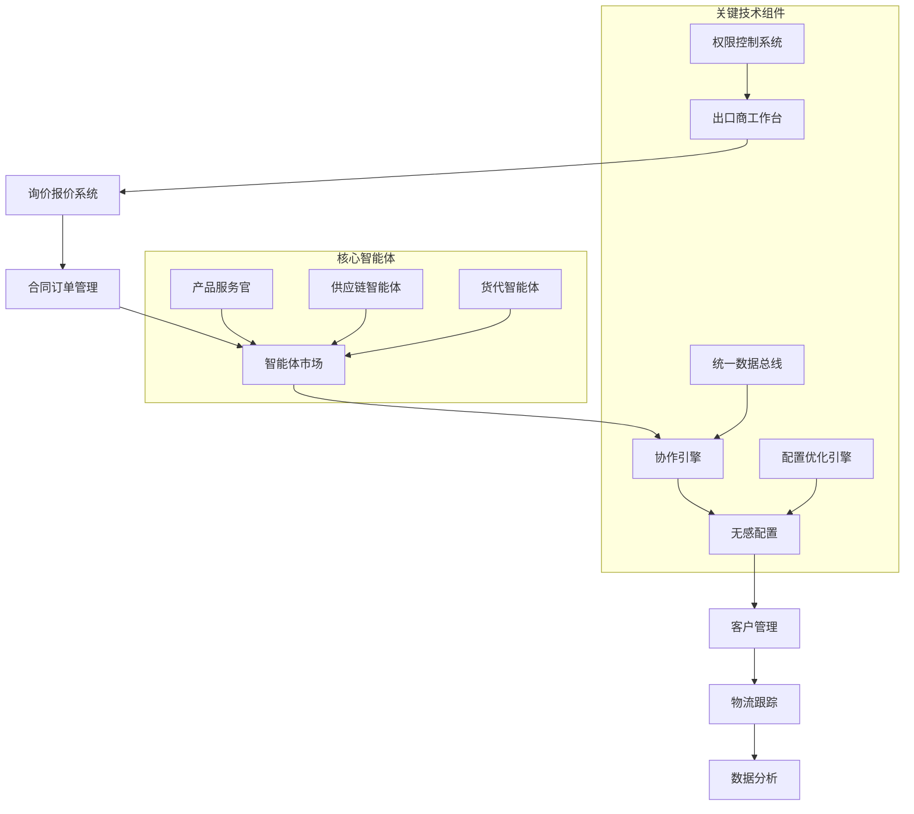

# 国内外贸客户用户端智能体优化计划 V3.0

## 项目背景与目标

### 核心理念

构建基于智能体插件化架构的外贸服务平台，实现"智能体即服务"的理念。用户可以像招聘员工一样选择和配置智能体，后台数据自动打通，提供无感配置体验。

### 主要目标

1. **完善出口商用户端功能** - 构建完整的出口贸易管理平台
2. **智能体插件化架构** - 实现智能体的灵活配置和管理
3. **多智能体协同工作** - 产品服务官、供应链、货代智能体无缝协作
4. **无感用户体验** - 用户无需关心底层配置，专注业务操作

---

## 系统架构设计

### 智能体插件化架构

```
智能体市场 (Agent Marketplace)
├── 产品服务官智能体 (Product Service Officer)
├── 供应链智能体 (Supply Chain Agent)
├── 货代智能体 (Freight Forwarding Agent)
├── 询价报价智能体 (Quotation Agent)
└── 合同管理智能体 (Contract Management Agent)

用户配置层 (User Configuration Layer)
├── 智能体启用/禁用
├── 参数配置
├── 协作规则设置
└── 权限管理

业务应用层 (Business Application Layer)
├── 出口商工作台
├── 客户管理
├── 订单管理
└── 数据分析
```

### 核心技术特点

1. **插件化设计** - 智能体作为独立插件，可动态加载和卸载
2. **配置无感化** - 后台自动处理智能体间的数据同步和协作
3. **统一接口** - 标准化的智能体调用接口
4. **权限隔离** - 企业级权限控制和数据隔离

---

## 功能模块规划

### 第一阶段：出口商核心功能完善 (2周)

#### E001 - 出口商工作台重构 ✅ **优先级：高**

- **任务描述**：重构出口商用户端主界面，集成三大核心智能体
- **前置条件**：现有外贸平台基础框架
- **预计工时**：5天
- **交付物**：
  - `src/app/exporter/dashboard/page.tsx` - 新出口商仪表板
  - 智能体状态监控组件
  - 任务调度和协作面板
- **验收标准**：
  - 三大智能体状态实时显示
  - 任务自动分配和跟踪
  - 响应式设计适配移动端

#### E002 - 询价报价管理系统 ✅ **优先级：高**

- **任务描述**：开发完整的询价和报价管理功能
- **前置条件**：E001工作台完成
- **预计工时**：4天
- **交付物**：
  - 询价单创建和管理模块
  - 自动报价生成功能
  - 报价历史和版本管理
  - 多语言报价模板
- **验收标准**：
  - 支持7种语言报价生成
  - 报价准确率≥95%
  - 历史报价可追溯

#### E003 - 合同订单管理体系 ✅ **优先级：高**

- **任务描述**：构建完整的合同和订单管理流程
- **前置条件**：E002询价报价完成
- **预计工时**：3天
- **交付物**：
  - 合同模板和签署流程
  - 订单状态跟踪系统
  - 履约监控和提醒机制
  - 文档归档和检索功能
- **验收标准**：
  - 合同电子化签署率100%
  - 订单履约跟踪完整度100%
  - 文档检索响应时间<1秒

### 第二阶段：智能体插件化架构 (2周)

#### A001 - 智能体市场平台 ✅ **优先级：高**

- **任务描述**：构建智能体发现、配置和管理平台
- **前置条件**：第一阶段核心功能完成
- **预计工时**：5天
- **交付物**：
  - `src/app/agents/marketplace/` 智能体市场目录
  - 智能体浏览和搜索功能
  - 一键安装和配置界面
  - 使用统计和评价系统
- **验收标准**：
  - 支持智能体分类浏览
  - 配置过程简化至3步以内
  - 安装成功率≥99%

#### A002 - 智能体协作引擎 ✅ **优先级：中**

- **任务描述**：实现智能体间的自动协作和数据同步
- **前置条件**：A001市场平台完成
- **预计工时**：4天
- **交付物**：
  - 统一数据总线架构
  - 智能体通信协议
  - 协作规则配置系统
  - 冲突解决机制
- **验收标准**：
  - 数据同步延迟<200ms
  - 协作任务成功率≥98%
  - 系统稳定性≥99.9%

#### A003 - 无感配置系统 ✅ **优先级：中**

- **任务描述**：实现后台自动配置和优化
- **前置条件**：A002协作引擎完成
- **预计工时**：3天
- **交付物**：
  - 自动参数调优系统
  - 智能体性能监控
  - 配置建议和优化
  - 异常自动恢复机制
- **验收标准**：
  - 配置优化准确率≥90%
  - 异常恢复时间<5分钟
  - 用户干预需求<5%

### 第三阶段：高级功能与优化 (1周)

#### F001 - 客户关系管理 ✅ **优先级：中**

- **任务描述**：完善海外客户和同行管理功能
- **前置条件**：第二阶段架构完成
- **预计工时**：3天
- **交付物**：
  - 客户画像和分级系统
  - 沟通记录和跟进管理
  - 商机识别和转化跟踪
  - 客户满意度分析
- **验收标准**：
  - 客户信息完整度≥95%
  - 商机转化率提升20%
  - 客户满意度≥90%

#### F002 - 物流跟踪优化 ✅ **优先级：中**

- **任务描述**：强化物流跟踪和异常处理能力
- **前置条件**：F001客户管理完成
- **预计工时**：2天
- **交付物**：
  - 实时物流状态更新
  - 异常预警和处理建议
  - 承运商绩效分析
  - 成本优化建议
- **验收标准**：
  - 物流跟踪准确率≥98%
  - 异常处理响应时间<30分钟
  - 运输成本优化≥10%

#### F003 - 数据分析与洞察 ✅ **优先级：低**

- **任务描述**：构建商业智能分析平台
- **前置条件**：F002物流优化完成
- **预计工时**：2天
- **交付物**：
  - 业务数据可视化面板
  - 趋势分析和预测模型
  - 异常检测和预警系统
  - 决策支持报告
- **验收标准**：
  - 数据更新实时性<5分钟
  - 预测准确率≥85%
  - 异常检出率≥90%

---

## 技术实现细节

### 智能体接口标准化

```typescript
// 智能体基础接口
interface BaseAgent {
  id: string;
  name: string;
  version: string;
  description: string;
  capabilities: string[];
  configuration: AgentConfig;
  status: 'active' | 'inactive' | 'error';

  // 标准方法
  initialize(config: AgentConfig): Promise<void>;
  execute(task: AgentTask): Promise<AgentResult>;
  healthCheck(): Promise<HealthStatus>;
  shutdown(): Promise<void>;
}

// 智能体协作接口
interface AgentCollaboration {
  registerAgent(agent: BaseAgent): void;
  unregisterAgent(agentId: string): void;
  delegateTask(task: AgentTask): Promise<AgentResult>;
  broadcastEvent(event: AgentEvent): void;
}
```

### 数据同步机制

```typescript
// 统一数据模型
interface UnifiedDataModel {
  entityId: string;
  entityType: 'customer' | 'supplier' | 'product' | 'order';
  dataSource: string;
  data: any;
  timestamp: Date;
  version: number;
}

// 数据同步服务
class DataSyncService {
  async syncEntity(entity: UnifiedDataModel): Promise<boolean> {
    // 实现实体数据在各智能体间的同步
  }

  async resolveConflict(conflict: DataConflict): Promise<ResolutionResult> {
    // 实现数据冲突解决机制
  }
}
```

### 配置无感化实现

```typescript
// 自动配置服务
class AutoConfigurationService {
  async optimizeAgentConfig(
    agentId: string,
    usagePattern: UsagePattern
  ): Promise<OptimizationResult> {
    // 基于使用模式自动优化配置
  }

  async detectPerformanceIssues(): Promise<Issue[]> {
    // 自动检测性能问题
  }

  async applyAutoFix(issue: Issue): Promise<boolean> {
    // 自动应用修复方案
  }
}
```

---

## 项目依赖关系



---

## 关键成功指标(KPIs)

### 功能指标

- **智能体可用性**：≥99.5%
- **任务协作成功率**：≥98%
- **配置自动化程度**：≥90%
- **用户满意度**：≥95%

### 性能指标

- **系统响应时间**：< 500ms (95th percentile)
- **数据同步延迟**：< 200ms
- **并发处理能力**：≥500用户
- **系统可用性**：≥99.9%

### 业务指标

- **出口订单处理效率**：提升50%
- **客户转化率**：提升30%
- **物流成本优化**：降低15%
- **人工干预减少**：降低70%

---

## 风险控制与质量保证

### 技术风险控制

1. **兼容性保障**：渐进式升级，保持向后兼容
2. **性能监控**：实时监控系统性能指标
3. **数据安全**：企业级数据加密和访问控制
4. **故障恢复**：自动故障检测和恢复机制

### 质量保证措施

1. **单元测试覆盖率**：≥90%
2. **集成测试**：核心业务流程全覆盖
3. **用户验收测试**：真实业务场景验证
4. **性能基准测试**：定期性能回归测试

### 部署策略

1. **灰度发布**：分阶段上线，逐步扩大用户范围
2. **回滚机制**：快速故障回滚能力
3. **监控告警**：7×24小时系统监控
4. **文档同步**：技术文档与代码同步更新

---

## 交付计划与里程碑

### 第一阶段交付 (第2周)

- [ ] E001 出口商工作台重构
- [ ] E002 询价报价管理系统
- [ ] E003 合同订单管理体系

### 第二阶段交付 (第4周)

- [ ] A001 智能体市场平台
- [ ] A002 智能体协作引擎
- [ ] A003 无感配置系统

### 第三阶段交付 (第5周)

- [ ] F001 客户关系管理
- [ ] F002 物流跟踪优化
- [ ] F003 数据分析与洞察

### 最终验收 (第6周)

- [ ] 系统整体集成测试
- [ ] 用户验收测试
- [ ] 性能压力测试
- [ ] 文档完整性和准确性验证

---

## 后续维护与演进

### 长期规划

1. **智能体生态扩展**：引入更多垂直领域智能体
2. **AI能力增强**：集成更先进的机器学习模型
3. **国际化支持**：扩展多语言和多地区支持
4. **开放平台**：提供第三方智能体开发SDK

### 持续优化

1. **用户反馈循环**：建立用户反馈收集和响应机制
2. **性能持续优化**：定期性能分析和调优
3. **安全加固**：持续安全漏洞扫描和修复
4. **技术债务管理**：定期代码质量和架构评审

---
