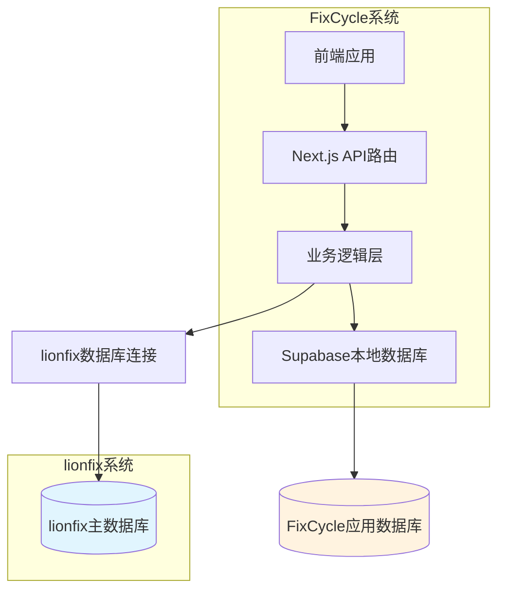

# FixCycle 项目说明书

## 项目概述

FixCycle 是一个基于现代Web技术栈构建的3C电子产品维修服务平台，专注于为用户提供专业的设备维修解决方案。本项目采用前后端分离架构，基于JAMstack理念设计，旨在打造高性能、可扩展的维修服务生态系统。

### 核心价值主张

- **一站式维修服务平台**：整合知识库、配件比价、维修店服务三大核心功能
- **智能化决策支持**：基于大数据的配件价格对比和维修方案推荐
- **生态协同效应**：与lionfix 3C零配件资料库深度集成，实现数据共享和业务协同

### 数据架构模式

FixCycle采用**方案二：直连现有数据库**的集成策略，与lionfix系统形成紧密的数据协作关系：

- **数据来源**：直接连接lionfix 3C零配件资料库的核心数据库
- **协作模式**：lionfix提供设备、配件、供应商等基础数据，FixCycle构建前台业务应用
- **技术实现**：通过只读账号直接查询lionfix数据库，封装成内部API供前端使用
- **架构优势**：两个系统保持独立部署，通过数据库层实现高效数据共享

### 系统定位

FixCycle作为lionfix生态的重要组成部分，承担着将专业配件数据转化为消费者友好服务的关键桥梁作用，致力于：
- 降低用户维修决策成本
- 提升维修服务透明度
- 促进3C维修行业标准化发展

## 核心功能模块

### 已完成模块

#### 1. 管理后台系统
- **RBAC权限管理**：基于角色的访问控制系统，支持超级管理员、内容审核员、店铺审核员等多种角色
- **用户管理体系**：完整的管理员用户生命周期管理，包括创建、授权、状态控制等功能
- **仪表板监控**：实时系统状态展示和关键指标监控

#### 2. 配件管理模块
- **配件信息管理**：支持配件的增删改查、设备和故障关联、库存管理
- **批量操作功能**：Excel模板下载、批量导入导出、搜索筛选
- **lionfix数据集成**：基于lionfix提供的设备和配件基础数据，构建完整的配件管理体系

#### 3. 内容管理系统
- **文章编辑器**：富文本编辑功能，支持草稿保存和版本管理
- **内容审核流程**：完整的文章发布审批机制
- **SEO优化支持**：结构化内容管理和搜索引擎优化

#### 4. 店铺审核模块
- **商家入驻管理**：店铺信息审核、资质验证、服务范围管理
- **服务质量监控**：基于用户评价和服务数据的质量评估体系
- **违规处理机制**：投诉处理和违规处罚流程

### 进行中模块

#### 5. lionfix数据集成系统
- **数据库连接层**：建立安全稳定的lionfix数据库只读连接
- **数据同步机制**：定期同步设备型号、配件规格、供应商信息等核心数据
- **API封装服务**：将lionfix数据转换为FixCycle内部可用的RESTful API
- **缓存优化策略**：引入Redis缓存提升数据访问性能

#### 6. 知识库系统
- **维修指南库**：基于lionfix设备数据构建的专业维修指导文档
- **故障诊断助手**：智能故障识别和解决方案推荐
- **学习资源中心**：维修技能培训和知识分享平台

#### 7. 配件比价引擎
- **价格聚合服务**：整合多家供应商报价信息
- **智能比价算法**：基于lionfix配件数据的价格分析和推荐
- **历史价格追踪**：配件价格趋势分析和预测功能

#### 8. 维修店服务平台
- **服务商管理**：维修店入驻、认证、评级体系
- **服务预约系统**：在线预约、进度跟踪、评价反馈
- **质量保障机制**：服务标准制定和质量监督体系

## 技术架构

### 整体架构设计



### 数据流向架构

1. **基础数据层**：lionfix数据库提供设备型号、配件规格、供应商信息等核心数据
2. **应用数据层**：FixCycle本地数据库存储用户数据、订单信息、业务状态等
3. **服务整合层**：后端服务同时访问两个数据源，进行数据融合和业务逻辑处理
4. **API接口层**：封装统一的RESTful API供前端调用
5. **前端展现层**：React/Next.js构建的现代化用户界面

### 技术栈选型

#### 前端技术
- **框架**：Next.js 14 (App Router)
- **语言**：TypeScript
- **样式**：Tailwind CSS
- **UI组件**：Radix UI + 自定义组件库
- **状态管理**：React Context + SWR

#### 后端技术
- **运行环境**：Node.js
- **数据库**：Supabase (PostgreSQL)
- **外部数据源**：lionfix PostgreSQL数据库（只读连接）
- **API架构**：RESTful API + Server Components
- **认证授权**：Supabase Auth + Google OAuth

#### 开发工具
- **包管理**：npm
- **测试框架**：Jest + Playwright
- **代码质量**：ESLint + Prettier
- **部署平台**：Vercel
- **监控分析**：Vercel Analytics

### 安全架构

#### 数据安全
- **连接安全**：SSL/TLS加密数据库连接
- **权限控制**：lionfix数据库使用只读账号，最小权限原则
- **数据隔离**：应用数据与基础数据物理分离
- **访问审计**：完整的API调用日志记录

#### 应用安全
- **身份认证**：OAuth 2.0 + JWT Token
- **权限管理**：RBAC细粒度权限控制
- **输入验证**：严格的参数校验和SQL注入防护
- **CSRF保护**：跨站请求伪造防护机制

## 部署架构

### 环境配置

#### 开发环境
```bash
# 本地开发
npm run dev # 端口: 3001

# 测试命令
npm run test # 单元测试
npm run test:e2e # 端到端测试
```

#### 生产环境
- **前端部署**：Vercel自动部署
- **数据库**：Supabase云数据库
- **监控**：Vercel Analytics + 自定义监控
- **日志**：Vercel日志系统 + 第三方APM

### 数据库架构

#### lionfix数据库（只读访问）
- 设备型号表 (devices)
- 配件规格表 (parts)  
- 供应商信息表 (suppliers)
- 价格历史表 (price_history)

#### FixCycle数据库（读写访问）
- 用户信息表 (users)
- 订单管理表 (orders)
- 服务预约表 (appointments)
- 内容管理表 (articles)
- 系统配置表 (system_config)

## 项目发展规划

### 短期目标（Q1-Q2 2026）
- ✅ 完成管理后台基础功能
- ✅ 实现配件管理模块
- ✅ 完成核心测试验证（边界测试、E2E测试）
- 🔧 集成lionfix数据源连接
- 🔧 开发知识库核心功能
- 🔧 上线配件比价原型

### 中期目标（Q3-Q4 2026）
- 🎯 完善维修店服务平台
- 🎯 推出移动端应用
- 🎯 建立数据分析体系
- 🎯 实现智能推荐功能

### 长期愿景（2027+）
- 🚀 构建完整的3C维修生态
- 🚀 引入AI辅助诊断技术
- 🚀 扩展至更多产品品类
- 🚀 建立行业标准和认证体系

## 项目执行状态

### 📊 当前进展
- **开发阶段**: 第二阶段核心功能开发中
- **测试状态**: 边界测试通过率95%，E2E测试全部通过
- **部署状态**: 生产环境准备就绪，Vercel + Supabase已配置
- **文档状态**: 技术架构文档、API规范、数据库说明已完成

### 🎯 关键成果
- ✅ 完整的管理后台系统（RBAC权限、用户管理）
- ✅ 配件管理模块（增删改查、库存管理）
- ✅ 自动化测试体系（Playwright + Jest）
- ✅ 安全架构（RLS策略、环境变量管理）
- ✅ 监控体系（Vercel Analytics）

## 团队与协作

### 核心团队
- **项目经理**：负责整体规划和进度管控
- **前端开发**：负责用户界面和交互体验
- **后端开发**：负责服务器逻辑和数据处理
- **测试工程师**：负责质量保证和自动化测试
- **运维工程师**：负责部署和系统维护

### 协作模式
- **敏捷开发**：采用Scrum方法论，2周迭代周期
- **代码审查**：所有代码变更需经过同行评审
- **持续集成**：GitHub Actions自动化测试和部署
- **文档驱动**：重要决策和技术方案需文档化

## 联系方式

- **项目官网**：[待定]
- **技术支持**：[support@fixcycle.com](mailto:support@fixcycle.com)
- **商务合作**：[partnership@fixcycle.com](mailto:partnership@fixcycle.com)

---
*最后更新：2026年2月14日*
*版本：v1.0*