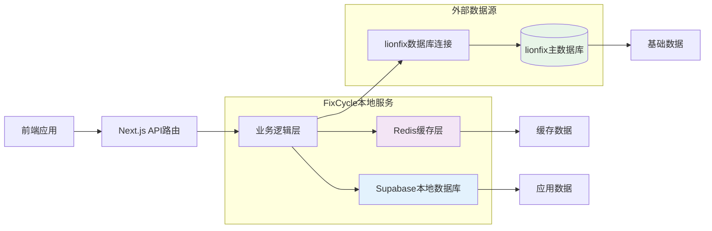

# FixCycle 技术架构文档

## 概述

本文档详细描述 FixCycle 项目的技术架构设计，重点说明与 lionfix 系统的集成方案、数据流向、安全措施和部署策略。

## 系统架构总览

### 架构模式
FixCycle 采用**微服务友好的单体架构**，基于 JAMstack 理念设计，通过 Next.js 的 API 路由实现前后端一体化部署。

### 核心设计理念
- **数据分离**：应用数据与基础数据物理分离
- **实时集成**：通过数据库直连实现实时数据访问
- **安全优先**：最小权限原则和多重安全防护
- **性能优化**：智能缓存和连接池管理

## 后端技术栈

### 核心框架
- **运行时**：Node.js 18+/20+
- **Web框架**：Next.js 14 (App Router)
- **编程语言**：TypeScript 5.0+
- **包管理**：npm 9+

### 数据库层

#### 本地数据库 (Supabase)
```typescript
// src/lib/supabase.ts
import { createClient } from '@supabase/supabase-js'

export const supabase = createClient(
  process.env.NEXT_PUBLIC_SUPABASE_URL!,
  process.env.SUPABASE_SERVICE_ROLE_KEY!
)
```

#### 外部数据源集成 (lionfix)
```typescript
// src/lib/lionfix/db.ts
import { Pool } from 'pg'
import dotenv from 'dotenv'

dotenv.config()

// lionfix 数据库连接池配置
export const lionfixPool = new Pool({
  host: process.env.LIONFIX_DB_HOST,
  port: parseInt(process.env.LIONFIX_DB_PORT || '5432'),
  database: process.env.LIONFIX_DB_NAME,
  user: process.env.LIONFIX_DB_USER, // 只读账号
  password: process.env.LIONFIX_DB_PASSWORD,
  max: 20, // 最大连接数
  idleTimeoutMillis: 30000,
  connectionTimeoutMillis: 2000,
  ssl: {
    rejectUnauthorized: false
  }
})

// 安全连接验证
lionfixPool.on('connect', (client) => {
  console.log('✅ 连接到 lionfix 数据库')
})

lionfixPool.on('error', (err) => {
  console.error('❌ lionfix 数据库连接错误:', err)
})
```

### 数据库环境变量配置
```env
# lionfix 数据库配置
LIONFIX_DB_HOST=your-lionfix-db-host.com
LIONFIX_DB_PORT=5432
LIONFIX_DB_NAME=lionfix_main
LIONFIX_DB_USER=fixcycle_reader
LIONFIX_DB_PASSWORD=secure_password_here
LIONFIX_DB_SSL=true

# IP 白名单配置
LIONFIX_ALLOWED_IPS=192.168.1.100,192.168.1.101
```

## 数据流架构

### 数据流向图



### 查询流程

1. **缓存查询**：首先检查 Redis 缓存是否存在有效数据
2. **本地数据库**：查询用户、订单等应用数据
3. **外部数据源**：通过 lionfix 连接池查询设备、配件信息
4. **数据融合**：在业务逻辑层整合多源数据
5. **结果返回**：向客户端返回统一格式的响应

## 模块架构说明

### 核心模块结构

```
src/
├── app/
│   ├── api/
│   │   ├── admin/           # 管理后台API
│   │   ├── auth/            # 认证相关API
│   │   ├── internal/        # 内部数据API（lionfix集成）
│   │   │   ├── devices/     # 设备数据接口
│   │   │   ├── parts/       # 配件数据接口
│   │   │   └── suppliers/   # 供应商数据接口
│   │   └── parts/compare/   # 配件比价API
│   └── admin/               # 管理后台页面
├── components/              # UI组件
├── lib/
│   ├── supabase.ts         # 本地数据库客户端
│   ├── lionfix/
│   │   ├── db.ts           # lionfix数据库连接池
│   │   ├── queries.ts      # 数据查询封装
│   │   └── cache.ts        # 缓存策略管理
│   └── auth-service.ts     # 认证服务
└── middleware.ts           # 请求中间件
```

### lionfix 集成模块详解

#### 数据库连接管理
```typescript
// src/lib/lionfix/db.ts
import { Pool, QueryResult } from 'pg'

class LionfixDatabase {
  private pool: Pool
  
  constructor() {
    this.pool = new Pool({
      connectionString: process.env.LIONFIX_DATABASE_URL,
      max: 10,
      idleTimeoutMillis: 30000,
      connectionTimeoutMillis: 2000,
    })
  }
  
  async query<T>(sql: string, params?: any[]): Promise<QueryResult<T>> {
    const client = await this.pool.connect()
    try {
      return await client.query(sql, params)
    } finally {
      client.release()
    }
  }
  
  async close(): Promise<void> {
    await this.pool.end()
  }
}

export const lionfixDB = new LionfixDatabase()
```

#### 内部API路由示例
```typescript
// src/app/api/internal/devices/route.ts
import { NextResponse } from 'next/server'
import { lionfixDB } from '@/lib/lionfix/db'
import { redis } from '@/lib/lionfix/cache'

export async function GET(request: Request) {
  try {
    const { searchParams } = new URL(request.url)
    const brand = searchParams.get('brand')
    const category = searchParams.get('category')
    
    // 1. 检查缓存
    const cacheKey = `devices:${brand}:${category}`
    const cachedData = await redis.get(cacheKey)
    
    if (cachedData) {
      return NextResponse.json({
        data: JSON.parse(cachedData),
        source: 'cache'
      })
    }
    
    // 2. 查询lionfix数据库
    let sql = `
      SELECT d.*, b.name as brand_name, c.name as category_name
      FROM devices d
      JOIN brands b ON d.brand_id = b.id
      JOIN categories c ON d.category_id = c.id
      WHERE d.status = 'active'
    `
    
    const params: any[] = []
    if (brand) {
      sql += ' AND b.name = $1'
      params.push(brand)
    }
    if (category) {
      sql += params.length ? ' AND c.name = $2' : ' AND c.name = $1'
      params.push(category)
    }
    
    const result = await lionfixDB.query(sql, params)
    
    // 3. 缓存结果（1小时过期）
    await redis.setex(cacheKey, 3600, JSON.stringify(result.rows))
    
    return NextResponse.json({
      data: result.rows,
      source: 'database',
      count: result.rowCount
    })
    
  } catch (error) {
    console.error('设备查询错误:', error)
    return NextResponse.json(
      { error: '数据库查询失败' },
      { status: 500 }
    )
  }
}
```

## 安全措施

### 数据库连接安全

#### 1. 权限控制
```sql
-- 创建只读用户
CREATE USER fixcycle_reader WITH PASSWORD 'secure_password';
GRANT CONNECT ON DATABASE lionfix_main TO fixcycle_reader;
GRANT USAGE ON SCHEMA public TO fixcycle_reader;

-- 授予只读权限
GRANT SELECT ON TABLE devices, parts, suppliers, brands, categories TO fixcycle_reader;
```

#### 2. IP白名单配置
```typescript
// 数据库层面的IP限制
const ipWhitelist = process.env.LIONFIX_ALLOWED_IPS?.split(',') || []

// 应用层面的IP验证
function validateIP(clientIP: string): boolean {
  return ipWhitelist.includes(clientIP) || clientIP === '127.0.0.1'
}
```

#### 3. 连接池安全配置
```typescript
const securePoolConfig = {
  // 限制最大连接数
  max: 10,
  // 设置连接超时
  connectionTimeoutMillis: 2000,
  // 启用SSL加密
  ssl: {
    rejectUnauthorized: true,
    ca: fs.readFileSync('./certs/ca.crt').toString()
  },
  // 连接验证
  async connect(client: Client) {
    // 验证客户端IP
    const clientIP = client.connectionParameters.client_address
    if (!validateIP(clientIP)) {
      throw new Error('IP地址不在白名单内')
    }
  }
}
```

### API安全防护

#### 1. 请求频率限制
```typescript
// src/lib/rate-limit.ts
import { Ratelimit } from '@upstash/ratelimit'
import { Redis } from '@upstash/redis'

const ratelimit = new Ratelimit({
  redis: Redis.fromEnv(),
  limiter: Ratelimit.slidingWindow(100, '1 m'), // 每分钟100次请求
  analytics: true
})

export async function checkRateLimit(identifier: string) {
  return await ratelimit.limit(identifier)
}
```

#### 2. 输入验证和SQL注入防护
```typescript
// 使用参数化查询防止SQL注入
const safeQuery = `
  SELECT * FROM devices 
  WHERE brand_id = $1 AND category_id = $2
`
const result = await lionfixDB.query(safeQuery, [brandId, categoryId])
```

#### 3. 敏感数据保护
```typescript
// 环境变量加密
const encryptedConfig = {
  LIONFIX_DB_PASSWORD: encrypt(process.env.LIONFIX_DB_PASSWORD)
}

// 日志脱敏
function sanitizeLog(data: any): any {
  const sanitized = { ...data }
  delete sanitized.password
  delete sanitized.api_key
  return sanitized
}
```

## 缓存策略

### Redis缓存架构

#### 缓存层级设计
```typescript
// src/lib/lionfix/cache.ts
import { Redis } from '@upstash/redis'

export const redis = new Redis({
  url: process.env.UPSTASH_REDIS_URL!,
  token: process.env.UPSTASH_REDIS_TOKEN!
})

// 缓存策略配置
export const CACHE_CONFIG = {
  devices: {
    ttl: 3600,      // 1小时
    prefix: 'device:'
  },
  parts: {
    ttl: 1800,      // 30分钟
    prefix: 'part:'
  },
  suppliers: {
    ttl: 7200,      // 2小时
    prefix: 'supplier:'
  }
}
```

#### 智能缓存更新
```typescript
class CacheManager {
  static async getOrSet<T>(
    key: string,
    fetcher: () => Promise<T>,
    ttl: number = 3600
  ): Promise<T> {
    // 尝试从缓存获取
    const cached = await redis.get(key)
    if (cached) {
      return JSON.parse(cached) as T
    }
    
    // 缓存未命中，执行查询
    const data = await fetcher()
    
    // 异步更新缓存
    redis.setex(key, ttl, JSON.stringify(data)).catch(console.error)
    
    return data
  }
  
  // 缓存预热
  static async warmUpCache() {
    const popularDevices = await this.getPopularDevices()
    await redis.setex('popular:devices', 3600, JSON.stringify(popularDevices))
  }
}
```

## 部署架构

### 环境配置

#### 开发环境
```bash
# 本地开发启动
npm run dev

# 环境变量配置 (.env.local)
NODE_ENV=development
NEXT_PUBLIC_APP_URL=http://localhost:3001
```

#### 生产环境
```yaml
# vercel.json
{
  "regions": ["iad1"],
  "builds": [
    {
      "src": "package.json",
      "use": "@vercel/next"
    }
  ],
  "env": {
    "NODE_ENV": "production",
    "NEXT_PUBLIC_APP_URL": "https://fixcycle.vercel.app"
  }
}
```

### 监控和日志

#### 应用监控
```typescript
// src/lib/monitoring.ts
import { captureException, captureMessage } from '@sentry/nextjs'

export class MonitoringService {
  static logDatabaseQuery(query: string, duration: number) {
    if (duration > 1000) {
      captureMessage(`慢查询警告: ${query}`, {
        level: 'warning',
        extra: { duration }
      })
    }
  }
  
  static logError(error: Error, context?: any) {
    captureException(error, { extra: context })
  }
}
```

#### 性能指标
- 数据库查询响应时间
- API端点响应时间
- 缓存命中率
- 连接池使用率

## 故障处理和恢复

### 数据库连接故障
```typescript
// 连接重试机制
async function retryQuery<T>(
  queryFn: () => Promise<T>,
  maxRetries: number = 3
): Promise<T> {
  let lastError: Error
  
  for (let i = 0; i < maxRetries; i++) {
    try {
      return await queryFn()
    } catch (error) {
      lastError = error as Error
      if (i < maxRetries - 1) {
        await new Promise(resolve => setTimeout(resolve, 1000 * Math.pow(2, i)))
      }
    }
  }
  
  throw lastError
}
```

### 降级策略
```typescript
// 服务降级处理
async function getDataWithFallback() {
  try {
    // 首选：查询lionfix数据库
    return await lionfixDB.query('SELECT * FROM devices')
  } catch (error) {
    console.warn('lionfix数据库不可用，使用缓存数据')
    
    // 降级：使用缓存数据
    const cached = await redis.get('devices:fallback')
    if (cached) {
      return JSON.parse(cached)
    }
    
    // 最终降级：返回静态数据
    return getStaticDeviceData()
  }
}
```

---

*文档版本：v1.0*
*最后更新：2026年2月14日*