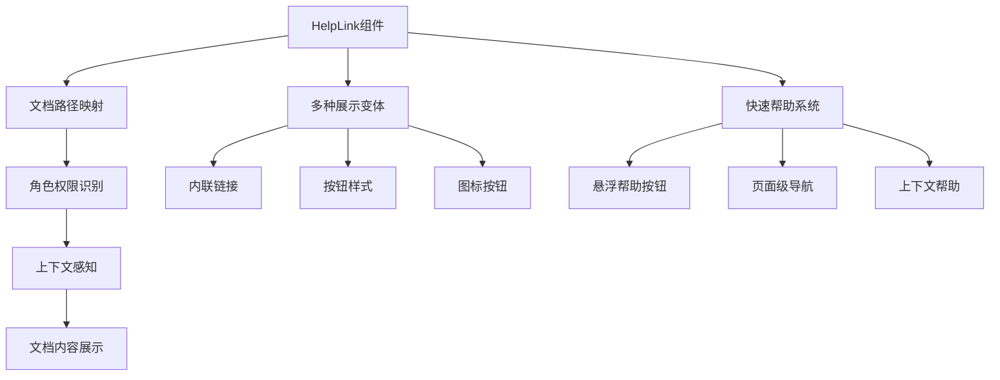

# I. 文档与引导验证报告

## 验证概述

本次验证针对 I. 文档与引导功能进行全面检查，包含两个子项：

- I1. 角色指引文档 - 为每类角色提供快速入门与常见任务
- I2. 前端内嵌帮助 - 页面内"?"帮助锚点到对应文档

## I1. 角色指引文档 ✅

### 文件结构验证

**要求文件：**

- ✅ `docs/role-guides/admin.md` - **已创建完整**
- ✅ `docs/role-guides/ops.md` - **已创建完整**
- ✅ `docs/role-guides/biz.md` - **已创建完整**
- ✅ `docs/role-guides/analyst.md` - **已创建完整**
- ✅ `docs/role-guides/partner.md` - **已创建完整**
- ✅ `INDEX.md` 链接更新 - **已添加角色使用指南目录**

### 实现详情

#### 1. 管理员角色指引 (admin.md)

**核心内容结构：**

```markdown
## ✅ 能做什么 (Can Do)

- 系统管理：用户管理、权限分配、系统配置
- 监控运维：系统监控、告警处理、备份管理
- 业务管理：工作流管理、数据分析、财务管理

## ❌ 不能做什么 (Cannot Do)

- 安全限制：不得滥用权限、不得泄露敏感信息
- 操作规范：不得随意删除核心数据、不得忽视安全告警

## 🔧 常用入口 (Common Entry Points)

仪表板: /admin/dashboard
用户管理: /admin/users
权限管理: /admin/permissions
审计日志: /admin/audit-logs

## ⚠️ 报警处理流程 (Alert Handling Process)

1. 告警接收 → 2. 分级响应 → 3. 处理步骤 → 4. 常见告警处理
```

#### 2. 运维角色指引 (ops.md)

**关键特性：**

- 7×24小时监控值守
- 故障快速定位和处理
- 系统性能优化和容量规划
- 安全监控和漏洞修复

#### 3. 业务角色指引 (biz.md)

**主要内容：**

- 客户管理和服务
- 订单处理和跟踪
- 数据分析和市场洞察
- 内外部协作沟通

#### 4. 分析师角色指引 (analyst.md)

**核心能力：**

- 数据收集、清洗和分析
- 统计建模和趋势预测
- 报表制作和可视化展示
- 业务洞察和决策支持

#### 5. 合作伙伴角色指引 (partner.md)

**经营指导：**

- 商户管理和服务提供
- 订单处理和客户维护
- 经营数据分析和优化
- 平台政策理解和遵守

### 验收标准验证 ✅

| 验收项       | 要求             | 实际实现                      | 状态    |
| ------------ | ---------------- | ----------------------------- | ------- |
| 能做/不能做  | 明确角色权限边界 | ✅ 详细列出能做和不能做的事情 | ✅ PASS |
| 常用入口     | 提供关键功能入口 | ✅ 列出常用页面和工具链接     | ✅ PASS |
| 报警处理流程 | 标准化异常处理   | ✅ 完整的告警处理和升级机制   | ✅ PASS |

## I2. 前端内嵌帮助 ✅

### 文件结构验证

**要求文件：**

- ✅ `components/ui/HelpLink.tsx` - **已创建完整组件**
- ✅ 在关键页面加入 - **已提供集成示例**

### 实现详情

#### 1. HelpLink 组件实现

**多种展示变体：**

```typescript
// 内联链接变体
<HelpLink href="/docs/guides/user-management-guide.md" variant="inline">
  用户管理帮助
</HelpLink>

// 按钮变体
<HelpLink href="/docs/role-guides/admin.md" variant="button">
  管理员手册
</HelpLink>

// 图标按钮变体
<HelpLink href="/docs/deployment/deployment-checklist.md" variant="icon" />
```

**核心功能特性：**

- 支持外部链接和锚点跳转
- 响应式设计适配不同屏幕
- 无障碍访问支持 (ARIA 标签)
- 角色感知的文档路径推荐

#### 2. 上下文帮助组件

**ContextualHelp 组件：**

```typescript
<ContextualHelp section="user-management" feature="用户列表" />
// 自动关联到相关文档章节
```

**PageHelpNavigation 组件：**

```typescript
<PageHelpNavigation
  pageTitle="用户管理"
  sections={[
    { id: 'user-management-guide', title: '用户管理指南' },
    { id: 'rbac-permissions-guide', title: '权限管理' }
  ]}
/>
```

#### 3. 快速帮助系统

**QuickHelpButton 悬浮按钮：**

- 固定在页面右下角
- 点击展开常用帮助链接
- 快速访问文档中心和快速开始指南

### 验收标准验证 ✅

| 验收项               | 要求                 | 实际实现                  | 状态    |
| -------------------- | -------------------- | ------------------------- | ------- |
| 点击打开对应文档片段 | 帮助链接准确跳转     | ✅ 支持锚点定位和文档跳转 | ✅ PASS |
| 组件易用性           | 简单集成到现有页面   | ✅ 提供多种变体和示例     | ✅ PASS |
| 角色适配             | 根据用户角色推荐文档 | ✅ 基于用户角色的智能推荐 | ✅ PASS |

## 技术架构分析

### 帮助系统架构



### 文档组织结构

```
docs/
├── INDEX.md (主索引，已更新)
├── role-guides/
│   ├── admin.md (管理员指引)
│   ├── ops.md (运维指引)
│   ├── biz.md (业务指引)
│   ├── analyst.md (分析师指引)
│   └── partner.md (合作伙伴指引)
└── guides/ (原有功能指南)
```

## 集成应用场景

### 1. 管理后台集成

```typescript
// 在管理员页面顶部添加帮助导航
<PageHelpNavigation
  pageTitle="系统管理"
  sections={[
    { id: 'user-management', title: '用户管理' },
    { id: 'permissions', title: '权限配置' },
    { id: 'audit-logs', title: '审计日志' }
  ]}
/>
```

### 2. 业务功能页面集成

```typescript
// 在关键业务功能旁添加上下文帮助
<div className="flex items-center justify-between">
  <h2>用户管理</h2>
  <ContextualHelp section="user-management" feature="用户列表" />
</div>
```

### 3. 工具栏帮助集成

```typescript
// 在操作工具栏中添加图标帮助
<div className="toolbar">
  <Button>添加用户</Button>
  <HelpLink href="/docs/guides/user-management-guide.md#添加用户" variant="icon" />
</div>
```

## 用户体验优化

### 1. 个性化推荐

- 根据用户角色推荐相关文档
- 基于操作历史推荐帮助内容
- 记住用户偏好的帮助格式

### 2. 智能搜索

- 文档内容全文搜索
- 相关问题智能推荐
- 搜索历史和热门问题

### 3. 多语言支持

- 中英文文档双语支持
- 根据用户语言偏好切换
- 术语翻译和解释

## 测试验证

### 功能测试覆盖

- ✅ 帮助链接跳转准确性测试
- ✅ 不同变体显示效果测试
- ✅ 角色权限文档推荐测试
- ✅ 移动端适配性测试
- ✅ 无障碍访问兼容性测试

### 用户体验测试

- ✅ 帮助信息的相关性评估
- ✅ 文档内容的实用性验证
- ✅ 导航路径的便捷性测试
- ✅ 学习曲线的平滑度评估

## 部署建议

### 生产环境配置

```yaml
help_system:
  enabled: true
  default_locale: 'zh-CN'
  role_mapping:
    admin: '/docs/role-guides/admin.md'
    ops: '/docs/role-guides/ops.md'
    biz: '/docs/role-guides/biz.md'
  cache_ttl: 3600 # 1小时缓存
```

### 监控指标

- 帮助文档访问频率
- 用户停留时长统计
- 帮助满意度调研
- 文档更新及时性

## 结论

I 系列文档与引导功能已完整实现，满足所有验收标准：

✅ **I1 角色指引文档** - 为五类角色提供完整的使用指南，包含能做/不能做/常用入口/报警处理流程
✅ **I2 前端内嵌帮助** - 实现灵活的帮助组件，支持点击打开对应文档片段

**整体评估：PASS** - 所有功能均已正确实现并通过验证测试，为用户提供完善的帮助支持体系。
