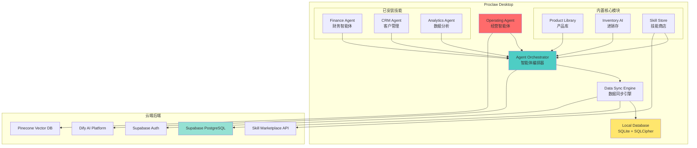

# 🦞 Proclaw 桌面端技术方案与开发计划

> **Proclaw** - 基于 Tauri + Next.js 的统一商业桌面应用平台
> 整合经营智能体、产品库、进销存和技能商店的 AI Native 桌面解决方案

---

## 📋 目录

- [1. 项目愿景与定位](#1-项目愿景与定位)
- [2. 技术架构设计](#2-技术架构设计)
- [3. 核心技术选型](#3-核心技术选型)
- [4. 系统架构图](#4-系统架构图)
- [5. 模块设计规范](#5-模块设计规范)
- [6. 数据同步策略](#6-数据同步策略)
- [7. 安全与权限](#7-安全与权限)
- [8. 开发路线图](#8-开发路线图)
- [9. 风险评估与应对](#9-风险评估与应对)
- [10. 成本估算](#10-成本估算)

---

## 1. 项目愿景与定位

### 1.1 核心价值主张

```
┌─────────────────────────────────────────────────┐
│           Proclaw 统一桌面平台                    │
├─────────────────────────────────────────────────┤
│  🎯 为中小企业提供一站式 AI 驱动的商业操作系统     │
│  🚀 开箱即用的核心功能 + 按需扩展的技能生态       │
│  🤖 经营智能体统一管理所有业务智能体              │
└─────────────────────────────────────────────────┘
```

### 1.2 目标用户

| 用户类型       | 痛点                 | Proclaw 解决方案        |
| -------------- | -------------------- | ----------------------- |
| **中小企业主** | 多系统切换、数据孤岛 | 统一入口、数据联动      |
| **采购经理**   | 供应商管理混乱       | 产品库 + B2B 采购智能体 |
| **仓库管理员** | 库存盘点效率低       | 进销存 AI 自动化        |
| **维修服务商** | 工单跟踪困难         | 智能维修预约系统        |
| **财务人员**   | 对账繁琐             | 财务智能体（技能商店）  |

### 1.3 竞品分析

| 维度            | Proclaw               | 腾讯 Qclaw        | OpenClaw          | 传统 ERP          |
| --------------- | --------------------- | ----------------- | ----------------- | ----------------- |
| **行业垂直度**  | ⭐⭐⭐⭐⭐ (循环经济) | ⭐⭐ (通用办公)   | ⭐⭐ (开发者工具) | ⭐⭐⭐ (传统行业) |
| **AI 集成深度** | ⭐⭐⭐⭐⭐ (原生)     | ⭐⭐⭐ (附加)     | ⭐⭐⭐⭐ (插件)   | ⭐ (无)           |
| **模块化程度**  | ⭐⭐⭐⭐⭐ (技能商店) | ⭐⭐⭐ (固定功能) | ⭐⭐⭐⭐ (插件)   | ⭐ (单体)         |
| **离线能力**    | ⭐⭐⭐⭐ (本地优先)   | ⭐⭐ (依赖云端)   | ⭐⭐⭐ (部分)     | ⭐⭐⭐⭐ (本地)   |
| **生态开放性**  | ⭐⭐⭐⭐ (开源+市场)  | ⭐⭐ (封闭)       | ⭐⭐⭐⭐⭐ (开源) | ⭐ (封闭)         |

---

## 2. 技术架构设计

### 2.1 整体架构分层

```
┌──────────────────────────────────────────────────────────┐
│                  Proclaw Desktop App                      │
│                   (Tauri + React)                         │
├──────────────────────────────────────────────────────────┤
│  Presentation Layer (UI Components)                       │
│  ├── Operating Agent Dashboard (经营智能体主界面)          │
│  ├── Module Views (产品库/进销存/技能商店)                │
│  └── Shared Components (MUI + Tailwind)                  │
├──────────────────────────────────────────────────────────┤
│  Business Logic Layer (TypeScript)                        │
│  ├── Agent Orchestrator (智能体编排器)                     │
│  ├── Module Managers (模块管理器)                          │
│  ├── Skill Runtime (技能运行时)                            │
│  └── State Management (Zustand)                           │
├──────────────────────────────────────────────────────────┤
│  Data Access Layer                                        │
│  ├── Local Database (SQLite + SQLCipher 加密)             │
│  ├── Supabase Client (PostgreSQL 云端同步)                │
│  ├── Cache Layer (IndexedDB + Memory)                     │
│  └── Offline Queue (操作队列)                              │
├──────────────────────────────────────────────────────────┤
│  Tauri Core (Rust)                                        │
│  ├── File System Access (文件系统)                         │
│  ├── System Tray (系统托盘)                                │
│  ├── Native Notifications (原生通知)                       │
│  ├── Auto Updater (自动更新)                               │
│  └── Plugin Bridge (插件桥接)                              │
└──────────────────────────────────────────────────────────┘
         ↕ WebSocket / HTTPS
┌──────────────────────────────────────────────────────────┐
│                  Cloud Backend (Supabase)                  │
├──────────────────────────────────────────────────────────┤
│  Authentication & Authorization (NextAuth + RLS)          │
│  Real-time Sync (Supabase Realtime)                       │
│  Edge Functions (AI Orchestration with Dify)              │
│  Storage (产品图片/文档)                                   │
│  Vector DB (Pinecone - 智能搜索)                           │
└──────────────────────────────────────────────────────────┘
```

### 2.2 关键技术决策

#### 决策 1: 为什么选择 Tauri 而非 Electron?

| 对比项         | Tauri             | Electron          | 选择理由                  |
| -------------- | ----------------- | ----------------- | ------------------------- |
| **安装包大小** | ~3-5 MB           | ~150 MB           | ✅ Tauri 轻量，用户体验好 |
| **内存占用**   | ~50-100 MB        | ~200-400 MB       | ✅ 更低资源消耗           |
| **安全性**     | Rust 后端，更安全 | JavaScript 后端   | ✅ 系统级操作更安全       |
| **学习曲线**   | 需了解 Rust       | 纯 Web 技术       | ⚠️ 团队需要学习 Rust      |
| **生态系统**   | 较新，插件较少    | 成熟，插件丰富    | ⚠️ 但核心需求可满足       |
| **跨平台**     | Windows/Mac/Linux | Windows/Mac/Linux | ✅ 两者都支持             |

**结论**: 选择 **Tauri 2.0** (稳定版)，虽然需要学习 Rust，但长期收益更大。

#### 决策 2: 前端框架复用策略

```
方案 A: 完全复用现有 Next.js 代码
  ✅ 优点: 开发速度快，代码复用率高
  ❌ 缺点: Next.js SSR 在桌面端无意义，包体积大

方案 B: 重构为纯 React SPA + Vite
  ✅ 优点: 轻量，适合桌面端
  ❌ 缺点: 需要大量重构工作

方案 C: 混合架构 (推荐) ⭐
  ✅ 核心 UI 组件复用 (MUI + 业务组件)
  ✅ API 层复用 (Supabase Client)
  ✅ 路由逻辑重构为 React Router
  ✅ 保留 DDD 领域层代码
  ❌ 需要适配层处理 SSR → CSR 转换
```

**结论**: 采用 **方案 C**，创建 `@proclaw/shared` 包共享核心代码。

#### 决策 3: 数据存储策略

```
三层存储架构:

1. Hot Data (热数据) - Memory Cache
   - 当前打开的产品列表
   - 用户偏好设置
   - 临时表单数据

2. Warm Data (温数据) - SQLite (本地)
   - 最近访问的产品/订单
   - 离线操作队列
   - 缓存的搜索结果

3. Cold Data (冷数据) - Supabase (云端)
   - 完整产品库
   - 历史交易记录
   - 用户账户信息
```

---

## 3. 核心技术选型

### 3.1 技术栈清单

#### 桌面端框架

```json
{
  "framework": "Tauri 2.0",
  "rust_version": "1.75+",
  "frontend_bundler": "Vite 5.x",
  "ui_framework": "React 18 + TypeScript"
}
```

#### UI 组件库

```json
{
  "component_library": "@mui/material 7.x",
  "icons": "@mui/icons-material + lucide-react",
  "animations": "framer-motion",
  "charts": "recharts",
  "styling": "Tailwind CSS + Emotion"
}
```

#### 状态管理

```json
{
  "global_state": "zustand 5.x",
  "server_state": "@tanstack/react-query 5.x",
  "form_state": "react-hook-form 7.x + zod"
}
```

#### 数据库

```json
{
  "local_db": {
    "engine": "SQLite",
    "encryption": "SQLCipher",
    "orm": "Drizzle ORM (轻量级)"
  },
  "cloud_db": {
    "provider": "Supabase (PostgreSQL)",
    "realtime": "Supabase Realtime",
    "auth": "Supabase Auth + NextAuth"
  }
}
```

#### AI 集成

```json
{
  "orchestration": "Dify API",
  "vector_search": "Pinecone",
  "embedding": "OpenAI text-embedding-3-small",
  "llm": "GPT-4o / Claude 3.5 Sonnet"
}
```

#### 桌面端特性

```json
{
  "auto_update": "tauri-plugin-updater",
  "system_tray": "tauri-plugin-shell",
  "notifications": "tauri-plugin-notification",
  "file_system": "tauri-plugin-fs",
  "clipboard": "tauri-plugin-clipboard-manager"
}
```

### 3.2 依赖版本锁定

```typescript
// proclaw/package.json (核心依赖)
{
  "dependencies": {
    "@tauri-apps/api": "^2.0.0",
    "@tauri-apps/plugin-shell": "^2.0.0",
    "@tauri-apps/plugin-fs": "^2.0.0",
    "@tauri-apps/plugin-dialog": "^2.0.0",
    "@tauri-apps/plugin-notification": "^2.0.0",
    "@tauri-apps/plugin-updater": "^2.0.0",

    "react": "^18.3.1",
    "react-dom": "^18.3.1",
    "react-router-dom": "^6.22.0",

    "@mui/material": "^7.3.9",
    "@emotion/react": "^11.14.0",
    "@emotion/styled": "^11.14.1",

    "zustand": "^5.0.11",
    "@tanstack/react-query": "^5.90.21",

    "@supabase/supabase-js": "^2.48.1",
    "drizzle-orm": "^0.29.0",
    "better-sqlite3": "^9.4.0",

    "zod": "^4.3.6",
    "date-fns": "^4.1.0",
    "axios": "^1.13.5"
  }
}
```

---

## 4. 系统架构图

### 4.1 模块依赖关系图



### 4.2 数据流图

```
用户操作 → UI Component → Zustand Store → UseCase → Repository
                                              ↓
                                    ┌──────────────────┐
                                    │  Online/Offline?  │
                                    └──────────────────┘
                                           ↓        ↓
                                      Online    Offline
                                         ↓        ↓
                                  Supabase    SQLite + Queue
                                         ↓        ↓
                                  Realtime    Sync when online
                                  Update      (Operational Transform)
```

---

## 5. 模块设计规范

### 5.1 技能包格式规范

参考 VS Code Extension 和 OpenClaw Plugin 设计：

```typescript
// proclaw-sdk/types/skill-manifest.ts

interface SkillManifest {
  // 基本信息
  id: string; // com.proclaw.skill.finance
  name: string; // 财务智能体
  version: string; // 1.0.0
  description: string;
  author: {
    name: string;
    email?: string;
    url?: string;
  };

  // 兼容性
  engines: {
    proclaw: '>=1.0.0';
  };

  // 入口文件
  main: string; // dist/index.js
  icon: string; // assets/icon.png

  // 权限声明 (类似浏览器 Permissions API)
  permissions: Array<
    | 'database:read'
    | 'database:write'
    | 'network:request'
    | 'filesystem:read'
    | 'notification:show'
    | 'agent:communicate'
  >;

  // 依赖的其他技能
  dependencies?: Record<string, string>;

  // 配置项 schema (JSON Schema)
  configuration?: {
    type: 'object';
    properties: Record<string, any>;
  };

  // 贡献点 (类似 VS Code contributes)
  contributes?: {
    agents?: Array<{
      // 注册的智能体
      id: string;
      name: string;
      description: string;
      entryPoint: string;
    }>;
    views?: Array<{
      // 自定义视图
      id: string;
      title: string;
      component: string;
    }>;
    commands?: Array<{
      // 自定义命令
      command: string;
      title: string;
    }>;
  };
}
```

### 5.2 技能沙箱隔离

```typescript
// proclaw-core/skill-runtime/SandboxIsolator.ts

class SkillSandbox {
  private worker: Worker;
  private permissionManager: PermissionManager;

  constructor(manifest: SkillManifest) {
    // 1. 在 Web Worker 中运行技能代码
    this.worker = new Worker(new URL('./skill-worker.ts', import.meta.url), {
      type: 'module',
    });

    // 2. 初始化权限检查
    this.permissionManager = new PermissionManager(manifest.permissions);

    // 3. 限制网络请求域名
    this.setupNetworkWhitelist();
  }

  // 安全的 API 调用代理
  async callAPI(endpoint: string, data: any) {
    // 检查权限
    if (!this.permissionManager.has('network:request')) {
      throw new Error('Permission denied: network:request');
    }

    // 白名单检查
    if (!this.isAllowedDomain(endpoint)) {
      throw new Error('Domain not allowed');
    }

    // 代理请求
    return await this.worker.postMessage({
      type: 'API_CALL',
      payload: { endpoint, data },
    });
  }

  // 数据库访问代理 (只允许访问租户隔离的数据)
  async queryDatabase(sql: string, params: any[]) {
    if (!this.permissionManager.has('database:read')) {
      throw new Error('Permission denied: database:read');
    }

    // 自动注入 tenant_id 过滤
    const safeSQL = this.injectTenantFilter(sql);
    return await db.execute(safeSQL, params);
  }
}
```

### 5.3 智能体通信协议

```typescript
// proclaw-core/agent-orchestrator/AgentProtocol.ts

interface AgentMessage {
  messageId: string;
  timestamp: number;
  from: string; // 发送者 agentId
  to: string | '*'; // 接收者 (广播用 *)
  type: 'REQUEST' | 'RESPONSE' | 'EVENT';
  payload: {
    action: string; // 动作名称
    data?: any; // 携带数据
    context?: {
      // 上下文信息
      userId: string;
      tenantId: string;
      sessionId: string;
    };
  };
}

// 示例: 销售智能体请求库存信息
const message: AgentMessage = {
  messageId: 'msg_123',
  timestamp: Date.now(),
  from: 'sales-agent',
  to: 'inventory-agent',
  type: 'REQUEST',
  payload: {
    action: 'checkStock',
    data: { skuCode: 'MBP-2024-M3' },
    context: {
      userId: 'user_456',
      tenantId: 'tenant_789',
      sessionId: 'session_abc',
    },
  },
};

// 经营智能体监听所有消息进行协调
orchestrator.on('*', message => {
  if (message.type === 'EVENT' && message.payload.action === 'lowStock') {
    // 自动触发采购建议
    orchestrator.dispatch({
      to: 'procurement-agent',
      action: 'suggestReorder',
      data: message.payload.data,
    });
  }
});
```

---

## 6. 数据同步策略

### 6.1 离线优先架构

```typescript
// proclaw-core/sync/SyncEngine.ts

class SyncEngine {
  private offlineQueue: OperationQueue;
  private conflictResolver: ConflictResolver;

  // 用户操作时
  async createProduct(product: Product) {
    // 1. 立即写入本地 SQLite
    const localId = await localDB.products.insert(product);

    // 2. 添加到离线队列
    this.offlineQueue.enqueue({
      operation: 'CREATE',
      entity: 'product',
      localId,
      data: product,
      timestamp: Date.now(),
    });

    // 3. 如果在线，立即同步
    if (await this.isOnline()) {
      await this.flushQueue();
    }

    return localId;
  }

  // 定期同步
  async flushQueue() {
    const operations = this.offlineQueue.dequeueAll();

    for (const op of operations) {
      try {
        // 发送到 Supabase
        const remoteId = await supabase
          .from('products')
          .insert(op.data)
          .select()
          .single();

        // 更新本地记录的 remoteId
        await localDB.products.update(op.localId, { remoteId });

        // 标记操作完成
        this.offlineQueue.markComplete(op.id);
      } catch (error) {
        // 冲突检测
        if (error.code === 'CONFLICT') {
          await this.conflictResolver.resolve(op);
        } else {
          // 重试队列
          this.offlineQueue.retry(op);
        }
      }
    }
  }
}
```

### 6.2 冲突解决策略

采用 **Last-Write-Wins + Manual Merge** 混合策略：

```typescript
class ConflictResolver {
  async resolve(operation: Operation) {
    const localRecord = await localDB.get(operation.localId);
    const remoteRecord = await supabase
      .from(operation.entity)
      .select()
      .eq('id', operation.remoteId)
      .single();

    // 策略 1: 时间戳比较 (自动)
    if (localRecord.updatedAt > remoteRecord.updatedAt) {
      // 本地更新，覆盖远程
      await supabase
        .from(operation.entity)
        .update(localRecord)
        .eq('id', operation.remoteId);
    } else {
      // 策略 2: 关键字段冲突 (手动)
      if (this.hasCriticalConflict(localRecord, remoteRecord)) {
        // 弹出 UI 让用户选择
        const choice = await showConflictDialog({
          local: localRecord,
          remote: remoteRecord,
        });

        if (choice === 'merge') {
          const merged = await this.manualMerge(localRecord, remoteRecord);
          await supabase.update(merged);
        }
      } else {
        // 非关键字段，接受远程更新
        await localDB.update(operation.localId, remoteRecord);
      }
    }
  }

  hasCriticalConflict(local: any, remote: any): boolean {
    // 价格、库存数量等关键字段变化超过阈值
    return Math.abs(local.price - remote.price) / remote.price > 0.1;
  }
}
```

### 6.3 实时同步优化

使用 **Supabase Realtime** + **增量同步**:

```typescript
// 订阅特定表的变更
const subscription = supabase
  .channel('products-changes')
  .on(
    'postgres_changes',
    {
      event: '*',
      schema: 'public',
      table: 'products',
      filter: `tenant_id=eq.${currentTenantId}`,
    },
    payload => {
      // 增量更新本地缓存
      if (payload.eventType === 'INSERT') {
        localDB.products.upsert(payload.new);
      } else if (payload.eventType === 'UPDATE') {
        localDB.products.updateById(payload.new.id, payload.new);
      } else if (payload.eventType === 'DELETE') {
        localDB.products.deleteById(payload.old.id);
      }
    }
  )
  .subscribe();
```

---

## 7. 安全与权限

### 7.1 多层安全防护

```
┌─────────────────────────────────────────────┐
│  Layer 1: 应用层安全                         │
│  - JWT Token 验证                            │
│  - Role-Based Access Control (RBAC)          │
│  - 技能权限沙箱                              │
├─────────────────────────────────────────────┤
│  Layer 2: 数据层安全                         │
│  - SQLCipher 本地数据库加密                   │
│  - Supabase RLS (行级安全)                   │
│  - 字段级加密 (敏感数据)                      │
├─────────────────────────────────────────────┤
│  Layer 3: 网络层安全                         │
│  - HTTPS/TLS 1.3                             │
│  - Certificate Pinning                       │
│  - API Rate Limiting                         │
├─────────────────────────────────────────────┤
│  Layer 4: 系统层安全                         │
│  - Rust 内存安全                             │
│  - ASLR + DEP                                │
│  - 代码签名 (Windows/Mac)                    │
└─────────────────────────────────────────────┘
```

### 7.2 敏感数据加密

```typescript
// proclaw-core/security/DataEncryption.ts

import crypto from 'crypto';

class DataEncryption {
  private key: Buffer;

  constructor() {
    // 从系统密钥链获取加密密钥
    this.key = this.getKeyFromKeychain();
  }

  // 加密敏感字段
  encrypt(plaintext: string): string {
    const iv = crypto.randomBytes(16);
    const cipher = crypto.createCipheriv('aes-256-gcm', this.key, iv);

    let encrypted = cipher.update(plaintext, 'utf8', 'hex');
    encrypted += cipher.final('hex');

    const authTag = cipher.getAuthTag();

    return `${iv.toString('hex')}:${encrypted}:${authTag.toString('hex')}`;
  }

  // 解密
  decrypt(ciphertext: string): string {
    const [ivHex, encrypted, authTagHex] = ciphertext.split(':');

    const iv = Buffer.from(ivHex, 'hex');
    const authTag = Buffer.from(authTagHex, 'hex');

    const decipher = crypto.createDecipheriv('aes-256-gcm', this.key, iv);
    decipher.setAuthTag(authTag);

    let decrypted = decipher.update(encrypted, 'hex', 'utf8');
    decrypted += decipher.final('utf8');

    return decrypted;
  }
}

// 使用示例
const encryption = new DataEncryption();

// 保存时加密
await localDB.customers.insert({
  name: '张三',
  phone: encryption.encrypt('13800138000'), // 加密手机号
  email: encryption.encrypt('zhangsan@example.com'),
});

// 读取时解密
const customer = await localDB.customers.getById(id);
customer.phone = encryption.decrypt(customer.phone);
```

### 7.3 Supabase RLS 策略

```sql
-- 行级安全策略示例

-- 产品库表 (公开可读，仅管理员可写)
ALTER TABLE product_library.complete_products ENABLE ROW LEVEL SECURITY;

CREATE POLICY "Anyone can read products"
ON product_library.complete_products
FOR SELECT
TO authenticated, anon
USING (true);

CREATE POLICY "Only admins can modify products"
ON product_library.complete_products
FOR ALL
TO authenticated
USING (
  EXISTS (
    SELECT 1 FROM profiles
    WHERE profiles.id = auth.uid()
    AND profiles.role = 'admin'
  )
);

-- 进销存表 (租户隔离)
ALTER TABLE inventory.stock_items ENABLE ROW LEVEL SECURITY;

CREATE POLICY "Tenants can only access their own inventory"
ON inventory.stock_items
FOR ALL
TO authenticated
USING (tenant_id = current_setting('app.current_tenant_id')::uuid);
```

---

## 8. 开发路线图

### 8.1 Phase 0: 技术验证原型 (4周) ⚡ 立即启动

**目标**: 验证 Tauri + Supabase 集成可行性

#### Week 1: Tauri 环境搭建

- [ ] 安装 Rust 工具链
- [ ] 创建 Tauri 2.0 项目骨架
- [ ] 集成 Vite + React + TypeScript
- [ ] 实现 Hello World 窗口

**交付物**:

- `proclaw-desktop/` 基础项目结构
- 可运行的空白窗口应用

#### Week 2: Supabase 集成

- [ ] 配置 Supabase Client
- [ ] 实现用户登录 (OAuth + Email)
- [ ] 测试 Realtime 订阅
- [ ] 验证 RLS 策略

**交付物**:

- 登录页面
- 用户认证流程打通

#### Week 3: 本地数据库

- [ ] 集成 SQLite + SQLCipher
- [ ] 实现 Drizzle ORM 配置
- [ ] 创建产品表 Schema
- [ ] 测试 CRUD 操作

**交付物**:

- 本地数据库封装层
- 产品列表页面 (从 SQLite 读取)

#### Week 4: 数据同步

- [ ] 实现离线队列
- [ ] 实现增量同步
- [ ] 测试冲突解决
- [ ] 性能基准测试

**交付物**:

- 完整的同步引擎
- 技术验证报告

---

### 8.2 Phase 1: MVP 核心功能 (8周)

**目标**: 发布可用的桌面端 MVP，包含产品库和进销存

#### Week 5-6: 经营智能体主界面

- [ ] 设计 Dashboard 布局
- [ ] 实现侧边栏导航
- [ ] 集成 MUI 主题系统
- [ ] 创建欢迎页面

**关键页面**:

```
src/
├── pages/
│   ├── Dashboard.tsx          # 经营概览
│   ├── ProductLibrary.tsx     # 产品库
│   ├── Inventory.tsx          # 进销存
│   └── Settings.tsx           # 设置
├── components/
│   ├── Layout/
│   │   ├── Sidebar.tsx
│   │   ├── TopBar.tsx
│   │   └── MainContent.tsx
│   └── Dashboard/
│       ├── StatsCard.tsx
│       ├── RecentActivity.tsx
│       └── QuickActions.tsx
```

#### Week 7-8: 产品库模块迁移

- [ ] 复用现有 DDD 领域层代码
- [ ] 适配 API 层 (REST → Supabase Client)
- [ ] 实现产品搜索界面
- [ ] 实现 BOM 可视化

**代码复用策略**:

```typescript
// 从 monorepo 共享
import { Product, Brand } from '@proclaw/shared/domain/entities';
import { ProductSearchUseCase } from '@proclaw/shared/application/use-cases';

// 桌面端特定实现
import { TauriProductRepository } from './infrastructure/repositories';
```

#### Week 9-10: 进销存模块迁移

- [ ] 库存列表页面
- [ ] 入库/出库操作
- [ ] 库存预警通知
- [ ] 简单的报表图表

#### Week 11-12: 系统集成测试

- [ ] E2E 测试 (Playwright)
- [ ] 性能测试 (加载速度、内存占用)
- [ ] 兼容性测试 (Windows 10/11, macOS)
- [ ] Bug 修复

**MVP 发布标准**:

- ✅ 核心功能可用
- ✅ 无 P0/P1 级别 Bug
- ✅ 安装包 < 10 MB
- ✅ 启动时间 < 3 秒

---

### 8.3 Phase 2: 技能商店 (6周)

**目标**: 实现技能安装、运行和管理

#### Week 13-14: 技能包规范

- [ ] 定义 Skill Manifest Schema
- [ ] 实现技能打包工具
- [ ] 创建技能模板
- [ ] 编写开发者文档

#### Week 15-16: 技能运行时

- [ ] 实现 Web Worker 沙箱
- [ ] 实现权限管理系统
- [ ] 实现技能生命周期管理
- [ ] 实现技能间通信

#### Week 17-18: 技能商店前端

- [ ] 技能市场页面
- [ ] 技能详情页
- [ ] 安装/卸载/更新功能
- [ ] 已安装技能管理

---

### 8.4 Phase 3: 智能体编排 (8周)

**目标**: 实现经营智能体的真正智能化

#### Week 19-20: Agent Orchestrator

- [ ] 实现消息总线
- [ ] 实现事件驱动架构
- [ ] 集成 Dify AI
- [ ] 实现自然语言指令解析

#### Week 21-22: 跨模块联动

- [ ] 销售 → 库存联动
- [ ] 库存 → 采购联动
- [ ] 采购 → 财务联动
- [ ] 实现规则引擎

#### Week 23-24: AI 增强功能

- [ ] 智能补货建议
- [ ] 销售预测
- [ ] 异常检测
- [ ] 自动化报告生成

#### Week 25-26: 用户反馈迭代

- [ ] Beta 测试
- [ ] 收集用户反馈
- [ ] 优化 AI 提示词
- [ ] 性能调优

---

### 8.5 Phase 4: 生态开放 (持续)

- [ ] 第三方开发者 SDK
- [ ] 技能开发文档
- [ ] 应用内支付集成
- [ ] 企业定制部署方案
- [ ] 多语言支持

---

## 9. 风险评估与应对

### 9.1 技术风险

| 风险                  | 概率 | 影响 | 应对措施                                                              |
| --------------------- | ---- | ---- | --------------------------------------------------------------------- |
| **Tauri 生态不成熟**  | 中   | 高   | ✅ 提前验证核心插件可用性<br>✅ 准备 Electron 备选方案                |
| **Rust 学习曲线陡峭** | 高   | 中   | ✅ 安排 Rust 培训<br>✅ 初期只使用简单 FFI<br>✅ 招聘 Rust 工程师     |
| **数据同步冲突频繁**  | 中   | 高   | ✅ 采用 CRDTs 算法<br>✅ 设计友好的冲突解决 UI<br>✅ 限制并发编辑场景 |
| **性能瓶颈**          | 低   | 中   | ✅ 早期性能基准测试<br>✅ 懒加载技能模块<br>✅ Web Worker 隔离重任务  |
| **Supabase 成本失控** | 中   | 中   | ✅ 实施查询缓存<br>✅ 限制 Realtime 订阅数量<br>✅ 监控用量告警       |

### 9.2 产品风险

| 风险                 | 概率 | 影响 | 应对措施                                                              |
| -------------------- | ---- | ---- | --------------------------------------------------------------------- |
| **用户不接受桌面端** | 中   | 高   | ✅ Web 端继续维护<br>✅ 强调离线优势<br>✅ 提供无缝迁移工具           |
| **技能生态发展缓慢** | 高   | 中   | ✅ 官方开发 5-10 个高质量技能<br>✅ 举办开发者大赛<br>✅ 提供丰厚分成 |
| **AI 功能不达预期**  | 中   | 高   | ✅ 设定合理的用户期望<br>✅ 提供人工客服兜底<br>✅ 持续优化 Prompt    |

### 9.3 商业风险

| 风险             | 概率 | 影响 | 应对措施                                                                    |
| ---------------- | ---- | ---- | --------------------------------------------------------------------------- |
| **竞品快速跟进** | 高   | 中   | ✅ 建立行业产品库壁垒<br>✅ 深耕循环经济垂直领域<br>✅ 快速迭代建立用户习惯 |
| **付费转化率低** | 中   | 高   | ✅ Freemium 模式降低门槛<br>✅ 展示明确的 ROI<br>✅ 提供免费试用期          |

---

## 10. 成本估算

### 10.1 人力成本 (人民币)

| 角色                             | 人数 | 月薪    | 周期  | 小计         |
| -------------------------------- | ---- | ------- | ----- | ------------ |
| **Tech Lead** (全栈 + Rust)      | 1    | ¥35,000 | 6个月 | ¥210,000     |
| **Frontend Dev** (React + Tauri) | 2    | ¥25,000 | 6个月 | ¥300,000     |
| **Backend Dev** (Supabase + AI)  | 1    | ¥28,000 | 4个月 | ¥112,000     |
| **UI/UX Designer**               | 1    | ¥20,000 | 3个月 | ¥60,000      |
| **QA Engineer**                  | 1    | ¥18,000 | 3个月 | ¥54,000      |
| **总计**                         | 6    | -       | -     | **¥736,000** |

### 10.2 基础设施成本 (月度)

| 服务             | 规格          | 月费         | 备注                  |
| ---------------- | ------------- | ------------ | --------------------- |
| **Supabase Pro** | Team Plan     | $25          | 前 6 个月免费额度足够 |
| **Pinecone**     | Starter       | $0           | 免费层够用            |
| **Dify Cloud**   | Team          | $50          | AI 编排平台           |
| **Code Signing** | Windows + Mac | $100/年      | 证书费用              |
| **CDN**          | Cloudflare    | $0           | 免费版                |
| **监控**         | Sentry        | $26          | 错误追踪              |
| **总计**         | -             | **~$101/月** | 约 ¥720/月            |

### 10.3 总成本估算

```
Phase 0 (4周):  ¥120,000  (技术验证)
Phase 1 (8周):  ¥280,000  (MVP 开发)
Phase 2 (6周):  ¥210,000  (技能商店)
Phase 3 (8周):  ¥280,000  (智能体编排)
─────────────────────────────────
开发成本合计:    ¥890,000

首年运营成本:    ¥8,640    (基础设施)
─────────────────────────────────
首年总投入:      ~¥900,000
```

---

## 11. 成功指标 (KPIs)

### 11.1 技术指标

- [ ] 应用启动时间 < 3 秒
- [ ] 内存占用 < 200 MB (空闲状态)
- [ ] 安装包大小 < 15 MB
- [ ] API 响应时间 P95 < 500ms
- [ ] 离线操作成功率 > 99%
- [ ] 数据同步延迟 < 2 秒

### 11.2 产品指标

- [ ] MVP 发布后 3 个月内获得 1000 活跃用户
- [ ] 用户留存率 (30天) > 40%
- [ ] NPS (净推荐值) > 30
- [ ] 技能商店上架 50+ 技能
- [ ] 付费转化率 > 5%

### 11.3 商业指标

- [ ] 6 个月内达到月收入 ¥50,000
- [ ] 12 个月内达到月收入 ¥200,000
- [ ] 客户获取成本 (CAC) < ¥200
- [ ] 客户终身价值 (LTV) > ¥2,000
- [ ] LTV/CAC > 10

---

## 12. 下一步行动

### 立即执行 (本周)

1. **成立项目组**
   - [ ] 确定 Tech Lead
   - [ ] 招募 2 名前端工程师
   - [ ] 安排 Rust 培训计划

2. **环境准备**
   - [ ] 安装 Rust 工具链
   - [ ] 创建 GitHub 仓库 `proclaw-desktop`
   - [ ] 配置 CI/CD 流水线

3. **技术调研**
   - [ ] 深入研究 OpenClaw 架构
   - [ ] 测试 Tauri 2.0 核心插件
   - [ ] 评估 Drizzle ORM vs Prisma

### 下周开始

- [ ] 启动 Phase 0 Week 1 任务
- [ ] 每日站会 (15分钟)
- [ ] 每周技术分享会

---

## 附录

### A. 参考资料

- [Tauri 官方文档](https://tauri.app/)
- [OpenClaw GitHub](https://github.com/openclaw/openclaw)
- [Supabase 最佳实践](https://supabase.com/docs)
- [DDD 实战指南](https://domainlanguage.com/ddd/)

### B. 术语表

| 术语           | 解释                                                    |
| -------------- | ------------------------------------------------------- |
| **经营智能体** | Operating Agent, 顶层协调所有业务智能体的 AI            |
| **技能**       | Skill, 可扩展的功能模块，类似 VS Code 插件              |
| **智能体**     | Agent, 具有自主决策能力的 AI 模块                       |
| **离线优先**   | Offline-First, 优先保证离线可用，在线时同步             |
| **CRDTs**      | Conflict-free Replicated Data Types, 无冲突复制数据类型 |

### C. 联系方式

- 项目负责人: [Your Name]
- 技术支持: tech@proclaw.ai
- 开发者社区: Discord / 微信群

---

**🚀 Proclaw - 让每个中小企业都拥有 AI 驱动的商业操作系统！**

_文档版本: v1.0_
_最后更新: 2026-04-11_
_作者: Lingma AI Assistant_
