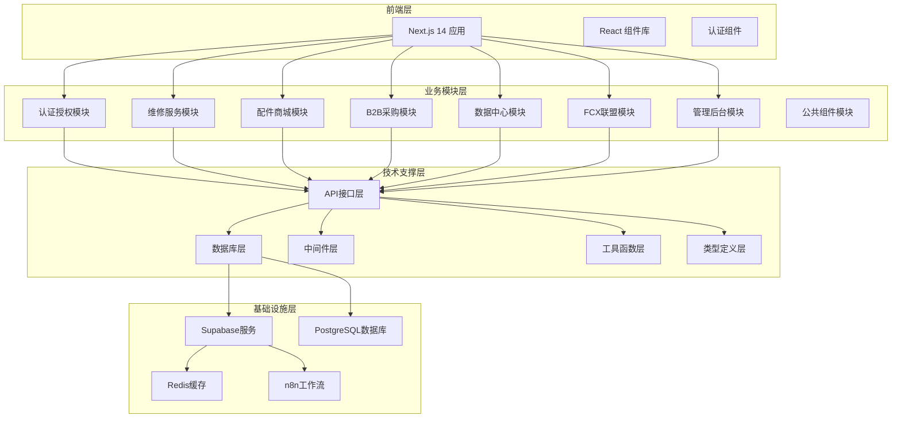
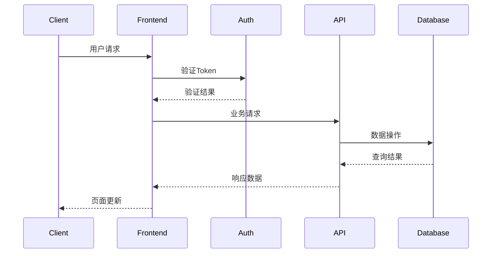

# ProdCycleAI 项目架构文档

## 🏗️ 系统架构概览

ProdCycleAI 是一个基于微服务架构的智能循环经济平台，采用模块化设计理念，支持高并发和可扩展性。

## 📐 架构图

## 📦 模块结构说明

### 业务模块 (src/modules)

1. **auth** - 认证授权模块
   - 负责用户身份验证和权限管理
   - 提供OAuth集成和JWT令牌管理
   - 依赖: common

2. **repair-service** - 维修服务模块
   - 设备维修预约和管理
   - 工单系统和技师调度
   - 依赖: auth, common, data-center

3. **parts-market** - 配件商城模块
   - 3C配件交易和比价
   - 库存管理和订单处理
   - 依赖: auth, common

4. **b2b-procurement** - B2B采购模块
   - 进出口贸易管理
   - 供应商对接和物流跟踪
   - 依赖: auth, common, data-center

5. **data-center** - 数据中心模块
   - 数据分析和报表生成
   - 实时监控和预警系统
   - 依赖: common

6. **fcx-alliance** - FCX联盟模块
   - 代币经济和激励系统
   - 联盟管理和收益分配
   - 依赖: auth, common, data-center

7. **admin-panel** - 管理后台模块
   - 系统配置和用户管理
   - 内容审核和运营监控
   - 依赖: auth, common, data-center

8. **common** - 公共组件模块
   - 共享UI组件和工具函数
   - 基础样式和常量定义
   - 无外部依赖

### 技术模块 (src/tech)

1. **database** - 数据库相关
   - 数据模型定义和ORM配置
   - 数据库连接管理和迁移
   - 查询优化和索引策略

2. **api** - API接口层
   - RESTful API控制器
   - 业务逻辑服务层
   - 接口文档和版本管理

3. **middleware** - 中间件
   - 认证和授权中间件
   - 日志记录和错误处理
   - 请求验证和限流控制

4. **utils** - 工具函数
   - 通用辅助函数
   - 数据验证和格式化
   - 加密解密和安全工具

5. **types** - 类型定义
   - TypeScript接口和类型
   - 枚举定义和常量
   - 类型安全保证

## 🔧 技术栈

### 前端技术

- **框架**: Next.js 14 (App Router)
- **语言**: TypeScript
- **UI库**: React 18 + Tailwind CSS
- **组件库**: shadcn/ui
- **状态管理**: React Context + Hooks

### 后端技术

- **运行时**: Node.js 18+
- **数据库**: PostgreSQL + Supabase
- **缓存**: Redis
- **工作流**: n8n
- **消息队列**: (计划中)

### 开发工具

- **包管理**: npm
- **构建工具**: Webpack + SWC
- **测试框架**: Jest + Playwright
- **代码质量**: ESLint + Prettier
- **CI/CD**: GitHub Actions

## 🔄 数据流向

## 📊 性能指标

- **响应时间**: < 200ms (API)
- **并发用户**: 10,000+
- **可用性**: 99.9%
- **数据库连接池**: 20
- **缓存命中率**: > 85%

## 🔒 安全架构

- **认证**: JWT + OAuth 2.0
- **授权**: RBAC权限控制
- **数据加密**: AES-256
- **传输安全**: HTTPS/TLS 1.3
- **输入验证**: 严格参数校验
- **审计日志**: 完整操作记录

---

_最后更新: 2026年2月21日_
_版本: v3.0_
