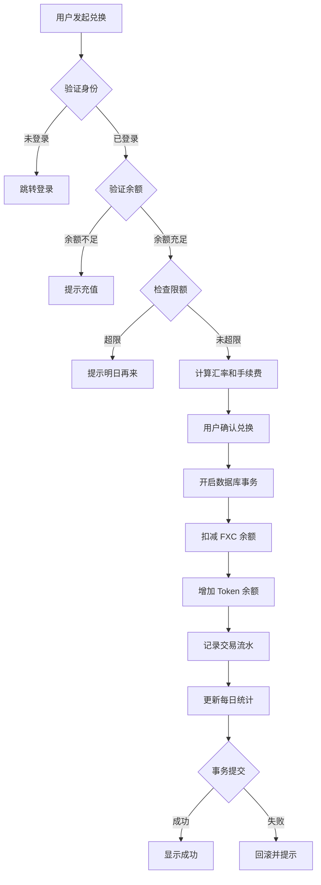

# FXC 兑换 Token 业务白皮书

**版本**: 1.0.0  
**创建时间**: 2026-03-24  
**最后更新**: 2026-03-24  

---

## 📋 目录

1. [概述](#概述)
2. [汇率机制](#汇率机制)
3. [业务流程](#业务流程)
4. [技术实现](#技术实现)
5. [费用结构](#费用结构)
6. [风控策略](#风控策略)
7. [使用示例](#使用示例)
8. [常见问题](#常见问题)

---

## 概述

### 背景

FXC（Foreign Exchange Coin）是本平台的外汇通证，Token 是平台内部的数字权益凭证。为满足用户在两种通证之间的自由兑换需求，我们设计了 FXC 兑换 Token 业务系统。

### 核心功能

- **双向兑换**: FXC ↔ Token 自由转换
- **动态汇率**: 基于市场供需的实时汇率调整
- **即时到账**: 秒级交易确认
- **限额管理**: 每日兑换额度控制
- **透明计费**: 明确的手续费结构

### 设计原则

1. **公平性**: 所有用户享受相同汇率和费率
2. **透明度**: 兑换前后金额清晰展示
3. **安全性**: 事务保证，资金零风险
4. **便捷性**: 一键兑换，实时到账

---

## 汇率机制

### 基础汇率

```typescript
BASE_RATE = 10 // 1 FXC = 10 Tokens
```

### 动态浮动模型

采用简单的供需定价模型：

```typescript
汇率浮动比 = (市场需求 / 市场供应) - 1

如果 比率 > 1.2: 汇率上浮 +5%
如果 比率 < 0.8: 汇率下浮 -5%
否则：按实际比率浮动（限制在±5% 内）
```

### 汇率更新频率

- **更新周期**: 每小时更新一次
- **更新时间**: 整点自动刷新
- **缓存策略**: 客户端可缓存 5 分钟

### 示例计算

**场景 1: 需求旺盛（比率 = 1.3）**
```
浮动调整 = +5%
实际汇率 = 10 * (1 + 0.05) = 10.5
兑换 100 FXC → 1050 Tokens (未扣手续费)
```

**场景 2: 需求低迷（比率 = 0.7）**
```
浮动调整 = -5%
实际汇率 = 10 * (1 - 0.05) = 9.5
兑换 100 FXC → 950 Tokens (未扣手续费)
```

**场景 3: 供需平衡（比率 = 1.0）**
```
浮动调整 = 0%
实际汇率 = 10 * (1 + 0) = 10
兑换 100 FXC → 1000 Tokens (未扣手续费)
```

---

## 业务流程

### 兑换流程图



### 详细步骤

#### 步骤 1: 用户发起兑换

用户在 FXC 管理页面点击"兑换"按钮，输入兑换金额。

**验证规则**:
- 最小金额：10 FXC
- 最大金额：10,000 FXC/天
- 账户状态：必须为 active

#### 步骤 2: 实时计算

系统根据当前汇率和手续费率，计算用户可获得的 Token 数量。

**计算公式**:
```
理论 Token = FXC 金额 × 当前汇率
手续费 = 理论 Token × 1%
实际到账 = 理论 Token - 手续费
```

#### 步骤 3: 用户确认

预览兑换详情，包括:
- 兑换金额
- 当前汇率
- 理论 Token 数量
- 手续费
- 实际到账金额

#### 步骤 4: 事务处理

系统执行数据库事务:

1. 验证 FXC 余额
2. 检查每日限额
3. 扣减 FXC 账户
4. 增加 Token 账户
5. 记录交易流水
6. 更新统计数据

#### 步骤 5: 结果反馈

- **成功**: 显示交易 ID 和详细信息
- **失败**: 回滚所有操作并提示错误原因

---

## 技术实现

### 系统架构

```
┌─────────────┐      ┌──────────────┐      ┌─────────────┐
│   前端 UI   │ ───> │  API Gateway │ ───> │  兑换服务   │
│ (React/MUI) │      │ (Next.js API)│      │  (Service)  │
└─────────────┘      └──────────────┘      └─────────────┘
                                                  │
                                                  v
                                         ┌─────────────┐
                                         │  Supabase   │
                                         │  Database   │
                                         └─────────────┘
```

### 核心组件

#### 1. 配置模块 (`fxc-exchange.config.ts`)

```typescript
export const EXCHANGE_CONFIG = {
  baseRate: 10,           // 基础汇率
  dynamicPricing: true,   // 启用动态定价
  volatilityBand: 0.05,   // ±5% 浮动
  updateFrequency: 3600,  // 每小时更新
  minExchangeAmount: 10,  // 最小 10 FXC
  maxDailyAmount: 10000,  // 每天最多 10000 FXC
  feeRate: 0.01,          // 1% 手续费
};
```

#### 2. 服务模块 (`fxc-exchange.service.ts`)

```typescript
class FXCExchangeService {
  async exchangeFXCToTokens(dto: ExchangeRequestDTO) {
    // 1. 验证
    // 2. 计算
    // 3. 事务处理
    // 4. 返回结果
  }
}
```

#### 3. API 路由 (`/api/fxc/exchange`)

```typescript
POST /api/fxc/exchange
{
  "fxcAmount": 100,
  "useDynamicRate": true
}

Response:
{
  "success": true,
  "data": {
    "transactionId": "uuid",
    "tokenAmount": 1000,
    "feeAmount": 10,
    "finalAmount": 990,
    "exchangeRate": 10.0
  }
}
```

#### 4. 数据库表

**fcx_exchange_transactions** - 兑换交易表
- `id`: UUID 主键
- `user_id`: 用户 ID
- `fxc_amount`: FXC 金额
- `token_amount`: 理论 Token 数量
- `fee_amount`: 手续费
- `final_amount`: 实际到账 Token
- `exchange_rate`: 汇率
- `status`: 交易状态

**fcx_daily_exchange_limits** - 每日限额追踪表
- `user_id`: 用户 ID
- `exchange_date`: 兑换日期
- `total_exchanged`: 累计兑换金额
- `transaction_count`: 交易笔数

---

## 费用结构

### 收费标准

| 项目 | 费率 | 说明 |
|------|------|------|
| 兑换手续费 | 1% | 从 Token 中扣除 |
| Gas 费 | 免费 | 平台补贴 |
| 转账费 | 免费 | - |

### 费用计算示例

**兑换 100 FXC**:

```
理论 Token = 100 × 10.0 = 1000 Tokens
手续费 = 1000 × 1% = 10 Tokens
实际到账 = 1000 - 10 = 990 Tokens
```

**兑换 1000 FXC**:

```
理论 Token = 1000 × 10.0 = 10,000 Tokens
手续费 = 10,000 × 1% = 100 Tokens
实际到账 = 10,000 - 100 = 9,900 Tokens
```

### 费用用途

手续费用于:
- 平台运营成本
- 流动性池补充
- 风险控制基金

---

## 风控策略

### 限额管理

| 类型 | 限制 | 说明 |
|------|------|------|
| 单笔最小 | 10 FXC | 防止小额骚扰 |
| 单笔最大 | 10,000 FXC | 控制大额风险 |
| 每日累计 | 10,000 FXC | 反洗钱合规 |
| 每月累计 | 100,000 FXC | 大额申报阈值 |

### 异常检测

系统自动监控以下异常行为:

1. **频繁交易**: 1 分钟内超过 5 次
2. **拆分交易**: 刻意规避限额
3. **异常时间**: 凌晨 2-5 点大额交易
4. **汇率操纵**: 试图影响汇率计算

### 处置措施

- **一级预警**: 短信通知用户
- **二级预警**: 临时冻结账户（24 小时）
- **三级预警**: 永久封禁并上报监管

---

## 使用示例

### 前端调用示例

```typescript
import { exchangeFXCToTokens } from '@/services/fxc-exchange.service';

// 兑换 100 FXC
const result = await exchangeFXCToTokens(
  userId,
  100,
  true // 使用动态汇率
);

if (result.success) {
  console.log(`兑换成功！获得 ${result.finalAmount} Tokens`);
  console.log(`交易 ID: ${result.transactionId}`);
} else {
  console.error(`兑换失败：${result.error}`);
}
```

### API 调用示例

```bash
curl -X POST https://api.example.com/fxc/exchange \
  -H "Authorization: Bearer YOUR_TOKEN" \
  -H "Content-Type: application/json" \
  -d '{
    "fxcAmount": 100,
    "useDynamicRate": true
  }'
```

**响应**:
```json
{
  "success": true,
  "message": "成功兑换 990 Tokens",
  "data": {
    "transactionId": "550e8400-e29b-41d4-a716-446655440000",
    "tokenAmount": 1000,
    "feeAmount": 10,
    "finalAmount": 990,
    "exchangeRate": 10.0,
    "dailyStats": {
      "todayExchanged": 100,
      "remainingLimit": 9900,
      "transactionCount": 1
    }
  }
}
```

### 数据库查询示例

**查询用户兑换历史**:
```sql
SELECT 
  created_at,
  fxc_amount,
  final_amount,
  exchange_rate,
  status
FROM fcx_exchange_transactions
WHERE user_id = 'your-user-id'
ORDER BY created_at DESC
LIMIT 20;
```

**查询每日统计**:
```sql
SELECT 
  exchange_date,
  SUM(fxc_amount) as total_exchanged,
  COUNT(*) as transaction_count,
  AVG(exchange_rate) as avg_rate
FROM fcx_exchange_transactions
WHERE user_id = 'your-user-id'
  AND exchange_date >= DATE_TRUNC('month', CURRENT_DATE)
GROUP BY exchange_date
ORDER BY exchange_date DESC;
```

---

## 常见问题

### Q1: 为什么我看到的汇率和别人不一样？

A: 汇率每小时更新一次，不同时间点的汇率可能不同。此外，如果使用动态汇率，市场供需变化也会影响汇率。

### Q2: 兑换后 Token 什么时候到账？

A: 即时到账。交易确认后，Token 会立即增加到您的账户余额中。

### Q3: 可以撤销已完成的兑换吗？

A: 不可以。区块链交易不可逆转，请谨慎操作。

### Q4: 每日限额是多少？

A: 每个用户每日最多可兑换 10,000 FXC。次日 0 点重置。

### Q5: 手续费能否优惠？

A: 对于 VIP 用户或大额兑换，可联系人工客服申请手续费优惠。

### Q6: 支持哪些支付方式？

A: 目前仅支持 FXC 账户余额兑换。未来将支持信用卡、银行转账等方式购买 FXC 后再兑换。

### Q7: 兑换失败怎么办？

A: 常见原因包括:
- 余额不足
- 超过每日限额
- 网络异常
- 系统维护

如遇失败，系统会自动退还已扣除的 FXC，请稍后重试或联系客服。

---

## 附录

### A. 术语表

| 术语 | 定义 |
|------|------|
| FXC | Foreign Exchange Coin，外汇通证 |
| Token | 平台内部数字权益凭证 |
| 汇率 | 1 FXC 可兑换的 Token 数量 |
| 手续费 | 兑换交易的服务费用 |
| 动态定价 | 基于市场供需的汇率调整机制 |

### B. 相关文件

- [FXC 账户管理系统设计文档](./fxc-account-design.md)
- [Token 经济模型白皮书](./token-economy.md)
- [数据库迁移脚本](../../sql/fcx-exchange-system.sql)
- [API 接口文档](../../docs/api/fxc-exchange-api.md)

### C. 联系方式

- 技术支持：tech-support@example.com
- 客服热线：400-XXX-XXXX
- 办公时间：周一至周五 9:00-18:00

---

**免责声明**: 本白皮书仅供参考，不构成投资建议。兑换业务存在风险，请谨慎操作。平台保留最终解释权。
