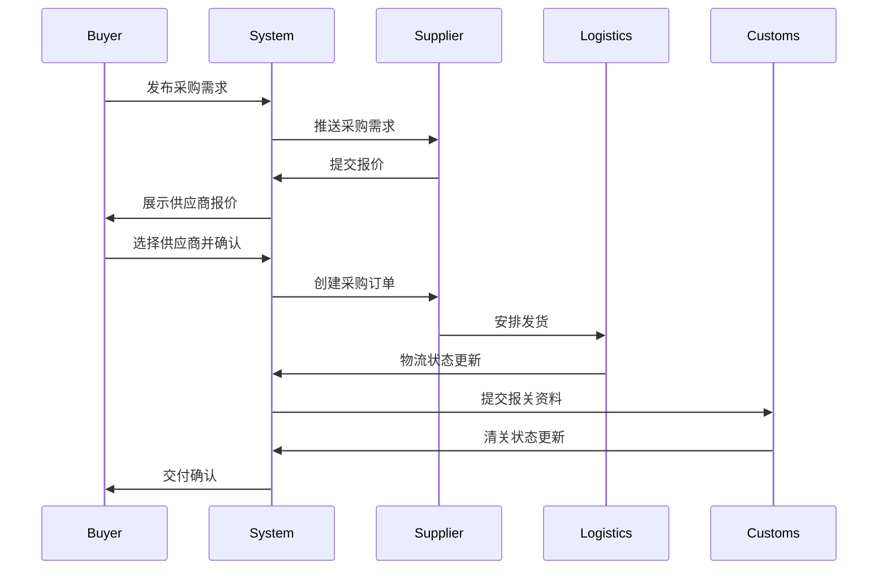
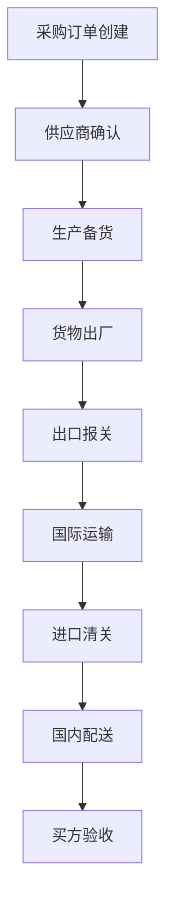

# B2B采购模块技术文档

## 📋 模块概览

B2B采购模块为FixCycle平台的企业用户提供完整的进出口贸易解决方案，涵盖供应商管理、采购订单、物流跟踪、报关清关等核心功能。

## 🏗️ 模块架构

### 目录结构
```
src/modules/b2b-procurement/
├── app/
│   ├── importer/          # 进口商业务
│   │   ├── dashboard/     # 进口商仪表板
│   │   ├── procurement/   # 采购管理
│   │   ├── suppliers/     # 供应商管理
│   │   ├── logistics/     # 物流跟踪
│   │   └── customs/       # 报关清关
│   ├── exporter/          # 出口商业务
│   │   ├── dashboard/     # 出口商仪表板
│   │   ├── trading/       # 销售订单
│   │   ├── customers/     # 客户管理
│   │   ├── shipping/      # 发货管理
│   │   └── compliance/    # 合规管理
│   └── shared/            # 共享功能
├── components/
│   ├── OrderCard/         # 订单卡片
│   ├── SupplierCard/      # 供应商卡片
│   ├── TrackingMap/       # 物流追踪地图
│   ├── DocumentUploader/  # 文档上传组件
│   └── TradeCalculator/   # 贸易计算器
├── services/
│   ├── procurementService.ts  # 采购服务
│   ├── supplierService.ts     # 供应商服务
│   ├── logisticsService.ts    # 物流服务
│   ├── customsService.ts      # 报关服务
│   └── tradeService.ts        # 贸易服务
├── hooks/
│   ├── useProcurement.ts      # 采购数据钩子
│   ├── useSuppliers.ts        # 供应商数据钩子
│   ├── useLogistics.ts        # 物流数据钩子
│   └── useTradeAnalytics.ts   # 贸易分析钩子
├── utils/
│   ├── tradeCalculations.ts   # 贸易计算工具
│   ├── documentProcessing.ts  # 文档处理工具
│   ├── riskAssessment.ts      # 风险评估工具
│   └── complianceChecker.ts   # 合规检查工具
├── types/
│   ├── procurement.ts         # 采购类型
│   ├── supplier.ts            # 供应商类型
│   ├── logistics.ts           # 物流类型
│   ├── customs.ts             # 报关类型
│   └── trade.ts               # 贸易类型
└── api/
    ├── procurement/           # 采购API
    ├── suppliers/             # 供应商API
    ├── logistics/             # 物流API
    ├── customs/               # 报关API
    └── trade/                 # 贸易API
```

## 🎯 核心功能

### 1. 采购订单管理
- 采购需求发布和管理
- 供应商报价对比
- 订单创建和跟踪
- 付款条件协商
- 合同电子签署

### 2. 供应商管理
- 供应商信息维护
- 资质认证管理
- 绩效评估体系
- 关系等级管理
- 风险监控预警

### 3. 国际物流跟踪
- 运输方式选择
- 实时位置追踪
- 运费计算优化
- 异常情况处理
- 交付时间预测

### 4. 报关清关服务
- 进出口单据管理
- 关税计算和优化
- 海关政策解读
- 合规性检查
- 异常处理流程

## 📊 数据模型

### 采购订单模型 (ProcurementOrder)
```typescript
interface ProcurementOrder {
  // 基本信息
  id: string;
  orderNumber: string;
  buyerId: string;
  supplierId: string;
  
  // 订单详情
  items: ProcurementItem[];
  totalAmount: number;
  currency: CurrencyCode;
  paymentTerms: PaymentTerms;
  
  // 状态信息
  status: 'draft' | 'pending' | 'confirmed' | 'processing' | 'shipped' | 'delivered' | 'cancelled';
  priority: 'low' | 'medium' | 'high' | 'urgent';
  
  // 时间信息
  createdAt: Date;
  updatedAt: Date;
  expectedDelivery: Date;
  actualDelivery?: Date;
  
  // 贸易条款
  incoterms: Incoterms; // 国际贸易术语
  shippingMethod: ShippingMethod;
  deliveryAddress: Address;
  
  // 文档信息
  documents: TradeDocument[];
  certificates: Certificate[];
  
  // 关联信息
  buyer: Company;
  supplier: Supplier;
  logistics: LogisticsInfo[];
}

interface ProcurementItem {
  id: string;
  productId: string;
  productName: string;
  quantity: number;
  unitPrice: number;
  totalPrice: number;
  specifications: string;
  hsCode?: string; // 海关税则号
}
```

### 供应商模型 (Supplier)
```typescript
interface Supplier {
  id: string;
  companyId: string;
  name: string;
  legalName: string;
  country: CountryCode;
  registrationNumber: string;
  
  // 联系信息
  contact: {
    email: string;
    phone: string;
    website?: string;
    address: Address;
  };
  
  // 业务能力
  productCategories: string[];
  minOrderQuantity: number;
  leadTime: number; // 天数
  productionCapacity: number;
  
  // 财务信息
  paymentMethods: PaymentMethod[];
  creditTerms: CreditTerms;
  bankDetails?: BankDetails;
  
  // 认证资质
  certifications: Certification[];
  complianceStatus: ComplianceStatus;
  
  // 绩效评估
  ratings: {
    quality: number;
    delivery: number;
    service: number;
    price: number;
    overall: number;
  };
  reviewCount: number;
  
  // 风险评估
  riskLevel: 'low' | 'medium' | 'high';
  riskFactors: RiskFactor[];
  
  // 系统信息
  status: 'active' | 'inactive' | 'suspended';
  verified: boolean;
  createdAt: Date;
  updatedAt: Date;
}
```

### 物流跟踪模型 (LogisticsTracking)
```typescript
interface LogisticsTracking {
  id: string;
  orderId: string;
  trackingNumber: string;
  carrier: string;
  serviceType: ServiceType;
  
  // 路线信息
  origin: Location;
  destination: Location;
  waypoints: Waypoint[];
  
  // 状态信息
  currentStatus: ShipmentStatus;
  statusHistory: StatusUpdate[];
  estimatedArrival: Date;
  actualArrival?: Date;
  
  // 货物信息
  packages: PackageInfo[];
  weight: number;
  volume: number;
  declaredValue: number;
  
  // 费用信息
  shippingCost: number;
  insuranceCost: number;
  dutiesAndTaxes: number;
  totalCost: number;
}

interface StatusUpdate {
  timestamp: Date;
  location: Location;
  status: ShipmentStatus;
  description: string;
  proofOfDelivery?: string;
}
```

## 🔧 服务层实现

### 采购服务 (procurementService.ts)
```typescript
class ProcurementService {
  // 创建采购订单
  async createPurchaseOrder(data: CreatePurchaseOrderDTO): Promise<ProcurementOrder> {
    // 验证供应商资质
    await this.validateSupplier(data.supplierId);
    
    // 计算总价和税费
    const calculatedData = await this.calculateOrderTotals(data);
    
    // 生成订单号
    const orderNumber = this.generateOrderNumber();
    
    // 创建订单记录
    const order = await db.procurementOrders.create({
      ...calculatedData,
      orderNumber,
      status: 'pending'
    });
    
    // 通知供应商
    await notificationService.notifySupplierNewOrder(
      data.supplierId,
      order.id
    );
    
    return order;
  }
  
  // 供应商报价对比
  async compareSupplierQuotes(productId: string, quantity: number): Promise<QuoteComparison> {
    const suppliers = await supplierService.findByProduct(productId);
    
    const quotes = await Promise.all(
      suppliers.map(async (supplier) => {
        const quote = await this.requestQuote(supplier.id, productId, quantity);
        return {
          supplier,
          quote,
          totalPrice: quote.unitPrice * quantity,
          deliveryTime: quote.deliveryTime,
          terms: quote.terms
        };
      })
    );
    
    // 按价格和交货时间排序
    return quotes.sort((a, b) => {
      if (a.totalPrice !== b.totalPrice) {
        return a.totalPrice - b.totalPrice;
      }
      return a.deliveryTime - b.deliveryTime;
    });
  }
  
  // 风险评估
  async assessOrderRisk(orderId: string): Promise<RiskAssessment> {
    const order = await this.findById(orderId);
    const supplier = await supplierService.findById(order.supplierId);
    
    const riskFactors = [];
    let riskScore = 0;
    
    // 供应商风险
    if (supplier.riskLevel === 'high') {
      riskFactors.push('供应商风险等级高');
      riskScore += 30;
    }
    
    // 地缘政治风险
    const geopoliticalRisk = await this.checkGeopoliticalRisk(
      supplier.country,
      order.deliveryAddress.country
    );
    if (geopoliticalRisk.level === 'high') {
      riskFactors.push(`地缘政治风险: ${geopoliticalRisk.reason}`);
      riskScore += 25;
    }
    
    // 汇率风险
    if (order.currency !== 'USD') {
      const forexRisk = await this.calculateForexRisk(order.currency);
      riskScore += forexRisk.score;
      if (forexRisk.score > 10) {
        riskFactors.push(`汇率波动风险: ${forexRisk.description}`);
      }
    }
    
    return {
      orderId,
      riskScore: Math.min(100, riskScore),
      riskLevel: riskScore < 30 ? 'low' : riskScore < 70 ? 'medium' : 'high',
      factors: riskFactors,
      recommendations: this.generateRiskRecommendations(riskScore, riskFactors)
    };
  }
}
```

### 物流服务 (logisticsService.ts)
```typescript
class LogisticsService {
  // 智能运输方式推荐
  async recommendShippingMethod(order: ProcurementOrder): Promise<ShippingRecommendation[]> {
    const options = [];
    
    // 海运推荐
    const seaFreight = await this.calculateSeaFreight(order);
    if (seaFreight.available) {
      options.push({
        method: 'sea',
        carrier: seaFreight.carrier,
        cost: seaFreight.cost,
        transitTime: seaFreight.transitTime,
        co2Emissions: seaFreight.co2Emissions,
        reliability: seaFreight.reliability,
        score: this.calculateShippingScore(seaFreight, order.priority)
      });
    }
    
    // 空运推荐
    const airFreight = await this.calculateAirFreight(order);
    if (airFreight.available) {
      options.push({
        method: 'air',
        carrier: airFreight.carrier,
        cost: airFreight.cost,
        transitTime: airFreight.transitTime,
        co2Emissions: airFreight.co2Emissions,
        reliability: airFreight.reliability,
        score: this.calculateShippingScore(airFreight, order.priority)
      });
    }
    
    // 快递推荐
    const express = await this.calculateExpressDelivery(order);
    if (express.available) {
      options.push({
        method: 'express',
        carrier: express.carrier,
        cost: express.cost,
        transitTime: express.transitTime,
        co2Emissions: express.co2Emissions,
        reliability: express.reliability,
        score: this.calculateShippingScore(express, order.priority)
      });
    }
    
    return options.sort((a, b) => b.score - a.score);
  }
  
  // 实时跟踪更新
  async updateTrackingInfo(trackingId: string): Promise<void> {
    const tracking = await this.getTrackingById(trackingId);
    
    // 获取最新的物流信息
    const latestStatus = await this.fetchCarrierStatus(tracking.carrier, tracking.trackingNumber);
    
    if (latestStatus.status !== tracking.currentStatus) {
      // 更新状态
      await db.logisticsTracking.update(trackingId, {
        currentStatus: latestStatus.status,
        statusHistory: [
          ...tracking.statusHistory,
          {
            timestamp: new Date(),
            location: latestStatus.location,
            status: latestStatus.status,
            description: latestStatus.description
          }
        ]
      });
      
      // 发送状态更新通知
      await notificationService.sendTrackingUpdate(
        tracking.orderId,
        latestStatus
      );
    }
  }
}
```

## 🔄 业务流程

### 采购流程


### 国际贸易流程


## 📈 贸易分析工具

### 成本效益分析
```typescript
class TradeAnalyzer {
  // 总拥有成本计算
  static calculateTCO(order: ProcurementOrder): TotalCostOfOwnership {
    const directCosts = {
      productCost: order.items.reduce((sum, item) => sum + item.totalPrice, 0),
      shippingCost: order.logistics.reduce((sum, log) => sum + log.shippingCost, 0),
      insuranceCost: order.logistics.reduce((sum, log) => sum + log.insuranceCost, 0)
    };
    
    const indirectCosts = {
      customsDuties: this.calculateCustomsDuties(order),
      taxes: this.calculateImportTaxes(order),
      handlingFees: this.estimateHandlingFees(order),
      currencyRisk: this.assessCurrencyRisk(order)
    };
    
    const hiddenCosts = {
      leadTimeCost: this.calculateLeadTimeCost(order),
      qualityRiskCost: this.estimateQualityRisk(order),
      supplierRiskCost: this.assessSupplierRisk(order)
    };
    
    return {
      directCosts,
      indirectCosts,
      hiddenCosts,
      totalCost: Object.values({...directCosts, ...indirectCosts, ...hiddenCosts})
                  .reduce((sum, cost) => sum + cost, 0)
    };
  }
  
  // 供应商绩效评分
  static evaluateSupplierPerformance(supplierId: string, period: DateRange): SupplierPerformance {
    const metrics = await this.getSupplierMetrics(supplierId, period);
    
    return {
      qualityScore: this.calculateQualityScore(metrics.qualityMetrics),
      deliveryScore: this.calculateDeliveryScore(metrics.deliveryMetrics),
      serviceScore: this.calculateServiceScore(metrics.serviceMetrics),
      priceScore: this.calculatePriceScore(metrics.priceMetrics),
      overallScore: this.calculateOverallScore(metrics),
      trend: this.analyzePerformanceTrend(supplierId, period)
    };
  }
}
```

## 🔒 合规与风控

### 合规检查清单
```typescript
class ComplianceChecker {
  // 出口管制检查
  static async checkExportControls(order: ProcurementOrder): Promise<ComplianceResult> {
    const violations = [];
    
    for (const item of order.items) {
      // 检查是否在管制清单中
      const isControlled = await this.isExportControlled(item.hsCode, order.destinationCountry);
      if (isControlled) {
        violations.push({
          item: item.productName,
          reason: '受出口管制',
          requiredLicense: await this.getRequiredLicense(item.hsCode)
        });
      }
      
      // 检查制裁名单
      const sanctionedParties = await this.checkSanctionsLists([
        order.supplier.companyId,
        order.buyer.companyId
      ]);
      
      if (sanctionedParties.length > 0) {
        violations.push({
          parties: sanctionedParties,
          reason: '涉及制裁实体'
        });
      }
    }
    
    return {
      compliant: violations.length === 0,
      violations,
      recommendations: violations.length > 0 
        ? this.generateComplianceRecommendations(violations)
        : []
    };
  }
  
  // 风险预警系统
  static async monitorTradeRisks(): Promise<TradeRiskAlert[]> {
    const alerts = [];
    
    // 汇率风险监控
    const forexAlerts = await this.monitorForexRisks();
    alerts.push(...forexAlerts);
    
    // 地缘政治风险
    const geopoliticalAlerts = await this.monitorGeopoliticalRisks();
    alerts.push(...geopoliticalAlerts);
    
    // 供应商风险
    const supplierAlerts = await this.monitorSupplierRisks();
    alerts.push(...supplierAlerts);
    
    return alerts.filter(alert => alert.severity === 'high' || alert.severity === 'critical');
  }
}
```

## 📊 报表与分析

### 贸易数据分析
```typescript
interface TradeAnalytics {
  // 采购分析
  procurementMetrics: {
    totalOrders: number;
    totalValue: number;
    avgOrderValue: number;
    supplierDiversity: number;
    categoryDistribution: Record<string, number>;
  };
  
  // 供应商分析
  supplierMetrics: {
    activeSuppliers: number;
    newSuppliers: number;
    supplierRetention: number;
    performanceDistribution: Record<string, number>;
  };
  
  // 物流分析
  logisticsMetrics: {
    onTimeDelivery: number;
    avgTransitTime: number;
    shippingCostRatio: number;
    carrierPerformance: Record<string, CarrierPerformance>;
  };
  
  // 风险分析
  riskMetrics: {
    highRiskOrders: number;
    complianceViolations: number;
    disputeRate: number;
    claimFrequency: number;
  };
}
```

## 🛠️ 开发指南

### 环境配置
```bash
# 安装依赖
npm install

# 启动B2B模块开发
npm run dev:b2b

# 运行集成测试
npm run test:b2b

# 代码质量检查
npm run lint:b2b
```

### API使用示例
```typescript
// 创建采购订单
const purchaseOrder = await procurementService.createPurchaseOrder({
  supplierId: 'sup_123',
  items: [
    {
      productId: 'prod_456',
      quantity: 1000,
      unitPrice: 50
    }
  ],
  incoterms: 'FOB',
  shippingMethod: 'sea'
});

// 获取供应商报价对比
const quotes = await procurementService.compareSupplierQuotes('prod_456', 1000);
console.log('最优报价:', quotes[0]);

// 物流跟踪
const tracking = await logisticsService.trackShipment('track_789');
console.log('当前位置:', tracking.currentLocation);

// 风险评估
const riskAssessment = await procurementService.assessOrderRisk(purchaseOrder.id);
if (riskAssessment.riskLevel === 'high') {
  console.warn('高风险订单，建议采取风险缓解措施');
}
```

---
_文档版本: v1.0_
_最后更新: 2026年2月21日_
_维护人员: B2B采购团队_