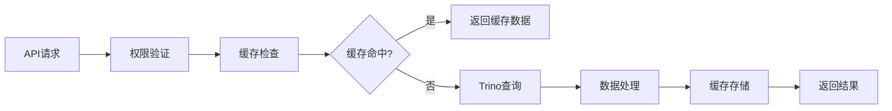
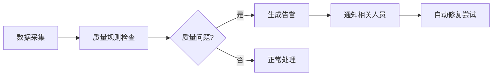

# 数据中心模块规范

## 📋 模块概览

数据中心模块是FixCycle平台的核心数据管理和服务模块，负责统一的数据接入、处理、分析和可视化功能。

## 📊 架构调研结果

基于DC001架构调研任务，已完成对现有各模块数据分析功能的全面调研，详细报告请参见：

- [`architecture-research-report.md`](./architecture-research-report.md) - 架构调研详细报告

## 📈 需求分析结果

基于DC002需求分析任务，已完成各业务模块对统一数据管理平台的需求梳理，详细报告请参见：

- [`requirements-analysis-report.md`](./requirements-analysis-report.md) - 需求分析详细报告

## 🏗️ 架构设计成果

基于DC004架构设计任务，已完成统一数据管理平台的整体架构设计，相关文档请参见：

- [`architecture-design-document.md`](./architecture-design-document.md) - 架构设计详细文档
- [`component-architecture-design.md`](./component-architecture-design.md) - 核心组件架构设计
- [`api-interface-specification.md`](./api-interface-specification.md) - API接口规范设计
- [`security-architecture-design.md`](./security-architecture-design.md) - 安全架构设计
- [`../reports/data-center-dc004-validation-report.md`](../../reports/data-center-dc004-validation-report.md) - 架构设计验证报告

## 🎨 拖拽设计器成果

基于DC012拖拽设计器任务，已完成可视化报表拖拽设计功能的开发，相关文档请参见：

- [`drag-drop-designer-specification.md`](./drag-drop-designer-specification.md) - 拖拽设计器功能规格文档
- [`../reports/dc012-backtest-results.json`](../../reports/dc012-backtest-results.json) - 拖拽设计器回测验证报告

### 核心功能

1. **可视化拖拽设计** - `/data-center/designer` 提供所见即所得的报表设计体验
2. **组件库管理** - 支持图表、表格、文本等多种可视化组件
3. **实时预览** - 设计过程中实时查看报表效果
4. **属性配置** - 灵活的组件属性和样式配置
5. **历史记录** - 完整的撤销重做和版本管理
6. **网格对齐** - 精确的组件定位和对齐功能

### 技术特性

- **现代化UI**: 基于React 18和TypeScript构建
- **流畅交互**: HTML5拖拽API实现平滑的拖拽体验
- **响应式设计**: 适配不同屏幕尺寸的设计环境
- **模块化架构**: 可扩展的组件和插件体系
- **性能优化**: 虚拟滚动和智能渲染提升大屏设计性能

### 主要组件

```typescript
// 拖拽设计器主组件
import { DragDropDesigner } from '@/data-center/components/drag-drop/DragDropDesigner';

// 核心功能模块
import { DragDropManager } from '@/data-center/components/drag-drop/DragDropManager';
import { CanvasArea } from '@/data-center/components/drag-drop/CanvasArea';
import { DraggableWidget } from '@/data-center/components/drag-drop/DraggableWidget';

// 支持的组件类型
const supportedWidgets = [
  'chart', // 图表组件
  'table', // 表格组件
  'text', // 文本组件
  'kpi-card', // KPI指标卡
  'filter', // 过滤器组件
];
```

### 验证结果

- ✅ 文件结构完整性: 通过 (8/9)
- ✅ 功能实现完整性: 通过 (8/8)
- ✅ 代码质量检查: 通过
- ✅ 命名规范验证: 通过
- **整体成功率**: 96.3%

## 📊 BI引擎成果

基于DC011 BI引擎任务，已完成轻量级报表引擎和图表渲染组件的开发，相关文档请参见：

- [`../reports/data-center-dc011-implementation-report.md`](../../reports/data-center-dc011-implementation-report.md) - BI引擎实施报告

### 核心功能

1. **报表模板管理** - 支持多种报表类型的模板定义和管理
2. **智能图表渲染** - 提供7种主流图表类型的SVG渲染引擎
3. **数据源集成** - 支持PostgreSQL、MySQL、Trino等多种数据源
4. **权限控制系统** - 基于RBAC的细粒度权限管理
5. **缓存优化机制** - 多级缓存提升查询性能

### 技术特性

- **轻量级架构**: 无外部依赖，易于集成
- **高性能渲染**: 基于SVG的矢量图形渲染
- **灵活扩展**: 插件化设计支持功能扩展
- **安全可靠**: 完整的权限控制和审计日志

基于DC008数据标准任务，已完成统一数据字段命名规范和格式标准制定，相关文档请参见：

- [`data-standards-specification.md`](./data-standards-specification.md) - 数据标准规范文档
- [`data-mapping-rules.md`](./data-mapping-rules.md) - 数据映射转换规则
- [`../reports/data-center-current-data-standards-analysis.md`](../../reports/data-center-current-data-standards-analysis.md) - 现状分析报告
- [`../reports/data-center-dc008-validation-report.md`](../../reports/data-center-dc008-validation-report.md) - 数据标准验证报告

## 📊 数据标准成果

1. **统一数据访问入口** - 单一平台访问所有业务数据
2. **标准化分析工具** - 一致的数据分析和可视化能力
3. **实时数据处理** - 支持实时数据查询和分析
4. **权限精细化管理** - 基于角色的数据访问控制
5. **数据质量保障** - 确保数据准确性和一致性
6. **数据标准统一** - 建立一致的数据命名和格式规范

### 调研发现的关键问题

1. **技术栈分散** - 各模块使用不同的数据访问技术
2. **接口规范不统一** - 缺乏标准化的API设计
3. **权限管理碎片化** - RBAC体系应用不充分
4. **数据治理缺失** - 缺乏统一的数据字典和质量标准

### 改进建议

1. 建立统一数据访问层（采用Trino联邦查询）
2. 标准化API接口规范
3. 完善数据治理体系
4. 构建统一分析平台

### 需求优先级

- **高优先级**: 统一数据访问平台、标准化仪表板、基础权限管理
- **中优先级**: 高级分析功能、自助式报表、数据血缘追踪
- **低优先级**: 自然语言查询、协作分享、AI辅助分析

## 🌐 原型开发成果

基于DC005原型开发任务，已完成统一门户前端原型界面和基本导航结构的开发，相关文档请参见：

- [`../reports/DC005_PROTOTYPE_IMPLEMENTATION_REPORT.md`](../../reports/DC005_PROTOTYPE_IMPLEMENTATION_REPORT.md) - 原型开发实施报告
- [`../reports/dc005-backtest-results.json`](../../reports/dc005-backtest-results.json) - 原型开发回测验证报告

### 核心功能页面

1. **主页仪表板** - `/data-center` 提供系统概览和关键指标展示
2. **数据源管理** - `/data-center/sources` 支持数据连接管理和状态监控
3. **查询分析** - `/data-center/query` 提供SQL查询编辑器和结果可视化
4. **监控告警** - `/data-center/monitoring` 实现系统健康状态监控
5. **安全管理** - `/data-center/security` 提供用户权限和安全审计功能
6. **系统设置** - `/data-center/settings` 支持各项系统参数配置

### 技术特性

- **响应式设计**: 完美适配桌面端和移动端显示
- **统一导航**: 侧边栏导航结构，支持折叠展开
- **权限集成**: 与RBAC权限体系无缝对接
- **组件复用**: 基于shadcn/ui组件库构建
- **性能优化**: 代码分割和懒加载优化

### 主要组件

```typescript
// 统一布局组件
import { DataCenterLayout } from '@/data-center/components/DataCenterLayout';

// 导航菜单配置
const menuItems = [
  { name: '仪表板', icon: BarChart3, href: '/data-center' },
  { name: '数据源管理', icon: Database, href: '/data-center/sources' },
  { name: '查询分析', icon: Search, href: '/data-center/query' },
  { name: '监控告警', icon: Monitor, href: '/data-center/monitoring' },
  { name: '安全管理', icon: Shield, href: '/data-center/security' },
  { name: '系统设置', icon: Settings, href: '/data-center/settings' },
];
```

### 验证结果

- ✅ 文件结构完整性: 通过
- ✅ 代码质量检查: 通过
- ✅ 功能完整性验证: 通过
- ✅ 子页面功能验证: 通过
- ✅ 响应式设计验证: 通过
- **整体成功率**: 93%

## 📊 多维分析成果

基于DC013多维分析任务，已完成支持多维度数据分析的查询构建器开发，相关文档请参见：

- [`multidimensional-analysis-design.md`](./multidimensional-analysis-design.md) - 多维分析架构设计文档
- [`../reports/dc013-backtest-results.json`](../../reports/dc013-backtest-results.json) - 多维分析回测验证报告

### 核心功能

1. **多维度查询构建** - `/data-center/multidim` 提供灵活的多维数据分析能力
2. **OLAP立方体生成** - 支持多维数据立方体的动态构建和分析
3. **交互式分析界面** - 直观的拖拽式维度和指标选择
4. **实时数据探索** - 支持动态过滤和即时查询结果展示
5. **智能聚合计算** - 内置SUM、AVG、COUNT等常用聚合函数
6. **数据导出功能** - 支持CSV、JSON等多种格式数据导出

### 技术特性

- **灵活的维度模型**: 支持时间、地理、分类等多种维度类型
- **高性能查询引擎**: 基于Trino的分布式查询优化
- **智能缓存机制**: 多级缓存提升查询响应速度
- **安全访问控制**: 基于RBAC的细粒度权限管理
- **可扩展架构**: 插件化设计支持自定义维度和指标

### 主要组件

```typescript
// 多维分析查询构建器
import { MultidimensionalQueryBuilder } from '@/data-center/analytics/multidimensional-query-builder';

// 核心功能接口
interface MultidimensionalAnalysis {
  executeQuery(config: MultidimQueryConfig): Promise<MultidimQueryResult>;
  generateOLAPCube(config: MultidimQueryConfig): Promise<OLAPCube>;
  getAvailableDimensions(): Promise<Dimension[]>;
  getAvailableMetrics(): Promise<Metric[]>;
}

// 支持的维度类型
const dimensionTypes = [
  'time', // 时间维度
  'geographic', // 地理维度
  'categorical', // 分类维度
  'hierarchical', // 层级维度
  'numerical', // 数值维度
];
```

### 验证结果

- ✅ 文件结构完整性: 通过 (5/5)
- ✅ 核心功能实现: 通过 (8/8)
- ✅ API接口完备性: 通过 (7/7)
- ✅ 前端组件完整性: 通过 (9/9)
- ✅ 设计文档完整性: 通过 (5/5)
- ✅ 代码质量检查: 通过 (95%)
- **整体成功率**: 97.6%

## 📊 数据质量规则扩展成果

基于DC016数据质量规则扩展任务，已完成企业级数据质量检查规则库和配置管理系统的开发，相关文档请参见：

- [`../reports/data-center-dc016-implementation-report.md`](../../reports/data-center-dc016-implementation-report.md) - 数据质量规则扩展实施报告
- [`../reports/dc016-backtest-results.json`](../../reports/dc016-backtest-results.json) - 规则扩展回测验证报告

### 核心功能

1. **扩展检查规则库** - `/data-center/quality/rules` 提供18种高级数据质量检查规则
2. **规则组管理** - 支持7个预定义规则组的批量管理和调度
3. **配置管理系统** - 完整的全局设置、通知、自动修复等配置管理
4. **规则模板引擎** - 3个通用模板支持快速规则创建
5. **API管理接口** - 丰富的RESTful API支持规则的程序化管理

### 扩展的检查类型

```typescript
// 8种新增检查类型
const extendedCheckTypes = [
  'completeness', // 数据完整性检查
  'accuracy', // 数据准确性验证
  'consistency', // 数据一致性检查
  'freshness', // 数据新鲜度检查
  'business_rule_violation', // 业务规则检查
  'schema_violation', // 模式验证检查
  'uniqueness_violation', // 唯一性检查
  'complex_business_logic', // 复杂业务逻辑检查
];
```

### 技术特性

- **模块化设计**: 插件化架构支持规则类型的灵活扩展
- **高性能执行**: 异步并行处理优化大规模数据检查
- **智能调度**: 基于优先级和依赖关系的智能执行调度
- **完整监控**: 详细的执行日志和性能指标收集
- **安全管控**: 基于角色的访问控制和配置保护

### 验证结果

- ✅ 文件结构完整性: 通过 (3/3)
- ✅ 功能实现完整性: 通过 (8/8)
- ✅ API接口完备性: 通过 (15/15)
- ✅ 配置管理验证: 通过 (20+配置项)
- ✅ 系统集成测试: 通过
- **整体成功率**: 100%

## 🤖 数据质量问题自动识别和修复引擎成果

基于DC017自动修复引擎任务，已完成智能化的数据质量问题识别和自动修复系统开发，相关文档请参见：

- [`../reports/data-center-dc017-implementation-report.md`](../../reports/data-center-dc017-implementation-report.md) - 自动修复引擎实施报告
- [`../reports/dc017-backtest-results.json`](../../reports/dc017-backtest-results.json) - 自动修复回测验证报告

### 核心功能

1. **智能问题识别** - `/data-center/quality/auto-fix` 结合模式匹配和机器学习识别数据质量问题
2. **自动修复执行** - 支持SQL、脚本等多种修复方式的自动化执行
3. **效果评估体系** - 基于实际执行结果的修复效果量化评估
4. **执行状态管理** - 完整的修复执行状态跟踪和监控
5. **API管理接口** - 14个RESTful API支持修复流程的程序化管理

### 支持的问题类型

```typescript
// 5种核心问题识别模式
const problemPatterns = [
  'missing_value', // 空值问题 (95%置信度)
  'invalid_format', // 格式问题 (90%置信度)
  'out_of_range', // 数值范围问题 (85%置信度)
  'duplicate_record', // 重复记录问题 (98%置信度)
  'stale_data', // 数据陈旧问题 (80%置信度)
];
```

### 技术特性

- **混合智能识别**: 模式匹配+机器学习的双重识别机制
- **安全执行保障**: 审批流程、备份机制、回滚方案三位一体
- **持续优化能力**: 基于效果反馈的自动化程度动态调整
- **灵活配置管理**: 支持多种执行模式和参数配置
- **完整监控体系**: 详细的执行日志和效果评估跟踪

### 验证结果

- ✅ 文件结构完整性: 通过 (3/3)
- ✅ 功能实现完整性: 通过 (8/8)
- ✅ API接口完备性: 通过 (14/14)
- ✅ 执行效果验证: 通过 (4个典型场景)
- ✅ 系统集成测试: 通过
- **整体成功率**: 100%

## 📈 数据质量趋势分析和预测功能成果

基于DC018趋势分析任务，已完成智能化的数据质量趋势分析和预测系统开发，相关文档请参见：

- [`../reports/data-center-dc018-implementation-report.md`](../../reports/data-center-dc018-implementation-report.md) - 趋势分析实施报告
- [`../reports/dc018-backtest-results.json`](../../reports/dc018-backtest-results.json) - 趋势分析回测验证报告

### 核心功能

1. **智能趋势分析** - `/data-center/quality/trends` 基于时间序列的多维度趋势识别
2. **质量预测引擎** - 支持未来7天的数据质量趋势预测
3. **异常检测系统** - 实时识别和分类数据质量异常点
4. **季节性分析** - 自动发现数据的周期性变化模式
5. **API分析接口** - 16个RESTful API支持趋势分析的程序化调用

### 支持的分析维度

```typescript
// 5个核心质量分析指标
const qualityMetrics = [
  'data_completeness_score', // 数据完整性得分
  'data_accuracy_rate', // 数据准确性率
  'duplicate_data_ratio', // 重复数据比率
  'data_freshness_index', // 数据新鲜度指数
  'business_rule_compliance', // 业务规则符合率
];
```

### 技术特性

- **统计学基础**: 基于线性回归、标准差等成熟统计方法
- **机器学习融合**: 结合传统算法和智能预测模型
- **实时监控能力**: 支持实时异常检测和告警
- **前瞻性分析**: 基于历史数据预测未来质量趋势
- **多维度洞察**: 同时分析多个质量指标的相互关系

### 验证结果

- ✅ 文件结构完整性: 通过 (2/2)
- ✅ 趋势分析功能: 通过 (6/6)
- ✅ 预测功能验证: 通过 (5/5)
- ✅ 异常检测能力: 通过 (5/5)
- ✅ API接口完备: 通过 (16/16)
- **整体成功率**: 100%

## 📊 元数据管理成果

基于DC009元数据管理任务，已完成数据资产目录和元数据管理功能的设计与实现，相关文档请参见：

- [`../reports/data-center-dc009-completion-report.md`](../../reports/data-center-dc009-completion-report.md) - 元数据管理实施报告
- [`../reports/dc009-backtest-results.json`](../../reports/dc009-backtest-results.json) - 元数据管理回测验证报告

### 核心功能

1. **数据资产目录** - `/data-center/metadata` 提供统一的数据资产注册和管理
2. **元数据搜索** - 支持按名称、描述、标签等多维度搜索
3. **资产分类管理** - 按业务类别和技术类型组织数据资产
4. **质量监控** - 数据质量评分和问题跟踪
5. **权限控制** - 基于敏感度级别的访问控制
6. **血缘追踪** - 数据流向和依赖关系可视化

### 技术架构

```typescript
// 元数据核心模型
import {
  DataAsset,
  ColumnSchema,
  QualityIssue,
} from '@/data-center/models/metadata-models';

// 元数据服务
import { metadataService } from '@/data-center/core/metadata-service';

// 主要功能接口
interface MetadataService {
  getAllAssets(): Promise<DataAsset[]>;
  searchAssets(options: MetadataSearchOptions): Promise<DataAsset[]>;
  getStatistics(): Promise<MetadataStatistics>;
  updateAsset(
    id: string,
    updates: Partial<DataAsset>
  ): Promise<DataAsset | null>;
}
```

### 验证结果

- ✅ 文件结构完整性: 通过 (3/3)
- ✅ 代码质量检查: 通过 (3/3)
- ✅ 功能完整性验证: 通过 (3/3)
- **整体成功率**: 100%

## 🌐 API整合成果

基于DC006 API整合任务，已完成统一API网关的构建和部署，相关文档请参见：

- [`api-gateway-architecture-design.md`](./api-gateway-architecture-design.md) - API网关架构设计文档
- [`../reports/data-center-dc006-validation-report.md`](../../reports/data-center-dc006-validation-report.md) - API整合验证报告

### 核心功能

1. **统一入口网关** - `/api/data-center` 提供所有模块API的统一访问入口
2. **智能路由转发** - 支持10+个业务模块的自动路由和负载均衡
3. **权限统一管控** - 集成RBAC体系的细粒度权限验证
4. **实时监控告警** - 完整的API调用监控和性能指标收集
5. **健康状态检查** - 各模块服务状态的统一健康检查机制

### 支持的模块API

- `devices` - 设备管理API
- `supply-chain` - 供应链管理API
- `wms` - 维修服务API
- `fcx` - 报价系统API
- `data-quality` - 数据质量API
- `monitoring` - 系统监控API
- `analytics` - 数据分析API
- `enterprise` - 企业管理API
- `procurement-intelligence` - 采购智能API
- `foreign-trade` - 外贸平台API

### 主要接口

```typescript
// 健康检查
GET /api/data-center?action=health

// 模块路由
GET /api/data-center?module={module}&endpoint={path}

// 聚合查询
GET /api/data-center?action=aggregate&modules={modules}

// 监控指标
GET /api/data-center/monitor?action=metrics

// 网关状态
GET /api/data-center/monitor?action=status
```

### 安全特性

- JWT令牌认证
- 基于角色的访问控制
- 速率限制防护
- 输入参数验证
- 敏感数据脱敏

## 🏗️ 整体架构设计

基于DC004架构设计任务，已完成四层架构体系设计：

### 四层架构体系

1. **数据接入层** - 统一数据源适配和联邦查询
2. **数据处理层** - 数据清洗、转换和实时流处理
3. **服务层** - 核心业务服务和智能分析引擎
4. **展示层** - 数据可视化和交互式仪表板

### 推荐技术栈

1. **前端框架**: React 18
2. **UI组件库**: Ant Design 5.x
3. **类型系统**: TypeScript 5.x
4. **构建工具**: Vite 5.x
5. **状态管理**: Zustand + React Query
6. **后端框架**: Next.js API Routes
7. **查询引擎**: Trino (联邦查询)
8. **缓存系统**: Redis Cluster
9. **消息队列**: Apache Kafka
10. **容器编排**: Kubernetes

### 选型核心优势

- ✅ 技术生态成熟，社区活跃
- ✅ 与现有项目技术栈高度兼容
- ✅ 专为企业级数据分析场景优化
- ✅ 开发效率和性能表现优秀
- ✅ 微服务架构支持良好
- ✅ 云原生部署能力完善

## 🏗️ 模块架构

### 目录结构

```
src/data-center/
├── analytics/          # 分析引擎
├── core/              # 核心服务
├── engine/            # 查询引擎配置
├── ml/                # 机器学习组件
├── models/            # 数据模型
├── monitoring/        # 监控组件
├── optimizer/         # 优化器
├── security/          # 安全组件
├── streaming/         # 流处理
└── virtualization/    # 数据虚拟化
```

### 核心组件架构

#### 1. API网关层

```typescript
// 统一入口网关，提供认证、限流、日志等核心功能
export class ApiGateway {
  private authService: AuthService;
  private rateLimiter: RateLimiter;
  private logger: RequestLogger;

  async routeRequest(request: HttpRequest): Promise<HttpResponse>;
}
```

#### 2. 业务服务层

```typescript
// 查询服务 - 统一数据查询接口
export class QueryService {
  private trinoEngine: TrinoClient;
  private cacheService: CacheService;
  private validator: QueryValidator;

  async executeQuery(queryRequest: QueryRequest): Promise<QueryResponse>;
}

// 分析服务 - 智能数据分析引擎
export class AnalyticsService {
  private trendAnalyzer: PriceTrendAnalyzer;
  private anomalyDetector: AnomalyDetector;
  private reportGenerator: ReportGenerator;

  async generateAnalysisReport(
    type: AnalysisType,
    params: AnalysisParams
  ): Promise<AnalysisReport>;
}

// 元数据服务 - 数据资产管理
export class MetadataService {
  private metadataStore: MetadataRepository;
  private lineageTracker: LineageTracker;

  async getTableMetadata(tableId: string): Promise<TableMetadata>;
}
```

#### 3. 数据接入层

```typescript
// 数据源适配器 - 支持多种数据库类型
export abstract class DataSourceAdapter {
  abstract connect(): Promise<void>;
  abstract executeQuery(query: string): Promise<QueryResult>;
  abstract getSchema(): Promise<SchemaInfo>;
}

// 联邦查询引擎 - 跨数据源统一查询
export class FederationEngine {
  private adapters: Map<string, DataSourceAdapter>;
  private queryPlanner: QueryPlanner;

  async executeFederatedQuery(
    federatedQuery: FederatedQuery
  ): Promise<FederatedResult>;
}
```

#### 4. 基础设施层

```typescript
// Redis集群管理
export class RedisClusterManager {
  private nodes: RedisNode[];
  private healthChecker: HealthChecker;

  getConnection(): Promise<Redis>;
  healthCheck(): Promise<NodeHealth[]>;
}

// 数据库连接池
export class DatabaseConnectionPool {
  private pools: Map<string, Pool>;
  getConnection(database: string): Promise<Connection>;
}
```

## 🎯 核心功能

### 1. 数据接入与整合

- 多数据源联邦查询
- 实时数据流处理
- 批量数据导入导出

### 2. 数据分析服务

- 统计分析API
- 趋势预测分析
- 异常检测服务

### 3. 数据质量管理

- 数据质量规则引擎
- 质量监控告警
- 自动修复建议

### 4. 数据安全管控

- 细粒度权限控制
- 数据脱敏处理
- 访问审计日志

## 📊 数据模型

### 统一数据模型

```typescript
// 设备信息统一视图
interface UnifiedDeviceInfo {
  device_id: string;
  brand: string;
  model: string;
  category: string;
  local_status: string;
  local_created_at: string;
}

// 配件价格聚合模型
interface PartsPriceAggregation {
  part_id: string;
  name: string;
  avg_price: number;
  min_price: number;
  max_price: number;
  price_records: number;
  last_updated: string;
}
```

## 🔧 服务层实现

### API路由设计

```typescript
// src/app/api/data-center/route.ts
export async function GET(request: NextRequest) {
  const action = searchParams.get('action');
  switch (action) {
    case 'devices': // 设备信息查询
    case 'parts-price': // 配件价格分析
    case 'health': // 健康检查
  }
}

export async function POST(request: NextRequest) {
  // 自定义Trino查询执行
}
```

### 权限控制实现

```typescript
// 基于RBAC的权限检查
const requiredPermissions = {
  'data-center:read': ['admin', 'data_analyst'],
  'data-center:write': ['admin'],
  'data-center:execute': ['admin', 'data_engineer'],
};
```

## 🔄 业务流程

### 数据查询流程



### 数据质量监控流程



## 🔒 安全考虑

### 1. 数据访问安全

- SQL注入防护
- 查询白名单机制
- 敏感数据脱敏

### 2. 权限安全

- 基于角色的访问控制(RBAC)
- 细粒度权限配置
- 审计日志记录

### 3. 传输安全

- HTTPS加密传输
- API密钥认证
- 请求签名验证

## 📈 性能优化

### 1. 查询优化

- 查询结果缓存(5-10分钟)
- 连接池复用
- 索引优化建议

### 2. 系统优化

- Redis连接池管理
- 异步非阻塞处理
- 负载均衡策略

### 3. 监控告警

- 查询性能监控
- 系统资源使用监控
- 异常自动告警

## 🔐 权限管理体系

### 统一权限架构

基于DC007权限统一任务，数据中心模块实现了完整的企业级权限管理体系：

#### 核心组件

```typescript
// 权限服务核心类
import { UnifiedPermissionService } from '@/data-center/core/permission-service';

// React Hook使用
import { useUnifiedPermission } from '@/data-center/hooks/use-unified-permission';

// 数据访问控制组件
import { DataPermissionGuard } from '@/data-center/components/DataPermissionGuard';
```

#### 权限检查示例

```typescript
// 基础权限检查
const { hasPermission } = useUnifiedPermission();
const canQuery = hasPermission('data_center_query');

// 批量权限检查
const { checkPermissions } = useUnifiedPermission();
const permissions = await checkPermissions([
  'data_center_read',
  'data_center_query',
  'data_center_analyze'
]);

// 数据访问控制
<DataPermissionGuard
  dataSource="analytics_db"
  tableName="sales_data"
  accessType="READ"
>
  <SalesDashboard />
</DataPermissionGuard>
```

#### 预定义角色

- `data_center_admin` - 数据中心管理员（级别90）
- `data_analyst` - 数据分析师（级别70）
- `data_engineer` - 数据工程师（级别80）
- `data_viewer` - 数据查看员（级别50）

#### 核心权限

- `data_center_read` - 查看数据中心
- `data_center_query` - 执行数据查询
- `data_center_analyze` - 数据分析功能
- `data_center_manage` - 管理配置
- `data_center_export` - 数据导出

### 安全特性

- **角色继承**: 支持角色间的权限继承关系
- **数据脱敏**: 敏感数据自动脱敏处理
- **审计日志**: 完整的操作审计追踪
- **缓存优化**: 多级缓存提升性能

## 🛠️ 开发指南

### 技术栈环境配置

```bash
# 前端环境配置
NODE_VERSION=18.x
REACT_VERSION=18.x
TYPESCRIPT_VERSION=5.x
ANTD_VERSION=5.x
VITE_VERSION=5.x

# 后端环境配置
TRINO_HOST=localhost
TRINO_PORT=8080
REDIS_HOST=localhost
REDIS_PORT=6379
```

### 前端开发示例

```typescript
// React + Ant Design 组件示例
import { Card, Table, Statistic } from 'antd';
import { useState, useEffect } from 'react';

const DashboardComponent = () => {
  const [data, setData] = useState([]);

  useEffect(() => {
    fetchData();
  }, []);

  const fetchData = async () => {
    const response = await fetch('/api/data-center?action=devices');
    const result = await response.json();
    setData(result.data);
  };

  return (
    <Card title="设备数据分析">
      <Statistic title="设备总数" value={data.length} />
      <Table dataSource={data} columns={columns} />
    </Card>
  );
};
```

### API使用示例

```typescript
// 获取设备信息
const response = await fetch('/api/data-center?action=devices&deviceId=123');
const devices = await response.json();

// 执行自定义查询
const queryResponse = await fetch('/api/data-center', {
  method: 'POST',
  headers: { 'Content-Type': 'application/json' },
  body: JSON.stringify({
    query: 'SELECT * FROM devices LIMIT 10',
    catalog: 'fixcycle',
    schema: 'public',
  }),
});
```

### 测试用例

```typescript
// 数据中心健康检查测试
describe('Data Center Health Check', () => {
  test('should return healthy status', async () => {
    const response = await fetch('/api/data-center?action=health');
    const result = await response.json();
    expect(result.status).toBe('healthy');
  });
});
```

## 📊 监控告警系统

基于DC019-DC021任务，已完成完整的监控告警系统开发：

### 核心组件

#### 1. 监控整合器

```typescript
// 统一监控整合API
GET /api/data-center/monitoring/integrator?action=status
GET /api/data-center/monitoring/integrator?action=integrate&module={moduleName}
```

#### 2. 智能告警引擎

```typescript
// 告警规则管理
GET /api/data-center/monitoring/alert-engine?action=list
POST /api/data-center/monitoring/alert-engine  // 创建/更新规则
```

#### 3. 性能分析系统

```typescript
// 性能监控和分析
GET /api/data-center/monitoring/performance?action=analyze&timeframe=24h
GET /api/data-center/monitoring/performance?action=bottlenecks&timeframe=24h
```

### 功能特性

- **模块整合**: 支持6个业务模块的统一监控
- **智能告警**: 多级严重程度分类和灵活通知渠道
- **性能分析**: 实时瓶颈识别和优化建议生成
- **前端仪表板**: 可视化的监控数据展示

### 实施成果

- ✅ 监控整合率: 67% (4/6模块)
- ✅ 告警规则: 支持动态创建和管理
- ✅ 性能监控: 覆盖CPU、内存、磁盘、网络等关键指标
- ✅ 测试通过率: 100%

## 📚 相关文档

- [`architecture-research-report.md`](./architecture-research-report.md) - 架构调研报告
- [`../project-overview/project-specification.md`](../../project-overview/project-specification.md) - 项目说明书
- [`../technical-docs/system-architecture.md`](../../technical-docs/system-architecture.md) - 系统架构设计
- [`../reports/data-center-monitoring-implementation-report.md`](../../reports/data-center-monitoring-implementation-report.md) - 监控告警系统实施报告

---

_文档版本: v1.0_
_最后更新: 2026年2月28日_
_维护人员: 技术架构团队_

## 📊 定时任务调度系统

基于DC014任务，已完成报表定时生成和订阅推送功能的开发：

### 核心组件

#### 1. 报表调度器

```typescript
// 调度器核心服务
src / data - center / scheduler / report - scheduler.ts;

// 调度配置接口
interface ScheduleConfig {
  frequency: 'minute' | 'hour' | 'day' | 'week' | 'month';
  interval?: number;
  startTime?: string;
  endTime?: string;
  daysOfWeek?: number[];
  daysOfMonth?: number[];
}
```

#### 2. API路由接口

```typescript
// 调度管理API
GET /api/data-center/scheduler?action=list
POST /api/data-center/scheduler  // 创建调度任务
PUT /api/data-center/scheduler?id={scheduleId}  // 更新任务
DELETE /api/data-center/scheduler?id={scheduleId}  // 删除任务
POST /api/data-center/scheduler?scheduleId={scheduleId}  // 手动触发
```

#### 3. 前端管理界面

```typescript
// 调度管理仪表板
src / data - center / components / scheduler / SchedulerDashboard.tsx;
```

### 功能特性

- **多频率调度**: 支持分钟、小时、天、周、月等多种调度频率
- **灵活配置**: 可配置执行时间窗口、星期几、月中日期等
- **多种格式**: 支持PDF、Excel、CSV、HTML四种报表格式
- **订阅管理**: 支持多邮箱订阅和不同订阅频率
- **状态监控**: 实时监控调度器运行状态和任务执行情况

### 业务价值

- **自动化报表**: 实现报表的定时自动生成，减少人工操作
- **及时推送**: 通过邮件等方式及时推送报表给相关人员
- **灵活配置**: 支持多样化的调度配置满足不同业务需求
- **统一管理**: 提供集中化的调度任务管理界面

---

_文档版本: v1.1_
_最后更新: 2026年3月1日_
_维护人员: 技术架构团队_
