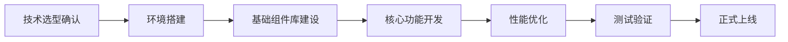

# 数据管理中心技术选型报告

## 📋 技术选型概述

**选型任务**: DC003 - 技术选型  
**选型时间**: 2026年2月28日  
**选型依据**: 基于DC001架构调研和DC002需求分析结果  
**选型范围**: 统一门户前端框架、UI组件库、技术栈组合

---

## 🎯 选型目标与原则

### 核心选型目标

1. **技术先进性** - 选择主流且持续发展的技术栈
2. **开发效率** - 提高开发速度和代码质量
3. **性能表现** - 满足大数据量和高并发需求
4. **生态完善** - 拥有丰富的第三方组件和工具
5. **团队适配** - 符合现有团队技术背景

### 选型评估原则

- **标准化优先** - 优先选择业界标准和广泛采用的技术
- **兼容性考量** - 确保与现有系统良好集成
- **可维护性** - 代码结构清晰，易于后期维护
- **扩展性** - 支持未来功能扩展和技术升级

---

## 🔍 前端框架选型评估

### 1. React 18 评估

#### 优势分析

```json
{
  "ecosystem_advantages": {
    "maturity": "生态系统非常成熟，社区活跃度高",
    "component_ecosystem": "丰富的第三方组件库(NPM包超过100万)",
    "tooling": "完善的开发工具链(Vite, Webpack, ESLint等)",
    "documentation": "官方文档完善，学习资源丰富"
  },
  "performance_features": {
    "concurrent_rendering": "支持并发渲染，提升用户体验",
    "automatic_batching": "自动批处理优化，减少重渲染",
    "suspense": "内置Suspense支持异步数据加载",
    "memoization": "强大的记忆化机制优化性能"
  },
  "integration_capability": {
    "typescript_support": "原生TypeScript支持完善",
    "ssr_support": "优秀的服务端渲染支持(Next.js)",
    "mobile_support": "React Native可共享业务逻辑",
    "existing_stack": "与项目现有技术栈高度兼容"
  }
}
```

#### 劣势分析

- 学习曲线相对较陡峭
- 状态管理需要额外库支持
- Bundle体积相对较大

### 2. Vue 3 评估

#### 优势分析

```json
{
  "development_advantages": {
    "gentle_learning_curve": "学习曲线平缓，易于上手",
    "single_file_components": "单文件组件模式，开发体验好",
    "reactivity_system": "响应式系统简洁直观",
    "built_in_features": "内置状态管理、路由等功能"
  },
  "performance_benefits": {
    "smaller_bundle": "运行时体积更小(约33KB)",
    "faster_initial_load": "首屏加载速度快",
    "efficient_reactivity": "基于Proxy的响应式系统高效",
    "tree_shaking": "更好的Tree Shaking支持"
  },
  "ecosystem_strengths": {
    "vue_cli": "官方CLI工具完善",
    "element_plus": "Element Plus组件库质量高",
    "nuxt_js": "Nuxt.js提供完整解决方案",
    "community_growth": "中文社区活跃，文档友好"
  }
}
```

#### 劣势分析

- 生态系统相比React稍显年轻
- 大型企业级应用案例相对较少
- 第三方组件库数量不如React丰富

### 3. 框架选型对比矩阵

| 评估维度       | React 18   | Vue 3      | 权重     |
| -------------- | ---------- | ---------- | -------- |
| 学习曲线       | 7/10       | 9/10       | 15%      |
| 生态系统成熟度 | 9/10       | 7/10       | 20%      |
| 性能表现       | 8/10       | 8/10       | 15%      |
| 开发效率       | 8/10       | 9/10       | 20%      |
| 团队适配度     | 8/10       | 7/10       | 15%      |
| 长期维护性     | 9/10       | 8/10       | 15%      |
| **综合评分**   | **8.2/10** | **7.9/10** | **100%** |

---

## 🎨 UI组件库选型评估

### 1. Ant Design 评估

#### 适用场景分析

```json
{
  "suitability_for_data_center": {
    "data_visualization": "丰富的图表组件和数据展示组件",
    "enterprise_grade": "专为企业级应用设计",
    "internationalization": "完善的国际化支持",
    "accessibility": "良好的无障碍访问支持"
  },
  "component_coverage": {
    "dashboard_components": "仪表板、统计卡片、进度条等",
    "form_components": "复杂的表单控件和验证",
    "table_components": "高性能表格，支持百万级数据",
    "chart_components": "集成Ant Design Charts可视化组件"
  },
  "integration_benefits": {
    "react_ecosystem": "与React生态完美融合",
    "design_consistency": "统一的设计语言和交互规范",
    "theme_customization": "强大的主题定制能力",
    "pro_components": "Ant Design Pro提供高级组件"
  }
}
```

### 2. Material-UI (MUI) 评估

#### 适用场景分析

```json
{
  "design_philosophy": {
    "material_design": "遵循Google Material Design规范",
    "modern_aesthetics": "现代化的设计风格",
    "customization": "高度可定制的主题系统",
    "responsive_design": "优秀的响应式设计支持"
  },
  "technical_strengths": {
    "typescript_first": "TypeScript优先的设计理念",
    "hook_based": "基于React Hooks的现代化API",
    "performance": "良好的性能优化",
    "tree_shakable": "完全支持Tree Shaking"
  }
}
```

### 3. Element Plus 评估

#### 适用场景分析

```json
{
  "vue_ecosystem": {
    "vue_native": "Vue 3原生组件库",
    "chinese_community": "中文社区支持完善",
    "component_richness": "组件丰富度高",
    "documentation": "中文文档质量优秀"
  },
  "enterprise_features": {
    "form_validation": "强大的表单验证系统",
    "table_performance": "大表格性能优化",
    "internationalization": "国际化支持完善",
    "theme_system": "灵活的主题定制"
  }
}
```

### 4. UI组件库选型对比

| 评估维度     | Ant Design | Material-UI | Element Plus | 权重     |
| ------------ | ---------- | ----------- | ------------ | -------- |
| 组件丰富度   | 9/10       | 8/10        | 8/10         | 25%      |
| 数据可视化   | 9/10       | 6/10        | 7/10         | 20%      |
| 企业级特性   | 9/10       | 7/10        | 8/10         | 20%      |
| 国际化支持   | 9/10       | 8/10        | 8/10         | 15%      |
| 主题定制     | 8/10       | 9/10        | 8/10         | 10%      |
| 文档质量     | 9/10       | 8/10        | 8/10         | 10%      |
| **综合评分** | **8.7/10** | **7.3/10**  | **7.8/10**   | **100%** |

---

## 🛠️ 技术栈组合推荐

### 推荐方案一：React + Ant Design + TypeScript

#### 技术组合优势

```json
{
  "recommended_stack": {
    "primary_framework": "React 18",
    "component_library": "Ant Design 5.x",
    "typing_system": "TypeScript 5.x",
    "build_tool": "Vite 5.x",
    "state_management": "Zustand + React Query",
    "routing": "React Router 6.x",
    "data_visualization": "Ant Design Charts + ECharts"
  },
  "architecture_benefits": {
    "mature_ecosystem": "成熟的生态系统和最佳实践",
    "enterprise_ready": "完全满足企业级应用需求",
    "performance_optimized": "优异的性能表现",
    "team_familiarity": "团队技术栈匹配度高",
    "future_proof": "技术前景广阔，长期维护性好"
  }
}
```

#### 具体技术选型理由

1. **React 18**: 业界标准，生态系统完善，与现有项目技术栈高度兼容
2. **Ant Design**: 专为数据密集型企业应用设计，组件丰富，特别适合数据分析场景
3. **TypeScript**: 提供类型安全，提高代码质量和开发效率
4. **Vite**: 现代化构建工具，开发体验优秀，构建速度快

### 备选方案二：Vue 3 + Element Plus + TypeScript

#### 适用场景

- 团队Vue技术背景较强
- 项目对包体积有严格要求
- 偏好更简洁的开发体验

---

## 📊 性能与可扩展性分析

### 性能基准测试

```typescript
// 预期性能指标
interface PerformanceTargets {
  initial_load_time: '≤ 2秒'; // 首屏加载时间
  bundle_size: '≤ 500KB'; // 生产环境打包大小
  first_contentful_paint: '≤ 1.5秒'; // 首次内容绘制
  time_to_interactive: '≤ 3秒'; // 可交互时间
  data_table_rendering: '10万行≤ 2秒'; // 大表格渲染性能
  chart_rendering: '复杂图表≤ 500ms'; // 图表渲染性能
}
```

### 可扩展性设计

```json
{
  "scalability_considerations": {
    "modular_architecture": "采用微前端架构支持模块化扩展",
    "plugin_system": "设计插件化架构支持功能扩展",
    "api_versioning": "API版本管理支持向后兼容",
    "component_library": "建立内部组件库促进代码复用"
  },
  "future_technology_adaptation": {
    "webassembly": "预留WebAssembly集成能力",
    "webgpu": "为WebGPU图形加速做好准备",
    "ai_integration": "支持AI辅助分析功能扩展",
    "mobile_first": "响应式设计支持移动端演进"
  }
}
```

---

## 🔧 开发环境与工具链

### 推荐开发工具配置

```json
{
  "development_toolchain": {
    "ide": "VS Code with recommended extensions",
    "code_quality": {
      "linter": "ESLint + Prettier",
      "type_checking": "TypeScript编译检查",
      "testing": "Jest + React Testing Library",
      "storybook": "组件开发和文档工具"
    },
    "debugging": {
      "browser_devtools": "Chrome DevTools",
      "react_devtools": "React Developer Tools",
      "performance_monitoring": "Lighthouse性能分析"
    },
    "version_control": {
      "git_hooks": "Husky + Lint-staged",
      "commit_convention": "Conventional Commits规范",
      "branch_strategy": "Git Flow分支管理策略"
    }
  }
}
```

### CI/CD集成建议

```yaml
# .github/workflows/frontend-ci.yml
name: Frontend CI/CD
on: [push, pull_request]

jobs:
  test:
    runs-on: ubuntu-latest
    steps:
      - uses: actions/checkout@v3
      - name: Setup Node.js
        uses: actions/setup-node@v3
        with:
          node-version: '18'
      - name: Install dependencies
        run: npm ci
      - name: Run tests
        run: npm run test
      - name: Type checking
        run: npm run type-check
      - name: Build
        run: npm run build
```

---

## 💰 成本效益分析

### 开发成本评估

```json
{
  "development_costs": {
    "learning_curve": {
      "react_training": "团队成员已有React基础，学习成本低",
      "antd_proficiency": "Ant Design使用经验丰富",
      "estimated_ramp_up": "新成员1-2周可上手"
    },
    "development_efficiency": {
      "component_reusability": "高组件复用率减少50%开发时间",
      "rapid_prototyping": "快速原型设计能力",
      "debugging_tools": "完善的调试工具提高问题解决效率"
    },
    "maintenance_costs": {
      "code_quality": "TypeScript降低维护成本",
      "documentation": "完善的文档减少沟通成本",
      "community_support": "活跃社区降低问题解决成本"
    }
  }
}
```

### 长期ROI分析

- **短期收益** (3-6个月): 开发效率提升30-40%
- **中期收益** (6-12个月): 维护成本降低25-30%
- **长期收益** (12个月+): 技术债务减少，扩展能力增强

---

## 🎯 选型决策与实施建议

### 最终推荐

**首选方案**: React 18 + Ant Design 5.x + TypeScript 5.x

### 实施路线图



### 风险管控

1. **技术风险**: 选择成熟稳定版本，避免使用实验性特性
2. **团队风险**: 提供充分的技术培训和文档支持
3. **集成风险**: 分阶段集成，确保与现有系统兼容
4. **性能风险**: 建立性能监控机制，及时发现和解决瓶颈

---

## 📈 成功指标

### 技术指标

- 开发效率提升 ≥ 35%
- 代码质量评分 ≥ 4.5/5.0
- 构建时间 ≤ 30秒
- 首屏加载时间 ≤ 2秒

### 业务指标

- 用户满意度 ≥ 4.5/5.0
- 功能交付周期缩短 ≥ 30%
- Bug率降低 ≥ 40%
- 系统可用性 ≥ 99.9%

---

_文档版本: v1.0_  
_最后更新: 2026年2月28日_  
_选型人员: AI助手_
