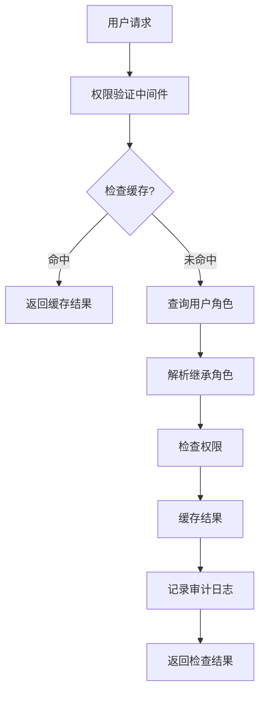
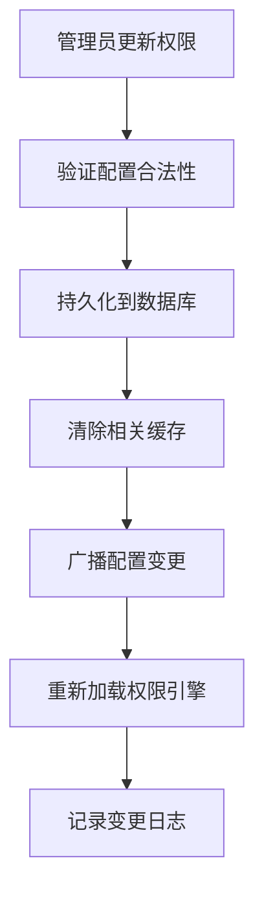

# 统一权限管理架构设计方案

## 📋 方案概述

**文档编号**: DC007-DESIGN  
**版本**: v1.0  
**设计时间**: 2026年2月28日  
**适用范围**: 数据中心模块权限统一重构

## 🏗️ 整体架构设计

### 1. 架构层次结构

```
┌─────────────────────────────────────────────────────────────┐
│                    统一权限管理系统                         │
├─────────────────────────────────────────────────────────────┤
│  API网关层      │  业务服务层      │  数据访问层      │  基础设施层  │
├─────────────────┼─────────────────┼─────────────────┼─────────────┤
│                 │                 │                 │             │
│ • 权限验证API   │ • 权限管理服务  │ • 权限存储      │ • Redis缓存 │
│ • 角色管理API   │ • 角色继承引擎  │ • 用户角色映射  │ • 数据库    │
│ • 资源控制API   │ • 权限检查引擎  │ • 审计日志      │ • 消息队列  │
│ • 审计查询API   │ • 动态权限加载  │                 │             │
│                 │                 │                 │             │
└─────────────────┴─────────────────┴─────────────────┴─────────────┘
```

### 2. 核心组件设计

#### 2.1 权限管理服务 (PermissionService)

```typescript
export class PermissionService {
  private permissionStore: PermissionStore;
  private roleInheritanceEngine: RoleInheritanceEngine;
  private cacheManager: CacheManager;
  private auditLogger: AuditLogger;

  /**
   * 检查用户是否具有指定权限
   */
  async checkPermission(userId: string, permission: string): Promise<boolean> {
    // 1. 检查缓存
    const cachedResult = await this.cacheManager.getPermissionCheck(
      userId,
      permission
    );
    if (cachedResult !== null) {
      return cachedResult;
    }

    // 2. 获取用户角色
    const userRoles = await this.permissionStore.getUserRoles(userId);

    // 3. 解析继承角色
    const effectiveRoles =
      await this.roleInheritanceEngine.resolveRoles(userRoles);

    // 4. 检查权限
    const hasPerm = await this.permissionStore.checkRolesPermission(
      effectiveRoles,
      permission
    );

    // 5. 缓存结果
    await this.cacheManager.setPermissionCheck(
      userId,
      permission,
      hasPerm,
      300
    ); // 5分钟缓存

    // 6. 记录审计日志
    await this.auditLogger.logPermissionCheck(userId, permission, hasPerm);

    return hasPerm;
  }

  /**
   * 获取用户可访问的资源列表
   */
  async getAccessibleResources(
    userId: string,
    category?: string
  ): Promise<string[]> {
    const userRoles = await this.permissionStore.getUserRoles(userId);
    const effectiveRoles =
      await this.roleInheritanceEngine.resolveRoles(userRoles);
    return await this.permissionStore.getResourcesByRoles(
      effectiveRoles,
      category
    );
  }
}
```

#### 2.2 角色继承引擎 (RoleInheritanceEngine)

```typescript
export class RoleInheritanceEngine {
  private roleHierarchy: Map<string, string[]>; // 角色继承关系图

  /**
   * 解析用户的所有有效角色（包括继承角色）
   */
  async resolveRoles(userRoles: string[]): Promise<string[]> {
    const effectiveRoles = new Set<string>(userRoles);

    // BFS遍历角色继承树
    const queue = [...userRoles];
    while (queue.length > 0) {
      const currentRole = queue.shift()!;
      const parentRoles = this.roleHierarchy.get(currentRole) || [];

      for (const parentRole of parentRoles) {
        if (!effectiveRoles.has(parentRole)) {
          effectiveRoles.add(parentRole);
          queue.push(parentRole);
        }
      }
    }

    return Array.from(effectiveRoles);
  }

  /**
   * 构建角色继承关系
   */
  async buildRoleHierarchy(): Promise<void> {
    const roles = await this.permissionStore.getAllRoles();
    this.roleHierarchy = new Map();

    // 建立继承关系图
    for (const role of roles) {
      if (role.inherits) {
        this.roleHierarchy.set(role.id, role.inherits);
      }
    }
  }
}
```

#### 2.3 权限存储 (PermissionStore)

```typescript
export interface PermissionStore {
  /**
   * 获取用户的角色列表
   */
  getUserRoles(userId: string): Promise<string[]>;

  /**
   * 检查角色集合是否具有指定权限
   */
  checkRolesPermission(roles: string[], permission: string): Promise<boolean>;

  /**
   * 根据角色获取可访问资源
   */
  getResourcesByRoles(roles: string[], category?: string): Promise<string[]>;

  /**
   * 动态加载权限配置
   */
  loadPermissionConfig(): Promise<PermissionConfig>;

  /**
   * 更新权限配置
   */
  updatePermissionConfig(config: PermissionConfig): Promise<void>;
}
```

#### 2.4 缓存管理器 (CacheManager)

```typescript
export class CacheManager {
  private redisClient: Redis;

  /**
   * 缓存权限检查结果
   */
  async setPermissionCheck(
    userId: string,
    permission: string,
    result: boolean,
    ttl: number
  ): Promise<void> {
    const key = `perm:${userId}:${permission}`;
    await this.redisClient.setex(key, ttl, result ? '1' : '0');
  }

  /**
   * 获取缓存的权限检查结果
   */
  async getPermissionCheck(
    userId: string,
    permission: string
  ): Promise<boolean | null> {
    const key = `perm:${userId}:${permission}`;
    const result = await this.redisClient.get(key);
    return result === null ? null : result === '1';
  }

  /**
   * 清除用户权限缓存
   */
  async clearUserPermissionCache(userId: string): Promise<void> {
    const pattern = `perm:${userId}:*`;
    const keys = await this.redisClient.keys(pattern);
    if (keys.length > 0) {
      await this.redisClient.del(...keys);
    }
  }
}
```

## 🔧 数据模型设计

### 1. 核心数据表结构

#### 1.1 角色表 (roles)

```sql
CREATE TABLE roles (
  id VARCHAR(50) PRIMARY KEY,
  name VARCHAR(100) NOT NULL,
  description TEXT,
  level INTEGER NOT NULL DEFAULT 50,
  is_system BOOLEAN NOT NULL DEFAULT false,
  inherits JSONB, -- 继承的角色列表
  created_at TIMESTAMP WITH TIME ZONE DEFAULT NOW(),
  updated_at TIMESTAMP WITH TIME ZONE DEFAULT NOW()
);

-- 索引优化
CREATE INDEX idx_roles_level ON roles(level);
CREATE INDEX idx_roles_system ON roles(is_system);
```

#### 1.2 权限表 (permissions)

```sql
CREATE TABLE permissions (
  id VARCHAR(100) PRIMARY KEY,
  name VARCHAR(100) NOT NULL,
  description TEXT,
  category VARCHAR(50) NOT NULL,
  resource VARCHAR(100) NOT NULL,
  action VARCHAR(50) NOT NULL,
  is_sensitive BOOLEAN NOT NULL DEFAULT false,
  created_at TIMESTAMP WITH TIME ZONE DEFAULT NOW()
);

-- 索引优化
CREATE INDEX idx_permissions_category ON permissions(category);
CREATE INDEX idx_permissions_resource ON permissions(resource);
```

#### 1.3 角色权限映射表 (role_permissions)

```sql
CREATE TABLE role_permissions (
  role_id VARCHAR(50) REFERENCES roles(id) ON DELETE CASCADE,
  permission_id VARCHAR(100) REFERENCES permissions(id) ON DELETE CASCADE,
  granted_at TIMESTAMP WITH TIME ZONE DEFAULT NOW(),
  granted_by VARCHAR(50),
  PRIMARY KEY (role_id, permission_id)
);

-- 索引优化
CREATE INDEX idx_role_perms_role ON role_permissions(role_id);
CREATE INDEX idx_role_perms_perm ON role_permissions(permission_id);
```

#### 1.4 用户角色表 (user_roles)

```sql
CREATE TABLE user_roles (
  user_id VARCHAR(50) NOT NULL,
  role_id VARCHAR(50) REFERENCES roles(id) ON DELETE CASCADE,
  assigned_at TIMESTAMP WITH TIME ZONE DEFAULT NOW(),
  assigned_by VARCHAR(50),
  expires_at TIMESTAMP WITH TIME ZONE,
  is_active BOOLEAN NOT NULL DEFAULT true,
  PRIMARY KEY (user_id, role_id)
);

-- 索引优化
CREATE INDEX idx_user_roles_user ON user_roles(user_id);
CREATE INDEX idx_user_roles_role ON user_roles(role_id);
CREATE INDEX idx_user_roles_active ON user_roles(is_active);
```

#### 1.5 权限审计日志表 (permission_audit_log)

```sql
CREATE TABLE permission_audit_log (
  id UUID PRIMARY KEY DEFAULT gen_random_uuid(),
  user_id VARCHAR(50) NOT NULL,
  permission_id VARCHAR(100),
  action VARCHAR(20) NOT NULL, -- CHECK, GRANT, REVOKE, CONFIG_CHANGE
  resource VARCHAR(100),
  result BOOLEAN NOT NULL,
  ip_address INET,
  user_agent TEXT,
  created_at TIMESTAMP WITH TIME ZONE DEFAULT NOW()
);

-- 索引优化
CREATE INDEX idx_audit_user ON permission_audit_log(user_id);
CREATE INDEX idx_audit_permission ON permission_audit_log(permission_id);
CREATE INDEX idx_audit_time ON permission_audit_log(created_at);
```

### 2. 数据中心专属权限模型

#### 2.1 数据访问权限表 (data_access_permissions)

```sql
CREATE TABLE data_access_permissions (
  id UUID PRIMARY KEY DEFAULT gen_random_uuid(),
  role_id VARCHAR(50) REFERENCES roles(id) ON DELETE CASCADE,
  data_source VARCHAR(100) NOT NULL, -- 数据源标识
  table_name VARCHAR(100) NOT NULL,   -- 表名
  column_name VARCHAR(100),           -- 列名（可为空表示整表）
  access_type VARCHAR(20) NOT NULL,   -- READ, WRITE, EXECUTE
  row_filter JSONB,                   -- 行级过滤条件
  column_mask JSONB,                  -- 列级脱敏规则
  created_at TIMESTAMP WITH TIME ZONE DEFAULT NOW(),
  updated_at TIMESTAMP WITH TIME ZONE DEFAULT NOW()
);

-- 索引优化
CREATE INDEX idx_data_access_role ON data_access_permissions(role_id);
CREATE INDEX idx_data_access_source ON data_access_permissions(data_source);
```

## 🔄 业务流程设计

### 1. 权限检查流程



### 2. 权限配置更新流程



## 🛡️ 安全设计

### 1. 权限安全机制

#### 1.1 防越权访问

```typescript
// 权限检查装饰器
export function RequirePermission(permission: string) {
  return function (
    target: any,
    propertyKey: string,
    descriptor: PropertyDescriptor
  ) {
    const originalMethod = descriptor.value;

    descriptor.value = async function (...args: any[]) {
      const userId = this.getCurrentUser()?.id;
      if (!userId) {
        throw new UnauthorizedError('用户未认证');
      }

      const hasPermission = await permissionService.checkPermission(
        userId,
        permission
      );
      if (!hasPermission) {
        throw new ForbiddenError(`缺少权限: ${permission}`);
      }

      return originalMethod.apply(this, args);
    };

    return descriptor;
  };
}
```

#### 1.2 敏感操作二次验证

```typescript
// 敏感权限操作需要额外验证
export async function checkSensitivePermission(
  userId: string,
  permission: string,
  verificationToken?: string
): Promise<boolean> {
  const isSensitive = await permissionStore.isSensitivePermission(permission);

  if (isSensitive) {
    // 需要二次验证或高级别权限
    if (!verificationToken) {
      throw new VerificationRequiredError('敏感操作需要二次验证');
    }

    // 验证令牌有效性
    const isValid = await verificationService.validateToken(
      userId,
      verificationToken
    );
    if (!isValid) {
      throw new InvalidTokenError('验证令牌无效');
    }
  }

  return await permissionService.checkPermission(userId, permission);
}
```

### 2. 数据脱敏机制

#### 2.1 行级数据过滤

```typescript
export class DataFilterEngine {
  /**
   * 应用行级过滤条件
   */
  async applyRowFilters(
    userId: string,
    dataSource: string,
    tableName: string,
    baseQuery: string
  ): Promise<string> {
    const filters = await this.getDataAccessFilters(
      userId,
      dataSource,
      tableName
    );

    if (filters.length === 0) {
      return baseQuery;
    }

    // 构造WHERE条件
    const filterConditions = filters.map(f => f.row_filter).join(' AND ');
    return `${baseQuery} WHERE ${filterConditions}`;
  }

  /**
   * 应用列级脱敏
   */
  async applyColumnMasking(
    userId: string,
    dataSource: string,
    tableName: string,
    data: any[]
  ): Promise<any[]> {
    const maskingRules = await this.getColumnMaskingRules(
      userId,
      dataSource,
      tableName
    );

    return data.map(row => {
      const maskedRow = { ...row };
      for (const [column, maskRule] of Object.entries(maskingRules)) {
        if (maskedRow[column] !== undefined) {
          maskedRow[column] = this.applyMask(maskRule, maskedRow[column]);
        }
      }
      return maskedRow;
    });
  }
}
```

## 📊 性能优化策略

### 1. 缓存策略

#### 1.1 多级缓存

```typescript
export class MultiLevelCache {
  private l1Cache: Map<string, any>; // 内存缓存
  private l2Cache: Redis; // Redis缓存

  async get(key: string): Promise<any> {
    // L1缓存查找
    if (this.l1Cache.has(key)) {
      return this.l1Cache.get(key);
    }

    // L2缓存查找
    const value = await this.l2Cache.get(key);
    if (value) {
      this.l1Cache.set(key, value); // 提升到L1
      return value;
    }

    return null;
  }

  async set(key: string, value: any, ttl: number): Promise<void> {
    this.l1Cache.set(key, value);
    await this.l2Cache.setex(key, ttl, JSON.stringify(value));
  }
}
```

### 2. 查询优化

#### 2.1 权限预加载

```typescript
export class PermissionPreloader {
  /**
   * 预加载用户的常用权限
   */
  async preloadUserPermissions(userId: string): Promise<void> {
    const commonPermissions = [
      'dashboard_read',
      'data_center_query',
      'reports_read',
    ];

    const results = await Promise.all(
      commonPermissions.map(perm =>
        permissionService.checkPermission(userId, perm)
      )
    );

    // 批量缓存结果
    await Promise.all(
      commonPermissions.map((perm, index) =>
        cacheManager.setPermissionCheck(userId, perm, results[index], 600)
      )
    );
  }
}
```

## 🔧 API接口设计

### 1. 权限管理API

#### 1.1 权限检查接口

```typescript
// GET /api/permissions/check?permission=data_center_query
export async function checkPermission(request: NextRequest) {
  const userId = getUserIdFromSession(request);
  const permission = request.nextUrl.searchParams.get('permission');

  if (!userId || !permission) {
    return NextResponse.json({ error: '参数缺失' }, { status: 400 });
  }

  const hasPermission = await permissionService.checkPermission(
    userId,
    permission
  );

  return NextResponse.json({
    permission,
    allowed: hasPermission,
    checked_at: new Date().toISOString(),
  });
}
```

#### 1.2 角色管理接口

```typescript
// POST /api/roles
export async function createRole(request: NextRequest) {
  const { name, description, inherits, permissions } = await request.json();

  // 权限验证
  const currentUser = getCurrentUser(request);
  if (
    !(await permissionService.checkPermission(currentUser.id, 'roles_manage'))
  ) {
    return NextResponse.json({ error: '无权限' }, { status: 403 });
  }

  const roleId = await roleService.createRole({
    name,
    description,
    inherits,
    permissions,
  });

  return NextResponse.json({ role_id: roleId });
}
```

## 📈 监控与告警

### 1. 关键指标监控

```typescript
export class PermissionMetrics {
  private metrics: Map<string, number> = new Map();

  recordPermissionCheck(result: boolean, duration: number): void {
    const key = `permission_check_${result ? 'success' : 'failed'}`;
    this.metrics.set(key, (this.metrics.get(key) || 0) + 1);

    // 记录响应时间
    this.metrics.set('avg_response_time', duration);
  }

  recordCacheHit(hit: boolean): void {
    const key = `cache_${hit ? 'hit' : 'miss'}`;
    this.metrics.set(key, (this.metrics.get(key) || 0) + 1);
  }
}
```

### 2. 异常告警机制

```typescript
export class AlertManager {
  async checkPermissionAnomalies(): Promise<void> {
    // 检查异常权限请求
    const failedChecks = await this.getFailedPermissionChecks(5); // 5分钟内

    if (failedChecks.length > 100) {
      await this.sendAlert({
        type: 'HIGH_PERMISSION_FAILURE_RATE',
        severity: 'WARNING',
        message: `权限检查失败率过高: ${failedChecks.length}次`,
        data: failedChecks,
      });
    }
  }
}
```

---

**设计完成时间**: 2026年2月28日  
**设计负责人**: 系统架构师  
**下一阶段**: 核心组件实现
