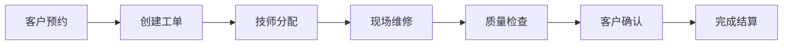
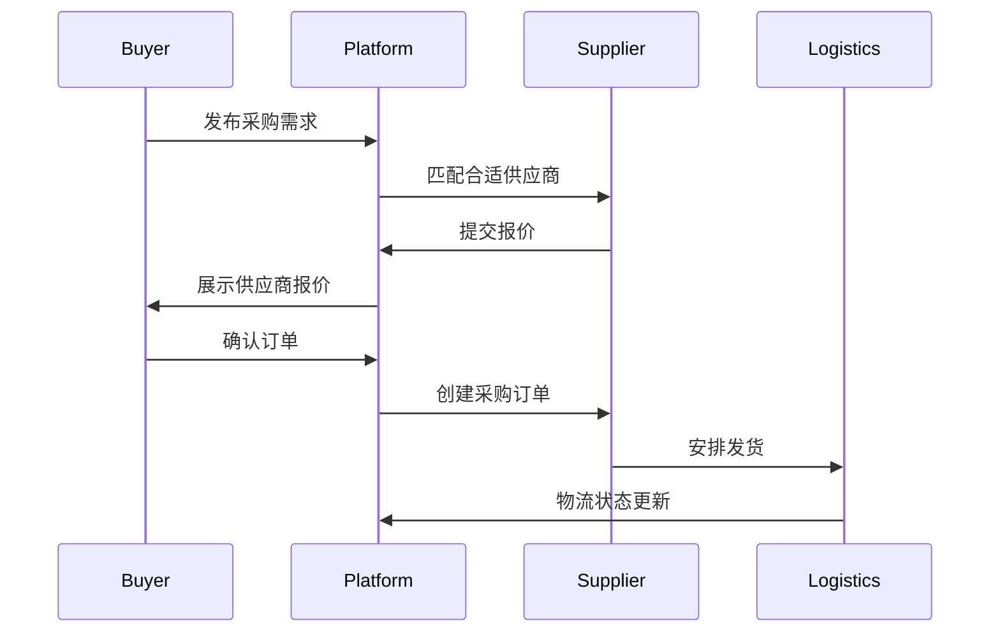

# 各模块详细技术文档

## 📋 模块文档索引

### 业务模块文档

1. [认证授权模块 (auth)](#认证授权模块)
2. [维修服务模块 (repair-service)](#维修服务模块)
3. [配件商城模块 (parts-market)](#配件商城模块)
4. [B2B采购模块 (b2b-procurement)](#b2b采购模块)
5. [数据中心模块 (data-center)](#数据中心模块)
6. [FCX联盟模块 (fcx-alliance)](#fcx联盟模块)
7. [管理后台模块 (admin-panel)](#管理后台模块)
8. [公共组件模块 (common)](#公共组件模块)

---

## 认证授权模块

### 模块概述
负责用户身份验证、权限管理和会话控制的核心模块。

### 目录结构
```
src/modules/auth/
├── app/                 # 路由组件
│   └── login/          # 登录页面
├── components/         # 认证相关组件
├── services/           # 认证服务
├── hooks/             # 自定义钩子
├── utils/             # 工具函数
├── types/             # 类型定义
└── api/               # API接口
```

### 核心功能
- 用户登录/注册
- JWT令牌管理
- OAuth第三方登录
- 权限验证和RBAC控制
- 会话管理和超时处理

### 技术实现
- **认证协议**: JWT + OAuth 2.0
- **加密算法**: bcrypt + AES-256
- **存储方式**: HttpOnly Cookie + Redis Session
- **安全措施**: CSRF保护 + Rate Limiting

### API接口
```typescript
// 登录接口
POST /api/auth/login
{
  "username": "string",
  "password": "string"
}

// 注册接口
POST /api/auth/register
{
  "email": "string",
  "username": "string", 
  "password": "string"
}

// 刷新令牌
POST /api/auth/refresh
```

---

## 维修服务模块

### 模块概述
提供设备维修预约、工单管理和技师调度的完整解决方案。

### 目录结构
```
src/modules/repair-service/
├── app/
│   ├── dashboard/      # 仪表板
│   ├── work-orders/    # 工单管理
│   ├── diagnostics/    # 设备诊断
│   ├── customers/      # 客户管理
│   ├── pricing/        # 价格管理
│   └── settings/       # 系统设置
├── components/
├── services/
├── hooks/
├── utils/
├── types/
└── api/
```

### 核心功能
- 设备故障诊断
- 维修工单创建和跟踪
- 技师资源调度
- 客户关系管理
- 价格策略配置
- 维修历史记录

### 业务流程


### 数据模型
```typescript
interface WorkOrder {
  id: string;
  customerId: string;
  deviceId: string;
  technicianId: string;
  status: 'pending' | 'assigned' | 'in-progress' | 'completed' | 'cancelled';
  priority: 'low' | 'medium' | 'high' | 'urgent';
  description: string;
  scheduledTime: Date;
  actualStartTime?: Date;
  actualEndTime?: Date;
  cost: number;
}
```

---

## 配件商城模块

### 模块概述
3C数码配件在线交易平台，支持比价和智能推荐。

### 目录结构
```
src/modules/parts-market/
├── app/
│   ├── products/       # 商品列表
│   ├── product/[id]/   # 商品详情
│   ├── cart/           # 购物车
│   ├── checkout/       # 结算页面
│   ├── orders/         # 订单管理
│   └── compare/        # 商品对比
├── components/
├── services/
├── hooks/
├── utils/
├── types/
└── api/
```

### 核心功能
- 商品搜索和筛选
- 价格比较和趋势分析
- 智能推荐算法
- 购物车和订单管理
- 支付集成
- 库存实时同步

### 推荐算法
采用协同过滤 + 内容推荐混合算法：
- 基于用户行为的协同过滤
- 基于商品特征的内容推荐
- 实时热度加权计算

---

## B2B采购模块

### 模块概述
为企业用户提供进出口贸易和供应链管理服务。

### 目录结构
```
src/modules/b2b-procurement/
├── app/
│   ├── importer/       # 进口商业务
│   ├── exporter/       # 出口商业务
│   ├── suppliers/      # 供应商管理
│   ├── procurement/    # 采购管理
│   ├── logistics/      # 物流跟踪
│   └── customs/        # 报关清关
├── components/
├── services/
├── hooks/
├── utils/
├── types/
└── api/
```

### 核心功能
- 供应商寻源和评估
- 采购订单管理
- 国际物流跟踪
- 报关清关流程
- 贸易合同管理
- 风险控制和合规

### 贸易流程


---

## 数据中心模块

### 模块概述
提供数据分析、报表生成和业务洞察的智能化平台。

### 目录结构
```
src/modules/data-center/
├── app/
│   ├── dashboard/      # 数据仪表板
│   ├── analytics/      # 分析报告
│   ├── reports/        # 报表中心
│   └── monitoring/     # 实时监控
├── components/
├── services/
├── hooks/
├── utils/
├── types/
└── api/
```

### 核心功能
- 实时数据监控
- 多维度数据分析
- 自定义报表生成
- 预警和通知系统
- 数据可视化展示
- BI报表集成

### 技术特点
- **数据处理**: 实时流处理 + 批处理
- **存储引擎**: PostgreSQL + Redis + 文件存储
- **可视化**: Recharts + D3.js
- **计算能力**: 异步任务队列

---

## FCX联盟模块

### 模块概述
基于区块链的代币经济和社区治理平台。

### 目录结构
```
src/modules/fcx-alliance/
├── app/
│   ├── alliance/       # 联盟首页
│   ├── staking/        # 质押挖矿
│   ├── rewards/        # 奖励中心
│   ├── rankings/       # 排行榜
│   └── governance/     # 治理投票
├── components/
├── services/
├── hooks/
├── utils/
├── types/
└── api/
```

### 核心功能
- FCX代币质押和收益
- 社区贡献奖励机制
- 去中心化治理投票
- 生态合作伙伴计划
- 代币流通和销毁机制

### 经济模型
```
总发行量: 1,000,000,000 FCX
质押奖励: 年化 8-12%
社区基金: 20%
团队预留: 15%
市场推广: 10%
流动性池: 5%
```

---

## 管理后台模块

### 模块概述
系统管理和运营监控的统一平台。

### 目录结构
```
src/modules/admin-panel/
├── app/
│   ├── dashboard/      # 管理仪表板
│   ├── users/          # 用户管理
│   ├── shops/          # 商家管理
│   ├── content/        # 内容管理
│   ├── orders/         # 订单监控
│   ├── analytics/      # 运营分析
│   └── settings/       # 系统设置
├── components/
├── services/
├── hooks/
├── utils/
├── types/
└── api/
```

### 核心功能
- 用户账户管理
- 商家资质审核
- 内容审核和发布
- 订单异常监控
- 运营数据分析
- 系统配置管理

### 权限体系
采用RBAC模型：
- **超级管理员**: 系统最高权限
- **运营管理员**: 业务运营管理
- **客服专员**: 客户服务权限
- **财务专员**: 财务相关权限
- **内容编辑**: 内容管理权限

---

## 公共组件模块

### 模块概述
提供可复用的UI组件、工具函数和基础服务。

### 目录结构
```
src/modules/common/
├── components/         # 共享组件
│   ├── ui/            # 基础UI组件
│   ├── layout/        # 布局组件
│   └── forms/         # 表单组件
├── services/          # 公共服务
├── hooks/             # 通用钩子
├── utils/             # 工具函数
├── types/             # 共享类型
└── assets/            # 静态资源
```

### 核心组件
- **UI组件库**: 基于shadcn/ui的组件集合
- **表单系统**: 统一的表单验证和提交
- **表格组件**: 支持排序、筛选、分页
- **图表组件**: 数据可视化基础组件
- **上传组件**: 文件上传和管理

### 工具函数
```typescript
// 格式化工具
formatCurrency(amount: number): string
formatDate(date: Date): string
formatPhone(phone: string): string

// 验证工具
validateEmail(email: string): boolean
validatePhone(phone: string): boolean
validateIdCard(id: string): boolean

// 业务工具
calculateDistance(lat1, lng1, lat2, lng2): number
generateOrderId(): string
encryptData(data: string): string
```

---
_文档维护: 技术文档团队_
_更新频率: 每月定期更新_