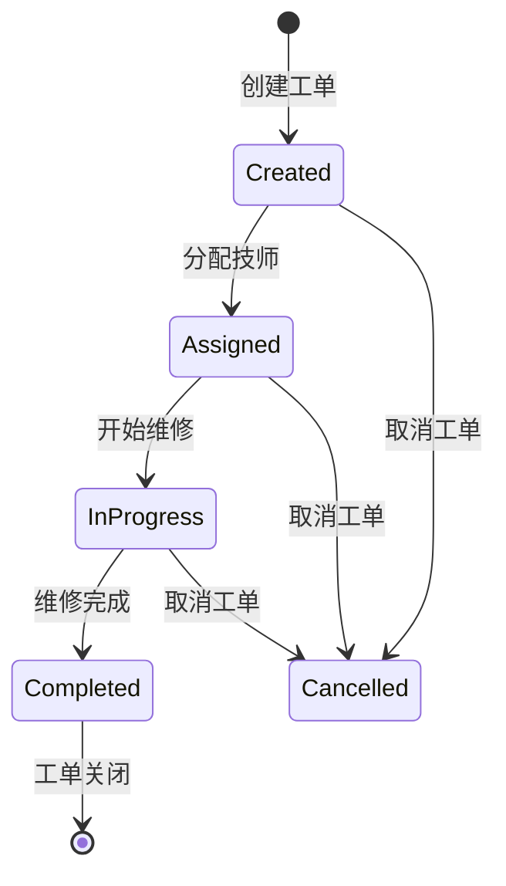
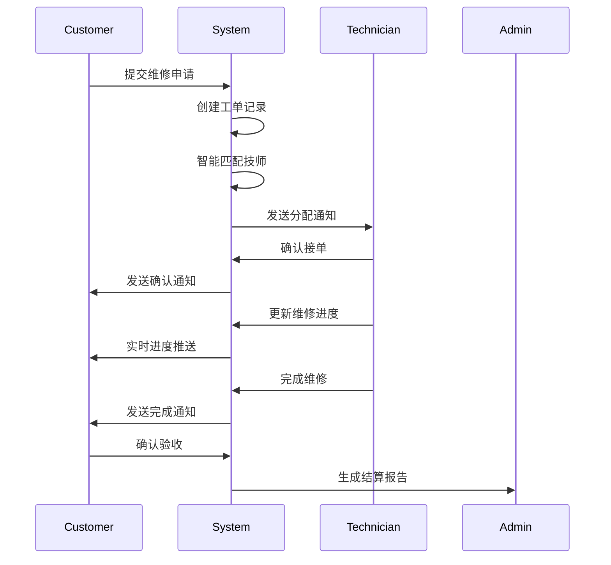

# 维修服务模块技术文档

## 📋 模块概览

维修服务模块是FixCycle平台的核心业务模块之一，提供完整的设备维修服务解决方案，包括预约管理、工单处理、技师调度等功能。

## 🏗️ 模块架构

### 目录结构
```
src/modules/repair-service/
├── app/                    # 应用路由层
│   ├── dashboard/         # 仪表板页面
│   ├── work-orders/       # 工单管理系统
│   │   ├── page.tsx      # 工单列表
│   │   └── [id]/         # 工单详情
│   ├── diagnostics/       # 设备诊断工具
│   ├── customers/         # 客户管理
│   ├── pricing/           # 价格配置
│   └── settings/          # 系统设置
├── components/            # 业务组件
│   ├── WorkOrderCard/    # 工单卡片组件
│   ├── TechnicianList/   # 技师列表组件
│   ├── DeviceSelector/   # 设备选择器
│   └── StatusTimeline/   # 状态时间线
├── services/              # 业务服务层
│   ├── workOrderService.ts  # 工单服务
│   ├── technicianService.ts # 技师服务
│   ├── diagnosticService.ts # 诊断服务
│   └── customerService.ts   # 客户服务
├── hooks/                 # 自定义钩子
│   ├── useWorkOrders.ts   # 工单数据钩子
│   ├── useTechnicians.ts  # 技师数据钩子
│   └── useDiagnostics.ts  # 诊断工具钩子
├── utils/                 # 工具函数
│   ├── workOrderUtils.ts  # 工单工具函数
│   ├── pricingUtils.ts    # 价格计算工具
│   └── schedulingUtils.ts # 调度算法工具
├── types/                 # 类型定义
│   ├── workOrder.ts       # 工单类型
│   ├── technician.ts      # 技师类型
│   ├── device.ts          # 设备类型
│   └── customer.ts        # 客户类型
└── api/                   # API接口
    ├── workOrders/        # 工单相关接口
    ├── technicians/       # 技师相关接口
    ├── diagnostics/       # 诊断相关接口
    └── customers/         # 客户相关接口
```

## 🎯 核心功能

### 1. 工单管理系统
- 工单创建、编辑、删除
- 状态流转和跟踪
- 优先级管理
- 分配和调度
- 历史记录追溯

### 2. 设备诊断工具
- 智能故障识别
- 诊断报告生成
- 维修建议推荐
- 配件需求预测

### 3. 技师资源管理
- 技师档案管理
- 技能标签系统
- 工作负载平衡
- 绩效评估体系

### 4. 客户关系管理
- 客户信息维护
- 维修历史记录
- 服务质量评价
- 忠诚度管理

## 📊 数据模型

### 工单模型 (WorkOrder)
```typescript
interface WorkOrder {
  // 基本信息
  id: string;
  orderNumber: string;
  customerId: string;
  deviceId: string;
  technicianId?: string;
  
  // 状态信息
  status: 'created' | 'assigned' | 'in-progress' | 'completed' | 'cancelled';
  priority: 'low' | 'medium' | 'high' | 'urgent';
  progress: number; // 0-100
  
  // 时间信息
  createdAt: Date;
  updatedAt: Date;
  scheduledTime: Date;
  actualStartTime?: Date;
  actualEndTime?: Date;
  estimatedCompletion?: Date;
  
  // 业务信息
  description: string;
  faultDescription: string;
  diagnosisResult?: string;
  repairNotes?: string;
  cost: {
    labor: number;
    parts: number;
    total: number;
  };
  
  // 关联信息
  customer: Customer;
  device: Device;
  technician?: Technician;
  attachments: Attachment[];
  timeline: WorkOrderEvent[];
}

interface WorkOrderEvent {
  id: string;
  type: 'status_change' | 'assignment' | 'note' | 'attachment';
  timestamp: Date;
  userId: string;
  description: string;
  metadata?: Record<string, any>;
}
```

### 技师模型 (Technician)
```typescript
interface Technician {
  id: string;
  userId: string;
  name: string;
  phone: string;
  email: string;
  avatar?: string;
  
  // 专业技能
  specialties: string[]; // 专业领域
  certifications: Certification[]; // 认证证书
  experienceYears: number;
  skillLevel: 'junior' | 'intermediate' | 'senior' | 'master';
  
  // 工作状态
  status: 'available' | 'busy' | 'offline' | 'on-vacation';
  currentWorkload: number; // 当前工单数
  location: {
    latitude: number;
    longitude: number;
    address: string;
  };
  
  // 绩效指标
  ratings: {
    average: number;
    totalReviews: number;
    responseTime: number; // 平均响应时间(分钟)
    completionRate: number; // 完成率
  };
  
  // 系统信息
  createdAt: Date;
  updatedAt: Date;
  isActive: boolean;
}
```

## 🔧 服务层实现

### 工单服务 (workOrderService.ts)
```typescript
class WorkOrderService {
  // 创建工单
  async createWorkOrder(data: CreateWorkOrderDTO): Promise<WorkOrder> {
    // 验证输入数据
    await this.validateWorkOrderData(data);
    
    // 生成工单号
    const orderNumber = this.generateOrderNumber();
    
    // 创建工单记录
    const workOrder = await db.workOrders.create({
      ...data,
      orderNumber,
      status: 'created',
      progress: 0
    });
    
    // 触发创建事件
    await this.emitEvent('workorder.created', workOrder);
    
    return workOrder;
  }
  
  // 分配技师
  async assignTechnician(workOrderId: string, technicianId: string): Promise<WorkOrder> {
    const workOrder = await this.findById(workOrderId);
    const technician = await technicianService.findById(technicianId);
    
    // 验证技师可用性
    if (!this.isTechnicianAvailable(technician)) {
      throw new Error('技师不可用');
    }
    
    // 更新工单状态
    const updatedOrder = await db.workOrders.update(workOrderId, {
      technicianId,
      status: 'assigned',
      assignedAt: new Date()
    });
    
    // 通知技师
    await notificationService.sendAssignmentNotification(technicianId, workOrder);
    
    return updatedOrder;
  }
  
  // 获取技师工作负载
  async getTechnicianWorkload(technicianId: string): Promise<number> {
    const activeOrders = await db.workOrders.count({
      technicianId,
      status: { $in: ['assigned', 'in-progress'] }
    });
    
    return activeOrders;
  }
}
```

### 调度算法工具 (schedulingUtils.ts)
```typescript
class SchedulingAlgorithm {
  // 智能技师匹配
  static async findBestTechnician(workOrder: WorkOrder): Promise<Technician | null> {
    const availableTechnicians = await technicianService.getAvailableTechnicians();
    
    // 过滤符合条件的技师
    const qualifiedTechnicians = availableTechnicians.filter(tech => 
      this.matchesSpecialty(tech, workOrder.device.type) &&
      this.withinServiceArea(tech, workOrder.customer.location)
    );
    
    if (qualifiedTechnicians.length === 0) {
      return null;
    }
    
    // 计算匹配分数
    const scoredTechnicians = qualifiedTechnicians.map(tech => ({
      technician: tech,
      score: this.calculateMatchScore(tech, workOrder)
    }));
    
    // 返回最高分技师
    return scoredTechnicians
      .sort((a, b) => b.score - a.score)[0]
      .technician;
  }
  
  // 计算匹配分数
  private static calculateMatchScore(technician: Technician, workOrder: WorkOrder): number {
    let score = 0;
    
    // 专业技能匹配 (权重: 40%)
    if (technician.specialties.includes(workOrder.device.type)) {
      score += 40;
    }
    
    // 距离因素 (权重: 25%)
    const distance = this.calculateDistance(
      technician.location,
      workOrder.customer.location
    );
    score += Math.max(0, 25 - (distance / 1000) * 5);
    
    // 工作负载 (权重: 20%)
    const workloadFactor = Math.max(0, 20 - technician.currentWorkload * 5);
    score += workloadFactor;
    
    // 技师评级 (权重: 15%)
    score += technician.ratings.average * 3;
    
    return Math.min(100, score);
  }
}
```

## 🔄 业务流程

### 工单生命周期


### 完整业务流程


## 📈 性能优化

### 数据库优化
```sql
-- 工单查询索引
CREATE INDEX idx_work_orders_status ON work_orders(status);
CREATE INDEX idx_work_orders_technician ON work_orders(technician_id);
CREATE INDEX idx_work_orders_customer ON work_orders(customer_id);
CREATE INDEX idx_work_orders_created_at ON work_orders(created_at);

-- 复合索引优化常用查询
CREATE INDEX idx_work_orders_status_priority ON work_orders(status, priority);
CREATE INDEX idx_work_orders_technician_status ON work_orders(technician_id, status);
```

### 缓存策略
```typescript
class CacheStrategy {
  // 工单详情缓存 (5分钟)
  static async getCachedWorkOrder(id: string): Promise<WorkOrder | null> {
    const cacheKey = `workorder:${id}`;
    const cached = await redis.get(cacheKey);
    
    if (cached) {
      return JSON.parse(cached);
    }
    
    const workOrder = await workOrderService.findById(id);
    if (workOrder) {
      await redis.setex(cacheKey, 300, JSON.stringify(workOrder));
    }
    
    return workOrder;
  }
  
  // 技师列表缓存 (10分钟)
  static async getCachedTechnicians(filters: any): Promise<Technician[]> {
    const cacheKey = `technicians:${JSON.stringify(filters)}`;
    const cached = await redis.get(cacheKey);
    
    if (cached) {
      return JSON.parse(cached);
    }
    
    const technicians = await technicianService.findByFilters(filters);
    await redis.setex(cacheKey, 600, JSON.stringify(technicians));
    
    return technicians;
  }
}
```

## 🔒 安全考虑

### 数据权限控制
```typescript
class PermissionService {
  // 验证技师是否有权查看工单
  static async canViewWorkOrder(technicianId: string, workOrderId: string): Promise<boolean> {
    const workOrder = await workOrderService.findById(workOrderId);
    
    // 技师只能查看自己负责的工单
    if (workOrder.technicianId !== technicianId) {
      return false;
    }
    
    // 检查技师状态
    const technician = await technicianService.findById(technicianId);
    return technician.isActive && technician.status !== 'suspended';
  }
  
  // 验证客户是否有权查看自己的工单
  static async canViewOwnWorkOrders(customerId: string): Promise<boolean> {
    // 客户只能查看自己的工单
    return true; // 在查询时通过customerId过滤
  }
}
```

## 📊 监控指标

### 关键性能指标 (KPIs)
```typescript
interface RepairMetrics {
  // 响应速度指标
  averageResponseTime: number;        // 平均响应时间(分钟)
  firstResponseTime: number;          // 首次响应时间(分钟)
  
  // 完成效率指标
  averageCompletionTime: number;      // 平均完成时间(小时)
  onTimeCompletionRate: number;       // 准时完成率(%)
  
  // 质量指标
  customerSatisfaction: number;       // 客户满意度(%)
  reworkRate: number;                 // 返工率(%)
  firstTimeFixRate: number;           // 首次修复率(%)
  
  // 资源利用率
  technicianUtilization: number;      // 技师利用率(%)
  workOrderVolume: number;            // 工单处理量
}
```

## 🛠️ 开发指南

### 环境配置
```bash
# 安装依赖
npm install

# 启动开发服务器
npm run dev:repair

# 运行单元测试
npm run test:repair

# 代码检查
npm run lint:repair
```

### API使用示例
```typescript
// 创建工单
const newWorkOrder = await workOrderService.create({
  customerId: 'cust_123',
  deviceId: 'dev_456',
  description: '手机屏幕碎裂',
  priority: 'high'
});

// 分配技师
const assignedOrder = await workOrderService.assignTechnician(
  newWorkOrder.id,
  'tech_789'
);

// 更新进度
await workOrderService.updateProgress(newWorkOrder.id, 50, '更换屏幕中');

// 完成工单
await workOrderService.complete(newWorkOrder.id, {
  notes: '屏幕更换完成，功能正常',
  cost: { labor: 200, parts: 300, total: 500 }
});
```

---
_文档版本: v1.0_
_最后更新: 2026年2月21日_
_维护人员: 维修服务团队_