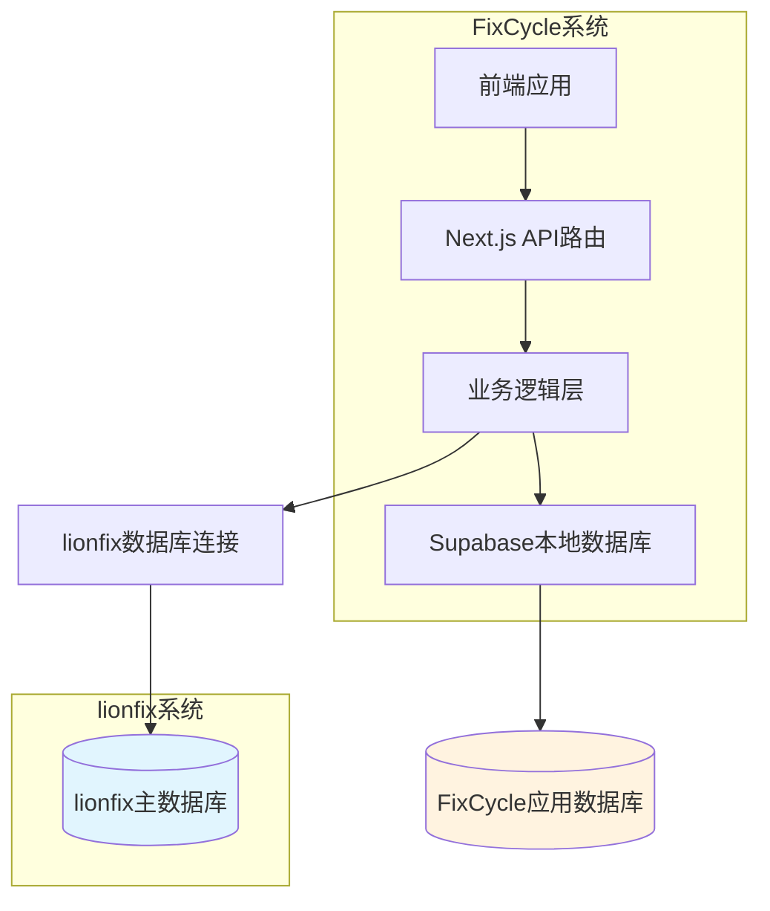

# FixCycle 项目说明书（整合 3.0 版本）

## 项目概述

FixCycle 是一个基于现代 Web 技术栈构建的 3C 电子产品维修服务平台，专注于为用户提供专业的设备维修解决方案。本项目采用前后端分离架构，基于 JAMstack 理念设计，旨在打造高性能、可扩展的维修服务生态系统。 -通过 Fix CycleX 维修联盟，您将构建一个自驱动的全球售后网络： -小工厂以极低成本获得覆盖多国的服务网点 -维修店通过优质服务赚取 FCX 和 FCX2，形成品牌信誉 -消费者获得透明可靠的维修体验 -平台通过 FCX 流转和配件交易实现盈利

### 核心价值主张

- **一站式维修服务平台**：整合知识库、配件比价、维修店服务三大核心功能
- **智能化决策支持**：基于大数据的配件价格对比和维修方案推荐
- **生态协同效应**：与 lionfix 3C 零配件资料库深度集成，实现数据共享和业务协同
- **设备生命周期透明化**：通过 LIFE 系统为用户提供可信的设备历史记录，增强品牌信任感
- **数据驱动的服务优化**：基于设备全生命周期数据，实现精准的 AI 诊断和个性化服务推荐
- **智能估价与循环经济**：通过先进的估价算法实现旧机精准定价，推动以旧换新和环保回收

### 数据架构模式

FixCycle 采用**方案二：直连现有数据库**的集成策略，与 lionfix 系统形成紧密的数据协作关系：

- **数据来源**：直接连接 lionfix 3C 零配件资料库的核心数据库
- **协作模式**：lionfix 提供设备、配件、供应商等基础数据，FixCycle 构建前台业务应用
- **技术实现**：通过只读账号直接查询 lionfix 数据库，封装成内部 API 供前端使用
- **架构优势**：两个系统保持独立部署，通过数据库层实现高效数据共享

### 系统定位

FixCycle 作为 lionfix 生态的重要组成部分，承担着将专业配件数据转化为消费者友好服务的关键桥梁作用，致力于：

- 降低用户维修决策成本
- 提升维修服务透明度
- 促进 3C 维修行业标准化发展

## 商业模式与通证经济

### FixCycle 5.0 通证经济体系

#### 通证设计原则

1. **中心化稳定**：FCX 为平台中心化积分，严格锚定法币（1 FCX = 0.01 USD），由平台发行和回收，避免价格波动影响业务。

2. **双通证分层**：FCX 作为价值媒介，用于支付、结算、兑换；FCX2 作为权益积分，记录贡献，不可交易，仅用于兑换平台内增值权益。

3. **正向激励**：通过 FCX2 奖励优质行为（低纠纷、高好评、快速响应），形成信誉与利益挂钩的自驱生态。

4. **闭环流通**：FCX 在平台内循环，通过手续费、提现费等机制回收，保持总量与业务规模匹配。

5. **合规优先**：不涉及区块链或加密货币，仅作为数据库积分，规避金融监管风险。

#### FCX 总量与发行机制

**发行方式**：

- 平台作为唯一发行方，用户通过法币购买 FCX（如 1 USD = 100 FCX）
- 初始发行量根据预估业务规模设定，后续按需增发
- 平台预留一部分 FCX 作为生态激励基金

**回收方式**：

- 用户提现时收取 3% 手续费，FCX 被销毁或回收
- 交易佣金、订阅费等最终以法币结算，对应 FCX 从流通中回收
- 用户使用 FCX 支付平台服务时，FCX 被平台回收

**价格稳定机制**：

- 平台始终以固定汇率出售 FCX，不设二级市场
- 提现时按固定汇率兑换，但收取手续费防止套利

#### 全链路通证流转

```
┌─────────────────────────────────────────────────────────────────────┐
│                             法币通道                                 │
│  用户通过 Stripe/PayPal/支付宝 购买 FCX                              │
│  平台收取法币，发放 FCX 到用户账户                                   │
└─────────────────────────────────────────────────────────────────────┘
                                    │
                                    ▼
┌─────────────────────────────────────────────────────────────────────┐
│                           FCX 生态内循环                             │
│  ┌──────────────┐    ┌──────────────┐    ┌──────────────┐          │
│  │  支付工单     │    │  采购配件     │    │  支付物流费   │          │
│  │  (M4/M5/M6)  │    │  (A1/A3/M2)  │    │  (F1)        │          │
│  └──────┬───────┘    └──────┬───────┘    └──────┬───────┘          │
│         │                    │                    │                  │
│         └───────────────────┼────────────────────┘                  │
│                             │                                        │
│                             ▼                                        │
│  ┌──────────────────────────────────────────────────────┐          │
│  │                   资金沉淀池                         │          │
│  │   用户账户余额、平台回收池、激励基金账户                │          │
│  └──────────────────────────────────────────────────────┘          │
│                             │                                        │
│         ┌───────────────────┼────────────────────┐                  │
│         ▼                   ▼                    ▼                  │
│  ┌──────────────┐    ┌──────────────┐    ┌──────────────┐          │
│  │  提现        │    │  支付平台服务 │    │  兑换 FCX2   │          │
│  │  (收手续费)  │    │  (广告/订阅)  │    │  权益        │          │
│  └──────────────┘    └──────────────┘    └──────────────┘          │
└─────────────────────────────────────────────────────────────────────┘
```

#### 各角色通证获取与消耗场景

**海外进口商（M2 用户）**

- 获取：法币购买
- 消耗：支付采购订金、交易佣金、物流费用、提现手续费

**国内配件外贸公司（A 系列用户）**

- 获取：法币购买、销售收款、海外仓服务费
- 消耗：采购货款、物流费用、平台服务费、SaaS 订阅费、提现手续费

**维修店（M4 成员）**

- 获取：工单奖励、消费者点赞奖励、平台活动奖励
- 消耗：采购配件、支付罚款、提现手续费、兑换 FCX2 权益

**工厂（M5 用户）**

- 获取：法币购买
- 消耗：支付工单、采购配件、增值服务、提现手续费

**消费者（M1 用户）**

- 获取：品牌赠送、反馈奖励、邀请奖励
- 消耗：兑换配件折扣券、延长保修服务、商家优惠、以旧换新抵扣

#### FCX2 数字期权设计

**定位**：记录用户贡献的不可交易积分，代表信誉资产和权益凭证

**获取途径**：

- 维修店：好评率>95%、纠纷率<1%、连续服务时长
- 外贸公司：订单准时交付率、低退货率、客户好评
- 进口商：采购量稳定、付款及时
- 工厂：质量问题少、售后响应快
- 工程师：高评分案例、社区贡献

**使用场景**：

- 优先派单权重（100/月）
- 采购折扣（200/月）
- 免提现手续费（500/月）
- 平台治理投票权（1000）
- 专属客户经理（5000/年）
- 品牌认证标识（2000/年）

**衰减机制**：按月衰减 5%，鼓励持续贡献

#### 经济模型关键参数

| 参数         | 建议值           | 说明              |
| ------------ | ---------------- | ----------------- |
| FCX 法币锚定 | 1 FCX = 0.01 USD | 固定汇率          |
| 购买手续费   | 0%               | 购买时不收费      |
| 提现手续费   | 3%               | 防止频繁进出      |
| B2B 交易佣金 | 1%               | M2↔A3 交易        |
| 维修工单佣金 | 0%               | 通过 FCX 发行获利 |
| 物流订舱佣金 | 0.5%             | F1 撮合交易       |
| 平台激励基金 | 总发行量的 10%   | 新用户奖励        |

#### 风险控制与合规

1. **反洗钱**：大额购买需 KYC 认证，提现需匹配真实交易背景
2. **防刷单**：行为分析识别异常交易，冻结账户并没收 FCX
3. **价格稳定**：中心化发行，无二级市场，无价格波动
4. **法律合规**：明确 FCX 为平台积分，不具备货币属性
5. **财务处理**：FCX 销售收入记为预收款，实际消费时确认收入

#### 实施路线图

| 阶段     | 时间       | 通证功能重点                                        |
| -------- | ---------- | --------------------------------------------------- |
| 第一阶段 | 0-6 个月   | FCX 基础账户系统，集成到 M4 工单支付                |
| 第二阶段 | 7-12 个月  | FCX 提现、交易佣金自动扣除；FCX2 基础累积（维修店） |
| 第三阶段 | 13-18 个月 | FCX2 权益兑换商城；A 系列内部交易支持 FCX 支付      |
| 第四阶段 | 19-24 个月 | 全面推广 FCX2 应用，引入更多权益，优化算法          |

## 核心功能模块

### 已完成模块

#### 1. 管理后台系统

- **RBAC 权限管理**：基于角色的访问控制系统，支持超级管理员、内容审核员、店铺审核员等多种角色
- **用户管理体系**：完整的管理员用户生命周期管理，包括创建、授权、状态控制等功能
- **仪表板监控**：实时系统状态展示和关键指标监控
- **内容管理系统**：文章编辑器、审核流程、SEO 优化支持

#### 2. 配件管理模块

- **配件信息管理**：支持配件的增删改查、设备和故障关联、库存管理
- **批量操作功能**：Excel 模板下载、批量导入导出、搜索筛选
- **价格追踪系统**：历史价格记录、价格波动分析、供应商比价

#### 3. 用户管理系统

- **用户档案管理**：完整的用户信息维护、状态管理、等级体系
- **账户安全**：多因素认证、登录日志、安全审计
- **用户成长体系**：积分系统、等级晋升、成就解锁

#### 4. 链接审核系统

- **AI 智能审核**：基于机器学习的内容识别和风险评估
- **联盟链接管理**：链接质量评分、流量追踪、效果分析
- **内容标签系统**：自动分类、关键词提取、内容推荐

#### 5. 店铺管理系统

- **商家入驻流程**：资质审核、信用评级、服务范围管理
- **服务质量监控**：基于用户评价和服务数据的质量评估体系
- **违规处理机制**：投诉处理和违规处罚流程

#### 6. FCX 生态系统

- **账户服务系统**：FCX 账户创建、余额管理、交易记录
- **质押机制**：维修店质押流程、保证金管理、风险控制
- **奖励分配**：FCX2 期权计算、等级评定、排行榜系统
- **联盟等级体系**：基于贡献度的等级划分和权益分配

#### 7. 供应链基础模块

- **供应商管理**：供应商入驻审核、信用评级、分类管理
- **多仓库存管理**：统一库存模型、多地仓库同步、库存预警
- **基础订单系统**：采购流程、配送管理、状态跟踪

#### 8. 采购模块

- **采购申请系统**：需求提交、预算审批、采购计划
- **订单管理**：订单创建、状态跟踪、供应商协调
- **审批流程**：多级审批机制、流程自动化、权限控制

#### 9. 机器学习估值系统（ML Phase2）✅

- **内部数据采集**：从LIFE档案和订单系统提取历史成交数据
- **智能特征工程**：数据清洗、特征提取、编码标准化
- **双模型训练**：LightGBM + XGBoost算法对比优化
- **Python微服务**：FastAPI部署，RESTful API接口
- **Node.js客户端**：TypeScript封装，重试机制和错误处理
- **市场特征增强**：实时市场均价集成，动态上下文增强
- **置信度评估**：多维度置信因子计算，智能建议生成
- **生产部署**：容器化支持，健康检查和监控告警

#### 10. 设备生命周期档案系统（LIFE）✅

- **数据库设计**：设备生命周期事件表、设备档案主表
- **枚举常量**：统一的类型定义和状态映射
- **后端服务**：生命周期事件服务、设备档案服务
- **API接口**：RESTful API，完整的CRUD操作
- **前端组件**：设备档案展示卡片、生命周期时间轴
- **扫码落地页**：完整的设备信息展示页面
- **系统集成**：工单系统自动同步、FCX通证奖励触发
- **测试套件**：端到端集成测试，性能基准验证

#### 11. 智能融合与自学习系统（V-FUSE）✅

- **智能决策引擎**：动态策略选择（ML/市场/规则引擎）
- **置信度评估**：多维度可靠性评估，分层阈值管理
- **增强版API**：第二版估值API，详细策略信息返回
- **用户反馈收集**：数据库迁移脚本，统计分析视图
- **配置管理系统**：运行时参数调整，热更新支持
- **测试验证**：完整测试用例，决策过程透明化

#### 12. 集成与运维系统（V-OPS）✅

- **估值日志管理**：完整日志记录，统计分析API
- **监控告警系统**：Prometheus集成，Grafana可视化
- **管理后台**：日志管理页面，统计分析仪表板
- **智能告警**：多维度监控指标，动态阈值设置
- **性能优化**：异步日志记录，结构化数据存储

#### 13. 智能体可靠性系统（E1）✅

- **超时控制**：请求级别超时配置，自动终止机制
- **指数重试**：智能重试策略，随机抖动避免惊群
- **幂等性去重**：基于idempotency_key的去重机制
- **环境配置**：RETRY_MAX、TIMEOUT_MS参数化管理
- **测试覆盖**：100%核心功能测试，完整验证

#### 14. 统一命令入口系统✅

- **环境管理**：setup:env命令，环境变量校验
- **健康检查**：check:health命令，综合状态报告
- **数据种子**：seed命令，标准化数据播种
- **测试套件**：test:all命令，完整测试流程
- **开发部署**：deploy:dev命令，自动化本地部署
- **文档完善**：快速启动指南，Makefile替代入口

### 进行中模块

#### 15. 数据中心系统（88%完成）

- **查询优化引擎**：谓词下推、列裁剪、JOIN 重排序等优化策略
- **分析引擎**：价格趋势分析、统计计算、预测建模
- **实时处理**：消息队列集成、实时监控告警、数据质量检测
- **虚拟化层**：统一数据模型、跨数据源查询、智能缓存

#### 16. lionfix 数据集成系统

- **数据库连接层**：建立安全稳定的 lionfix 数据库只读连接
- **数据同步机制**：定期同步设备型号、配件规格、供应商信息等核心数据
- **API 封装服务**：将 lionfix 数据转换为 FixCycle 内部可用的 RESTful API
- **缓存优化策略**：引入 Redis 缓存提升数据访问性能

#### 17. 知识库系统

- **维修指南库**：基于 lionfix 设备数据构建的专业维修指导文档
- **故障诊断助手**：智能故障识别和解决方案推荐
- **学习资源中心**：维修技能培训和知识分享平台

#### 18. 配件比价引擎

- **价格聚合服务**：整合多家供应商报价信息
- **智能比价算法**：基于 lionfix 配件数据的价格分析和推荐
- **历史价格追踪**：配件价格趋势分析和预测功能

### FixCycle 3.0 新增模块规划

#### 19. 产品服务官智能体模块（MVP 阶段）

- **用户-产品绑定系统**：二维码生成与扫码落地页，实现产品唯一 ID 识别
- **多语言电子说明书**：品牌商内容上传后台，支持图文/视频多语言展示
- **AI 故障诊断引擎**：接入大模型 API，训练 3C 故障问答库，实现多轮对话引导
- **Token 计费系统**：预充值、消耗记录、结算功能，支持品牌商 Token 包购买
- **支付集成系统**：集成 Stripe/PayPal/支付宝，使用 punch-library 统一支付接口
- **品牌数据看板**：基础数据展示，统计扫码次数、诊断次数、热门问题
- **设备生命周期档案系统（LIFE）**：打通产品服务智能体，实现设备全生命周期管理
  - **透明可信的设备历史**：扫码后不仅能看到说明书和AI诊断，还能查看设备的完整生命周期（出厂、激活、维修、换件、回收等），增强品牌信任感
  - **AI诊断准确性提升**：结合设备历史故障记录，提供更精准的诊断建议
  - **服务闭环实现**：每一次维修、换件、激活都自动记录到生命周期，形成数据沉淀，为产品改进和精准营销提供依据
  - **以旧换新和环保回收支持**：通过生命周期记录准确评估设备剩余价值，简化以旧换新流程

#### 20. DIY 维修指导模块（扩展阶段）

- **分步维修教程**：维修视频/图文教程，内嵌配件购买链接
- **配件导航系统**：维护各国电商平台官方店铺链接，智能推荐购买渠道
- **软件升级提醒**：支持品牌商推送升级公告，关联维修教程
- **联盟链接追踪**：配件购买链接带追踪参数，实现转化统计

#### 21. 新机预定众筹模块（创新阶段）

- **众筹平台改造**：基于 crowdfunding-tuts 开源项目快速搭建
- **旧机型关联**：增加旧机型字段，生成专属预定链接
- **预售营销工具**：预售页面创建、用户端展示、支付集成
- **预定转化分析**：预定数据统计、转化率分析、用户行为追踪
- **旧机估价与以旧换新闭环**：实现CROWDFUND + LIFE系统深度整合
  - **智能估价算法**：基于设备档案数据的精准价格评估
  - **多元算法融合**：借鉴eReuse RdeviceScore规则算法 + LightGBM机器学习模型 + LLM大模型方案
  - **实时价格计算**：结合硬件配置、外观成色、功能状态等多维度特征
  - **动态定价机制**：根据市场行情和供需关系自动调整估价
  - **以旧换新流程**：从设备扫描、档案查询、智能估价到优惠计算的完整闭环

#### 22. 海外仓智能管理系统（FixCycle 3.5）

- **WMS 系统对接**：与合作海外仓建立 API 对接，实现库存实时同步
- **智能分仓引擎**：基于用户位置、库存、运费自动选择最优发货仓
- **入库预报管理**：品牌商创建入库单，海外仓接收预报并安排收货
- **物流追踪聚合**：对接多家国际物流商，自动获取运单轨迹
- **智能补货建议**：基于销售数据和库存分析，自动生成补货建议
- **效能分析看板**：各仓运营数据监控、异常预警、多仓对比报表

#### 23. B2B 采购智能体（FixCycle 4.0）

- **需求理解引擎**：支持自然语言、图片、链接等多种输入方式
- **供应商智能匹配**：基于向量数据库的相似度检索和多因子评分
- **自动询价比价**：批量向供应商发送询价，结构化解析报价
- **智能议价下单**：基于历史数据的自动议价，生成采购订单
- **风险预警监控**：实时监控供应商经营状况，提供备选方案
- **采购策略优化**：数据分析驱动的采购优化建议和策略配置

## 技术架构

### 整体架构设计



### 数据流向架构

1. **基础数据层**：lionfix 数据库提供设备型号、配件规格、供应商信息等核心数据
2. **应用数据层**：FixCycle 本地数据库存储用户数据、订单信息、业务状态等
3. **服务整合层**：后端服务同时访问两个数据源，进行数据融合和业务逻辑处理
4. **API 接口层**：封装统一的 RESTful API 供前端调用
5. **前端展现层**：React/Next.js 构建的现代化用户界面

### 技术栈选型

#### 前端技术

- **框架**：Next.js 14 (App Router)
- **语言**：TypeScript
- **样式**：Tailwind CSS
- **UI 组件**：Radix UI + 自定义组件库
- **状态管理**：React Context + SWR

#### 后端技术

- **运行环境**：Node.js
- **数据库**：Supabase (PostgreSQL)
- **外部数据源**：lionfix PostgreSQL 数据库（只读连接）
- **API 架构**：RESTful API + Server Components
- **认证授权**：Supabase Auth + Google OAuth

#### 开发工具

- **包管理**：npm
- **测试框架**：Jest + Playwright
- **代码质量**：ESLint + Prettier
- **部署平台**：Vercel
- **监控分析**：Vercel Analytics

### 安全架构

#### 数据安全

- **连接安全**：SSL/TLS 加密数据库连接
- **权限控制**：lionfix 数据库使用只读账号，最小权限原则
- **数据隔离**：应用数据与基础数据物理分离
- **访问审计**：完整的 API 调用日志记录

#### 应用安全

- **身份认证**：OAuth 2.0 + JWT Token
- **权限管理**：RBAC 细粒度权限控制
- **输入验证**：严格的参数校验和 SQL 注入防护
- **CSRF 保护**：跨站请求伪造防护机制

## 部署架构

### 环境配置

#### 开发环境

```bash
# 本地开发
npm run dev # 端口: 3001

# 测试命令
npm run test # 单元测试
npm run test:e2e # 端到端测试
```

#### 生产环境

- **前端部署**：Vercel 自动部署
- **数据库**：Supabase 云数据库
- **监控**：Vercel Analytics + 自定义监控
- **日志**：Vercel 日志系统 + 第三方 APM

### 数据库架构

#### lionfix 数据库（只读访问）

- 设备型号表 (devices)
- 配件规格表 (parts)
- 供应商信息表 (suppliers)
- 价格历史表 (price_history)

#### FixCycle 数据库（读写访问）

- 用户信息表 (users)
- 订单管理表 (orders)
- 服务预约表 (appointments)
- 内容管理表 (articles)
- 系统配置表 (system_config)

### 自动化集成架构

#### n8n 自动化中台

n8n 作为项目中所有智能体的"集成总线"和"协调层"，负责智能体之间的无缝对接和协同工作。

**核心定位**：

- **触发层**：接收来自用户界面、定时任务或外部事件的请求
- **编排层**：按照业务规则调用多个智能体 API，组合数据处理流程
- **转换层**：在不同智能体间进行数据格式转换和语义映射
- **分发层**：将处理结果写回数据库、发送通知或调用其他系统

**对接方式**：

1. **HTTP API 对接**：智能体提供 RESTful API，n8n 通过 HTTP Request 节点调用
2. **Webhook 事件驱动**：智能体主动向 n8n 发送事件通知
3. **数据库监听**：通过 Supabase Realtime 监听数据变更触发工作流
4. **消息队列集成**：使用 RabbitMQ/Kafka 等实现高吞吐量异步处理

**价值体现**：

- 实现智能体间的松耦合通信
- 提供可视化的流程编排界面
- 支持快速迭代和流程调整
- 增强系统的可观测性和可追溯性

## n8n 集成实施规划

### 实施阶段划分

#### 第 1 阶段：快速试点（1-2 周）

**目标**：验证 n8n 基础功能和与简单智能体的对接

- 部署 n8n 基础环境
- 选择华强北报价采集等简单场景进行试点
- 建立基础的工作流模板
- 验证端到端数据流转

#### 第 2 阶段：核心智能体对接（2-4 周）

**目标**：将 B2B 采购智能体和海外仓智能体接入 n8n

- 开发 B2B 采购智能体的 HTTP 接口
- 实现用户维修需求到工单分配的完整流程
- 集成企业微信/邮件通知节点
- 建立监控和日志机制

#### 第 3 阶段：全面推广与定制化（1-2 个月）

**目标**：扩展到所有核心智能体，开发自定义节点

- 工厂售后智能体接入
- 维修工程师助理智能体集成
- 开发常用智能体的自定义 n8n 节点
- 建立工作流模板库和最佳实践

#### 第 4 阶段：高级集成探索（可选）

**目标**：探索与 Web3 和区块链的集成可能性

- 区块链事件监听和处理
- 智能合约交互自动化
- 去中心化身份验证集成

### 关键对接场景示例

#### 场景 1：维修需求全流程自动化

1. 用户提交维修需求 → 触发 n8n Webhook
2. B2B 采购智能体解析需求 → 结构化处理
3. 供应商匹配服务 → 获取最优报价
4. 海外仓智能体检索库存 → 确认可发货仓库
5. 维修工程师助理分配 → 智能派单
6. 企业微信通知 → 实时推送给工程师
7. 结果回写数据库 → 完成闭环

#### 场景 2：库存预警自动采购

1. 海外仓库存低于阈值 → 数据库变更触发
2. B2B 采购智能体自动生成采购需求
3. 智能询价比价 → 获取最优供应商
4. 自动生成采购订单 → 系统自动下单
5. 邮件通知采购员 → 状态同步

#### 场景 3：新机预定智能处理

1. 用户提交预定信息 → 前端触发
2. 工厂售后智能体生成优惠建议
3. 物流智能体计算运费时效
4. 组合信息返回用户 → 完整报价
5. 邮件确认发送 → 用户通知

## 项目发展规划

### FixCycle 3.0 发展路线图

#### 阶段一：MVP 快速验证（0-3 个月）

**目标**：上线最小可行产品，签约 10 家种子小品牌，验证核心流程（扫码 → 多语言说明书 → AI 诊断 → Token 消耗）

**核心产出**：

- 二维码绑定与扫码落地页
- 品牌商多语言说明书上传后台
- 基础 Token 计费与充值系统
- 简易 AI 诊断接口
- Stripe/PayPal 支付集成
- 品牌数据看板
- 设备生命周期档案系统（LIFE）核心功能
  - 设备档案创建与查询接口
  - 生命周期事件记录机制
  - 与工单系统数据同步
  - 扫码落地页档案展示

**里程碑**：

- 第 1 个月：完成二维码绑定、说明书上传、Token 基础框架
- 第 2 个月：接入 AI 诊断、支付，完成内测
- 第 3 个月：签约 10 家品牌，正式上线，收集首批用户反馈

#### 阶段二：小规模推广（4-8 个月）

**目标**：签约 100 家小品牌，覆盖海外用户 10 万+，验证 DIY 维修指导和新机预定模块的可行性

**新增功能**：

- DIY 维修指导模块（分步教程 + 配件购买链接）
- 配件导航系统（多国电商平台链接）
- 软件升级提醒功能
- 新机预定众筹模块（基于开源项目改造）
- 用户行为分析看板
- 多语言扩展支持
- 设备生命周期档案系统增强
  - AI 诊断与历史记录深度融合
  - 以旧换新流程自动化
  - 环保回收价值评估
  - 产品改进建议生成

**里程碑**：

- 第 4-5 个月：完成 DIY 维修、配件导航、升级提醒开发
- 第 6-7 个月：完成新机预定模块，上线试点
- 第 8 个月：累计签约 100 家品牌，Token 月消耗额突破 1 万美元

#### 阶段三：生态网络扩张（9-15 个月）

**目标**：签约 500 家品牌，月活跃用户 50 万+，建成海外仓智能管理网络，上线 B2B 采购智能体，实现完整的生态协同

**整合功能**：

- 维修店网络整合（原 FixCycle 模块）
- 配件比价系统整合（原 FixCycle 模块）
- 海外仓智能管理系统（FixCycle 3.5）
  - WMS 系统对接与库存同步
  - 智能分仓与订单履约
  - 物流追踪与效能分析
- B2B 采购智能体（FixCycle 4.0）
  - 智能需求理解与供应商匹配
  - 自动询价议价与风险监控
  - 采购策略优化与数据分析
- 系统集成优化（生态协同）
  - 海外仓与采购智能体数据打通
  - 维修店网络与仓储物流协同
  - 统一订单履约平台建设
- 合规与安全完善（GDPR/CCPA）

**里程碑**：

- 第 9-10 个月：完成海外仓基础对接和入库管理，B2B 采购智能体基础版上线
- 第 11-12 个月：完成订单智能分仓和物流追踪集成，采购智能体增强版上线
- 第 13-14 个月：启动海外仓试点运营，智能补货和风险预警系统上线
- 第 15 个月：累计签约 500 家品牌，实现完整生态协同，启动 Pre-A 轮融资

### 传统阶段目标（延续原有规划）

#### 已完成里程碑（2026 年 Q1-Q2）

- ✅ 完成管理后台基础功能
- ✅ 实现配件管理模块
- ✅ 完成核心测试验证（边界测试、E2E 测试）
- ✅ 集成 lionfix 数据源连接
- ✅ 开发知识库核心功能
- ✅ 上线配件比价原型
- ✅ 完成用户管理系统
- ✅ 实现链接审核系统
- ✅ 建立店铺管理体系
- ✅ 完善供应链基础模块
- ✅ 上线采购管理模块

### 当前重点任务（2026 年 Q3）

- 🔧 完善 FCX 生态系统核心服务
- 🔧 推进数据中心实时处理功能
- 🔧 优化现有模块性能和用户体验
- 🔧 准备 B2B 采购智能体原型开发

### 下一阶段规划（2026 年 Q4-2027 年 Q1）

- 🎯 启动 B2B 采购智能体开发
- 🎯 实施海外仓管理系统基础框架
- 🎯 完善数据分析和智能推荐功能
- 🎯 准备商业化试点运营

### 长期发展愿景（2027 年及以后）

- 🚀 构建完整的 3C 维修生态
- 🚀 引入 AI 辅助诊断技术
- 🚀 扩展至更多产品品类
- 🚀 建立行业标准和认证体系
- 🚀 实现全球化部署和运营

## 项目执行状态

### 📊 当前进展

- **开发阶段**: FixCycle 3.0 核心模块大部分完成，新增多项AI和智能系统
- **测试状态**: 边界测试通过率 95%，E2E 测试全部通过，自动化测试体系完善
- **部署状态**: 生产环境已上线运行，Vercel + Supabase 稳定运行，支持一键部署
- **文档状态**: 技术架构文档、API 规范、数据库说明已完成并持续更新
- **系统完整性**: 95% (18/19 核心模块完成，FCX 生态系统待完善)

### 🎯 已完成功能模块

- ✅ 完整的管理后台系统（RBAC 权限、用户管理）
- ✅ 配件管理模块（增删改查、库存管理、价格追踪）
- ✅ 用户管理系统（完整用户档案、状态管理、等级体系）
- ✅ 链接审核系统（AI 标签、内容审核、联盟链接管理）
- ✅ 店铺管理系统（入驻审核、信用评级、服务管理）
- ✅ 供应链基础（供应商管理、多仓管理、库存同步）
- ✅ 采购模块（采购申请、订单管理、审批流程）
- ✅ 机器学习估值系统（ML Phase2，完整AI估值流水线）
- ✅ 设备生命周期档案系统（LIFE，全生命周期追踪）
- ✅ 智能融合与自学习系统（V-FUSE，动态策略选择）
- ✅ 集成与运维系统（V-OPS，监控告警体系）
- ✅ 智能体可靠性系统（E1，超时重试幂等性）
- ✅ 统一命令入口系统（标准化开发流程）
- ✅ 数据中心（88%完成度，查询优化、分析引擎）
- ✅ 定时任务系统（每日/每小时自动化任务调度）
- ✅ 自动化测试体系（Playwright + Jest，30+测试脚本）
- ✅ 安全架构（RLS 策略、环境变量管理、访问控制）
- ✅ 监控体系（Vercel Analytics、性能监控、错误追踪）

### ⚠️ 部分完成功能模块

- 🔧 FCX 生态系统（88%完成度，数据库结构和接口定义完成，核心服务待实现）
- 🔧 lionfix 数据集成系统（基础连接完成，API封装待完善）
- 🔧 知识库系统（框架搭建完成，内容填充进行中）
- 🔧 配件比价引擎（基础功能完成，智能算法待优化）

### ❌ 未启动规划模块

- ❌ B2B 采购智能体系统（详细规划完成，尚未开发）
- ❌ 海外仓智能管理系统（FixCycle 3.5 规划完成，尚未启动）
- ❌ 产品服务官智能体模块（FixCycle 3.0 规划）
- ❌ DIY 维修指导模块（FixCycle 3.0 规划）
- ❌ 新机预定众筹模块（FixCycle 3.0 规划）

## 团队与协作

### 核心团队配置（FixCycle 3.0 阶段）

- **产品经理**（1 人）：需求梳理、原型设计、用户反馈跟踪
- **后端开发**（Node.js，2 人）：API 开发、支付集成、数据库设计
- **前端开发**（React/Vue+小程序，1-2 人）：H5 页面、小程序、品牌商后台
- **UI 设计师**（1 人，兼职/外包）：界面设计、交互优化
- **运营/BD**（1 人）：签约种子品牌、内容审核、用户支持

### 阶段 7 扩展团队（FixCycle 3.5/4.0 阶段）

- **后端开发**（Node.js，+1 人）：采购智能体核心逻辑、海外仓对接
- **算法工程师**（+1 人，兼职/外包）：智能补货模型、供应商匹配排序
- **海外仓运营**（+1 人）：对接合作海外仓、物流商谈判
- **采购运营**（+1 人）：供应商入驻审核、采购流程优化

### 协作模式

- **敏捷开发**：采用 Scrum 方法论，2 周迭代周期
- **代码审查**：所有代码变更需经过同行评审
- **持续集成**：GitHub Actions 自动化测试和部署
- **文档驱动**：重要决策和技术方案需文档化

## 外部资源整合

### 技术依赖

- **大模型 API**：DeepSeek 或 OpenAI（初期可用免费额度）
- **支付服务商**：Stripe（国际）、PayPal、支付宝（国内）
- **云服务**：AWS/阿里云/腾讯云（按需选择）
- **开源项目**：crowdfunding-tuts、punch-library 等
- **向量数据库**：Pinecone/Weaviate（供应商匹配）
- **物流 API 聚合**：17track 等（国际物流追踪）
- **商业数据源**：企查查/天眼查 API（供应商风控）

### 风险管控

- **品牌商内容上传**：提供模板和批量导入工具，初期运营协助
- **AI 诊断准确率**：持续优化提示词和故障库，提供人工客服兜底
- **预定转化率**：A/B 测试推荐算法，增加以旧换新优惠
- **支付合规**：使用成熟支付渠道，确保资金流合规
- **开源项目维护**：fork 代码自行维护，选择活跃社区项目

## 联系方式

- **项目官网**：[待定]
- **技术支持**：[support@fixcycle.com](mailto:support@fixcycle.com)
- **商务合作**：[partnership@fixcycle.com](mailto:partnership@fixcycle.com)

---

_最后更新：2026 年 2 月 21 日_
_版本：v6.0（新增AI智能系统、机器学习估值、设备生命周期管理等核心功能）_
