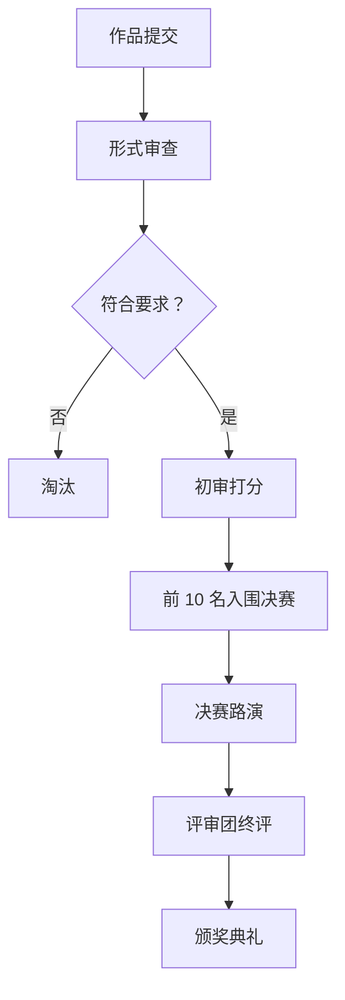

# ProCyc Skill Hackathon 2026 活动方案

**活动名称**: ProCyc Skill Hackathon 2026 - 智能维修·创享未来
**活动时间**: 2026 年 4 月 15 日 - 5 月 15 日
**活动状态**: ⏳ 策划中

## 一、活动概述

### 1.1 活动目标

- 🎯 激发开发者创新活力，丰富 ProCyc Skill 生态
- 🌟 发掘高质量技能和优秀开发者
- 💡 促进 3C 维修领域的技术创新
- 🤝 构建活跃的开发者社区

### 1.2 活动主题

**"智能维修·创享未来"**

鼓励开发者基于 ProCyc Skill 开发创新应用，包括但不限于：

- AI 驱动的智能诊断工具
- 基于大数据的估值模型
- 创新的配件匹配算法
- 智能客服和自动化服务
- 维修知识图谱应用
- AR/VR 维修辅助工具

## 二、参赛要求

### 2.1 参赛资格

- 面向全球所有开发者（个人或团队）
- 团队人数不超过 5 人
- 必须使用至少一个 ProCyc Skill
- 作品必须开源并遵循 MIT 许可证

### 2.2 作品分类

**A 类：技能开发组**

- 开发全新的 ProCyc Skill
- 对现有技能进行重大改进
- 多语言版本的技能移植

**B 类：应用创新组**

- 基于 ProCyc Skill 的应用程序
- 智能体工作流设计
- 集成解决方案

**C 类：工具增强组**

- CLI 工具增强
- 测试框架优化
- 文档和示例改进

### 2.3 技术要求

**必备条件**：

- ✅ 至少集成 1 个 ProCyc Skill
- ✅ 代码托管在 GitHub
- ✅ 提供完整的 README 文档
- ✅ 包含测试用例
- ✅ 符合 ProCyc Skill 规范

**推荐技术栈**：

- TypeScript / JavaScript / Python
- Next.js / React（前端）
- Node.js / FastAPI（后端）
- Supabase / PostgreSQL（数据库）

## 三、赛程安排

### 3.1 时间安排

```
┌──────────────────────────────────────────────────────┐
│  报名期        │ 4 月 15 日 - 4 月 30 日 (16 天)          │
├──────────────────────────────────────────────────────┤
│  开发期        │ 4 月 15 日 - 5 月 10 日 (26 天)          │
├──────────────────────────────────────────────────────┤
│  提交截止      │ 5 月 10 日 23:59 (UTC+8)              │
├──────────────────────────────────────────────────────┤
│  初审期        │ 5 月 11 日 - 5 月 12 日 (2 天)           │
├──────────────────────────────────────────────────────┤
│  决赛展示      │ 5 月 15 日 (线上直播)                 │
├──────────────────────────────────────────────────────┤
│  颁奖典礼      │ 5 月 15 日晚 20:00 (UTC+8)            │
└──────────────────────────────────────────────────────┘
```

### 3.2 重要节点

| 日期          | 时间  | 活动                           |
| ------------- | ----- | ------------------------------ |
| 4 月 15 日    | 10:00 | 开幕式暨线上说明会             |
| 4 月 20 日    | 19:00 | 第一期技术培训：Skill 开发入门 |
| 4 月 25 日    | 19:00 | 第二期技术培训：高级集成技巧   |
| 4 月 30 日    | 23:59 | 报名截止                       |
| 5 月 5 日     | -     | 中期进度检查（可选）           |
| 5 月 10 日    | 23:59 | 作品提交截止                   |
| 5 月 11-12 日 | -     | 评审团初审                     |
| 5 月 13 日    | 10:00 | 公布入围决赛名单（Top 10）     |
| 5 月 15 日    | 14:00 | 决赛路演（线上）               |
| 5 月 15 日    | 20:00 | 颁奖典礼                       |

## 四、奖项设置

### 4.1 现金奖励

**总奖金池**: $15,000 USD

#### A 类：技能开发组

- 🥇 **金奖** (1 名): $3,000 + 证书 + ProCyc 年度会员
- 🥈 **银奖** (2 名): $1,500 + 证书 + ProCyc 半年会员
- 🥉 **铜奖** (3 名): $800 + 证书 + ProCyc 季度会员
- 🏅 **优秀奖** (4 名): $300 + 证书

#### B 类：应用创新组

- 🥇 **金奖** (1 名): $2,500 + 证书 + ProCyc 年度会员
- 🥈 **银奖** (2 名): $1,200 + 证书 + ProCyc 半年会员
- 🥉 **铜奖** (3 名): $600 + 证书 + ProCyc 季度会员

#### C 类：工具增强组

- 🏆 **最佳贡献奖** (2 名): $1,000 + 证书 + ProCyc 半年会员
- 🌟 **创新奖** (2 名): $500 + 证书

### 4.2 特别奖励

**FCX 积分奖励**：

- 所有参赛者获得 500 FCX
- 入围决赛额外获得 1000 FCX
- 获奖者按名次获得 2000-5000 FCX

**流量扶持**：

- 获奖作品在 ProCyc 首页展示一个月
- 官方社交媒体专题报道
- 邀请参加 ProCyc 开发者大会

**其他福利**：

- 免费使用 ProCyc 高级 API 一年
- 获得 ProCyc 认证徽章
- 优先推荐给投资机构和合作伙伴

## 五、评审标准

### 5.1 评分维度

**技术性 (40%)**：

- 代码质量和架构设计
- 技术创新性和难度
- 性能优化程度
- 测试覆盖率

**实用性 (30%)**：

- 解决实际问题能力
- 用户体验
- 应用场景广泛性
- 商业价值潜力

**完整性 (20%)**：

- 功能完整度
- 文档质量
- 示例代码可用性
- 部署便捷性

**创新性 (10%)**：

- 创意新颖程度
- 差异化竞争优势
- 填补生态空白

### 5.2 评审流程



### 5.3 评审团组成

- ProCyc 技术负责人 (30%)
- 行业专家 (30%)
- 社区代表 (20%)
- 用户代表 (20%)

## 六、活动宣传

### 6.1 宣传渠道

**线上渠道**：

- GitHub 首页 Banner
- ProCyc 官方网站
- 开发者社区（掘金、思否、知乎）
- 技术公众号推送
- Twitter / LinkedIn
- Discord / Slack 技术社群

**线下渠道**：

- 高校计算机社团合作
- 技术沙龙宣讲
- 开发者大会宣传

### 6.2 宣传节奏

**预热期 (4 月 1 日 -4 月 14 日)**：

- 发布活动预告
- 悬念海报系列
- KOL 转发造势

**爆发期 (4 月 15 日 -4 月 30 日)**：

- 开幕式直播
- 参赛者故事专访
- 每日倒计时海报

**持续期 (5 月 1 日 -5 月 10 日)**：

- 参赛作品展示
- 网络投票（人气奖）
- 技术分享文章

**高潮期 (5 月 11 日 -5 月 15 日)**：

- 决赛路演直播
- 颁奖典礼
- 获奖作品展示

## 七、技术支持

### 7.1 培训资源

**线上培训课程**：

1. ProCyc Skill 开发入门（2 小时）
2. 高级集成技巧和最佳实践（2 小时）
3. 测试和部署实战（1.5 小时）
4. 优秀作品案例解析（1.5 小时）

**文档资源**：

- 快速入门指南
- API 参考文档
- 常见问题 FAQ
- 视频教程系列

### 7.2 答疑支持

**答疑渠道**：

- 💬 Discord 专属频道
- 📧 专用邮箱：hackathon@procyc.com
- 🐛 GitHub Issues（标签：hackathon）
- 📱 微信群/QQ 群

**导师制度**：

- 为每个参赛团队分配一名导师
- 每周至少一次一对一辅导
- 技术方案评审和优化建议

## 八、组织架构

### 8.1 组织委员会

**主席**: ProCyc CEO
**执行主席**: ProCyc CTO
**成员**: 各部门负责人

### 8.2 工作小组

**技术组**：

- 负责技术培训和答疑
- 评审系统开发和维护
- 参赛作品的技术审查

**运营组**：

- 活动策划和执行
- 宣传推广
- 参赛者服务和沟通

**评审组**：

- 制定评审标准
- 组织评审工作
- 处理申诉和争议

**后勤组**：

- 奖品和证书准备
- 直播平台搭建
- 嘉宾邀请和接待

## 九、预算规划

### 9.1 支出预算

| 项目       | 金额 (USD)  | 占比     |
| ---------- | ----------- | -------- |
| 奖金       | $15,000     | 62.5%    |
| 宣传推广   | $3,000      | 12.5%    |
| 直播平台   | $2,000      | 8.3%     |
| 设计和物料 | $1,500      | 6.3%     |
| 嘉宾邀请   | $1,000      | 4.2%     |
| 备用金     | $1,500      | 6.2%     |
| **总计**   | **$24,000** | **100%** |

### 9.2 收入来源

- ProCyc 公司赞助：$20,000
- 合作伙伴赞助：$4,000
- 社区众筹：待启动

## 十、风险管理

### 10.1 潜在风险

**参赛作品不足**：

- 对策：加大宣传力度
- 对策：延长报名时间
- 对策：邀请知名团队参赛

**技术问题**：

- 对策：提前测试直播平台
- 对策：准备备用方案
- 对策：技术团队全程待命

**评审争议**：

- 对策：制定详细评审规则
- 对策：多元化评审团
- 对策：设立申诉机制

### 10.2 应急预案

**疫情因素**：

- 全部转为线上进行
- 调整时间表
- 增加线上互动环节

**技术故障**：

- 准备录播内容
- 延迟播出机制
- 多渠道直播备份

## 十一、成功指标

### 11.1 短期指标

- ✅ 参赛队伍 ≥ 50 支
- ✅ 参赛作品 ≥ 40 个
- ✅ 新增开发者 ≥ 200 人
- ✅ 新增技能 ≥ 20 个
- ✅ 活动曝光量 ≥ 100,000 次

### 11.2 长期指标

- 📈 赛后 3 个月活跃开发者 ≥ 100 人
- 📈 获奖作品商业化率 ≥ 30%
- 📈 生态合作伙伴 ≥ 10 家
- 📈 媒体曝光量 ≥ 500,000 次

## 十二、附录

### 12.1 报名表模板

```markdown
## Hackathon 报名表

### 团队信息

- 团队名称：
- 团队成员（1-5 人）：
  - 队长：姓名，GitHub，角色
  - 成员 2：姓名，GitHub，角色
  - ...
- 联系方式：邮箱/微信

### 参赛信息

- 参赛组别：A/B/C
- 作品名称：
- 作品简介（100 字以内）：
- 拟使用的 ProCyc Skill：
- 技术栈：
- GitHub 仓库：（可后续补充）

### 其他信息

- 如何得知本活动：
- 是否有 ProCyc 开发经验：是/否
- 是否需要导师指导：是/否
```

### 12.2 提交作品清单

- [ ] 源代码（GitHub 仓库）
- [ ] README.md（包含安装和使用说明）
- [ ] 演示视频（3-5 分钟）
- [ ] 在线 Demo（如有）
- [ ] 技术文档
- [ ] 测试报告
- [ ] 商业计划书（可选）

---

**活动主办方**: ProCyc Core Team
**联系方式**: hackathon@procyc.com
**官方网站**: https://procyc.com/hackathon-2026
**活动协议**: 参赛者需同意《活动规则》和《隐私政策》

---

**版本**: v1.0
**最后更新**: 2026-03-03
**下次审查**: 2026-03-10
