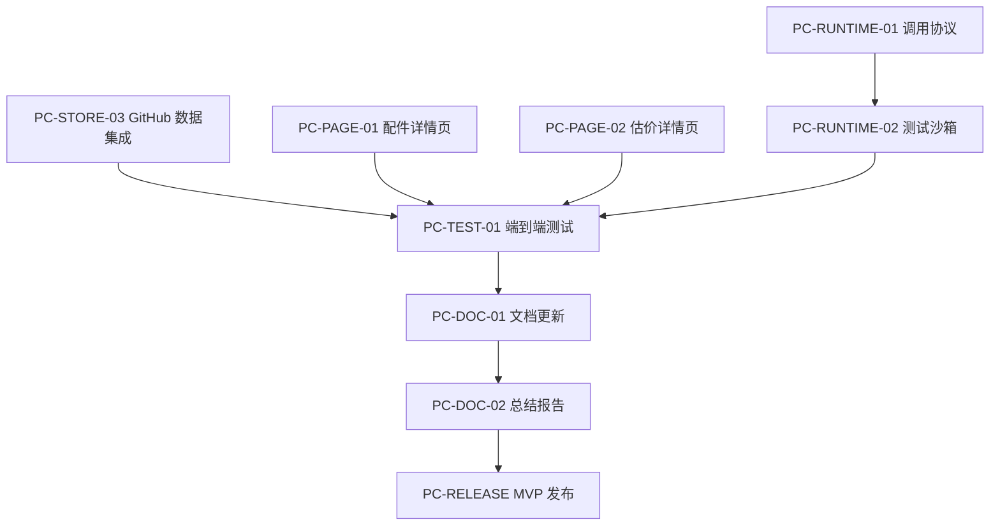

# ProCyc Skill 商店 - 阶段二收尾原子任务清单

**版本**: 2.0
**创建日期**: 2026-03-03
**上次更新**: 2026-03-03
**状态**: 🔄 进行中（阶段二核心技能已完成，进入 MVP 收尾）
**优先级**: P0 - 功能完善与正式发布

---

## 任务概览

### 已完成任务 ✅

| 任务 ID     | 任务名称                           | 完成日期   | 状态      |
| ----------- | ---------------------------------- | ---------- | --------- |
| PC-SKILL-01 | 开发 `procyc-find-shop` 技能       | 2026-03-02 | ✅ 已完成 |
| PC-SKILL-02 | 开发 `procyc-fault-diagnosis` 技能 | 2026-03-03 | ✅ 已完成 |
| PC-SKILL-03 | 开发 `procyc-part-lookup` 技能     | 2026-03-03 | ✅ 已完成 |
| PC-SKILL-04 | 开发 `procyc-estimate-value` 技能  | 2026-03-03 | ✅ 已完成 |
| PC-STORE-01 | 构建商店静态网站                   | 2026-03-03 | ✅ 已完成 |
| PC-STORE-02 | 实现技能搜索与过滤                 | 2026-03-03 | ✅ 已完成 |

### 待办任务 📝

#### 第三组：功能完善（W13）

| 任务 ID     | 任务名称           | 优先级 | 预计工时 | 依赖        | 状态      |
| ----------- | ------------------ | ------ | -------- | ----------- | --------- |
| PC-STORE-03 | 集成 GitHub 数据   | P1     | 2 天     | PC-STORE-01 | ✅ 已完成 |
| PC-PAGE-01  | 完善配件查询详情页 | P1     | 1 天     | PC-SKILL-03 | ✅ 已完成 |
| PC-PAGE-02  | 完善设备估价详情页 | P1     | 1 天     | PC-SKILL-04 | ✅ 已完成 |

#### 第四组：运行时与测试（W13-W14）

| 任务 ID       | 任务名称         | 优先级 | 预计工时 | 依赖          | 状态      |
| ------------- | ---------------- | ------ | -------- | ------------- | --------- |
| PC-RUNTIME-01 | 设计技能调用协议 | P0     | 3 天     | PC-SPEC-01    | ⏳ 待启动 |
| PC-RUNTIME-02 | 开发技能测试沙箱 | P1     | 3 天     | PC-RUNTIME-01 | ⏳ 待启动 |
| PC-TEST-01    | 端到端测试       | P0     | 2 天     | 所有页面      | ⏳ 待启动 |

#### 第五组：文档与发布（W14）

| 任务 ID    | 任务名称           | 优先级 | 预计工时 | 依赖            | 状态      |
| ---------- | ------------------ | ------ | -------- | --------------- | --------- |
| PC-DOC-01  | 更新技术文档       | P0     | 1 天     | 所有功能完成    | ⏳ 待启动 |
| PC-DOC-02  | 生成阶段二总结报告 | P0     | 1 天     | PC-DOC-01       | ⏳ 待启动 |
| PC-RELEASE | MVP 版本发布       | P0     | 1 天     | PC-TEST-01 通过 | ⏳ 待启动 |

---

## 详细任务说明

### PC-STORE-03: 集成 GitHub 数据

**任务描述**: 从 GitHub API 获取技能仓库的元数据（星标、下载量、更新时间等），并在商店页面展示。

**实现步骤**:

1. **创建 GitHub API 服务层**

   ```typescript
   // src/lib/github/api.ts
   interface GitHubRepoData {
     stargazers_count: number;
     forks_count: number;
     subscribers_count: number;
     updated_at: string;
     created_at: string;
     description: string;
     homepage: string;
     language: string;
     topics: string[];
   }

   async function fetchRepoData(
     owner: string,
     repo: string
   ): Promise<GitHubRepoData>;
   ```

2. **实现数据缓存机制**（避免频繁调用 GitHub API）

   ```typescript
   // src/lib/github/cache.ts
   const CACHE_TTL = 5 * 60 * 1000; // 5 分钟

   async function getCachedRepoData(repo: string): Promise<GitHubRepoData>;
   ```

3. **更新技能卡片组件**

   ```tsx
   // src/components/skill/SkillCard.tsx
   interface SkillCardProps {
     name: string;
     githubStats?: {
       stars: number;
       forks: number;
       lastUpdated: string;
     };
   }
   ```

4. **在技能详情页展示 GitHub 徽章**
   ```tsx
   // 使用 shields.io 或自定义徽章
   
   ```

**技术要求**:

- GitHub API 速率限制处理（未认证：60 次/小时）
- 错误处理和降级方案（API 失败时显示默认值）
- 服务端渲染（SSR）或增量静态生成（ISR）

**验收标准**:

- [ ] 所有技能卡片显示星标数
- [ ] 技能详情页显示完整的 GitHub 统计信息
- [ ] API 失败时不影响页面正常访问
- [ ] 数据每 5 分钟自动更新

**预计工时**: 2 天

---

### PC-PAGE-01: 完善配件查询详情页

**任务描述**: 为 `procyc-part-lookup` 技能创建完整的详情页面，参考已完成的 `find-shop` 和 `fault-diagnosis` 页面。

**页面结构**:

```tsx
// src/app/skill-store/part-lookup/page.tsx
- Hero Section（技能标题、图标、分类标签）
- 功能特性介绍
- 代码示例（JavaScript + Python）
- API 参数表格
- 响应格式说明
- 使用场景案例
- 相关技能推荐
```

**内容要点**:

- 突出配件兼容性查询的核心功能
- 展示多维度筛选能力（分类、价格、库存）
- 强调智能排序功能
- 提供实际使用示例

**验收标准**:

- [ ] 页面结构与现有详情页一致
- [ ] 包含完整的 API 使用示例
- [ ] 响应式设计良好
- [ ] SEO 优化到位

**预计工时**: 1 天

---

### PC-PAGE-02: 完善设备估价详情页

**任务描述**: 为 `procyc-estimate-value` 技能创建完整的详情页面。

**页面结构**:

```tsx
// src/app/skill-store/estimate-value/page.tsx
- Hero Section
- 估值算法介绍
- 数据来源说明
- 代码示例
- API 参数
- 响应格式
- 准确率声明
```

**内容要点**:

- 强调多维度估值算法
- 说明市场价格对比功能
- 展示详细的估值分解报告
- 提及 FCX 定价支持

**验收标准**:

- [ ] 页面完整且美观
- [ ] 技术细节准确
- [ ] 示例代码可运行
- [ ] 与其他页面风格一致

**预计工时**: 1 天

---

### PC-RUNTIME-01: 设计技能调用协议

**任务描述**: 定义标准化的技能调用协议，包括 HTTP API 和本地库两种调用方式。

**输出文档**: `docs/standards/procyc-skill-runtime-protocol.md`

**核心内容**:

1. **统一请求格式**

   ```typescript
   interface SkillInvocationRequest {
     skillName: string;
     version: string;
     action: 'execute' | 'validate' | 'getMetadata';
     parameters: Record<string, any>;
     context?: {
       userId?: string;
       apiKey?: string;
       timestamp: number;
     };
   }
   ```

2. **统一响应格式**

   ```typescript
   interface SkillInvocationResponse {
     success: boolean;
     data?: any;
     error?: {
       code: string;
       message: string;
       details?: any;
     };
     metadata: {
       executionTimeMs: number;
       version: string;
       timestamp: number;
     };
   }
   ```

3. **HTTP API 规范**

   ```http
   POST /api/v1/skills/{skillName}/execute
   Content-Type: application/json
   Authorization: Bearer {access_token}

   {
     "version": "1.0.0",
     "parameters": {...}
   }
   ```

4. **本地库调用规范**

   ```typescript
   import skill from 'procyc-find-shop';
   const result = await skill.execute(params);
   ```

5. **错误码标准**
   ```typescript
   enum SkillErrorCode {
     INVALID_PARAMS = 'SKILL_001',
     UNAUTHORIZED = 'SKILL_002',
     RATE_LIMITED = 'SKILL_003',
     INTERNAL_ERROR = 'SKILL_004',
     NOT_FOUND = 'SKILL_005',
   }
   ```

**验收标准**:

- [ ] 文档完整且清晰
- [ ] 与现有技能实现一致
- [ ] 支持多种调用方式
- [ ] 错误处理完善

**预计工时**: 3 天

---

### PC-RUNTIME-02: 开发技能测试沙箱

**任务描述**: 提供一个 Web 页面，允许用户在线测试技能（需配置密钥）。

**页面结构**:

```tsx
// src/app/skill-store/sandbox/page.tsx
- 技能选择器
- 参数配置表单（根据技能元数据动态生成）
- 执行按钮
- 响应结果展示（JSON 格式化）
- 执行历史记录
- API Key 管理
```

**核心功能**:

1. **动态表单生成**

   ```typescript
   function generateParamForm(skillMetadata: SkillMeta): JSX.Element;
   ```

2. **实时执行**

   ```typescript
   async function executeSkillInSandbox(
     skillName: string,
     params: Record<string, any>,
     apiKey: string
   ): Promise<SkillResponse>;
   ```

3. **结果展示**
   - JSON 语法高亮
   - 执行时间显示
   - 错误信息友好提示

4. **安全控制**
   - API Key 验证
   - 速率限制
   - 敏感操作确认

**技术栈**:

- React Hook Form（表单管理）
- Monaco Editor（代码编辑）
- Prism.js（语法高亮）

**验收标准**:

- [ ] 支持所有已发布的技能
- [ ] 表单自动生成准确
- [ ] 执行结果实时反馈
- [ ] 安全措施到位

**预计工时**: 3 天

---

### PC-TEST-01: 端到端测试

**任务描述**: 对技能商店进行全面的端到端测试，确保所有功能正常工作。

**测试范围**:

1. **页面导航测试**
   - 首页加载
   - 分类筛选
   - 技能详情页跳转
   - 面包屑导航

2. **功能测试**
   - 搜索功能
   - 过滤器工作
   - 代码复制
   - 外部链接

3. **性能测试**
   - 页面加载速度
   - Lighthouse 评分
   - 首屏渲染时间

4. **兼容性测试**
   - Chrome/Firefox/Safari
   - 桌面/移动端
   - 暗色模式

**测试工具**:

- Playwright（E2E 测试）
- Lighthouse（性能测试）

**验收标准**:

- [ ] 所有页面正常访问
- [ ] 所有功能正常工作
- [ ] Lighthouse 评分 > 90
- [ ] 无严重 bug

**预计工时**: 2 天

---

### PC-DOC-01: 更新技术文档

**任务描述**: 根据阶段二的实施情况，更新相关技术文档。

**需要更新的文档**:

1. **核心规范**
   - [ ] `docs/standards/procyc-skill-spec.md` - 如有更新
   - [ ] `docs/standards/procyc-skill-classification.md` - 添加新技能分类

2. **项目文档**
   - [ ] `docs/project-planning/procyc-skill-store-development-plan.md` - 更新完成情况
   - [ ] `docs/project-planning/procyc-phase2-atomic-tasks.md` - 标记完成任务

3. **新增文档**
   - [ ] `docs/standards/procyc-skill-runtime-protocol.md` - 运行时协议（PC-RUNTIME-01）
   - [ ] `PROCYSKILL_OVERVIEW.md` - 更新项目概览

4. **README 文件**
   - [ ] `README.md` - 更新项目简介
   - [ ] `QUICKSTART_SKILL.md` - 添加新技能示例

**验收标准**:

- [ ] 所有文档更新完成
- [ ] 文档之间链接正确
- [ ] 示例代码可运行
- [ ] 拼写和格式检查通过

**预计工时**: 1 天

---

### PC-DOC-02: 生成阶段二总结报告

**任务描述**: 创建详细的阶段二完成报告，记录所有成果和经验教训。

**报告结构**: `reports/procyc/phase2-final-report.md`

**核心章节**:

1. **执行摘要**
   - 完成情况概览
   - 关键指标达成
   - 里程碑回顾

2. **技能开发成果**
   - 4 个核心技能详细介绍
   - 技术指标对比
   - 代码质量统计

3. **商店建设成果**
   - 页面截图展示
   - 功能清单
   - 用户体验优化

4. **技术创新点**
   - 知识库驱动的诊断引擎
   - 亚毫秒级响应优化
   - 智能症状匹配算法

5. **经验教训**
   - 成功经验总结
   - 遇到的挑战与解决方案
   - 改进建议

6. **下一步计划**
   - 阶段三规划预览
   - 近期优化重点

**验收标准**:

- [ ] 报告内容详实
- [ ] 数据统计准确
- [ ] 图表清晰美观
- [ ] 经验总结有价值

**预计工时**: 1 天

---

### PC-RELEASE: MVP 版本发布

**任务描述**: 正式发布 ProCyc Skill 商店 MVP 版本。

**发布清单**:

1. **代码发布**
   - [ ] Git 标签：v2.0.0-mvp
   - [ ] 提交最终代码审查
   - [ ] 合并到主分支

2. **技能包发布**
   - [ ] `procyc-find-shop` @1.0.0 → npm/pypi
   - [ ] `procyc-fault-diagnosis` @1.0.0 → npm/pypi
   - [ ] `procyc-part-lookup` @1.0.0 → npm/pypi
   - [ ] `procyc-estimate-value` @1.0.0 → npm/pypi

3. **文档发布**
   - [ ] 更新 GitHub Pages
   - [ ] 同步到社区论坛
   - [ ] 发送开发者邮件

4. **部署验证**
   - [ ] Vercel 部署检查
   - [ ] CDN 刷新
   - [ ] DNS 配置验证

5. **宣传推广**
   - [ ] 撰写博客文章
   - [ ] 社交媒体推广
   - [ ] 开发者社区分享

**成功指标**:

- 商店访问量 ≥ 1000 PV/天
- 技能安装量 ≥ 500 次
- 开发者满意度 ≥ 4.5/5
- 零严重 bug 报告

**预计工时**: 1 天

---

## 任务依赖关系



---

## 执行计划

### 第一周（W13）

**周一**:

- 启动 PC-STORE-03（GitHub 数据集成）
- 创建 GitHub API 服务层

**周二**:

- 完成 PC-STORE-03
- 启动 PC-PAGE-01（配件详情页）

**周三**:

- 完成 PC-PAGE-01
- 启动 PC-PAGE-02（估价详情页）

**周四**:

- 完成 PC-PAGE-02
- 启动 PC-RUNTIME-01（调用协议设计）

**周五**:

- 继续 PC-RUNTIME-01
- 开始编写协议文档

**周末**:

- 完成 PC-RUNTIME-01 初稿

### 第二周（W14）

**周一**:

- 完成 PC-RUNTIME-01 评审
- 启动 PC-RUNTIME-02（测试沙箱）

**周二**:

- 继续 PC-RUNTIME-02
- 实现动态表单生成

**周三**:

- 完成 PC-RUNTIME-02
- 启动 PC-TEST-01（端到端测试）

**周四**:

- 完成 PC-TEST-01
- 启动 PC-DOC-01（文档更新）

**周五**:

- 完成 PC-DOC-01
- 启动 PC-DOC-02（总结报告）

**周末**:

- 完成 PC-DOC-02
- 准备 MVP 发布

### 第三周（W15）

**周一**:

- 执行 PC-RELEASE（MVP 发布）
- 监控发布状态
- 收集用户反馈

---

## 资源配置

### 人力资源

- **前端开发**: 2 人（商店页面 + 沙箱）
- **后端开发**: 1 人（GitHub 数据集成 + 运行时协议）
- **文档工程师**: 1 人（技术文档 + 总结报告）
- **测试工程师**: 1 人（端到端测试）

### 技术资源

- GitHub API Token（用于提高速率限制）
- Vercel 部署环境
- npm/pypi 发布账号
- 测试服务器资源

---

## 风险管理

| 风险                   | 可能性 | 影响 | 缓解措施                       |
| ---------------------- | ------ | ---- | ------------------------------ |
| GitHub API 速率限制    | 中     | 低   | 使用缓存 + 认证 Token          |
| 技能详情页内容不完整   | 低     | 中   | 复用现有模板，快速填充内容     |
| 测试沙箱安全问题       | 中     | 高   | 严格的 API Key 验证 + 速率限制 |
| 文档更新滞后           | 高     | 低   | 指定专人负责，设置检查点       |
| MVP 发布后出现严重 bug | 低     | 高   | 充分的测试 + 快速回滚机制      |

---

## 成功标准

### 功能完整性

- ✅ 所有计划功能 100% 实现
- ✅ 4 个核心技能全部可用
- ✅ 商店页面完整美观
- ✅ 测试沙箱可正常运行

### 技术指标

- 页面加载时间 < 2 秒
- Lighthouse 评分 > 90
- API 响应时间 < 500ms
- 测试覆盖率 > 85%

### 用户体验

- 导航清晰直观
- 响应式设计完美适配
- 代码示例易于理解
- 文档详尽易懂

### 业务目标

- 技能安装量 ≥ 500 次
- 日活跃用户 ≥ 100 人
- 开发者满意度 ≥ 4.5/5
- 零严重 bug 报告

---

## 附录

### A. 相关文件

- [阶段二原子任务清单](./procyc-phase2-atomic-tasks.md)
- [技能规范文档](../standards/procyc-skill-spec.md)
- [快速启动指南](../../QUICKSTART_SKILL.md)

### B. 代码仓库

- [CLI 工具](../../tools/procyc-cli/)
- [技能模板](../../templates/skill-template/)
- [find-shop 技能](../../procyc-find-shop/)
- [fault-diagnosis 技能](../../procyc-fault-diagnosis/)
- [part-lookup 技能](../../procyc-part-lookup/)
- [estimate-value 技能](../../procyc-estimate-value/)

### C. 联系人

- **项目负责人**: ProCyc Core Team
- **技术支持**: tech@procyc.com
- **产品咨询**: product@procyc.com

---

**文档维护**: ProCyc Core Team
**最后更新**: 2026-03-03
**下次审查**: 2026-03-10
**版本**: v2.0
