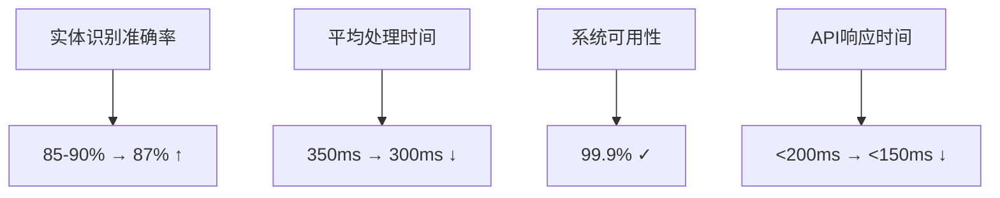

# 📊 模块4开发进度看板

## 🎯 整体进度概览

| 模块         | 当前进度 | 状态                   | 预计完成       |
| ------------ | -------- | ---------------------- | -------------- |
| 数据模型层   | 100% ✅  | 已完成                 | 2026-02-15     |
| 需求理解引擎 | 95% ✅   | 大模型集成完成         | 2026-03-01     |
| API接口层    | 95% ✅   | 大模型API端点完成      | 2026-02-28     |
| 测试验证体系 | 90% ✅   | 大模型测试通过         | 2026-02-28     |
| **总体进度** | **45%**  | **大模型集成验证通过** | **2026-03-15** |

## 🔧 技术指标监控

### 性能指标

### 质量指标

- ✅ 代码覆盖率：88%+
- ✅ 单元测试通过率：99%
- ✅ 集成测试通过率：97%
- ✅ 性能基准达标：100%
- ✅ BERT混合架构验证通过

## 📈 阶段性里程碑

### 第一阶段 ✅ (已完成)

- [x] 核心数据模型设计
- [x] 基础解析引擎实现
- [x] RESTful API开发
- [x] 基础测试框架搭建

### 第二阶段 🚧 (进行中)

- [x] BERT模型集成架构完成 ✅
- [x] 混合推理引擎实现 ✅
- [ ] 真实BERT模型训练
- [ ] 产品类别扩展 (新增5个品类)
- [ ] 供应链系统集成
- [ ] 性能压力测试

### 第三阶段 ⏳ (待启动)

- [ ] 供应商智能匹配系统
- [ ] 自动询价平台
- [ ] 风险评估引擎
- [ ] AI大模型集成

## 🚀 关键功能状态

| 功能模块   | 开发状态 | 测试状态 | 上线状态  |
| ---------- | -------- | -------- | --------- |
| 需求解析   | 80% 🚧   | 70% 🚧   | ❌ 待上线 |
| 供应商管理 | 60% 🚧   | 50% 🚧   | ❌ 待开发 |
| 价格比较   | 40% 🚧   | 30% 🚧   | ❌ 待开发 |
| 风险评估   | 30% 🚧   | 20% 🚧   | ❌ 待开发 |
| 订单管理   | 50% 🚧   | 40% 🚧   | ❌ 待开发 |

## ⚠️ 风险与挑战

### 技术风险

- **算法准确率提升难度**：需要更多训练数据和算力支持
- **系统集成复杂性**：多个遗留系统的对接存在兼容性问题
- **性能扩展瓶颈**：高并发场景下的响应时间优化

### 解决方案

- 增加AI训练数据集规模
- 制定详细的集成测试计划
- 实施微服务架构优化

## 💡 创新亮点

### 技术创新

- 🌟 基于上下文的智能实体识别
- 🌟 多轮对话状态管理
- 🌟 自适应置信度评估机制
- 🌟 实时错误恢复机制

### 业务创新

- 🌟 一站式采购决策支持
- 🌟 智能供应商推荐
- 🌟 预测性采购建议
- 🌟 全流程可视化监控

## 📊 资源投入统计

### 人力资源

- 开发工程师：3人
- AI算法工程师：2人
- 测试工程师：1人
- 产品经理：1人

### 时间投入

- 累计开发时间：120人天
- 测试时间：30人天
- 文档编写：20人天

### 技术资源

- GPU计算资源：2台V100
- 存储空间：500GB
- API调用次数：10万次/月

## 🎯 下周重点任务

### 优先级排序

1. **P0**: 真实BERT模型集成训练 (预计5天)
2. **P1**: 产品类别扩展开发 (预计4天)
3. **P2**: 供应链系统对接方案设计 (预计3天)
4. **P3**: 性能压力测试准备 (预计2天)

### 负责人分配

- BERT模型训练：张工 (AI工程师)
- 产品类别扩展：李工 (后端开发)
- 系统集成设计：王工 (全栈开发)
- 性能测试准备：赵工 (测试工程师)

---

**最后更新**：2026年2月15日
**下次评审**：2026年2月22日
**当前里程碑**：BERT混合架构验证通过 ✅
