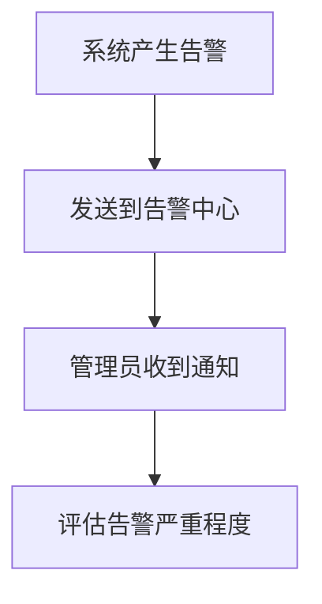

# 管理员角色指引 (Admin Role Guide)

## 🎯 角色概述

管理员拥有系统的最高权限，负责系统整体管理、用户管理和核心配置。

## ✅ 能做什么 (Can Do)

### 系统管理
- **用户管理**：创建、修改、删除所有用户账户
- **权限分配**：为用户分配角色和权限
- **系统配置**：修改全局系统设置和参数
- **数据管理**：访问和管理所有业务数据
- **日志查看**：查看完整的系统操作日志

### 监控运维
- **系统监控**：实时查看系统运行状态和性能指标
- **告警处理**：接收和处理系统告警
- **备份管理**：执行数据备份和恢复操作
- **版本升级**：部署系统更新和功能迭代

### 业务管理
- **工作流管理**：创建、修改、删除 n8n 工作流
- **数据分析**：访问所有业务报表和统计数据
- **财务管理**：查看和管理财务相关数据
- **合作伙伴管理**：管理合作商户和供应商关系

## ❌ 不能做什么 (Cannot Do)

### 安全限制
- **不得滥用权限**：不能超越职责范围进行操作
- **不得泄露敏感信息**：严禁向外透露系统密钥和用户隐私
- **不得绕过审计**：所有操作都会被记录和监控

### 操作规范
- **不得随意删除核心数据**：重要数据删除需要审批
- **不得私自修改系统架构**：重大变更需要团队讨论
- **不得忽视安全告警**：必须及时处理安全隐患

## 🔧 常用入口 (Common Entry Points)

### 核心管理页面
```
仪表板: /admin/dashboard
用户管理: /admin/users
权限管理: /admin/permissions
系统设置: /admin/settings
审计日志: /admin/audit-logs
```

### 监控工具
```
系统监控: /admin/monitoring
性能分析: /admin/analytics
告警中心: /admin/alerts
备份管理: /admin/backups
```

### 业务管理
```
工作流管理: /admin/workflows
数据报表: /admin/reports
财务管理: /admin/finance
合作伙伴: /admin/partners
```

## ⚠️ 报警处理流程 (Alert Handling Process)

### 1. 告警接收


### 2. 分级响应
- **紧急告警 (Critical)**：立即处理，30分钟内响应
- **重要告警 (High)**：2小时内处理
- **一般告警 (Medium)**：24小时内处理
- **提示告警 (Low)**：按计划处理

### 3. 处理步骤
```
1. 确认告警真实性
2. 分析根本原因
3. 制定解决方案
4. 执行修复操作
5. 验证修复效果
6. 记录处理过程
7. 更新预防措施
```

### 4. 常见告警处理
**系统性能告警：**
- 检查服务器资源使用情况
- 优化数据库查询
- 调整系统配置参数

**安全告警：**
- 立即封锁可疑IP
- 审查相关用户账户
- 加强安全防护措施

**数据异常告警：**
- 验证数据完整性
- 执行数据修复
- 检查业务逻辑

## 📋 日常工作清单

### 每日检查
- [ ] 查看系统运行状态
- [ ] 检查关键指标是否正常
- [ ] 处理待办告警事项
- [ ] 审核新增用户申请

### 每周任务
- [ ] 生成系统运行报告
- [ ] 备份重要数据
- [ ] 审查权限分配情况
- [ ] 优化系统性能配置

### 每月回顾
- [ ] 分析系统使用趋势
- [ ] 评估安全风险状况
- [ ] 规划系统改进方案
- [ ] 更新操作手册文档

## 🆘 紧急联系

遇到紧急情况时，请按以下优先级联系：
1. **系统崩溃**：立即联系技术支持团队
2. **安全事件**：同时通知安全部门和上级领导
3. **数据丢失**：启动应急预案，联系数据恢复专家

---
_最后更新：2026年2月21日_