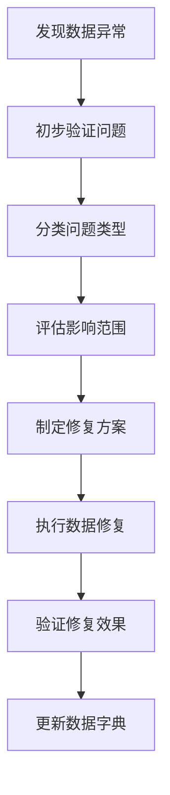

# 分析师角色指引 (Analyst Role Guide)

## 🎯 角色概述

分析师负责数据收集、分析和洞察挖掘，为业务决策提供数据支撑和专业建议。

## ✅ 能做什么 (Can Do)

### 数据分析

- **数据收集**：从各业务系统收集相关数据
- **数据清洗**：清理和标准化原始数据
- **统计分析**：运用统计方法分析业务指标
- **趋势预测**：基于历史数据预测未来趋势
- **异常检测**：识别数据中的异常模式和问题

### 报表制作

- **常规报表**：制作日报、周报、月报等标准报表
- **专题分析**：针对特定问题进行深度分析
- **可视化展示**：制作图表和仪表板直观展示数据
- **自动化报告**：建立自动化的数据报告机制

### 业务洞察

- **KPI监控**：持续监控关键业务指标变化
- **用户行为分析**：分析用户使用习惯和偏好
- **市场趋势研究**：跟踪行业动态和发展方向
- **竞品分析**：分析竞争对手的表现和策略

## ❌ 不能做什么 (Cannot Do)

### 数据安全

- **不能泄露敏感数据**：严格保护用户隐私和商业机密
- **不能篡改原始数据**：保持数据的真实性和完整性
- **不能越权访问**：只能访问工作所需的最小数据集

### 分析规范

- **不能主观臆断**：所有结论必须基于客观数据分析
- **不能隐瞒不利结果**：如实报告所有分析发现
- **不能超范围分析**：在授权范围内开展分析工作

## 🔧 常用入口 (Common Entry Points)

### 数据分析平台

```
数据分析门户: /analyst/dashboard
数据查询工具: /analyst/query
报表中心: /analyst/reports
可视化工具: /analyst/charts
```

### 专业工具

```
统计分析: /analyst/statistics
机器学习: /analyst/ml-models
数据挖掘: /analyst/data-mining
实验平台: /analyst/experiments
```

### 协作空间

```
项目管理: /analyst/projects
知识库: /analyst/knowledge-base
团队协作: /analyst/collaboration
成果展示: /analyst/presentations
```

## ⚠️ 数据异常处理流程 (Data Exception Handling Process)

### 1. 数据质量问题处理



### 2. 常见数据问题处理

**数据缺失：**

```
1. 识别缺失字段和记录
2. 分析缺失原因和规律
3. 选择合适的填充策略
4. 实施数据补全措施
5. 验证数据完整性
6. 建立预防机制
```

**数据不一致：**

```
1. 发现矛盾数据记录
2. 追溯数据来源差异
3. 确定权威数据源
4. 统一数据标准
5. 清洗不一致数据
6. 建立校验规则
```

**数据异常值：**

```
1. 识别离群数值
2. 分析异常产生原因
3. 判断是否为真实异常
4. 决定处理方式
5. 记录处理过程
6. 更新异常检测规则
```

### 3. 分析结果质疑处理

- **方法论质疑**：详细解释分析方法和假设前提
- **数据质疑**：提供数据来源和处理过程说明
- **结论质疑**：重新验证分析逻辑和计算过程
- **建议质疑**：补充论证依据和风险评估

## 📋 日常分析工作清单

### 每日任务

- [ ] 检查数据采集状态
- [ ] 监控关键指标变化
- [ ] 处理数据质量问题
- [ ] 更新常规报表
- [ ] 回复业务部门咨询

### 每周重点

- [ ] 制作周度分析报告
- [ ] 跟进专项分析项目
- [ ] 优化分析模型效果
- [ ] 参加跨部门会议
- [ ] 学习新技术方法

### 每月总结

- [ ] 编写月度分析报告
- [ ] 评估分析工具效果
- [ ] 总结业务洞察发现
- [ ] 规划下月工作重点
- [ ] 分享最佳实践经验

## 📊 核心分析技能要求

### 技术能力

```
统计学基础：假设检验、回归分析、时间序列
编程技能：Python/R、SQL、数据可视化
工具掌握：Excel、Tableau、Power BI
数据库知识：PostgreSQL、数据仓库概念
```

### 业务理解

```
行业知识：了解所在行业的特点和规律
业务流程：熟悉公司的业务运作模式
指标体系：掌握关键业务指标的含义
用户洞察：理解目标用户的需求和行为
```

### 分析思维

```
逻辑推理：严密的逻辑思维能力
批判性思维：质疑和验证分析结果
创新思维：探索新的分析角度和方法
沟通表达：清晰地传达分析发现
```

## 🎯 典型分析项目流程

### 1. 项目启动

```
需求理解 → 目标定义 → 资源评估 → 时间规划
```

### 2. 数据准备

```
数据识别 → 数据获取 → 数据清洗 → 数据整合
```

### 3. 分析执行

```
探索性分析 → 假设验证 → 模型构建 → 结果验证
```

### 4. 成果交付

```
报告撰写 → 可视化制作 → 结果演示 → 反馈收集
```

### 5. 项目总结

```
效果评估 → 经验总结 → 知识沉淀 → 流程优化
```

## 💡 分析质量提升建议

### 方法论改进

- 建立标准化分析流程
- 完善数据质量管理体系
- 引入先进的分析技术和工具
- 定期评审和更新分析方法

### 协作效率提升

- 建立跨部门沟通机制
- 共享分析模板和最佳实践
- 定期组织分析技能培训
- 建立知识管理和传承体系

### 价值创造优化

- 深入理解业务需求
- 主动发现业务机会点
- 提供前瞻性洞察建议
- 量化分析工作的业务价值

## 🆘 专业支持渠道

### 内部资源

- **数据工程团队**：协助数据获取和处理
- **业务部门**：提供业务背景和专业知识
- **技术架构师**：解决复杂技术问题
- **项目经理**：协调跨部门资源

### 外部学习

- **专业社区**：参与数据分析技术交流
- **学术资源**：关注前沿研究和方法论
- **行业会议**：了解行业最佳实践
- **认证考试**：提升专业资质水平

---

_最后更新：2026年2月21日_
