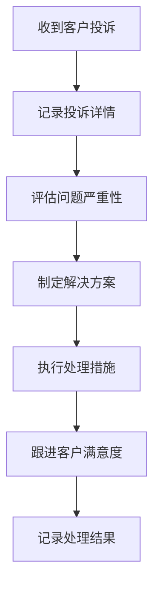

# 业务角色指引 (Biz Role Guide)

## 🎯 角色概述

业务人员负责日常业务运营、客户服务和商业决策支持，通过系统提升业务效率。

## ✅ 能做什么 (Can Do)

### 业务操作

- **客户管理**：维护客户信息和跟进记录
- **订单处理**：创建、修改、跟踪订单状态
- **产品管理**：维护商品信息和价格体系
- **库存管理**：监控库存水平和补货需求
- **促销活动**：策划和执行营销推广活动

### 数据分析

- **销售报表**：查看销售业绩和趋势分析
- **客户分析**：分析客户行为和偏好特征
- **市场洞察**：获取行业动态和竞争情报
- **绩效评估**：评估业务表现和改进机会

### 协作沟通

- **内部协作**：与其他部门协调业务需求
- **客户服务**：处理客户咨询和投诉
- **供应商沟通**：维护供应商关系和合作
- **团队管理**：指导和支持团队成员

## ❌ 不能做什么 (Cannot Do)

### 权限限制

- **不能修改系统配置**：业务人员无权更改系统设置
- **不能访问他人数据**：只能查看自己负责的客户信息
- **不能绕过审批流程**：重要业务决策需要按规定流程执行

### 操作规范

- **不能泄露客户信息**：严格遵守数据保护规定
- **不能虚假录入数据**：确保业务数据的真实性和准确性
- **不能擅自承诺客户**：超出权限范围的承诺需要上级批准

## 🔧 常用入口 (Common Entry Points)

### 业务管理中心

```
工作台: /biz/dashboard
客户管理: /biz/customers
订单管理: /biz/orders
产品管理: /biz/products
库存管理: /biz/inventory
```

### 数据分析工具

```
销售报表: /biz/reports/sales
客户分析: /biz/reports/customers
业绩看板: /biz/reports/performance
市场分析: /biz/reports/market
```

### 协作平台

```
任务管理: /biz/tasks
消息中心: /biz/messages
文档共享: /biz/documents
会议安排: /biz/meetings
```

## ⚠️ 业务异常处理流程 (Business Exception Handling Process)

### 1. 客户投诉处理



### 2. 订单异常处理

```
订单状态异常 → 确认异常类型 → 联系相关部门 →
制定处理方案 → 执行纠正措施 → 通知客户 → 记录处理过程
```

### 3. 库存预警响应

**库存不足：**

```
1. 收到库存预警通知
2. 确认实际库存情况
3. 联系采购部门补货
4. 通知销售团队调整策略
5. 跟踪补货进度
6. 更新库存预测
```

**库存积压：**

```
1. 分析积压原因
2. 制定清仓计划
3. 调整采购策略
4. 优化库存结构
5. 监控改善效果
```

### 4. 系统问题上报

- **业务功能异常**：立即联系技术支持
- **数据展示错误**：记录具体问题并上报
- **操作流程中断**：启用备用处理方案
- **性能明显下降**：及时反馈用户体验问题

## 📋 日常业务清单

### 每日工作

- [ ] 查看当日业务目标
- [ ] 处理待办客户事务
- [ ] 跟进重要订单状态
- [ ] 更新客户沟通记录
- [ ] 完成销售数据录入

### 每周重点

- [ ] 分析销售业绩达成情况
- [ ] 制定下周工作计划
- [ ] 跟进重点项目进展
- [ ] 参加业务例会讨论
- [ ] 更新客户档案信息

### 每月总结

- [ ] 评估月度目标完成度
- [ ] 分析业务发展趋势
- [ ] 识别改进机会点
- [ ] 制定下月行动计划
- [ ] 准备业务汇报材料

## 📊 关键业务指标

### 销售指标

```
销售额增长率
客户转化率
客单价水平
复购率表现
市场份额占比
```

### 客户指标

```
客户满意度评分
客户留存率
新客户获取成本
客户生命周期价值
服务响应时效
```

### 运营效率

```
订单处理时效
库存周转率
人均产出效率
流程标准化程度
数字化覆盖率
```

## 💡 业务优化建议

### 提升客户体验

- 个性化服务推荐
- 简化操作流程
- 提供多渠道支持
- 建立客户反馈机制

### 优化内部协作

- 明确职责分工
- 建立沟通标准
- 共享业务知识
- 定期经验分享

### 数据驱动决策

- 建立指标体系
- 定期数据分析
- 识别业务规律
- 预测市场趋势

## 🆘 业务支持渠道

### 内部支持

- **技术支持**：解决系统使用问题
- **培训部门**：提供业务技能培训
- **法务合规**：审核合同和政策
- **财务部门**：处理账务和结算

### 外部资源

- **行业协会**：获取行业最新资讯
- **培训机构**：参加专业能力提升
- **咨询公司**：获得战略发展建议
- **同行交流**：学习最佳实践经验

---

_最后更新：2026年2月21日_
