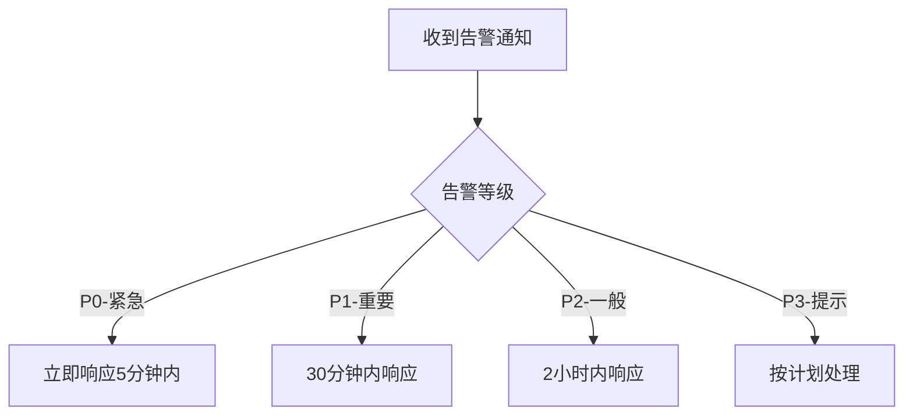

# 运维角色指引 (Ops Role Guide)

## 🎯 角色概述

运维人员负责系统的日常维护、监控和故障处理，确保系统稳定运行。

## ✅ 能做什么 (Can Do)

### 系统运维
- **监控值守**：7×24小时监控系统运行状态
- **故障排查**：快速定位和解决系统故障
- **性能优化**：持续优化系统性能和响应速度
- **容量规划**：监控资源使用情况，规划扩容方案
- **灾备演练**：定期执行备份恢复演练

### 部署维护
- **环境部署**：部署和维护开发、测试、生产环境
- **版本发布**：执行系统版本更新和补丁安装
- **配置管理**：维护系统配置和环境变量
- **服务启停**：管理各类服务的启动、停止和重启

### 安全运维
- **安全监控**：监控系统安全状态和异常访问
- **漏洞修复**：及时应用安全补丁和修复程序
- **访问控制**：管理服务器和数据库访问权限
- **日志分析**：分析系统日志，识别潜在问题

## ❌ 不能做什么 (Cannot Do)

### 权限限制
- **不能修改业务数据**：除非经过审批的紧急修复
- **不能更改核心配置**：重大配置变更需要审批
- **不能绕过安全检查**：必须遵循安全操作规程

### 操作约束
- **不能擅自停机**：系统维护需要提前通知和安排
- **不能忽略告警**：所有告警都需要及时响应和处理
- **不能使用弱密码**：必须使用强密码和密钥管理

## 🔧 常用入口 (Common Entry Points)

### 监控系统
```
监控大盘: /admin/monitoring/dashboard
告警中心: /admin/monitoring/alerts
性能分析: /admin/monitoring/performance
资源监控: /admin/monitoring/resources
```

### 运维工具
```
部署管理: /admin/deployments
配置中心: /admin/configurations
日志查询: /admin/logs
备份管理: /admin/backups
```

### 系统管理
```
服务器管理: /admin/servers
容器管理: /admin/containers
网络监控: /admin/network
安全中心: /admin/security
```

## ⚠️ 报警处理流程 (Alert Handling Process)

### 1. 告警分类响应


### 2. 故障处理标准流程
```
接收告警 → 确认告警 → 分析影响 → 制定方案 → 执行修复 → 验证恢复 → 记录总结
```

### 3. 常见故障处理

**服务器故障：**
```
1. 确认故障服务器
2. 检查硬件状态
3. 查看系统日志
4. 尝试重启服务
5. 必要时切换备用节点
6. 记录故障原因
```

**数据库问题：**
```
1. 检查连接状态
2. 查看慢查询日志
3. 分析锁等待情况
4. 优化查询语句
5. 必要时重启数据库
6. 验证数据一致性
```

**网络异常：**
```
1. 检查网络连通性
2. 分析流量峰值
3. 查看防火墙规则
4. 检查DNS解析
5. 验证CDN状态
6. 联系网络服务商
```

### 4. 升级处理机制
- **一级故障**：值班人员独立处理
- **二级故障**：需要团队协作解决
- **三级故障**：需要上报管理层协调
- **四级故障**：需要外部厂商支持

## 📋 日常运维清单

### 每小时检查
- [ ] 系统可用性监控
- [ ] 关键服务状态检查
- [ ] 资源使用率监控
- [ ] 待处理告警查看

### 每日任务
- [ ] 系统健康检查报告
- [ ] 备份执行情况核查
- [ ] 安全日志分析
- [ ] 性能指标统计

### 每周例行
- [ ] 系统巡检完整执行
- [ ] 容量使用情况分析
- [ ] 安全漏洞扫描
- [ ] 运维文档更新

### 每月总结
- [ ] 系统稳定性分析
- [ ] 故障统计和复盘
- [ ] 优化建议提出
- [ ] 运维流程改进

## 🛠️ 常用运维命令

### Linux 系统监控
```bash
# 系统负载查看
top
htop

# 磁盘使用情况
df -h
du -sh /var/log/*

# 内存使用
free -h
cat /proc/meminfo

# 网络连接
netstat -tuln
ss -tuln
```

### Docker 容器管理
```bash
# 查看容器状态
docker ps -a
docker stats

# 容器日志查看
docker logs -f container_name
docker logs --since 1h container_name

# 容器资源使用
docker stats --no-stream
```

### 数据库运维
```bash
# PostgreSQL 连接数
psql -c "SELECT count(*) FROM pg_stat_activity;"

# 慢查询分析
psql -c "SELECT * FROM pg_stat_statements ORDER BY total_time DESC LIMIT 10;"

# 数据库大小
psql -c "SELECT pg_size_pretty(pg_database_size('database_name'));"
```

## 🆘 应急联系方式

### 内部联系
- **技术负责人**：[电话] [邮箱]
- **安全团队**：[电话] [邮箱]
- **产品负责人**：[电话] [邮箱]

### 外部支持
- **云服务商**：[客服热线]
- **硬件厂商**：[技术支持]
- **网络运营商**：[故障申报]

---
_最后更新：2026年2月21日_