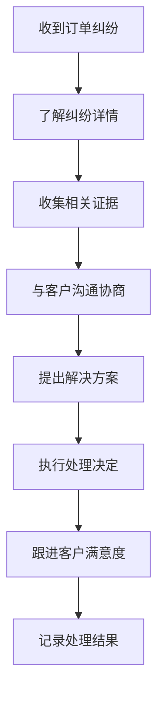

# 合作伙伴角色指引 (Partner Role Guide)

## 🎯 角色概述

合作伙伴通过平台开展业务合作，管理自己的商户和服务，享受平台提供的各种赋能工具。

## ✅ 能做什么 (Can Do)

### 商户管理
- **店铺信息维护**：更新店铺基本信息、营业时间、联系方式
- **商品管理**：发布、编辑、下架商品信息和价格
- **服务项目设置**：配置可提供的维修服务类型和收费标准
- **技师管理**：管理店内技师信息和技能认证
- **库存管理**：维护配件库存和采购计划

### 订单处理
- **订单接收**：查看和接受客户预约订单
- **进度更新**：实时更新订单处理状态
- **服务执行**：记录服务过程和结果
- **费用结算**：确认服务费用和收款情况
- **客户评价管理**：回复客户评价和反馈

### 数据查看
- **经营数据**：查看店铺销售业绩和经营分析
- **客户画像**：了解服务客户的基本特征
- **排名统计**：查看在平台内的排名和评分
- **收益分析**：分析收入构成和盈利情况

### 营销推广
- **优惠活动**：设置店铺优惠和促销活动
- **广告投放**：参与平台推广和精准营销
- **客户维护**：管理老客户关系和回头客
- **口碑建设**：提升服务质量和客户满意度

## ❌ 不能做什么 (Cannot Do)

### 平台限制
- **不能修改系统配置**：无权更改平台核心设置
- **不能访问其他商户数据**：只能查看自己店铺的信息
- **不能绕过审核机制**：所有内容发布需要平台审核
- **不能恶意竞争**：禁止不当竞争和违规操作

### 经营规范
- **不能提供虚假信息**：确保店铺和商品信息真实准确
- **不能违规收费**：严格按照公示价格收费
- **不能降低服务质量**：必须保证服务标准和质量
- **不能泄露客户隐私**：保护客户个人信息安全

## 🔧 常用入口 (Common Entry Points)

### 商户管理中心
```
商户首页: /partner/dashboard
店铺管理: /partner/shop
商品管理: /partner/products
服务管理: /partner/services
技师管理: /partner/technicians
```

### 订单管理系统
```
订单中心: /partner/orders
预约管理: /partner/appointments
服务记录: /partner/service-records
结算中心: /partner/settlement
评价管理: /partner/reviews
```

### 数据分析工具
```
经营报表: /partner/reports/performance
销售分析: /partner/reports/sales
客户分析: /partner/reports/customers
收益统计: /partner/reports/revenue
排名查看: /partner/reports/ranking
```

### 营销推广平台
```
活动管理: /partner/marketing/campaigns
优惠设置: /partner/marketing/discounts
广告投放: /partner/marketing/ads
客户管理: /partner/marketing/customers
数据分析: /partner/marketing/analytics
```

## ⚠️ 异常情况处理流程 (Exception Handling Process)

### 1. 订单纠纷处理


### 2. 服务异常应对

**服务质量问题：**
```
1. 收到客户投诉反馈
2. 立即核实问题情况
3. 向客户诚恳道歉
4. 提供补偿或重做服务
5. 分析问题根本原因
6. 制定改进措施
7. 跟踪改善效果
```

**技师能力不足：**
```
1. 识别技能缺口
2. 安排针对性培训
3. 暂停相关服务项目
4. 寻找合格技师补充
5. 建立技能评估机制
6. 持续提升团队能力
```

**配件供应问题：**
```
1. 监控库存预警
2. 及时补充常用配件
3. 建立供应商合作关系
4. 制定应急采购预案
5. 优化库存管理策略
6. 降低缺货风险
```

### 3. 系统使用问题
- **功能操作疑问**：查看帮助文档或联系客服
- **数据显示异常**：截图记录问题并及时反馈
- **账户登录困难**：按照密码找回流程操作
- **支付结算问题**：联系财务部门核实处理

### 4. 平台政策咨询
- **规则理解不清**：查阅平台规则说明文档
- **处罚申诉**：按申诉流程提交相关材料
- **权益保障**：了解合作伙伴权益保护机制
- **争议调解**：申请平台介入协调处理

## 📋 日常经营管理清单

### 每日检查
- [ ] 查看新订单和预约
- [ ] 更新商品和服务信息
- [ ] 检查库存和补货需求
- [ ] 处理客户咨询和售后
- [ ] 完成当日服务记录

### 每周重点
- [ ] 分析经营数据表现
- [ ] 优化商品定价策略
- [ ] 跟进客户满意度调查
- [ ] 参加平台培训活动
- [ ] 制定下周工作计划

### 每月总结
- [ ] 评估月度经营成果
- [ ] 分析市场竞争态势
- [ ] 识别改进提升机会
- [ ] 规划下月发展目标
- [ ] 参与平台交流分享

## 📊 经营成功要素

### 服务质量
```
专业技术水平
服务响应速度
客户满意度
问题解决能力
售后保障完善
```

### 商品管理
```
商品种类丰富
价格具有竞争力
库存充足稳定
描述准确详实
图片清晰美观
```

### 团队建设
```
技师技能达标
服务水平统一
团队协作高效
持续学习提升
激励机制合理
```

### 客户关系
```
沟通及时有效
服务态度良好
问题处理迅速
客户粘性较强
口碑传播积极
```

## 💡 经营优化建议

### 提升竞争力
- **差异化定位**：找到独特的服务特色和优势
- **品质标准化**：建立完善的服务质量标准
- **技术创新应用**：积极采用新技术提升效率
- **品牌建设**：注重品牌形象和服务口碑

### 降本增效
- **精细化管理**：优化资源配置和流程效率
- **供应链优化**：建立稳定的配件供应渠道
- **数字化工具**：充分利用平台提供的工具功能
- **数据分析驱动**：基于数据做出经营决策

### 客户价值创造
- **个性化服务**：提供定制化的解决方案
- **增值服务**：开发延伸服务项目
- **会员体系建设**：建立客户忠诚度计划
- **社区运营**：打造客户互动交流平台

## 🆘 支持服务体系

### 平台支持
- **客服热线**：400-xxx-xxxx（工作时间）
- **在线客服**：平台内即时聊天支持
- **帮助中心**：FAQ和操作指南文档
- **培训学院**：免费的业务技能培训

### 专业服务
- **运营顾问**：一对一经营指导服务
- **技术支持**：系统使用和故障处理
- **营销专家**：推广策略和活动策划
- **法律咨询**：合规经营和风险防范

### 合作伙伴社区
- **经验分享会**：定期举办优秀案例分享
- **互助小组**：建立区域合作伙伴网络
- **标杆学习**：参观学习优秀商户做法
- **联合营销**：参与平台组织的集体活动

---
_最后更新：2026年2月21日_