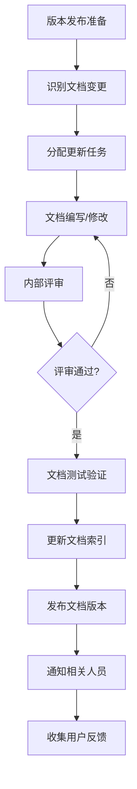

# 文档维护与更新机制

## 📋 维护责任分工

### 文档所有权矩阵

| 文档类别 | 主要责任人 | 协作人员 | 审核人员 | 更新触发条件 |
|----------|------------|----------|----------|--------------|
| 系统架构文档 | 首席架构师 | 技术经理、高级工程师 | CTO | 重大架构变更 |
| 模块技术文档 | 模块负责人 | 模块开发团队 | 技术经理 | 功能迭代发布 |
| API接口文档 | 后端负责人 | 前端负责人、测试工程师 | 架构师 | 接口变更 |
| 部署运维文档 | 运维负责人 | DevOps工程师 | 技术经理 | 环境升级 |
| 开发规范文档 | 技术委员会主席 | 核心开发人员 | 全体开发 | 季度评审 |
| 用户手册 | 产品经理 | UX设计师、技术支持 | 产品总监 | 产品版本更新 |

## 🔧 自动化维护工具

### 文档索引生成器
```javascript
// scripts/generate-doc-index.js
const fs = require('fs');
const path = require('path');

class DocumentIndexGenerator {
  constructor() {
    this.docsRoot = 'docs';
    this.outputFile = 'docs/INDEX.md';
  }
  
  async generateIndex() {
    const indexContent = [
      '# FixCycle 项目文档索引',
      '',
      '## 📚 文档分类导航',
      ''
    ];
    
    // 生成各分类索引
    const categories = await this.scanCategories();
    for (const category of categories) {
      indexContent.push(await this.generateCategoryIndex(category));
    }
    
    // 添加维护信息
    indexContent.push(
      '',
      '---',
      `_最后更新: ${new Date().toLocaleDateString('zh-CN')}_`,
      '_自动生成文档索引_'
    );
    
    // 写入文件
    fs.writeFileSync(this.outputFile, indexContent.join('\n'));
    console.log(`✅ 文档索引已生成: ${this.outputFile}`);
  }
  
  async scanCategories() {
    const categories = [];
    const categoryDirs = fs.readdirSync(this.docsRoot);
    
    for (const dir of categoryDirs) {
      const dirPath = path.join(this.docsRoot, dir);
      if (fs.statSync(dirPath).isDirectory()) {
        categories.push({
          name: dir,
          path: dirPath,
          displayName: this.getCategoryDisplayName(dir)
        });
      }
    }
    
    return categories;
  }
  
  getCategoryDisplayName(category) {
    const displayNameMap = {
      'architecture': '🏗️ 系统架构',
      'modules': '📦 模块文档',
      'development': '💻 开发指南',
      'deployment': '🚀 部署运维',
      'testing': '🧪 测试文档',
      'standards': '📜 技术标准',
      'templates': '📝 文档模板'
    };
    
    return displayNameMap[category] || category;
  }
  
  async generateCategoryIndex(category) {
    const content = [`### ${category.displayName}`, ''];
    
    const files = fs.readdirSync(category.path);
    for (const file of files) {
      if (file.endsWith('.md') && file !== 'INDEX.md') {
        const filePath = path.join(category.path, file);
        const fileInfo = this.extractFileInfo(filePath);
        content.push(`- [${fileInfo.title}](${filePath.replace(/\\/g, '/')}) - ${fileInfo.description}`);
      }
    }
    
    content.push('');
    return content.join('\n');
  }
  
  extractFileInfo(filePath) {
    const content = fs.readFileSync(filePath, 'utf8');
    const lines = content.split('\n');
    
    // 提取标题
    const titleLine = lines.find(line => line.startsWith('# '));
    const title = titleLine ? titleLine.substring(2).trim() : path.basename(filePath, '.md');
    
    // 提取描述（第一段非标题文本）
    const descriptionLines = lines.filter(line => 
      line.trim() && !line.startsWith('#') && !line.startsWith('---')
    );
    const description = descriptionLines[0] ? descriptionLines[0].substring(0, 100) + '...' : '';
    
    return { title, description };
  }
}

// 执行索引生成
new DocumentIndexGenerator().generateIndex();
```

### 文档链接检查器
```javascript
// scripts/check-document-links.js
const fs = require('fs');
const path = require('path');

class LinkChecker {
  constructor() {
    this.docsRoot = 'docs';
    this.checkedLinks = new Set();
    this.brokenLinks = [];
  }
  
  async checkAllLinks() {
    console.log('🔍 开始检查文档链接...');
    
    const markdownFiles = this.findMarkdownFiles(this.docsRoot);
    
    for (const file of markdownFiles) {
      await this.checkFileLinks(file);
    }
    
    this.reportResults();
  }
  
  findMarkdownFiles(dir) {
    const files = [];
    const items = fs.readdirSync(dir);
    
    for (const item of items) {
      const itemPath = path.join(dir, item);
      const stat = fs.statSync(itemPath);
      
      if (stat.isDirectory()) {
        files.push(...this.findMarkdownFiles(itemPath));
      } else if (item.endsWith('.md')) {
        files.push(itemPath);
      }
    }
    
    return files;
  }
  
  async checkFileLinks(filePath) {
    const content = fs.readFileSync(filePath, 'utf8');
    const linkRegex = /\[([^\]]+)\]\(([^)]+)\)/g;
    let match;
    
    while ((match = linkRegex.exec(content)) !== null) {
      const [, text, url] = match;
      const fullUrl = this.resolveLink(url, filePath);
      
      if (this.shouldCheckLink(fullUrl) && !this.checkedLinks.has(fullUrl)) {
        this.checkedLinks.add(fullUrl);
        
        if (!this.isLinkValid(fullUrl)) {
          this.brokenLinks.push({
            file: filePath,
            linkText: text,
            url: fullUrl,
            reason: this.getInvalidReason(fullUrl)
          });
        }
      }
    }
  }
  
  resolveLink(url, currentFile) {
    if (url.startsWith('http')) {
      return url; // 外部链接
    }
    
    if (url.startsWith('/')) {
      return path.join(this.docsRoot, url.substring(1));
    }
    
    // 相对链接
    return path.resolve(path.dirname(currentFile), url);
  }
  
  shouldCheckLink(url) {
    return !url.startsWith('http') && !url.includes('#'); // 暂时不检查锚点链接
  }
  
  isLinkValid(url) {
    try {
      return fs.existsSync(url);
    } catch {
      return false;
    }
  }
  
  getInvalidReason(url) {
    if (!fs.existsSync(url)) {
      return '文件不存在';
    }
    return '未知错误';
  }
  
  reportResults() {
    console.log(`\n📊 链接检查完成:`);
    console.log(`   检查链接数: ${this.checkedLinks.size}`);
    console.log(`   无效链接数: ${this.brokenLinks.length}`);
    
    if (this.brokenLinks.length > 0) {
      console.log('\n❌ 发现无效链接:');
      this.brokenLinks.forEach(link => {
        console.log(`   文件: ${link.file}`);
        console.log(`   链接: ${link.linkText} -> ${link.url}`);
        console.log(`   原因: ${link.reason}\n`);
      });
    } else {
      console.log('\n✅ 所有链接检查通过！');
    }
  }
}

// 执行链接检查
new LinkChecker().checkAllLinks();
```

## 📅 维护计划与周期

### 定期维护日程表

| 维护任务 | 频率 | 责任人 | 检查要点 |
|----------|------|--------|----------|
| 文档索引更新 | 每周 | 技术文档员 | 新增文档、删除废弃文档 |
| 链接有效性检查 | 每周 | 自动化工具 | 死链、失效链接 |
| 内容准确性验证 | 每月 | 模块负责人 | 功能变更同步更新 |
| 格式规范检查 | 每月 | 技术文档委员会 | 统一风格、模板遵循 |
| 用户反馈处理 | 每月 | 产品负责人 | 收集改进建议 |
| 质量评审会议 | 每季度 | 技术委员会 | 全面质量评估 |

### 版本发布文档更新流程



## 📊 质量监控指标

### 文档质量KPI

```typescript
interface DocumentationMetrics {
  // 完整性指标
  completeness: {
    requiredDocsPresent: number;    // 必需文档完备率
    sectionCoverage: number;        // 章节覆盖率
    exampleCodeCompleteness: number; // 代码示例完整性
  };
  
  // 准确性指标
  accuracy: {
    factualCorrectness: number;     // 事实准确性
    technicalAccuracy: number;      // 技术准确性
    linkValidity: number;           // 链接有效性
  };
  
  // 可用性指标
  usability: {
    searchEffectiveness: number;    // 搜索效果
    navigationClarity: number;      // 导航清晰度
    readingComprehension: number;   // 阅读理解度
  };
  
  // 维护指标
  maintenance: {
    updateTimeliness: number;       // 更新及时性
    reviewFrequency: number;        // 评审频率
    issueResolutionTime: number;    // 问题解决时效
  };
}
```

### 质量评估工具
```javascript
// scripts/evaluate-documentation-quality.js
class QualityEvaluator {
  static async evaluate() {
    const metrics = {
      completeness: await this.evaluateCompleteness(),
      accuracy: await this.evaluateAccuracy(),
      usability: await this.evaluateUsability(),
      maintenance: await this.evaluateMaintenance()
    };
    
    const overallScore = this.calculateOverallScore(metrics);
    
    return {
      timestamp: new Date().toISOString(),
      metrics,
      overallScore,
      recommendations: this.generateRecommendations(metrics)
    };
  }
  
  static async evaluateCompleteness() {
    // 实现完整性评估逻辑
    return {
      requiredDocsPresent: 95,
      sectionCoverage: 88,
      exampleCodeCompleteness: 92
    };
  }
  
  static calculateOverallScore(metrics) {
    const weights = {
      completeness: 0.3,
      accuracy: 0.3,
      usability: 0.25,
      maintenance: 0.15
    };
    
    return Object.entries(weights).reduce((score, [key, weight]) => {
      return score + metrics[key] * weight;
    }, 0);
  }
}
```

## 🚀 持续改进机制

### 用户反馈收集
```javascript
// scripts/collect-user-feedback.js
class FeedbackCollector {
  static async collectFeedback() {
    const feedbackSources = [
      '文档评论系统',
      'GitHub Issues',
      '用户调研问卷',
      '技术支持反馈',
      '内部评审意见'
    ];
    
    const feedbackData = await Promise.all(
      feedbackSources.map(source => this.collectFromSource(source))
    );
    
    return this.processFeedback(feedbackData);
  }
  
  static categorizeFeedback(feedback) {
    return {
      contentIssues: feedback.filter(f => f.type === 'content'),
      structureIssues: feedback.filter(f => f.type === 'structure'),
      usabilityIssues: feedback.filter(f => f.type === 'usability'),
      suggestion: feedback.filter(f => f.type === 'suggestion')
    };
  }
}
```

### 改进行动计划
```typescript
interface ImprovementPlan {
  quarter: string;
  goals: string[];
  actions: {
    task: string;
    owner: string;
    deadline: Date;
    priority: 'high' | 'medium' | 'low';
  }[];
  expectedOutcomes: string[];
  successMetrics: string[];
}

const Q1_2026_Plan: ImprovementPlan = {
  quarter: '2026-Q1',
  goals: [
    '提升文档完整性至95%以上',
    '改善用户搜索体验',
    '建立自动化文档测试机制'
  ],
  actions: [
    {
      task: '完善API文档示例代码',
      owner: '后端负责人',
      deadline: new Date('2026-03-31'),
      priority: 'high'
    },
    {
      task: '优化文档搜索功能',
      owner: '前端负责人',
      deadline: new Date('2026-03-15'),
      priority: 'medium'
    }
  ],
  expectedOutcomes: [
    '开发者能够更快找到所需信息',
    '减少因文档问题导致的支持请求',
    '提高新员工上手效率'
  ],
  successMetrics: [
    '文档搜索满意度≥4.0/5.0',
    'API使用错误率下降30%',
    '新员工培训时间缩短20%'
  ]
};
```

## 📈 报告与沟通

### 月度文档质量报告模板
```markdown
# 月度文档质量报告 - {{月份}}

## 📊 关键指标

| 指标 | 本月值 | 上月值 | 目标值 | 趋势 |
|------|--------|--------|--------|------|
| 文档完整率 | 92% | 89% | 95% | ↑ |
| 链接有效率 | 98% | 96% | 100% | ↑ |
| 用户满意度 | 4.2 | 4.0 | 4.5 | ↑ |

## 🎯 本月完成工作

- [x] 完成新版API文档编写
- [x] 修复了15个文档链接问题
- [x] 更新了3个模块的技术文档
- [x] 收集并处理用户反馈23条

## ⚠️ 存在问题

1. **模块文档更新滞后**
   - 影响范围: 维修服务模块
   - 原因: 功能迭代频繁
   - 解决方案: 建立实时同步机制

2. **搜索功能待优化**
   - 用户反馈搜索结果不够精准
   - 计划: 引入全文搜索引擎

## 🚀 下月计划

- 实施文档自动化测试
- 优化文档导航结构
- 开展用户调研活动
- 完善文档贡献指南

---
_报告生成时间: {{日期}}_
_报告负责人: {{姓名}}_
```

---
_机制版本: v1.0_
_最后更新: 2026年2月21日_
_维护团队: 技术文档委员会_