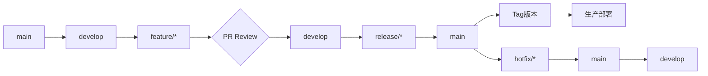
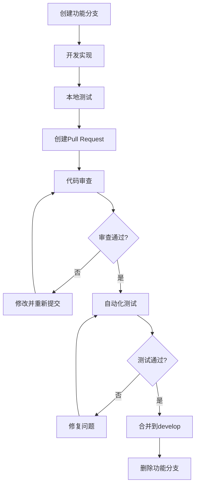

# Git 工作流与版本控制规范

## 📋 工作流概述

采用基于 Git Flow 的分支管理策略，结合持续集成/持续部署(CI/CD)实践，确保代码质量和发布稳定性。

## 🌿 分支策略

### 核心分支

```
main                    # 生产环境分支
develop                 # 开发主分支
release/vX.Y.Z          # 发布候选分支
hotfix/bug-fix-name     # 紧急修复分支
```

### 功能分支命名规范

```
feature/JIRA-123-short-description     # 新功能开发
bugfix/JIRA-124-bug-description        # Bug修复
improvement/JIRA-125-improvement-desc  # 功能改进
refactor/JIRA-126-refactor-target      # 代码重构
docs/JIRA-127-documentation-update     # 文档更新
```

### 分支生命周期



## 🎯 提交规范

### 提交信息格式

```
<type>(<scope>): <subject>

<body>

<footer>
```

### Type 类型说明

- `feat`: 新功能
- `fix`: Bug修复
- `docs`: 文档更新
- `style`: 代码格式调整
- `refactor`: 代码重构
- `perf`: 性能优化
- `test`: 测试相关
- `chore`: 构建过程或辅助工具变动
- `ci`: CI配置相关
- `revert`: 回滚提交

### Scope 范围说明

- `auth`: 认证模块
- `repair`: 维修服务模块
- `procurement`: 采购模块
- `api`: API接口
- `database`: 数据库相关
- `ui`: 用户界面
- `workflow`: 工作流相关

### 提交示例

```bash
# ✅ 推荐的提交信息
feat(auth): 添加微信登录功能
- 集成微信OAuth2.0认证
- 添加用户信息同步机制
- 更新相关文档

fix(repair): 修复工单状态更新失败问题
- 修正状态转换逻辑
- 添加异常处理机制
- 关联bug: JIRA-124

docs(api): 更新API文档结构
- 完善接口参数说明
- 添加错误码对照表
- 修正示例代码

refactor(database): 优化查询性能
- 重构复杂查询语句
- 添加必要的数据库索引
- 提升查询效率约40%
```

### 提交检查脚本

```bash
#!/bin/bash
# scripts/commit-validator.sh

validate_commit_message() {
    local message="$1"

    # 检查格式
    if ! echo "$message" | grep -qE "^(feat|fix|docs|style|refactor|perf|test|chore|ci|revert)\(.+\): .+"; then
        echo "❌ 提交信息格式不正确"
        echo "正确的格式: type(scope): subject"
        return 1
    fi

    # 检查长度
    local subject=$(echo "$message" | head -n1)
    if [ ${#subject} -gt 72 ]; then
        echo "❌ 提交主题过长（超过72字符）"
        return 1
    fi

    # 检查结尾标点
    if echo "$subject" | grep -qE "[.]$"; then
        echo "❌ 提交主题不应以句号结尾"
        return 1
    fi

    echo "✅ 提交信息验证通过"
    return 0
}

# 获取提交信息
COMMIT_MSG_FILE="$1"
COMMIT_MSG=$(cat "$COMMIT_MSG_FILE")

validate_commit_message "$COMMIT_MSG"
```

## 🔧 Git Hook 配置

### Pre-commit Hook

```javascript
// .husky/pre-commit
#!/bin/sh
. "$(dirname "$0")/_/husky.sh"

echo "🔍 运行代码检查..."

# 运行 Lint 检查
npm run lint-staged

# 运行测试
npm run test -- --changedSince=HEAD

# 检查提交信息格式
npx commitlint --from HEAD~1 --to HEAD --verbose

if [ $? -ne 0 ]; then
    echo "❌ 提交前检查失败，请修复问题后重试"
    exit 1
fi

echo "✅ 所有检查通过，准备提交"
```

### Commit-msg Hook

```javascript
// .husky/commit-msg
#!/bin/sh
. "$(dirname "$0")/_/husky.sh"

npx --no-install commitlint --edit "$1"
```

### Pre-push Hook

```javascript
// .husky/pre-push
#!/bin/sh
. "$(dirname "$0")/_/husky.sh"

echo "🚀 运行推送前检查..."

# 运行完整测试套件
npm run test:all

# 检查代码覆盖率
npm run test:coverage -- --coverageThreshold

# 验证构建
npm run build

if [ $? -ne 0 ]; then
    echo "❌ 推送前检查失败"
    exit 1
fi

echo "✅ 推送检查通过"
```

## 🔄 合并策略

### Pull Request 流程



### 代码审查清单

```markdown
## 📋 PR审查清单

### 代码质量

- [ ] 代码符合编码规范
- [ ] 类型定义完整准确
- [ ] 没有未使用的代码
- [ ] 注释清晰必要

### 功能实现

- [ ] 功能按需求实现
- [ ] 边界条件处理完整
- [ ] 错误处理机制健全
- [ ] 性能影响可接受

### 测试覆盖

- [ ] 单元测试完整
- [ ] 集成测试通过
- [ ] 测试覆盖率达标
- [ ] 测试用例合理

### 安全性

- [ ] 输入验证完整
- [ ] 没有安全漏洞
- [ ] 敏感信息处理得当
- [ ] 权限控制正确

### 文档更新

- [ ] 相关文档已更新
- [ ] API文档同步更新
- [ ] 注释和README完善
- [ ] 变更日志记录
```

### 合并要求

- 至少2个批准的审查意见
- 所有自动化检查通过
- 测试覆盖率不低于85%
- 没有冲突需要解决
- PR描述完整清晰

## 🚀 发布流程

### 版本号规范

采用语义化版本控制(SemVer): `MAJOR.MINOR.PATCH`

- **MAJOR**: 不兼容的API变更
- **MINOR**: 向后兼容的功能新增
- **PATCH**: 向后兼容的问题修复

### 发布分支流程

```bash
# 1. 创建发布分支
git checkout develop
git pull origin develop
git checkout -b release/v2.1.0

# 2. 更新版本号
npm version minor  # 或 major/patch

# 3. 更新变更日志
# 编辑 CHANGELOG.md

# 4. 最终测试
npm run test:all
npm run build

# 5. 合并到主分支
git checkout main
git merge --no-ff release/v2.1.0
git tag -a v2.1.0 -m "Release version 2.1.0"

# 6. 合并回develop
git checkout develop
git merge --no-ff release/v2.1.0

# 7. 清理发布分支
git branch -d release/v2.1.0
git push origin main develop --tags
```

### 热修复流程

```bash
# 1. 从main创建热修复分支
git checkout main
git pull origin main
git checkout -b hotfix/critical-bug-fix

# 2. 修复问题并测试
# ... 修复代码 ...

# 3. 合并到main和develop
git checkout main
git merge --no-ff hotfix/critical-bug-fix
git tag -a v2.0.1 -m "Hotfix for critical bug"

git checkout develop
git merge --no-ff hotfix/critical-bug-fix

# 4. 清理热修复分支
git branch -d hotfix/critical-bug-fix
git push origin main develop --tags
```

## 📊 Git 工具和配置

### 有用的 Git 别名

```bash
# .gitconfig
[alias]
    # 简化常用命令
    st = status
    co = checkout
    br = branch
    ci = commit
    df = diff
    lg = log --oneline --graph --decorate --all

    # 实用组合命令
    undo = reset --soft HEAD~1
    amend = commit --amend --no-edit
    unstage = reset HEAD --
    last = log -1 HEAD
    publish = "!f() { git push -u origin $(git rev-parse --abbrev-ref HEAD); }; f"

    # 状态查看
    stats = diff --stat
    changes = diff --name-status
    whoami = config user.name
```

### Git 配置建议

```bash
# 全局配置
git config --global user.name "Your Name"
git config --global user.email "your.email@example.com"
git config --global core.editor "code --wait"
git config --global init.defaultBranch main
git config --global pull.rebase true
git config --global push.autoSetupRemote true

# 颜色配置
git config --global color.ui auto
git config --global color.diff.meta "blue bold"
git config --global color.diff.frag "magenta bold"
```

## 📈 最佳实践

### 提交频率

- **小步快跑**: 频繁的小提交优于大的批量提交
- **原子性**: 每个提交只解决一个问题
- **及时推送**: 本地完成的提交应及时推送到远程

### 分支管理

- **及时清理**: 删除已合并的功能分支
- **定期同步**: 保持与develop分支的同步
- **避免长时间分支**: 功能分支不应超过一周

### 协作规范

- **沟通先行**: 复杂变更提前讨论
- **及时审查**: 24小时内完成代码审查
- **建设性反馈**: 提供具体的改进建议

### 问题处理

```bash
# 撤销最后一次提交（保留更改）
git reset --soft HEAD~1

# 撤销最后一次提交（丢弃更改）
git reset --hard HEAD~1

# 修改最后一次提交
git commit --amend

# 撤销特定文件的更改
git checkout HEAD -- filename

# 查看提交历史
git log --oneline --graph --decorate --all

# 查找引入bug的提交
git bisect start
git bisect bad
git bisect good <good_commit_hash>
```

## 🛡️ 安全注意事项

### 凭据保护

```bash
# 避免提交敏感信息
echo ".env*" >> .gitignore
echo "config/secrets.json" >> .gitignore

# 检查历史提交中的敏感信息
git log -p -S "password" --all
git log -p -S "secret" --all

# 移除已提交的敏感文件
git filter-branch --force --index-filter \
  'git rm --cached --ignore-unmatch path/to/sensitive/file' \
  --prune-empty --tag-name-filter cat -- --all
```

### 权限管理

- 限制main分支的直接推送权限
- 设置分支保护规则
- 要求PR审查和状态检查
- 定期审查仓库访问权限

---

_规范版本: v1.5_
_最后更新: 2026年2月21日_
_维护团队: DevOps团队_
