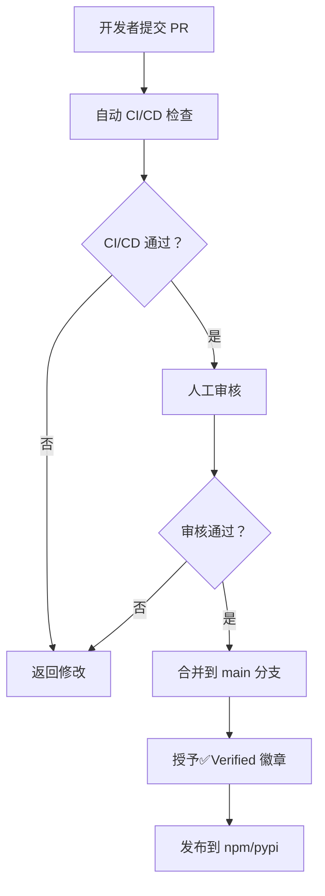
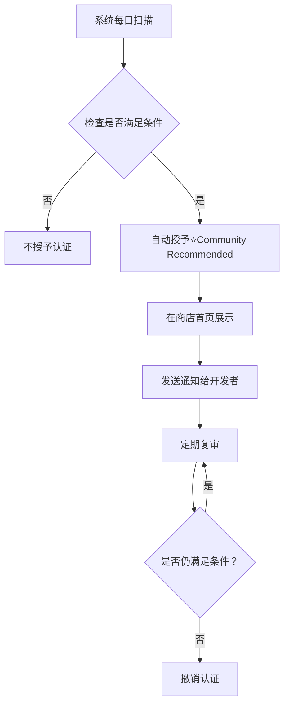
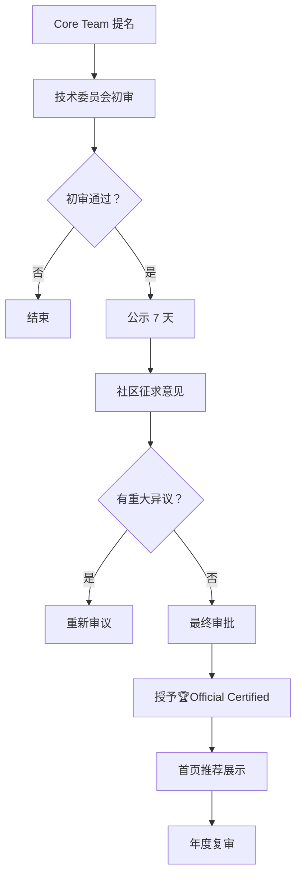

# ProCyc Skill 质量认证计划

**版本**: 1.0
**日期**: 2026 年 3 月 3 日
**状态**: ⏳ 待实施

## 一、项目愿景

建立 ProCyc Skill 生态的质量标准体系，通过认证机制识别和推广高质量技能，提升用户体验和开发者积极性。

## 二、认证等级体系

### 2.1 认证等级

```
┌─────────────────────────────────────────────┐
│   🏆 官方认证 (Official Certified)          │
│   - 最高级别认证                            │
│   - ProCyc Core Team 审核                   │
│   - 享受平台推荐资源                        │
└─────────────────────────────────────────────┘
                    ▲
                    │
┌─────────────────────────────────────────────┐
│   ⭐ 社区推荐 (Community Recommended)       │
│   - 社区评分 ≥ 4.5 星                       │
│   - 下载量 ≥ 1000 次                         │
│   - 无严重 Bug 报告                          │
└─────────────────────────────────────────────┘
                    ▲
                    │
┌─────────────────────────────────────────────┐
│   ✅ 已验证 (Verified)                      │
│   - 通过基础审核流程                        │
│   - 测试覆盖率 ≥ 80%                        │
│   - 符合 Skill 规范                          │
└─────────────────────────────────────────────┘
```

### 2.2 认证徽章设计

#### 官方认证徽章

```svg
<!-- 官方认证徽章 -->
🏆 ProCyc Official Certified
- 金色徽章设计
- 展示在技能列表页和详情页
- 链接到认证详情页面
```

#### 社区推荐徽章

```svg
<!-- 社区推荐徽章 -->
⭐ Community Recommended
- 银色徽章设计
- 基于用户评价自动生成
```

#### 已验证徽章

```svg
<!-- 已验证徽章 -->
✅ Verified Skill
- 蓝色徽章设计
- 基础认证标识
```

## 三、认证标准

### 3.1 基础认证（Verified）要求

**必备条件**：

- ✅ SKILL.md 包含所有必填字段
- ✅ 技能名称符合规范（`procyc-` 开头）
- ✅ 版本号符合语义化版本规范
- ✅ README.md 完整且准确
- ✅ 有至少一个使用示例
- ✅ 单元测试覆盖率 ≥ 80%
- ✅ 所有测试通过
- ✅ 代码符合 ESLint 规范
- ✅ 没有硬编码的敏感信息
- ✅ .gitignore 已正确配置

**技术审查**：

- ✅ 输入验证完善
- ✅ 错误处理规范
- ✅ 性能达标（P95 < 1000ms）
- ✅ 无安全漏洞
- ✅ 依赖版本安全

### 3.2 社区推荐（Community Recommended）要求

**基础条件**：

- ✅ 已获得基础认证
- ✅ 发布时间 ≥ 30 天
- ✅ 累计下载量 ≥ 1000 次
- ✅ 活跃用户数 ≥ 50 人

**评分要求**：

- ⭐ 平均评分 ≥ 4.5 星（满分 5 星）
- 💬 用户评价数量 ≥ 10 条
- 🐛 无未解决的严重 Bug 报告
- 📊 用户满意度 ≥ 90%

**质量指标**：

- 📈 月调用量增长率 ≥ 10%
- 🔧 月度更新频率 ≥ 1 次
- 📚 文档完整性评分 ≥ 4.5
- 🎯 功能稳定性 ≥ 99%

### 3.3 官方认证（Official Certified）要求

**基础条件**：

- ✅ 已获得社区推荐认证
- ✅ 由 ProCyc Core Team 成员提名
- ✅ 发布时间 ≥ 90 天
- ✅ 累计下载量 ≥ 5000 次

**技术审查**：

- 🎯 测试覆盖率 ≥ 95%
- ⚡ P95 响应时间 < 500ms
- 🛡️ 通过严格的安全审计
- 📖 API 文档完整度 100%
- 🔄 向后兼容性保证

**创新性评估**：

- 💡 技术创新性或业务价值突出
- 🌟 填补生态空白或解决关键问题
- 🚀 性能指标优于同类技能 30% 以上
- 📊 用户口碑和行业影响力显著

**审核流程**：

1. Core Team 成员提名
2. 技术委员会评审（3-5 人）
3. 公开征询意见（7 天公示期）
4. 最终审批并授予认证

## 四、评论系统设计

### 4.1 技术方案选择

**推荐方案：Giscus**

优势：

- ✅ 基于 GitHub Discussions，无需额外后端
- ✅ 完全免费且开源
- ✅ 支持 Markdown 语法
- ✅ 自动同步 GitHub 账号
- ✅ 支持回复和点赞
- ✅ 可自定义主题

集成步骤：

```html
<!-- 在技能详情页添加 Giscus 组件 -->
<script
  src="https://giscus.app/client.js"
  data-repo="procyc-skills/skills"
  data-repo-id="REPO_ID"
  data-category="Skill Reviews"
  data-category-id="CATEGORY_ID"
  data-mapping="pathname"
  data-strict="0"
  data-reactions-enabled="1"
  data-emit-metadata="0"
  data-input-position="bottom"
  data-theme="light"
  data-lang="zh-CN"
  crossorigin="anonymous"
  async
></script>
```

### 4.2 评分系统设计

**评分维度**：

1. ⭐⭐⭐⭐⭐ 总体评分（必填）
2. 📚 文档质量（可选）
3. 🚀 性能表现（可选）
4. 🛠️ 易用性（可选）
5. 💡 创新性（可选）

**评分计算**：

```typescript
// 加权平均算法
const overallRating =
  totalRating * 0.5 + // 总体评分占 50%
  docQuality * 0.15 + // 文档质量占 15%
  performance * 0.15 + // 性能占 15%
  usability * 0.1 + // 易用性占 10%
  innovation * 0.1; // 创新性占 10%
```

**防滥用机制**：

- 仅限已安装用户评分（需连接 GitHub）
- 每个用户每 30 天只能修改一次评分
- 异常评分自动触发审核（如短时间内大量 1 星）
- 开发者可举报恶意评价

### 4.3 评论管理

**评论分类**：

- 💡 使用心得
- 🐛 Bug 报告
- 🎯 功能建议
- 👍 表扬感谢
- ❓ 问题求助

**自动标签**：

```typescript
// 基于关键词自动打标签
const autoTags = {
  bug: ['bug', 'error', 'fail', 'issue'],
  feature: ['feature', 'suggestion', 'improve'],
  question: ['how to', 'question', 'help'],
  praise: ['great', 'awesome', 'excellent'],
};
```

**开发者回复**：

- 开发者回复会自动标记为"官方回复"
- 重要回复可置顶显示
- 支持@提及用户

## 五、认证流程

### 5.1 基础认证流程



### 5.2 社区推荐认证流程



### 5.3 官方认证流程



## 六、激励机制

### 6.1 开发者奖励

**FCX 积分奖励**：

- ✅ 获得基础认证：奖励 100 FCX
- ⭐ 获得社区推荐：奖励 500 FCX
- 🏆 获得官方认证：奖励 2000 FCX

**流量扶持**：

- 认证技能在搜索结果中优先展示
- 定期在官方博客和社交媒体推广
- 邀请参加 ProCyc 开发者大会

**荣誉表彰**：

- 年度最佳技能奖
- 月度明星开发者
- 贡献者排行榜展示

### 6.2 用户激励

**评价奖励**：

- 每条有用评价奖励 5 FCX
- 被评为"优质评价"奖励 20 FCX
- 月度活跃评论家奖励 100 FCX

**社区贡献**：

- 帮助解答问题获得积分
- 提交 Bug 被确认获得积分
- 提出功能建议被采纳获得积分

## 七、技术实现

### 7.1 数据库设计

```sql
-- 技能评分表
CREATE TABLE skill_ratings (
  id UUID PRIMARY KEY DEFAULT gen_random_uuid(),
  skill_name VARCHAR(100) NOT NULL,
  user_id UUID NOT NULL REFERENCES users(id),
  overall_rating DECIMAL(3,2) NOT NULL,
  doc_quality DECIMAL(3,2),
  performance DECIMAL(3,2),
  usability DECIMAL(3,2),
  innovation DECIMAL(3,2),
  comment TEXT,
  created_at TIMESTAMP DEFAULT CURRENT_TIMESTAMP,
  updated_at TIMESTAMP DEFAULT CURRENT_TIMESTAMP,
  UNIQUE(skill_name, user_id)
);

-- 技能认证表
CREATE TABLE skill_certifications (
  id UUID PRIMARY KEY DEFAULT gen_random_uuid(),
  skill_name VARCHAR(100) NOT NULL,
  certification_level VARCHAR(50) NOT NULL, -- VERIFIED, COMMUNITY_RECOMMENDED, OFFICIAL_CERTIFIED
  granted_at TIMESTAMP DEFAULT CURRENT_TIMESTAMP,
  expires_at TIMESTAMP,
  granted_by UUID REFERENCES users(id),
  reason TEXT,
  status VARCHAR(20) DEFAULT 'ACTIVE' -- ACTIVE, REVOKED, EXPIRED
);

-- 评论表
CREATE TABLE skill_reviews (
  id UUID PRIMARY KEY DEFAULT gen_random_uuid(),
  skill_name VARCHAR(100) NOT NULL,
  user_id UUID NOT NULL REFERENCES users(id),
  parent_id UUID REFERENCES skill_reviews(id),
  content TEXT NOT NULL,
  rating DECIMAL(3,2),
  likes INTEGER DEFAULT 0,
  is_official BOOLEAN DEFAULT FALSE,
  is_pinned BOOLEAN DEFAULT FALSE,
  tags TEXT[],
  created_at TIMESTAMP DEFAULT CURRENT_TIMESTAMP,
  updated_at TIMESTAMP DEFAULT CURRENT_TIMESTAMP
);

-- 创建索引
CREATE INDEX idx_skill_ratings_skill ON skill_ratings(skill_name);
CREATE INDEX idx_skill_certifications_skill ON skill_certifications(skill_name);
CREATE INDEX idx_skill_reviews_skill ON skill_reviews(skill_name);
CREATE INDEX idx_skill_reviews_parent ON skill_reviews(parent_id);
```

### 7.2 API 设计

```typescript
// 评分相关 API
POST   /api/skills/:name/ratings          // 提交评分
GET    /api/skills/:name/ratings          // 获取评分列表
PUT    /api/skills/:name/ratings/:id      // 更新评分
DELETE /api/skills/:name/ratings/:id      // 删除评分
GET    /api/skills/:name/ratings/average  // 获取平均评分

// 认证相关 API
GET    /api/skills/:name/certifications   // 获取认证信息
POST   /api/skills/certifications/nominate // 提名官方认证（仅 Core Team）

// 评论相关 API
POST   /api/skills/:name/reviews          // 提交评论
GET    /api/skills/:name/reviews          // 获取评论列表
PUT    /api/skills/:name/reviews/:id      // 更新评论
DELETE /api/skills/:name/reviews/:id      // 删除评论
POST   /api/skills/:name/reviews/:id/like // 点赞评论
```

### 7.3 前端组件

```tsx
// 评分组件
<SkillRating
  skillName="procyc-fault-diagnosis"
  averageRating={4.8}
  totalRatings={156}
  onRatingSubmit={handleRatingSubmit}
/>

// 评论组件
<SkillReviews
  skillName="procyc-fault-diagnosis"
  reviews={reviews}
  onReviewSubmit={handleReviewSubmit}
  onReviewLike={handleReviewLike}
/>

// 认证徽章组件
<CertificationBadge
  level="OFFICIAL_CERTIFIED"
  grantedAt="2026-03-01"
  expiresAt="2027-03-01"
/>
```

## 八、运营策略

### 8.1 推广计划

**第一阶段（1-2 个月）**：

- 上线基础认证系统
- 为首批 4 个官方技能授予认证
- 在开发者社区宣传认证体系

**第二阶段（3-4 个月）**：

- 上线评论和评分系统
- 启动"每月之星"评选活动
- 推出首期认证技能专题报道

**第三阶段（5-6 个月）**：

- 举办首届 ProCyc Hackathon
- 颁发首批官方认证技能
- 发布认证开发者专访系列

### 8.2 质量控制

**定期审查**：

- 每月审查认证技能的质量指标
- 对评分下降的技能发出警告
- 撤销不再符合标准的认证

**用户反馈**：

- 设立专门的反馈渠道
- 定期收集和分析用户意见
- 持续优化认证标准

**透明度建设**：

- 公开认证标准和流程
- 公示官方认证评审结果
- 定期发布认证生态报告

## 九、成功指标

### 9.1 短期指标（6 个月）

- ✅ 认证技能数量 ≥ 20 个
- ✅ 用户评价总数 ≥ 500 条
- ✅ 平均评分 ≥ 4.3 星
- ✅ 认证技能调用量占比 ≥ 80%

### 9.2 长期指标（12 个月）

- 🏆 官方认证技能 ≥ 5 个
- ⭐ 社区推荐技能 ≥ 15 个
- ✅ 基础认证技能 ≥ 50 个
- 💰 认证技能总收入 ≥ $50,000
- 👥 活跃开发者 ≥ 200 人

## 十、风险管理

### 10.1 潜在风险

**刷分风险**：

- 对策：限制每个用户的评分频率
- 对策：检测异常评分模式
- 对策：引入权重机制（老用户权重更高）

**恶意竞争**：

- 对策：匿名举报机制
- 对策：快速响应和处理投诉
- 对策：违规者列入黑名单

**认证贬值**：

- 对策：严格控制官方认证数量
- 对策：定期复审和动态调整
- 对策：建立退出机制

### 10.2 应急预案

**Bug 应急响应**：

- 发现严重 Bug 立即暂停认证资格
- 修复后重新审核恢复认证
- 公示 Bug 处理过程和结果

**争议处理**：

- 成立独立的仲裁委员会
- 制定明确的争议处理流程
- 保障双方申诉权利

## 十一、附录

### 11.1 认证申请表模板

```markdown
## 官方认证申请

### 基本信息

- 技能名称：procyc-xxxx
- 当前版本：x.x.x
- 作者：xxx
- 发布时间：YYYY-MM-DD

### 认证理由

（说明为什么应该获得官方认证）

### 技术指标

- 测试覆盖率：xx%
- P95 响应时间：xxx ms
- 月调用量：xxxx 次
- 用户评分：x.x/5.0

### 创新点说明

（描述技术创新或业务价值）

### 社会影响

（描述对用户和生态的贡献）
```

### 11.2 评审打分表

| 评分项     | 权重 | 得分 (1-10) | 加权得分       |
| ---------- | ---- | ----------- | -------------- |
| 代码质量   | 25%  |             |                |
| 文档完整性 | 15%  |             |                |
| 性能表现   | 20%  |             |                |
| 创新性     | 20%  |             |                |
| 用户口碑   | 10%  |             |                |
| 生态价值   | 10%  |             |                |
| **总分**   | 100% |             | **≥ 8.5 通过** |

---

**文档维护**: ProCyc Core Team
**最后更新**: 2026-03-03
**下次审查**: 2026-04-03
**版本**: v1.0
