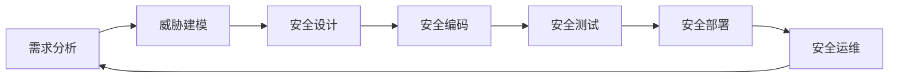

# 安全编码指南

## 🔐 安全原则总则

### 核心安全理念
- **纵深防御**: 多层次安全防护机制
- **最小权限**: 最小化系统和用户的权限
- **安全默认**: 默认情况下采用最安全的配置
- **零信任**: 不信任任何内外部访问请求
- **隐私保护**: 严格保护用户隐私数据

### 安全开发生命周期(SDLC)


## 🛡️ 输入验证与输出编码

### 输入验证规范
```typescript
// ✅ 推荐的安全输入验证
class InputValidator {
  static validateEmail(email: string): boolean {
    // 长度检查
    if (!email || email.length > 254) {
      return false;
    }
    
    // 格式验证
    const emailRegex = /^[a-zA-Z0-9._%+-]+@[a-zA-Z0-9.-]+\.[a-zA-Z]{2,}$/;
    if (!emailRegex.test(email)) {
      return false;
    }
    
    // 黑名单检查
    const blacklistedDomains = ['tempmail.com', '10minutemail.com'];
    const domain = email.split('@')[1];
    if (blacklistedDomains.includes(domain)) {
      return false;
    }
    
    return true;
  }
  
  static validatePhoneNumber(phone: string): boolean {
    // 移除空格和特殊字符
    const cleanPhone = phone.replace(/[\s\-\(\)]/g, '');
    
    // 验证格式
    const phoneRegex = /^\+?[1-9]\d{1,14}$/;
    return phoneRegex.test(cleanPhone);
  }
  
  static validateUserId(userId: string): boolean {
    // UUID v4 格式验证
    const uuidRegex = /^[0-9a-f]{8}-[0-9a-f]{4}-4[0-9a-f]{3}-[89ab][0-9a-f]{3}-[0-9a-f]{12}$/i;
    return uuidRegex.test(userId);
  }
}

// ❌ 避免的做法
function unsafeValidation(input: any) {
  return input != null; // 过于宽松的验证
}
```

### 输出编码规范
```typescript
// ✅ 推荐的输出编码
class OutputEncoder {
  static htmlEncode(text: string): string {
    const div = document.createElement('div');
    div.textContent = text;
    return div.innerHTML;
  }
  
  static urlEncode(url: string): string {
    return encodeURIComponent(url);
  }
  
  static jsonEncode(data: any): string {
    return JSON.stringify(data, null, 2);
  }
  
  static attributeEncode(value: string): string {
    return value.replace(/"/g, '&quot;').replace(/'/g, '&#x27;');
  }
}

// React 组件中的安全输出
function SafeUserProfile({ user }: { user: User }) {
  return (
    <div>
      {/* ✅ 安全 - React 自动转义 */}
      <h2>{user.name}</h2>
      
      {/* ✅ 安全 - dangerouslySetInnerHTML 需要手动编码 */}
      <div 
        dangerouslySetInnerHTML={{ 
          __html: OutputEncoder.htmlEncode(user.bio || '') 
        }} 
      />
      
      {/* ❌ 危险 - 直接插入 HTML */}
      {/* <div dangerouslySetInnerHTML={{ __html: user.bio }} /> */}
    </div>
  );
}
```

## 🔒 身份认证与授权

### JWT 安全实践
```typescript
// ✅ 推荐的 JWT 实现
import jwt from 'jsonwebtoken';
import { promisify } from 'util';

class JWTService {
  private readonly secret: string;
  private readonly expiresIn: string;
  
  constructor() {
    this.secret = process.env.JWT_SECRET!;
    this.expiresIn = '24h';
  }
  
  async sign(payload: object): Promise<string> {
    return promisify(jwt.sign)(
      payload,
      this.secret,
      {
        expiresIn: this.expiresIn,
        issuer: 'fixcycle-app',
        audience: 'fixcycle-users',
        algorithm: 'HS256'
      }
    );
  }
  
  async verify(token: string): Promise<any> {
    try {
      return await promisify(jwt.verify)(token, this.secret, {
        issuer: 'fixcycle-app',
        audience: 'fixcycle-users'
      });
    } catch (error) {
      if (error instanceof jwt.TokenExpiredError) {
        throw new Error('TOKEN_EXPIRED');
      }
      if (error instanceof jwt.JsonWebTokenError) {
        throw new Error('INVALID_TOKEN');
      }
      throw error;
    }
  }
  
  // JWT 黑名单管理（处理注销场景）
  private tokenBlacklist = new Set<string>();
  
  async invalidateToken(token: string): Promise<void> {
    this.tokenBlacklist.add(token);
  }
  
  async isTokenValid(token: string): Promise<boolean> {
    return !this.tokenBlacklist.has(token);
  }
}
```

### RBAC 权限控制
```typescript
// ✅ 推荐的权限控制实现
interface Permission {
  resource: string;
  action: string;
  conditions?: Record<string, any>;
}

class RBACService {
  private permissions: Map<string, Permission[]> = new Map();
  
  async checkPermission(
    userId: string,
    resource: string,
    action: string,
    context?: Record<string, any>
  ): Promise<boolean> {
    const userRoles = await this.getUserRoles(userId);
    const userPermissions = await this.getPermissionsForRoles(userRoles);
    
    return userPermissions.some(permission => {
      if (permission.resource !== resource || permission.action !== action) {
        return false;
      }
      
      // 检查条件
      if (permission.conditions) {
        return this.checkConditions(permission.conditions, context);
      }
      
      return true;
    });
  }
  
  private async getUserRoles(userId: string): Promise<string[]> {
    // 从数据库获取用户角色
    return ['user']; // 示例
  }
  
  private async getPermissionsForRoles(roles: string[]): Promise<Permission[]> {
    // 根据角色获取权限
    return [
      { resource: 'work_order', action: 'read' },
      { resource: 'work_order', action: 'create' }
    ];
  }
  
  private checkConditions(
    conditions: Record<string, any>,
    context?: Record<string, any>
  ): boolean {
    if (!context) return false;
    
    return Object.entries(conditions).every(([key, value]) => {
      return context[key] === value;
    });
  }
}

// 使用示例
const rbac = new RBACService();

// 中间件权限检查
async function requirePermission(
  req: Request,
  res: Response,
  next: NextFunction
) {
  const userId = req.user?.id;
  const { resource, action } = req.params;
  
  const hasPermission = await rbac.checkPermission(
    userId,
    resource,
    action,
    { ownerId: req.user?.id }
  );
  
  if (!hasPermission) {
    return res.status(403).json({ error: 'INSUFFICIENT_PERMISSIONS' });
  }
  
  next();
}
```

## 🛡️ 数据安全保护

### 敏感数据加密
```typescript
// ✅ 推荐的数据加密实践
import crypto from 'crypto';

class EncryptionService {
  private readonly algorithm = 'aes-256-gcm';
  private readonly key: Buffer;
  
  constructor() {
    const keyHex = process.env.ENCRYPTION_KEY!;
    this.key = Buffer.from(keyHex, 'hex');
  }
  
  encrypt(plaintext: string): { ciphertext: string; iv: string; authTag: string } {
    const iv = crypto.randomBytes(16);
    const cipher = crypto.createCipherGCM(this.algorithm, this.key);
    
    let encrypted = cipher.update(plaintext, 'utf8', 'hex');
    encrypted += cipher.final('hex');
    
    const authTag = cipher.getAuthTag().toString('hex');
    
    return {
      ciphertext: encrypted,
      iv: iv.toString('hex'),
      authTag
    };
  }
  
  decrypt(data: { ciphertext: string; iv: string; authTag: string }): string {
    const decipher = crypto.createDecipherGCM(this.algorithm, this.key);
    decipher.setAuthTag(Buffer.from(data.authTag, 'hex'));
    
    let decrypted = decipher.update(data.ciphertext, 'hex', 'utf8');
    decrypted += decipher.final('utf8');
    
    return decrypted;
  }
  
  // 密码哈希
  static hashPassword(password: string): Promise<string> {
    return new Promise((resolve, reject) => {
      const saltRounds = 12;
      bcrypt.hash(password, saltRounds, (err, hash) => {
        if (err) reject(err);
        else resolve(hash);
      });
    });
  }
  
  static verifyPassword(password: string, hash: string): Promise<boolean> {
    return new Promise((resolve, reject) => {
      bcrypt.compare(password, hash, (err, result) => {
        if (err) reject(err);
        else resolve(result);
      });
    });
  }
}
```

### 数据库安全
```typescript
// ✅ 推荐的数据库安全实践
class SecureDatabaseService {
  // 参数化查询防止SQL注入
  async findUserByEmail(email: string): Promise<User | null> {
    const query = `
      SELECT id, email, name, created_at 
      FROM users 
      WHERE email = $1 AND status = 'active'
      LIMIT 1
    `;
    
    const result = await db.query(query, [email]);
    return result.rows[0] || null;
  }
  
  // 数据脱敏
  maskSensitiveData(user: User): Partial<User> {
    return {
      id: user.id,
      name: user.name,
      email: this.maskEmail(user.email),
      phone: this.maskPhone(user.phone),
      created_at: user.created_at
    };
  }
  
  private maskEmail(email: string): string {
    const [local, domain] = email.split('@');
    if (local.length <= 2) return email;
    
    const maskedLocal = local.charAt(0) + '*'.repeat(local.length - 2) + local.charAt(local.length - 1);
    return `${maskedLocal}@${domain}`;
  }
  
  private maskPhone(phone: string): string {
    if (!phone) return '';
    return phone.replace(/(\d{3})\d{4}(\d{4})/, '$1****$2');
  }
  
  // 访问日志
  async logAccess(
    userId: string,
    resource: string,
    action: string,
    success: boolean,
    ipAddress: string
  ): Promise<void> {
    const logEntry = {
      user_id: userId,
      resource,
      action,
      success,
      ip_address: ipAddress,
      timestamp: new Date(),
      user_agent: this.getUserAgent()
    };
    
    await db.insert('access_logs', logEntry);
  }
}
```

## 🌐 网络安全防护

### CORS 配置
```typescript
// ✅ 推荐的 CORS 配置
import cors from 'cors';

const corsOptions = {
  origin: function (origin: string | undefined, callback: Function) {
    // 白名单域名
    const whitelist = [
      'https://app.fixcycle.com',
      'https://admin.fixcycle.com',
      process.env.DEV_ORIGIN || 'http://localhost:3000'
    ];
    
    // 允许开发环境的本地请求
    if (!origin || whitelist.indexOf(origin) !== -1) {
      callback(null, true);
    } else {
      callback(new Error('Not allowed by CORS'));
    }
  },
  credentials: true,
  methods: ['GET', 'POST', 'PUT', 'DELETE', 'OPTIONS'],
  allowedHeaders: ['Content-Type', 'Authorization', 'X-Requested-With'],
  exposedHeaders: ['X-Total-Count'],
  maxAge: 86400 // 24小时
};

app.use(cors(corsOptions));
```

### 安全头设置
```typescript
// ✅ 推荐的安全头配置
import helmet from 'helmet';

app.use(helmet({
  // 内容安全策略
  contentSecurityPolicy: {
    directives: {
      defaultSrc: ["'self'"],
      styleSrc: ["'self'", "'unsafe-inline'", 'https://fonts.googleapis.com'],
      scriptSrc: ["'self'", "'unsafe-inline'"],
      imgSrc: ["'self'", 'data:', 'https:'],
      fontSrc: ["'self'", 'https://fonts.gstatic.com'],
      connectSrc: ["'self'", 'https://api.fixcycle.com'],
      frameAncestors: ["'none'"]
    }
  },
  
  // HTTP 严格传输安全
  hsts: {
    maxAge: 31536000, // 1年
    includeSubDomains: true,
    preload: true
  },
  
  // 防止 MIME 类型嗅探
  noSniff: true,
  
  // 防止 XSS
  xssFilter: true,
  
  // 防止点击劫持
  frameguard: {
    action: 'deny'
  },
  
  // 隐藏 X-Powered-By
  hidePoweredBy: true
}));
```

## 🚨 常见安全漏洞防护

### CSRF 防护
```typescript
// ✅ 推荐的 CSRF 防护
import csrf from 'csurf';

// CSRF 保护中间件
const csrfProtection = csrf({
  cookie: {
    httpOnly: true,
    secure: process.env.NODE_ENV === 'production',
    sameSite: 'strict'
  }
});

// 在需要保护的路由上使用
app.post('/api/sensitive-action', csrfProtection, (req, res) => {
  // 处理敏感操作
});

// 为 SPA 应用提供 CSRF token
app.get('/api/csrf-token', csrfProtection, (req, res) => {
  res.json({ csrfToken: req.csrfToken() });
});
```

### 速率限制
```typescript
// ✅ 推荐的速率限制
import rateLimit from 'express-rate-limit';

// 基础 API 速率限制
const apiLimiter = rateLimit({
  windowMs: 15 * 60 * 1000, // 15分钟
  max: 100, // 限制每个IP 100次请求
  message: {
    error: 'Too many requests from this IP, please try again later.'
  },
  standardHeaders: true,
  legacyHeaders: false
});

// 严格的认证接口限制
const authLimiter = rateLimit({
  windowMs: 15 * 60 * 1000, // 15分钟
  max: 5, // 限制每个IP 5次尝试
  skipSuccessfulRequests: true, // 成功请求不计入限制
  message: {
    error: 'Too many authentication attempts, please try again later.'
  }
});

// 应用中间件
app.use('/api/', apiLimiter);
app.use('/api/auth/', authLimiter);
```

## 📊 安全监控与日志

### 安全日志记录
```typescript
// ✅ 推荐的安全日志实践
import winston from 'winston';

const securityLogger = winston.createLogger({
  level: 'info',
  format: winston.format.combine(
    winston.format.timestamp(),
    winston.format.errors({ stack: true }),
    winston.format.json()
  ),
  transports: [
    new winston.transports.File({ 
      filename: 'logs/security.log',
      level: 'warn'
    }),
    new winston.transports.Console({
      format: winston.format.simple()
    })
  ]
});

class SecurityMonitor {
  static logSecurityEvent(
    eventType: string,
    userId: string | null,
    details: Record<string, any>
  ): void {
    securityLogger.warn({
      event_type: eventType,
      user_id: userId,
      ip_address: details.ip,
      user_agent: details.userAgent,
      timestamp: new Date().toISOString(),
      details
    });
  }
  
  static logFailedLogin(
    email: string,
    ip: string,
    userAgent: string,
    reason: string
  ): void {
    this.logSecurityEvent('FAILED_LOGIN', null, {
      email,
      ip,
      userAgent,
      reason,
      severity: 'medium'
    });
  }
  
  static logSuspiciousActivity(
    userId: string,
    activity: string,
    ip: string
  ): void {
    this.logSecurityEvent('SUSPICIOUS_ACTIVITY', userId, {
      activity,
      ip,
      severity: 'high'
    });
  }
}
```

### 安全扫描集成
```json
{
  "scripts": {
    "security:scan": "npx audit-ci --config ./config/audit-ci.json",
    "security:deps": "npm audit --audit-level high",
    "security:sast": "npx eslint . --ext .js,.ts --config .eslintrc.security.js",
    "security:dast": "npx zap-cli quick-scan --self-contained --spider --ajax-spider http://localhost:3001"
  }
}
```

## 🎯 安全测试清单

### 代码审查安全检查点
```markdown
## 🔐 安全代码审查清单

### 认证授权
- [ ] 是否正确实现了身份验证
- [ ] JWT token 是否设置了合理的过期时间
- [ ] 是否正确实现了 RBAC 权限控制
- [ ] 敏感操作是否需要二次验证

### 输入验证
- [ ] 所有用户输入是否都经过验证
- [ ] 是否使用了参数化查询防止SQL注入
- [ ] 文件上传是否有类型和大小限制
- [ ] 是否正确处理了特殊字符

### 数据安全
- [ ] 敏感数据是否进行了加密存储
- [ ] 密码是否使用了强哈希算法
- [ ] 是否正确实现了数据脱敏
- [ ] 数据库连接是否使用了SSL

### 网络安全
- [ ] 是否正确配置了 CORS
- [ ] 是否设置了安全 HTTP 头
- [ ] 是否实现了 CSRF 防护
- [ ] 是否配置了适当的速率限制

### 日志安全
- [ ] 是否记录了安全相关事件
- [ ] 日志中是否避免记录敏感信息
- [ ] 是否实现了日志轮转和保留策略
- [ ] 是否有日志监控和告警机制

### 第三方依赖
- [ ] 是否定期更新依赖包
- [ ] 是否运行了安全漏洞扫描
- [ ] 是否审查了第三方库的安全性
- [ ] 是否有依赖降级计划
```

## 📈 持续安全改进

### 安全成熟度模型
```typescript
interface SecurityMaturityModel {
  levels: {
    level1_reactive: {
      characteristics: [
        '被动响应安全事件',
        '基础安全措施',
        '有限的安全意识'
      ];
      metrics: {
        incidentResponseTime: '> 24小时';
        vulnerabilityRemediation: '> 30天';
      };
    };
    level2_proactive: {
      characteristics: [
        '主动安全监控',
        '定期安全评估',
        '安全培训常态化'
      ];
      metrics: {
        incidentResponseTime: '< 4小时';
        vulnerabilityRemediation: '< 7天';
      };
    };
    level3_predictive: {
      characteristics: [
        '威胁情报驱动',
        '自动化安全测试',
        '安全左移实践'
      ];
      metrics: {
        incidentResponseTime: '< 1小时';
        vulnerabilityRemediation: '< 24小时';
      };
    };
  };
}
```

---
_指南版本: v2.1_
_最后更新: 2026年2月21日_
_维护团队: 安全团队_