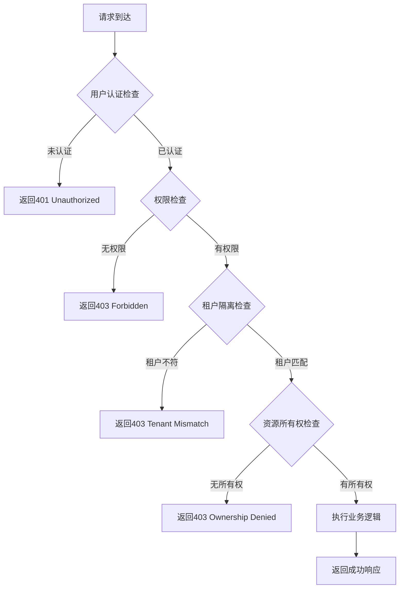

# API 层权限验证指南

## 📋 概述

本文档介绍如何在 API 层实现细粒度的权限控制，包括权限装饰器的使用方法和最佳实践。

---

## 🚀 快速开始

### 1. 安装依赖

确保已安装相关依赖：

```bash
npm install joi  # 用于输入验证
```

### 2. 基本使用

```javascript
const express = require('express');
const { requireApiPermission } = require('../decorators/api-permissions');

const router = express.Router();

// 简单权限控制
router.get('/users', requireApiPermission('users_read'), async (req, res) => {
  // 处理逻辑
});
```

---

## 🎯 核心装饰器

### 1. requireApiPermission - 基础权限验证

```javascript
// 单个权限
requireApiPermission('users_read');

// 多个权限（满足任一即可）
requireApiPermission(['users_read', 'content_read']);

// 多个权限（必须全部满足）
requireApiPermission(['users_read', 'users_create'], { requireAll: true });

// 带租户验证
requireApiPermission('content_create', { checkTenant: true });

// 带审计日志
requireApiPermission('users_delete', { audit: true });
```

### 2. requireMultiplePermissions - 复杂权限组合

```javascript
requireMultiplePermissions([
  {
    permissions: ['users_read'],
    options: { errorMessage: '需要用户查看权限' },
  },
  {
    permissions: ['users_approve'],
    condition: req => req.query.status === 'pending',
    options: { errorMessage: '需要用户审批权限' },
  },
]);
```

### 3. requireResourceOwnership - 资源所有权验证

```javascript
// 验证用户是否为资源所有者
requireResourceOwnership('userId'); // 参数名为 userId

// 在路由中使用
router.put(
  '/users/:userId',
  requireResourceOwnership('userId'),
  async (req, res) => {
    // 只有资源所有者或管理员能访问
  }
);
```

### 4. rateLimit - 速率限制

```javascript
// 基础速率限制
rateLimit({ max: 100, windowMs: 15 * 60 * 1000 }); // 15分钟100次

// 自定义配置
rateLimit({
  max: 10,
  windowMs: 60000, // 1分钟
  message: '请求过于频繁',
  keyGenerator: req => req.user?.id || req.ip,
});
```

### 5. validateInput - 输入验证

```javascript
validateInput({
  body: {
    username: 'string|required|min:3|max:50',
    email: 'string|required|email',
    role: 'string|in:admin,manager,user',
  },
  query: {
    page: 'number|optional|min:1',
    limit: 'number|optional|min:1|max:100',
  },
  params: {
    userId: 'string|uuid',
  },
});
```

---

## 📊 权限验证流程

### 标准验证流程



### 装饰器执行顺序

```javascript
router.post(
  '/api/resource',
  rateLimit(), // 1. 速率限制
  requireApiPermission(), // 2. 权限验证
  validateInput(), // 3. 输入验证
  requireResourceOwnership(), // 4. 资源所有权验证
  async (req, res) => {
    // 5. 业务逻辑
    // 处理请求
  }
);
```

---

## 🔧 实际应用示例

### 用户管理 API

```javascript
// 获取用户列表
router.get(
  '/users',
  requireApiPermission('users_read', { audit: true }),
  async (req, res) => {
    const users = await User.findAll({
      where: { tenant_id: req.user.tenant_id },
    });
    res.json({ success: true, data: users });
  }
);

// 创建用户
router.post(
  '/users',
  rateLimit({ max: 10, windowMs: 60000 }),
  requireApiPermission('users_create', { checkTenant: true, audit: true }),
  validateInput({
    body: {
      username: 'string|required|min:3|max:50',
      email: 'string|required|email',
      password: 'string|required|min:8',
    },
  }),
  async (req, res) => {
    const userData = {
      ...req.validatedBody,
      tenant_id: req.user.tenant_id,
      created_by: req.user.id,
    };
    const user = await User.create(userData);
    res.status(201).json({ success: true, data: user });
  }
);

// 更新用户（自我更新 vs 管理员更新）
router.put(
  '/users/:userId',
  requireMultiplePermissions([
    {
      permissions: ['users_update'],
      condition: req => req.params.userId !== req.user.id,
    },
  ]),
  requireResourceOwnership('userId'),
  async (req, res) => {
    const user = await User.update(req.params.userId, req.body);
    res.json({ success: true, data: user });
  }
);
```

### 内容管理 API

```javascript
// 创建内容
router.post(
  '/content',
  rateLimit({ max: 30, windowMs: 3600000 }), // 1小时30次
  requireApiPermission('content_create'),
  validateInput({
    body: {
      title: 'string|required|min:1|max:200',
      content: 'string|required|min:1',
      category: 'string|optional',
      tags: 'array|optional',
    },
  }),
  async (req, res) => {
    const contentData = {
      ...req.validatedBody,
      author_id: req.user.id,
      tenant_id: req.user.tenant_id,
      status: 'draft',
    };
    const content = await Content.create(contentData);
    res.status(201).json({ success: true, data: content });
  }
);

// 审批内容
router.patch(
  '/content/:contentId/approve',
  requireApiPermission('content_approve', { audit: true }),
  async (req, res) => {
    const { status, remarks } = req.body;
    const content = await Content.approve(
      req.params.contentId,
      status,
      remarks,
      req.user.id
    );
    res.json({ success: true, data: content });
  }
);
```

### 财务 API

```javascript
// 处理退款
router.post(
  '/payments/:paymentId/refund',
  requireApiPermission('payments_refund', { audit: true }),
  validateInput({
    body: {
      amount: 'number|required|min:0.01',
      reason: 'string|required|max:500',
    },
  }),
  async (req, res) => {
    const { amount, reason } = req.validatedBody;
    const refund = await Payment.processRefund(
      req.params.paymentId,
      amount,
      reason,
      req.user.id
    );
    res.json({ success: true, data: refund });
  }
);
```

---

## 🛡️ 安全最佳实践

### 1. 权限设计原则

```javascript
// ❌ 错误做法：权限过于宽泛
requireApiPermission('admin_access');

// ✅ 正确做法：最小权限原则
requireApiPermission(['users_read', 'users_create']);

// ✅ 更好的做法：基于操作的权限
requireApiPermission('users_create');
requireApiPermission('users_update');
requireApiPermission('users_delete');
```

### 2. 数据过滤

```javascript
// ❌ 错误做法：返回所有数据
const users = await User.findAll();

// ✅ 正确做法：基于租户过滤
const users = await User.findAll({
  where: {
    tenant_id: req.user.tenant_id,
  },
});

// ✅ 更好的做法：使用安全视图
const users = await db.query(
  'SELECT * FROM tenant_safe_users WHERE user_id = $1',
  [req.user.id]
);
```

### 3. 审计日志

```javascript
// 关键操作必须记录审计日志
requireApiPermission('users_delete', { audit: true });

// 自定义审计信息
await audit(
  'sensitive_operation',
  { id: req.user.id, roles: req.user.roles },
  'resource_name',
  { operation_details: '...' },
  'trace-id',
  { ip: req.ip, user_agent: req.get('User-Agent') }
);
```

### 4. 错误处理

```javascript
// 统一错误响应格式
function handleError(res, error, statusCode = 500) {
  const response = {
    success: false,
    error: error.message || '服务器内部错误',
    code: error.code || 'INTERNAL_ERROR',
  };

  if (process.env.NODE_ENV === 'development') {
    response.stack = error.stack;
  }

  res.status(statusCode).json(response);
}

// 在装饰器中使用
try {
  // 业务逻辑
} catch (error) {
  handleError(res, error);
}
```

---

## 📈 性能优化

### 1. 缓存权限检查结果

```javascript
const permissionCache = new Map();
const CACHE_TTL = 5 * 60 * 1000; // 5分钟

function getCachedPermission(userId, permissions) {
  const key = `${userId}:${permissions.join(',')}`;
  const cached = permissionCache.get(key);

  if (cached && Date.now() - cached.timestamp < CACHE_TTL) {
    return cached.result;
  }

  const result = checkPermissions(userId, permissions);
  permissionCache.set(key, {
    result,
    timestamp: Date.now(),
  });

  return result;
}
```

### 2. 批量权限检查

```javascript
// 一次检查多个权限
const permissions = ['users_read', 'content_read', 'shops_read'];
const results = await checkMultiplePermissions(userId, permissions);

// 在装饰器中使用
requireMultiplePermissions([
  {
    permissions: ['users_read'],
    options: {
      /* ... */
    },
  },
  {
    permissions: ['content_read'],
    options: {
      /* ... */
    },
  },
]);
```

---

## 🧪 测试策略

### 1. 权限测试用例

```javascript
describe('API 权限验证', () => {
  test('无权限用户访问受保护资源应该被拒绝', async () => {
    const response = await request(app)
      .get('/api/users')
      .set('Authorization', `Bearer ${noPermissionToken}`);

    expect(response.status).toBe(403);
    expect(response.body.success).toBe(false);
  });

  test('有权限用户应该能正常访问', async () => {
    const response = await request(app)
      .get('/api/users')
      .set('Authorization', `Bearer ${adminToken}`);

    expect(response.status).toBe(200);
    expect(response.body.success).toBe(true);
  });
});
```

### 2. 租户隔离测试

```javascript
test('用户不能访问其他租户的数据', async () => {
  const response = await request(app)
    .get('/api/content?tenant_id=other-tenant-id')
    .set('Authorization', `Bearer ${userToken}`);

  expect(response.status).toBe(403);
});
```

---

## 📞 支持与维护

### 常见问题

**Q: 权限验证太慢怎么办？**
A: 考虑实现权限缓存，或者将常用权限检查移到数据库层面

**Q: 如何处理复杂的权限组合逻辑？**
A: 使用 `requireMultiplePermissions` 装饰器，配合条件函数

**Q: 审计日志太多影响性能怎么办？**
A: 可以采用异步写入，或者批量处理审计日志

**Q: 如何测试权限系统？**
A: 编写全面的单元测试和集成测试，覆盖各种权限场景

---
