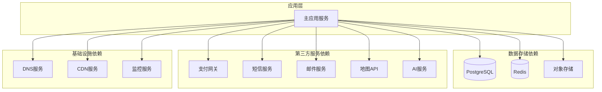
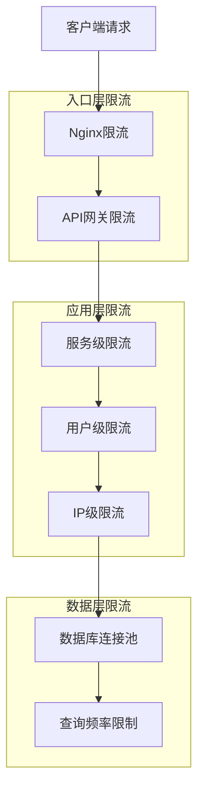
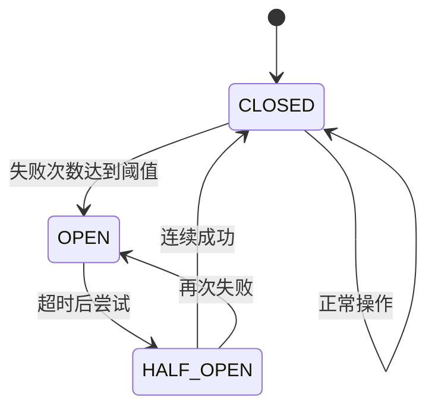

# 关键依赖与限流/重试策略

## 目录

1. [系统依赖关系](#系统依赖关系)
2. [限流策略](#限流策略)
3. [重试机制](#重试机制)
4. [熔断器模式](#熔断器模式)
5. [降级策略](#降级策略)
6. [监控告警](#监控告警)

## 系统依赖关系

### 核心依赖拓扑图



### 依赖重要性分级

```yaml
依赖等级:
  关键依赖 (Critical):
    - PostgreSQL数据库
    - Redis缓存
    - 认证服务
    影响: 系统不可用

  重要依赖 (High):
    - 支付网关
    - 短信服务
    - 邮件服务
    影响: 核心功能受限

  普通依赖 (Medium):
    - 地图API
    - AI服务
    - CDN服务
    影响: 用户体验下降

  可选依赖 (Low):
    - 分析服务
    - 第三方集成
    - 备用功能
    影响: 功能缺失但不影响核心业务
```

### 依赖健康检查

```javascript
// 依赖健康检查服务
class DependencyHealthChecker {
  constructor() {
    this.dependencies = {
      database: {
        check: () => this.checkDatabase(),
        timeout: 5000,
        critical: true,
      },
      redis: {
        check: () => this.checkRedis(),
        timeout: 2000,
        critical: true,
      },
      payment: {
        check: () => this.checkPaymentService(),
        timeout: 10000,
        critical: false,
      },
    };
  }

  async checkAllDependencies() {
    const results = {};

    for (const [name, config] of Object.entries(this.dependencies)) {
      try {
        const result = await Promise.race([
          config.check(),
          new Promise((_, reject) =>
            setTimeout(() => reject(new Error('Timeout')), config.timeout)
          ),
        ]);
        results[name] = { status: 'healthy', details: result };
      } catch (error) {
        results[name] = {
          status: 'unhealthy',
          error: error.message,
          critical: config.critical,
        };
      }
    }

    return results;
  }
}
```

## 限流策略

### 多层级限流架构



### 限流算法实现

#### 令牌桶算法

```javascript
class TokenBucket {
  constructor(capacity, refillRate) {
    this.capacity = capacity;
    this.tokens = capacity;
    this.refillRate = refillRate; // tokens per second
    this.lastRefill = Date.now();

    // 定期补充令牌
    setInterval(() => this.refill(), 1000);
  }

  refill() {
    const now = Date.now();
    const elapsed = (now - this.lastRefill) / 1000;
    const newTokens = Math.floor(elapsed * this.refillRate);

    this.tokens = Math.min(this.capacity, this.tokens + newTokens);
    this.lastRefill = now;
  }

  consume(tokens = 1) {
    if (this.tokens >= tokens) {
      this.tokens -= tokens;
      return true;
    }
    return false;
  }
}

// 使用示例
const userRateLimiter = new TokenBucket(100, 10); // 100容量，每秒补充10个令牌
```

#### 滑动窗口算法

```javascript
class SlidingWindowCounter {
  constructor(windowSizeMs, maxRequests) {
    this.windowSizeMs = windowSizeMs;
    this.maxRequests = maxRequests;
    this.requests = [];
  }

  addRequest(timestamp = Date.now()) {
    // 清理过期请求
    const cutoff = timestamp - this.windowSizeMs;
    this.requests = this.requests.filter(time => time > cutoff);

    // 添加新请求
    this.requests.push(timestamp);

    return this.requests.length <= this.maxRequests;
  }

  getCount() {
    const cutoff = Date.now() - this.windowSizeMs;
    return this.requests.filter(time => time > cutoff).length;
  }
}

// 使用示例
const ipLimiter = new SlidingWindowCounter(60000, 1000); // 1分钟内最多1000次请求
```

### 限流配置策略

```yaml
rate_limiting:
  global:
    requests_per_second: 1000
    burst_limit: 2000

  per_user:
    authenticated:
      requests_per_minute: 100
      burst_limit: 200
    anonymous:
      requests_per_minute: 30
      burst_limit: 50

  per_ip:
    requests_per_minute: 200
    burst_limit: 500

  per_endpoint:
    /api/appointments/create:
      requests_per_minute: 10
      burst_limit: 20
    /api/search:
      requests_per_minute: 60
      burst_limit: 100
    /api/payments:
      requests_per_minute: 5
      burst_limit: 10
```

## 重试机制

### 重试策略模式

#### 指数退避重试

```javascript
class ExponentialBackoffRetry {
  constructor(options = {}) {
    this.maxAttempts = options.maxAttempts || 3;
    this.baseDelay = options.baseDelay || 1000; // 1秒
    this.maxDelay = options.maxDelay || 30000; // 30秒
    this.multiplier = options.multiplier || 2;
    this.jitter = options.jitter !== false; // 默认启用抖动
  }

  async execute(operation, shouldRetry = () => true) {
    let lastError;

    for (let attempt = 1; attempt <= this.maxAttempts; attempt++) {
      try {
        return await operation();
      } catch (error) {
        lastError = error;

        // 检查是否应该重试
        if (!shouldRetry(error) || attempt === this.maxAttempts) {
          throw error;
        }

        // 计算延迟时间
        const delay = this.calculateDelay(attempt);
        console.log(`Attempt ${attempt} failed, retrying in ${delay}ms`);

        // 等待后重试
        await this.sleep(delay);
      }
    }

    throw lastError;
  }

  calculateDelay(attempt) {
    const exponentialDelay =
      this.baseDelay * Math.pow(this.multiplier, attempt - 1);
    const cappedDelay = Math.min(exponentialDelay, this.maxDelay);

    if (this.jitter) {
      // 添加随机抖动避免惊群效应
      return cappedDelay * (0.5 + Math.random() * 0.5);
    }

    return cappedDelay;
  }

  sleep(ms) {
    return new Promise(resolve => setTimeout(resolve, ms));
  }
}

// 使用示例
const retryStrategy = new ExponentialBackoffRetry({
  maxAttempts: 3,
  baseDelay: 1000,
  maxDelay: 10000,
});

const result = await retryStrategy.execute(
  () => fetchExternalApi(),
  error => {
    // 只对网络错误和5xx错误重试
    return (
      error instanceof NetworkError ||
      (error.response && error.response.status >= 500)
    );
  }
);
```

#### 断路器模式重试

```javascript
class CircuitBreaker {
  constructor(options = {}) {
    this.failureThreshold = options.failureThreshold || 5;
    this.timeout = options.timeout || 60000; // 1分钟
    this.resetTimeout = options.resetTimeout || 30000; // 30秒

    this.state = 'CLOSED'; // CLOSED, OPEN, HALF_OPEN
    this.failureCount = 0;
    this.lastFailureTime = null;
    this.halfOpenSuccesses = 0;
  }

  async execute(operation) {
    // 检查断路器状态
    if (this.state === 'OPEN') {
      const timeSinceLastFailure = Date.now() - this.lastFailureTime;
      if (timeSinceLastFailure < this.timeout) {
        throw new Error('Circuit breaker is OPEN');
      }
      // 进入半开状态
      this.state = 'HALF_OPEN';
      this.halfOpenSuccesses = 0;
    }

    try {
      const result = await operation();

      // 成功处理
      if (this.state === 'HALF_OPEN') {
        this.halfOpenSuccesses++;
        if (this.halfOpenSuccesses >= 3) {
          this.reset(); // 完全关闭断路器
        }
      } else {
        this.failureCount = 0;
      }

      return result;
    } catch (error) {
      // 失败处理
      this.failureCount++;
      this.lastFailureTime = Date.now();

      if (this.failureCount >= this.failureThreshold) {
        this.state = 'OPEN';
      }

      throw error;
    }
  }

  reset() {
    this.state = 'CLOSED';
    this.failureCount = 0;
    this.lastFailureTime = null;
    this.halfOpenSuccesses = 0;
  }
}
```

### 重试配置管理

```yaml
retry_policies:
  database:
    max_attempts: 3
    strategy: exponential_backoff
    base_delay: 1000
    max_delay: 10000
    retryable_errors:
      - ConnectionError
      - TimeoutError
      - DeadlockError

  external_api:
    max_attempts: 2
    strategy: fixed_interval
    interval: 2000
    retryable_errors:
      - NetworkError
      - ServiceUnavailable
      - GatewayTimeout

  critical_operation:
    max_attempts: 5
    strategy: fibonacci_backoff
    base_delay: 500
    max_delay: 30000
    retryable_errors:
      - all_errors
```

## 熔断器模式

### 熔断器状态机



### 熔断器实现

```javascript
class AdvancedCircuitBreaker {
  constructor(config = {}) {
    this.config = {
      failureThreshold: 5,
      successThreshold: 3,
      timeout: 60000,
      resetTimeout: 30000,
      failureRateThreshold: 0.5,
      ...config,
    };

    this.metrics = {
      totalRequests: 0,
      failedRequests: 0,
      recentResults: [],
      windowSize: 100,
    };

    this.state = 'CLOSED';
    this.lastStateChanged = Date.now();
  }

  async call(operation) {
    this.checkState();

    try {
      this.metrics.totalRequests++;
      const result = await operation();
      this.onSuccess();
      return result;
    } catch (error) {
      this.onFailure(error);
      throw error;
    }
  }

  checkState() {
    const now = Date.now();

    switch (this.state) {
      case 'OPEN':
        if (now - this.lastStateChanged > this.config.timeout) {
          this.state = 'HALF_OPEN';
          this.lastStateChanged = now;
        }
        break;

      case 'HALF_OPEN':
        if (now - this.lastStateChanged > this.config.resetTimeout) {
          this.state = 'OPEN';
          this.lastStateChanged = now;
        }
        break;
    }
  }

  onSuccess() {
    this.updateMetrics(true);

    if (this.state === 'HALF_OPEN') {
      this.metrics.successCount = (this.metrics.successCount || 0) + 1;
      if (this.metrics.successCount >= this.config.successThreshold) {
        this.reset();
      }
    }
  }

  onFailure(error) {
    this.updateMetrics(false);

    if (this.shouldOpenCircuit()) {
      this.openCircuit();
    }
  }

  updateMetrics(success) {
    this.metrics.recentResults.push(success);

    if (this.metrics.recentResults.length > this.config.windowSize) {
      const removed = this.metrics.recentResults.shift();
      if (!removed) this.metrics.failedRequests--;
    }

    if (!success) {
      this.metrics.failedRequests++;
    }
  }

  shouldOpenCircuit() {
    if (this.state !== 'CLOSED') return false;

    const totalRecent = this.metrics.recentResults.length;
    if (totalRecent < this.config.failureThreshold) return false;

    const failureRate = this.metrics.failedRequests / totalRecent;
    return failureRate >= this.config.failureRateThreshold;
  }

  openCircuit() {
    this.state = 'OPEN';
    this.lastStateChanged = Date.now();
    this.metrics.successCount = 0;
  }

  reset() {
    this.state = 'CLOSED';
    this.lastStateChanged = Date.now();
    this.metrics = {
      totalRequests: 0,
      failedRequests: 0,
      recentResults: [],
      windowSize: this.config.windowSize,
    };
  }
}
```

## 降级策略

### 服务降级机制

```javascript
class ServiceDegradationManager {
  constructor() {
    this.degradationLevels = {
      NORMAL: 0,
      DEGRADED: 1,
      MINIMAL: 2,
      OFFLINE: 3,
    };

    this.currentLevel = this.degradationLevels.NORMAL;
    this.serviceStatus = new Map();
  }

  async executeWithFallback(primaryOperation, fallbackOperation, serviceName) {
    try {
      // 检查服务健康状态
      if (this.shouldDegradate(serviceName)) {
        return await fallbackOperation();
      }

      const result = await primaryOperation();

      // 更新服务状态
      this.updateServiceStatus(serviceName, true);
      return result;
    } catch (error) {
      console.warn(
        `Primary operation failed for ${serviceName}:`,
        error.message
      );

      // 更新服务状态
      this.updateServiceStatus(serviceName, false);

      // 执行降级操作
      return await fallbackOperation();
    }
  }

  shouldDegradate(serviceName) {
    const status = this.serviceStatus.get(serviceName);
    if (!status) return false;

    // 基于错误率决定是否降级
    const errorRate = status.errors / status.totalRequests;
    return errorRate > 0.3 || status.consecutiveFailures > 3;
  }

  updateServiceStatus(serviceName, success) {
    const status = this.serviceStatus.get(serviceName) || {
      totalRequests: 0,
      errors: 0,
      consecutiveFailures: 0,
      lastSuccess: null,
    };

    status.totalRequests++;

    if (success) {
      status.consecutiveFailures = 0;
      status.lastSuccess = Date.now();
    } else {
      status.errors++;
      status.consecutiveFailures++;
    }

    this.serviceStatus.set(serviceName, status);
  }
}

// 使用示例
const degradationManager = new ServiceDegradationManager();

const result = await degradationManager.executeWithFallback(
  // 主要操作
  () => fetchFromPrimaryCache(),
  // 降级操作
  () => fetchFromDatabase(),
  'cache-service'
);
```

### 功能降级策略

```yaml
degradation_strategies:
  search_service:
    levels:
      - normal: 返回完整搜索结果
      - degraded: 返回缓存结果，限制排序
      - minimal: 只返回基本匹配，无高级筛选
      - offline: 返回静态默认结果

  recommendation_engine:
    levels:
      - normal: 实时个性化推荐
      - degraded: 基于热门商品推荐
      - minimal: 返回分类导航
      - offline: 返回固定推荐列表

  image_processing:
    levels:
      - normal: 高质量图片处理
      - degraded: 中等质量，减少特效
      - minimal: 基础尺寸调整
      - offline: 返回原始图片
```

## 监控告警

### 关键指标监控

```javascript
class DependencyMonitor {
  constructor() {
    this.metrics = {
      requestCount: new Map(),
      errorCount: new Map(),
      responseTime: new Map(),
      availability: new Map(),
    };
  }

  recordRequest(serviceName, success, responseTime) {
    // 记录请求数
    const requestCount = this.metrics.requestCount.get(serviceName) || 0;
    this.metrics.requestCount.set(serviceName, requestCount + 1);

    // 记录错误数
    if (!success) {
      const errorCount = this.metrics.errorCount.get(serviceName) || 0;
      this.metrics.errorCount.set(serviceName, errorCount + 1);
    }

    // 记录响应时间
    const times = this.metrics.responseTime.get(serviceName) || [];
    times.push(responseTime);
    if (times.length > 1000) times.shift(); // 保持最近1000个样本
    this.metrics.responseTime.set(serviceName, times);

    // 计算可用性
    this.calculateAvailability(serviceName);
  }

  calculateAvailability(serviceName) {
    const total = this.metrics.requestCount.get(serviceName) || 1;
    const errors = this.metrics.errorCount.get(serviceName) || 0;
    const availability = ((total - errors) / total) * 100;
    this.metrics.availability.set(serviceName, availability);
  }

  getMetrics(serviceName) {
    return {
      requestCount: this.metrics.requestCount.get(serviceName) || 0,
      errorCount: this.metrics.errorCount.get(serviceName) || 0,
      availability: this.metrics.availability.get(serviceName) || 100,
      avgResponseTime: this.getAverageResponseTime(serviceName),
      errorRate: this.getErrorRate(serviceName),
    };
  }

  getAverageResponseTime(serviceName) {
    const times = this.metrics.responseTime.get(serviceName) || [];
    if (times.length === 0) return 0;
    return times.reduce((sum, time) => sum + time, 0) / times.length;
  }

  getErrorRate(serviceName) {
    const total = this.metrics.requestCount.get(serviceName) || 1;
    const errors = this.metrics.errorCount.get(serviceName) || 0;
    return (errors / total) * 100;
  }
}
```

### 告警规则配置

```yaml
alerting_rules:
  service_availability:
    - name: critical_service_down
      condition: availability < 99.9%
      duration: 5m
      severity: critical
      targets:
        - pagerduty
        - email_admin

    - name: service_degraded
      condition: availability < 99.0%
      duration: 10m
      severity: warning
      targets:
        - slack_ops
        - email_team

  error_rates:
    - name: high_error_rate
      condition: error_rate > 5%
      duration: 2m
      severity: critical
      targets:
        - pagerduty

    - name: increasing_errors
      condition: error_rate_increase > 50% in 10m
      severity: warning
      targets:
        - slack_dev

  response_times:
    - name: slow_response
      condition: p95_response_time > 2000ms
      duration: 5m
      severity: warning
      targets:
        - slack_perf

    - name: very_slow_response
      condition: p99_response_time > 5000ms
      duration: 1m
      severity: critical
      targets:
        - pagerduty
```

### 健康检查端点

```javascript
// 健康检查API
app.get('/health', async (req, res) => {
  const checks = {
    database: await checkDatabaseHealth(),
    redis: await checkRedisHealth(),
    externalServices: await checkExternalServices(),
    systemResources: await checkSystemResources(),
  };

  const overallHealthy = Object.values(checks).every(check => check.healthy);

  res.status(overallHealthy ? 200 : 503).json({
    status: overallHealthy ? 'healthy' : 'unhealthy',
    timestamp: new Date().toISOString(),
    checks,
    metrics: {
      uptime: process.uptime(),
      memory: process.memoryUsage(),
      cpu: await getCpuUsage(),
    },
  });
});

// 详细依赖健康检查
app.get('/health/dependencies', async (req, res) => {
  const dependencyHealth = await dependencyMonitor.getAllDependencyHealth();

  res.json({
    dependencies: dependencyHealth,
    recommendations: getHealthRecommendations(dependencyHealth),
  });
});
```

---

_最后更新: 2026-02-20_
_版本: 1.2.0_
