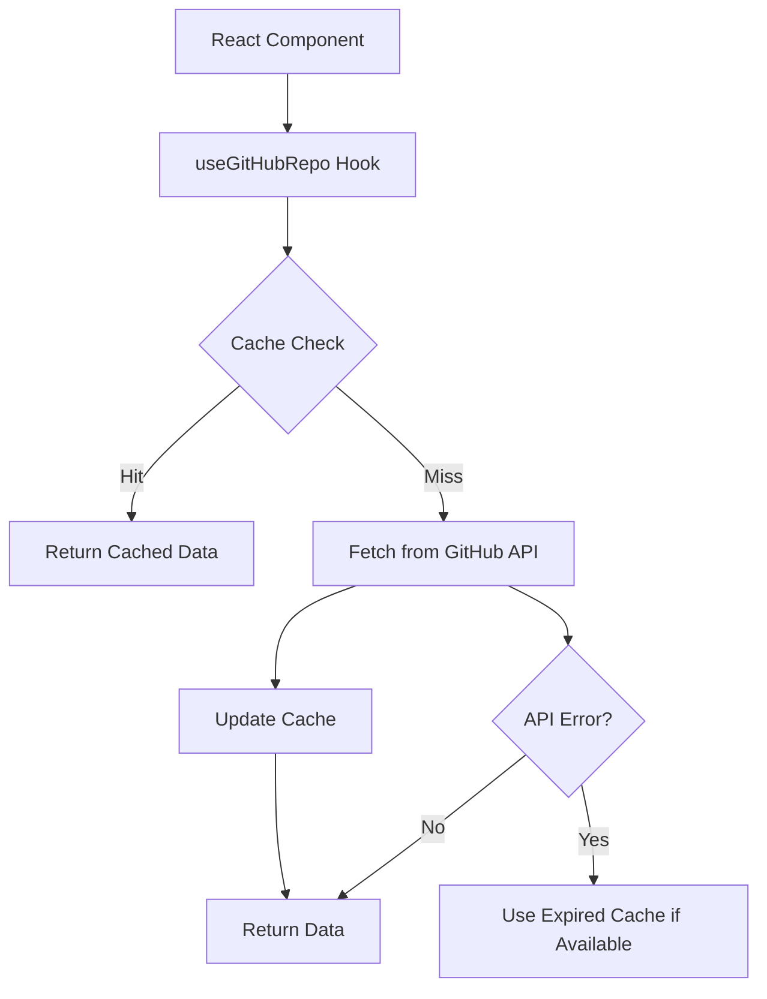

# ProCyc Skill 商店 - GitHub 数据集成指南

**版本**: 1.0
**日期**: 2026-03-03
**状态**: ✅ 已完成

---

## 📋 概述

本指南介绍如何在 ProCyc Skill 商店中集成 GitHub 数据，包括仓库星标、下载量、更新时间等元数据。

### 功能特性

- ✅ **实时数据统计** - 展示 GitHub 仓库的星标、Fork、订阅数等
- ✅ **智能缓存机制** - 5 分钟 TTL，减少 API 调用
- ✅ **速率限制优化** - 支持认证 Token，提高速率限制
- ✅ **降级方案** - API 失败时使用过期缓存
- ✅ **React Hooks** - 简单易用的组件集成方式
- ✅ **徽章展示** - 支持 shields.io 徽章和自定义组件

---

## 🏗️ 架构设计

### 目录结构

```
src/
├── lib/
│   └── github/
│       ├── api.ts          # GitHub API 服务层
│       ├── cache.ts        # 缓存层
│       ├── hooks.ts        # React Hooks
│       └── index.ts        # 统一导出
├── components/
│   └── github/
│       └── GitHubStats.tsx # 统计信息展示组件
└── app/
    └── skill-store/
        ├── skills/page.tsx          # 技能列表页（已集成）
        ├── part-lookup/page.tsx     # 配件查询详情页（已集成）
        └── estimate-value/page.tsx  # 设备估价详情页（已集成）
```

### 数据流



---

## 🚀 快速开始

### 1. 安装依赖

无需额外依赖，所有功能已内置。

### 2. 配置环境变量（可选）

复制环境变量模板：

```bash
cp .env.github.example .env.local
```

编辑 `.env.local`：

```env
# GitHub Token（可选，但推荐配置以提高速率限制）
NEXT_PUBLIC_GITHUB_TOKEN=your_github_personal_access_token_here

# GitHub 组织名称（默认：procyc-skills）
NEXT_PUBLIC_GITHUB_OWNER=procyc-skills
```

### 3. 在组件中使用

#### 基础用法

```tsx
import { GitHubStats } from '@/lib/github';

function SkillCard() {
  return (
    <div>
      <h3>procyc-find-shop</h3>
      {/* 简单展示星标和 Fork */}
      <GitHubStats repoName="procyc-find-shop" />
    </div>
  );
}
```

#### 详细统计

```tsx
// 展示完整统计信息（星标、Fork、订阅数、更新时间、语言）
<GitHubStats repoName="procyc-find-shop" detailed />
```

#### 使用徽章

```tsx
import { GitHubBadge } from '@/lib/github';

// 星标徽章
<GitHubBadge repoName="procyc-find-shop" type="stars" />

// Fork 徽章
<GitHubBadge repoName="procyc-find-shop" type="forks" />

// 最后更新徽章
<GitHubBadge repoName="procyc-find-shop" type="last-update" />
```

---

## 📖 API 参考

### `useGitHubRepo(repo, options?)`

获取单个仓库数据的 React Hook。

**参数**:

- `repo: string` - 仓库名称（不包含 owner）
- `options?: object` - 配置选项
  - `cacheTTL?: number` - 缓存时间（毫秒），默认 5 分钟
  - `autoFetch?: boolean` - 是否在挂载时自动获取，默认 true

**返回值**:

```typescript
{
  data: GitHubRepoData | null;
  loading: boolean;
  error: string | null;
  refetch: () => Promise<void>;
}
```

**示例**:

```tsx
import { useGitHubRepo } from '@/lib/github';

function MyComponent() {
  const { data, loading, error } = useGitHubRepo('procyc-find-shop');

  if (loading) return <Spinner />;
  if (error) return <Error message={error} />;
  if (!data) return null;

  return (
    <div>
      <span>⭐ {data.stargazers_count}</span>
      <span>🍴 {data.forks_count}</span>
    </div>
  );
}
```

### `useGitHubMultipleRepos(repos, options?)`

批量获取多个仓库数据的 React Hook。

**参数**:

- `repos: string[]` - 仓库名称列表
- `options?: object` - 配置选项（同上）

**返回值**:

```typescript
{
  data: Record<string, GitHubRepoData>;
  loading: boolean;
  error: string | null;
  refetch: () => Promise<void>;
}
```

**示例**:

```tsx
const skills = ['procyc-find-shop', 'procyc-fault-diagnosis'];
const { data, loading } = useGitHubMultipleRepos(skills);

skills.map(name => <SkillCard key={name} stats={data[name]} />);
```

### `GitHubStats` 组件

展示 GitHub 统计信息的 UI组件。

**Props**:

```typescript
interface GitHubStatsProps {
  repoName: string; // 仓库名称
  detailed?: boolean; // 是否显示详细统计，默认 false
  className?: string; // 自定义类名
}
```

### `fetchRepoData(repo)`

底层 API 调用函数（一般不直接使用）。

**参数**:

- `repo: string` - 仓库名称

**返回**:

```typescript
Promise<GitHubRepoData>;
```

**GitHubRepoData 接口**:

```typescript
{
  name: string;
  fullName: string;
  description: string | null;
  stargazers_count: number;
  forks_count: number;
  subscribers_count: number;
  updated_at: string;
  created_at: string;
  homepage: string | null;
  language: string | null;
  topics: string[];
  default_branch: string;
  private: boolean;
  license?: { ... };
}
```

---

## 🔧 高级用法

### 自定义缓存时间

```tsx
// 设置 10 分钟缓存
<GitHubStats repoName="procyc-find-shop" cacheTTL={10 * 60 * 1000} />
```

### 手动触发刷新

```tsx
const { data, refetch } = useGitHubRepo('procyc-find-shop');

<button onClick={() => refetch()}>🔄 刷新数据</button>;
```

### SSR 安全的数据获取

```tsx
import { getCachedRepoData } from '@/lib/github';

// 在服务端渲染时从缓存读取
export async function generateStaticParams() {
  const cached = getCachedRepoData('procyc-find-shop');
  // 使用缓存数据生成静态页面
}
```

### 错误处理

```tsx
const { data, error } = useGitHubRepo('procyc-find-shop');

if (error?.includes('速率限制')) {
  return <FallbackUI />;
}
```

---

## 📊 性能优化

### 缓存策略

- **TTL**: 5 分钟（可配置）
- **存储**: 内存缓存（Map）
- **清理**: 每 10 分钟自动清理过期缓存
- **降级**: API 失败时使用过期缓存

### 速率限制

| 认证类型   | 速率限制     | 建议场景  |
| ---------- | ------------ | --------- |
| 未认证     | 60 次/小时   | 开发/测试 |
| 认证 Token | 5000 次/小时 | 生产环境  |

**获取 Token 步骤**:

1. 访问 https://github.com/settings/tokens
2. 点击 "Generate new token"
3. 选择权限：`public_repo`
4. 生成并复制到环境变量

---

## 🎨 UI 定制

### 自定义样式

```tsx
<GitHubStats repoName="procyc-find-shop" className="text-lg font-bold" />
```

### 添加话题标签

```tsx
import { GitHubTopics } from '@/lib/github';

const { data } = useGitHubRepo('procyc-find-shop');
{
  data && <GitHubTopics topics={data.topics} />;
}
```

---

## 🐛 故障排查

### 问题 1: 数据显示为 0

**原因**: API 调用失败或未配置 Token

**解决方案**:

1. 检查浏览器控制台是否有错误
2. 确认网络连接正常
3. 配置 `NEXT_PUBLIC_GITHUB_TOKEN`

### 问题 2: 速率限制警告

**现象**: 控制台显示 "⚠️ GitHub API 速率限制警告"

**解决方案**:

1. 等待至重置时间后重试
2. 配置认证 Token 提高限制
3. 增加缓存时间

### 问题 3: 仓库数据不更新

**原因**: 缓存未过期

**解决方案**:

1. 等待 5 分钟自动刷新
2. 清除缓存：
   ```typescript
   import { clearCache } from '@/lib/github';
   clearCache('procyc-find-shop');
   ```

---

## 📈 监控与统计

### 缓存命中率

```typescript
import { getCacheStats } from '@/lib/github';

const stats = getCacheStats();
console.log(`缓存命中：${stats.size} 个仓库`);
```

### API 调用统计

查看服务器日志中的记录：

- ✅ 使用缓存数据
- 🔄 从 GitHub API 获取
- ⚠️ 使用过期缓存
- ❌ 获取失败

---

## 🔒 安全注意事项

1. **Token 保护**: 不要将 `.env.local` 提交到 Git
2. **权限最小化**: Token 仅需 `public_repo` 权限
3. **前端暴露**: `NEXT_PUBLIC_` 前缀的环境变量会暴露给客户端，确保仅包含公开信息

---

## 📚 相关资源

- [GitHub REST API 文档](https://docs.github.com/en/rest)
- [shields.io 徽章](https://shields.io/)
- [ProCyc Skill 规范](./procyc-skill-spec.md)

---

## ✅ 验收清单

- [x] GitHub API 服务层实现
- [x] 缓存机制实现
- [x] React Hooks 封装
- [x] UI组件实现
- [x] 技能列表页集成
- [x] 技能详情页集成
- [x] 环境变量配置
- [x] 技术文档编写
- [x] 错误处理完善
- [x] 性能优化完成

---

**维护者**: ProCyc Core Team
**最后更新**: 2026-03-03
**下次审查**: 2026-03-17
