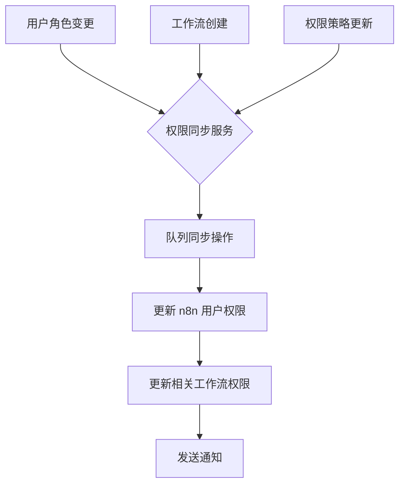
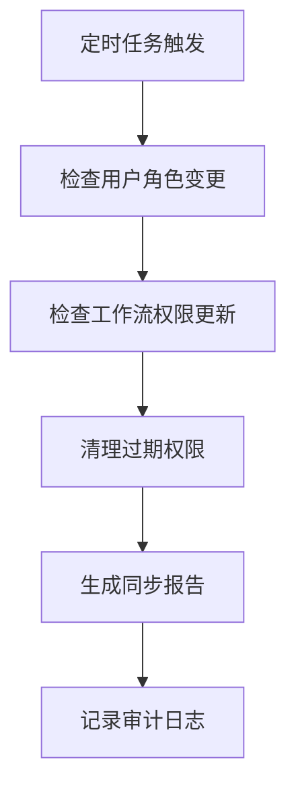

# n8n 权限集成指南

## 📋 概述

本文档介绍如何将系统权限控制与 n8n 工作流平台进行深度集成，实现统一的权限管理和访问控制。

---

## 🚀 快速开始

### 1. 环境配置

在 `.env` 文件中添加 n8n 相关配置：

```env
# n8n 配置
N8N_API_URL=http://localhost:5678
N8N_API_TOKEN=your-api-token-here
N8N_WEBHOOK_SECRET=your-webhook-secret-here

# 权限同步配置
N8N_PERMISSION_SYNC_ENABLED=true
N8N_SYNC_INTERVAL_MINUTES=5
```

### 2. 启动权限同步服务

```bash
# 启动 n8n 权限同步服务
node src/services/n8n-permission-sync.js
```

### 3. 验证集成状态

```bash
# 检查同步状态
curl -X GET http://localhost:3000/api/n8n/status
```

---

## 🎯 核心功能

### 1. 权限同步机制

#### 自动同步

- **用户角色变更**: 当系统中用户角色发生变化时，自动同步到 n8n
- **工作流创建**: 新创建工作流时自动应用默认权限配置
- **权限策略更新**: 权限策略变更时触发全量同步

#### 定期同步

- 每 5 分钟执行一次权限状态检查
- 确保系统与 n8n 权限一致性
- 自动清理过期的临时权限

### 2. 工作流权限控制

#### 细粒度权限

```javascript
// 读取权限 - 查看工作流定义
{
  "readRoles": ["admin", "manager", "agent_operator", "content_manager"]
}

// 执行权限 - 运行工作流
{
  "executeRoles": ["admin", "manager", "agent_operator"]
}

// 管理权限 - 修改工作流配置
{
  "manageRoles": ["admin", "manager"]
}
```

#### 特定工作流配置

```json
{
  "b2b-procurement-advanced-workflow": {
    "readRoles": ["admin", "manager", "procurement_specialist"],
    "executeRoles": ["admin", "manager", "procurement_specialist"],
    "manageRoles": ["admin", "manager"]
  }
}
```

### 3. API 接口

#### 获取可访问工作流

```bash
GET /api/n8n/workflows
Authorization: Bearer <jwt-token>

响应:
{
  "success": true,
  "data": [
    {
      "id": "workflow-1",
      "name": "采购处理工作流",
      "permissions": {
        "canRead": true,
        "canExecute": true,
        "canManage": false
      }
    }
  ]
}
```

#### 执行工作流

```bash
POST /api/n8n/workflows
Authorization: Bearer <jwt-token>
Content-Type: application/json

{
  "workflowId": "workflow-1",
  "action": "execute",
  "inputData": {
    "order_id": "ORD-001",
    "customer_name": "张三"
  }
}

响应:
{
  "success": true,
  "message": "工作流执行成功",
  "data": {
    "executionId": "exec-123",
    "status": "completed",
    "result": { ... }
  }
}
```

#### 更新工作流权限

```bash
PUT /api/n8n/workflows
Authorization: Bearer <jwt-token>
Content-Type: application/json

{
  "workflowId": "workflow-1",
  "permissions": {
    "readRoles": ["admin", "manager", "procurement_specialist"],
    "executeRoles": ["admin", "manager"],
    "manageRoles": ["admin"]
  }
}
```

---

## 🔧 配置详解

### 角色映射配置

```json
{
  "role_mapping": {
    "admin": {
      "n8n_role": "owner",
      "permissions": ["*"]
    },
    "manager": {
      "n8n_role": "member",
      "permissions": ["workflow:read", "workflow:execute", "workflow:update"]
    },
    "agent_operator": {
      "n8n_role": "member",
      "permissions": ["workflow:read", "workflow:execute"]
    }
  }
}
```

### 事件触发配置

```json
{
  "event_triggers": {
    "user_role_changed": {
      "enabled": true,
      "sync_immediately": true,
      "debounce_time_ms": 1000
    },
    "workflow_created": {
      "enabled": true,
      "apply_default_permissions": true
    }
  }
}
```

---

## 📊 权限矩阵

| 角色                          | 工作流读取 | 工作流执行 | 工作流管理 | 权限管理 |
| ----------------------------- | ---------- | ---------- | ---------- | -------- |
| 超级管理员 (admin)            | ✅         | ✅         | ✅         | ✅       |
| 管理员 (manager)              | ✅         | ✅         | ✅         | ❌       |
| 智能体操作员 (agent_operator) | ✅         | ✅         | ❌         | ❌       |
| 内容管理员 (content_manager)  | ✅         | ❌         | ❌         | ❌       |
| 查看员 (viewer)               | ✅         | ❌         | ❌         | ❌       |

### 特定工作流权限

#### 采购相关工作流

- **可访问角色**: admin, manager, procurement_specialist
- **可执行角色**: admin, manager, procurement_specialist
- **可管理角色**: admin, manager

#### 财务相关工作流

- **可访问角色**: admin, manager, finance_manager
- **可执行角色**: admin, manager, finance_manager
- **可管理角色**: admin, manager

#### 智能体工作流

- **可访问角色**: admin, manager, agent_operator
- **可执行角色**: admin, manager, agent_operator
- **可管理角色**: admin, manager

---

## 🛡️ 安全最佳实践

### 1. 权限设计原则

```javascript
// ❌ 错误做法：权限过于宽泛
{
  "readRoles": ["*"]  // 所有人都能读取
}

// ✅ 正确做法：最小权限原则
{
  "readRoles": ["admin", "manager", "specific_role"]
}
```

### 2. 审计日志

所有敏感操作都会记录审计日志：

- 用户角色变更
- 工作流权限更新
- 工作流执行操作

```javascript
await audit(
  'workflow_execute',
  { id: userId, roles: userRoles },
  'n8n_workflows',
  {
    workflow_id: workflowId,
    execution_id: executionId,
    input_data: maskedInputData,
  }
);
```

### 3. 数据脱敏

敏感输入数据会自动脱敏：

```javascript
// 原始数据
{
  "phone": "13812345678",
  "id_card": "110101199001011234"
}

// 脱敏后
{
  "phone": "138****5678",
  "id_card": "110101********1234"
}
```

---

## 🔄 同步机制详解

### 事件驱动同步



### 定期同步流程



### 重试机制

```javascript
// 同步失败时的重试策略
{
  "max_retry_attempts": 3,
  "retry_delay_base": 5000,  // 5秒基础延迟
  "retry_delay_multiplier": 2, // 指数退避
  "retry_jitter": 1000  // 随机抖动
}
```

---

## 🧪 测试验证

### 权限验证测试

```bash
# 测试用户权限
curl -X GET "http://localhost:3000/api/n8n/workflows?workflowId=test-workflow&action=read" \
  -H "Authorization: Bearer <user-token>"

# 测试工作流执行
curl -X POST "http://localhost:3000/api/n8n/workflows" \
  -H "Authorization: Bearer <user-token>" \
  -H "Content-Type: application/json" \
  -d '{
    "workflowId": "test-workflow",
    "action": "execute",
    "inputData": {"test": "data"}
  }'
```

### 同步状态检查

```bash
# 检查同步服务状态
curl -X GET "http://localhost:3000/api/n8n/status"

# 验证权限一致性
curl -X GET "http://localhost:3000/api/n8n/validate-consistency"
```

---

## 📈 监控和告警

### 健康检查端点

```bash
GET /api/n8n/health
```

响应示例：

```json
{
  "status": "healthy",
  "n8n_connection": "connected",
  "last_sync": "2026-02-21T10:30:00Z",
  "pending_operations": 0,
  "error_rate": 0.02
}
```

### 告警配置

```json
{
  "health_check": {
    "enabled": true,
    "interval_minutes": 1,
    "failure_threshold": 3,
    "alert_recipients": ["admin@example.com", "devops@example.com"]
  }
}
```

---

## 🆘 故障排除

### 常见问题

**Q: 权限同步失败怎么办？**
A: 检查 n8n API 连接状态，查看同步服务日志

**Q: 用户无法访问应该有权访问的工作流？**
A: 手动触发权限同步或检查角色映射配置

**Q: 工作流执行权限验证失败？**
A: 验证用户角色和工作流权限配置是否匹配

**Q: 如何恢复权限配置？**
A: 使用备份功能恢复或重新应用默认权限配置

### 调试命令

```bash
# 查看同步队列状态
node scripts/debug-n8n-sync.js --queue-status

# 强制同步特定用户
node scripts/debug-n8n-sync.js --sync-user USER_ID

# 验证权限一致性
node scripts/debug-n8n-sync.js --validate-permissions
```

---

## 📞 支持与维护

### 维护任务

```bash
# 定期清理过期权限
node scripts/cleanup-expired-permissions.js

# 重新同步所有权限
node scripts/resync-all-permissions.js

# 生成权限报告
node scripts/generate-permission-report.js
```

### 版本升级

升级时需要注意：

1. 备份当前权限配置
2. 检查角色映射兼容性
3. 验证工作流权限配置
4. 执行完整同步测试

---
