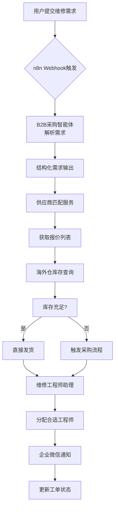
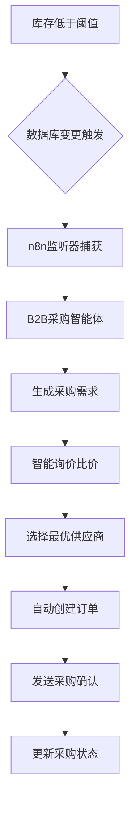
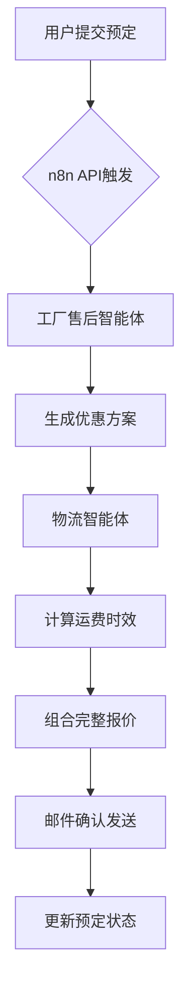
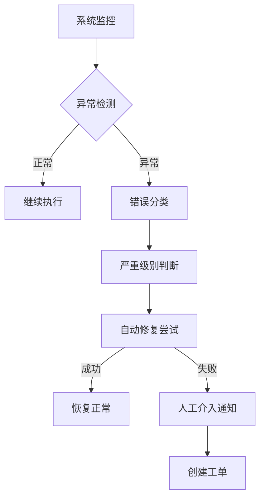

# n8n智能体集成场景示例文档

## 概述

本文档详细描述n8n如何作为"集成总线"协调项目中各类智能体协同工作，通过具体场景示例展示自动化流程的设计思路和实现方案。

## 场景分类

### 1. 维修服务自动化场景
涵盖从用户提交维修需求到工程师上门服务的完整自动化流程。

### 2. 供应链自动化场景  
包括采购、库存管理、订单履约等供应链环节的自动化处理。

### 3. 客户服务自动化场景
涉及客户咨询、预定、通知等客户服务流程的智能化处理。

---

## 场景一：维修需求全流程自动化

### 业务背景
用户通过微信小程序提交设备维修需求，系统需要自动完成需求解析、配件采购、工程师派单等全过程。

### 工作流设计



### 详细实现步骤

#### 1.1 触发层设计
```json
{
  "webhookConfig": {
    "method": "POST",
    "path": "/webhook/repair-request",
    "headers": {
      "Content-Type": "application/json",
      "Authorization": "Bearer {{API_KEY}}"
    },
    "validation": {
      "requiredFields": ["userId", "deviceId", "issueDescription"],
      "fieldTypes": {
        "userId": "string",
        "deviceId": "string", 
        "issueDescription": "string"
      }
    }
  }
}
```

#### 1.2 B2B采购智能体调用
```typescript
// 需求解析节点配置
{
  "nodeType": "httpRequest",
  "parameters": {
    "method": "POST",
    "url": "{{B2B_AGENT_BASE_URL}}/api/parse-demand",
    "authentication": "apiKey",
    "headers": {
      "X-API-Key": "{{B2B_API_KEY}}",
      "Content-Type": "application/json"
    },
    "body": {
      "userId": "{{webhook.userId}}",
      "deviceId": "{{webhook.deviceId}}",
      "description": "{{webhook.issueDescription}}",
      "preferredLanguage": "zh-CN"
    }
  }
}
```

#### 1.3 供应商匹配流程
```json
{
  "supplierMatchingWorkflow": {
    "steps": [
      {
        "name": "获取设备信息",
        "action": "queryDeviceSpecs",
        "input": "{{parsedDemand.deviceId}}",
        "output": "deviceSpecs"
      },
      {
        "name": "匹配供应商",
        "action": "matchSuppliers",
        "input": {
          "category": "{{deviceSpecs.category}}",
          "requiredParts": "{{parsedDemand.parts}}",
          "location": "{{userLocation}}"
        },
        "output": "supplierQuotes"
      },
      {
        "name": "价格比较",
        "action": "comparePrices",
        "input": "{{supplierQuotes}}",
        "output": "bestQuote"
      }
    ]
  }
}
```

#### 1.4 海外仓库存检查
```typescript
// 库存查询节点
interface InventoryCheckNode {
  warehouseIds: string[];
  requiredItems: Array<{
    sku: string;
    quantity: number;
  }>;
  timeout: 5000; // 5秒超时
}

async function checkWarehouseInventory(nodeConfig: InventoryCheckNode) {
  const results = await Promise.all(
    nodeConfig.warehouseIds.map(async (warehouseId) => {
      const response = await fetch(`${WAREHOUSE_API_BASE}/inventory/${warehouseId}`, {
        method: 'POST',
        headers: { 'Authorization': `Bearer ${WAREHOUSE_API_KEY}` },
        body: JSON.stringify({
          items: nodeConfig.requiredItems
        })
      });
      
      return {
        warehouseId,
        availability: await response.json()
      };
    })
  );
  
  return results.filter(r => r.availability.inStock);
}
```

#### 1.5 工程师智能分配
```json
{
  "engineerAssignment": {
    "criteria": {
      "skills": ["{{requiredSkills}}"],
      "location": "{{userLocation}}",
      "availability": "available",
      "rating": ">4.5"
    },
    "algorithm": "distance_weighted_scoring",
    "fallback": "manual_assignment"
  }
}
```

### 数据流转示例

```json
{
  "executionTrace": {
    "trigger": {
      "source": "wechat_miniprogram",
      "timestamp": "2026-02-19T10:30:00Z",
      "payload": {
        "userId": "user_12345",
        "deviceId": "iPhone_14_Pro_Max",
        "issueDescription": "屏幕碎裂，需要更换原装屏幕"
      }
    },
    "processingSteps": [
      {
        "step": "demand_parsing",
        "agent": "b2b_procurement_agent",
        "input": "屏幕碎裂，需要更换原装屏幕",
        "output": {
          "deviceModel": "iPhone 14 Pro Max",
          "requiredPart": "原装屏幕总成",
          "estimatedTime": "2-3天"
        },
        "duration": "1.2s"
      },
      {
        "step": "supplier_matching", 
        "agent": "supplier_match_service",
        "matches": [
          {"supplier": "苹果官方", "price": 2800, "delivery": "24h"},
          {"supplier": "华强北A店", "price": 1200, "delivery": "2-3天"}
        ],
        "selected": "华强北A店",
        "duration": "2.1s"
      },
      {
        "step": "inventory_check",
        "agent": "warehouse_management",
        "warehouses": [
          {"id": "WH_SZ_01", "inStock": true, "quantity": 5},
          {"id": "WH_SH_01", "inStock": false}
        ],
        "selectedWarehouse": "WH_SZ_01",
        "duration": "0.8s"
      },
      {
        "step": "engineer_assignment",
        "agent": "engineer_assistant",
        "assigned": {
          "engineerId": "eng_888",
          "name": "张师傅",
          "phone": "138****8888",
          "eta": "2026-02-19T14:00:00Z"
        },
        "duration": "1.5s"
      }
    ],
    "finalOutput": {
      "workOrderId": "WO_20260219_001",
      "status": "assigned",
      "totalDuration": "5.6s",
      "costEstimate": 1200
    }
  }
}
```

---

## 场景二：库存预警自动采购

### 业务背景
当海外仓某种配件库存低于安全阈值时，自动触发采购流程，确保库存及时补充。

### 工作流设计



### 实现细节

#### 2.1 数据库监听配置
```typescript
// Supabase Realtime监听
const inventoryListener = supabase
  .from('warehouse_inventory')
  .on('UPDATE', async (payload) => {
    const { sku, current_stock, safety_threshold } = payload.new;
    
    if (current_stock < safety_threshold) {
      await triggerProcurementWorkflow({
        sku,
        currentStock: current_stock,
        requiredQuantity: safety_threshold * 2 - current_stock,
        warehouseId: payload.new.warehouse_id
      });
    }
  })
  .subscribe();
```

#### 2.2 采购需求生成
```json
{
  "procurementRequest": {
    "triggerCondition": {
      "table": "warehouse_inventory",
      "event": "UPDATE",
      "filter": {
        "current_stock": "< safety_threshold"
      }
    },
    "requestTemplate": {
      "item_sku": "{{updated_row.sku}}",
      "required_quantity": "{{calculation_result}}",
      "warehouse_id": "{{updated_row.warehouse_id}}",
      "urgency_level": "normal"
    }
  }
}
```

#### 2.3 智能询价流程
```typescript
// 询价节点实现
interface QuotingProcess {
  suppliers: string[];
  quoteTimeout: number; // 秒
  comparisonCriteria: string[];
}

async function automatedQuoting(process: QuotingProcess) {
  const quotes = await Promise.all(
    process.suppliers.map(supplier => 
      requestQuote(supplier, process.quoteTimeout)
    )
  );
  
  return analyzeAndRankQuotes(quotes, process.comparisonCriteria);
}
```

---

## 场景三：新机预定智能处理

### 业务背景
用户提交新机预定请求，系统自动整合工厂优惠、物流信息，提供完整报价方案。

### 工作流设计



### 核心节点配置

#### 3.1 优惠计算节点
```json
{
  "discountCalculation": {
    "baseRules": [
      {
        "condition": "trade_in_device_exists",
        "discount": "10%",
        "type": "percentage"
      },
      {
        "condition": "bulk_order > 5",
        "discount": "500",
        "type": "fixed_amount"
      }
    ],
    "dynamicFactors": {
      "seasonal_promotion": "variable",
      "customer_loyalty": "tier_based"
    }
  }
}
```

#### 3.2 物流成本计算
```typescript
// 物流节点配置
interface LogisticsNode {
  origin: string;
  destinations: string[];
  packageInfo: {
    weight: number;
    dimensions: string;
    fragile: boolean;
  };
  serviceLevels: string[];
}

async function calculateShippingCosts(node: LogisticsNode) {
  const shippingOptions = await Promise.all([
    calculateExpressShipping(node),
    calculateStandardShipping(node),
    calculateEconomyShipping(node)
  ]);
  
  return optimizeByCostAndTime(shippingOptions);
}
```

---

## 场景四：质量监控与异常处理

### 业务背景
监控各智能体执行质量和系统健康状况，自动处理异常情况。

### 工作流设计



### 监控指标配置

```json
{
  "monitoringConfig": {
    "healthChecks": {
      "b2b_agent": {
        "endpoint": "/health",
        "interval": "30s",
        "timeout": "5s",
        "failureThreshold": 3
      },
      "warehouse_system": {
        "endpoint": "/api/status",
        "interval": "1min",
        "expectedResponse": "healthy"
      }
    },
    "performanceMetrics": {
      "responseTime": {
        "threshold": "2000ms",
        "alertLevel": "warning"
      },
      "errorRate": {
        "threshold": "5%",
        "alertLevel": "critical"
      }
    }
  }
}
```

---

## 最佳实践总结

### 设计原则

1. **单一职责**：每个工作流节点只负责一个特定功能
2. **错误处理**：为每个关键节点配置超时和重试机制
3. **可观测性**：记录完整的执行轨迹和性能指标
4. **安全性**：实施API密钥管理和访问控制
5. **可扩展性**：使用模块化设计便于后续扩展

### 性能优化建议

- 合理设置并行执行节点
- 实施缓存策略减少重复计算
- 优化数据库查询减少延迟
- 建立连接池管理外部服务调用

### 维护管理

- 建立工作流版本控制系统
- 定期审查和优化现有流程
- 建立完善的文档和培训体系
- 实施变更管理流程

---
*文档版本：v1.0*
*最后更新：2026年2月19日*