# 系统架构图

## 目录

1. [整体架构](#整体架构)
2. [数据流向图](#数据流向图)
3. [事件流架构](#事件流架构)
4. [微服务架构](#微服务架构)
5. [部署架构](#部署架构)

## 整体架构

### 高层次架构视图

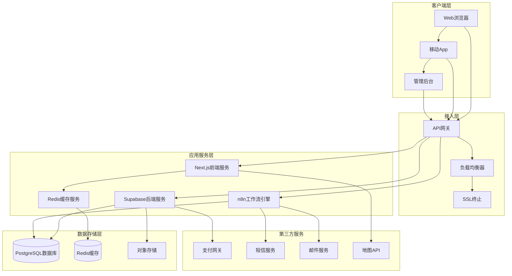

### 技术栈架构图

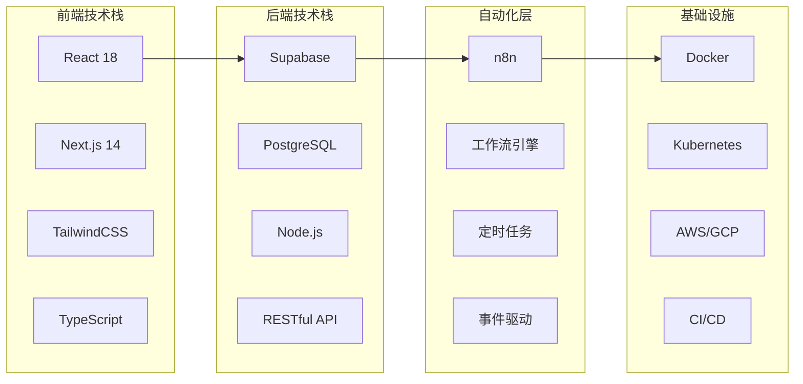

## 数据流向图

### 用户预约流程数据流

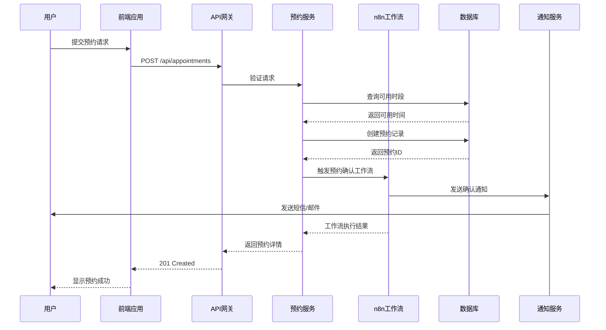

### 数据同步流程

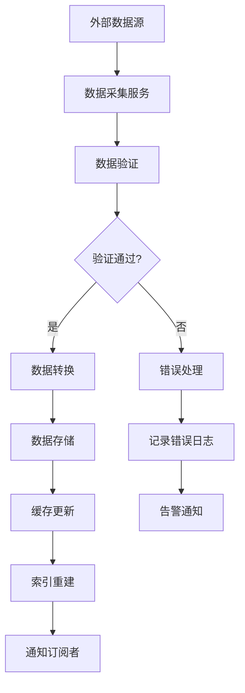

### 批处理数据流

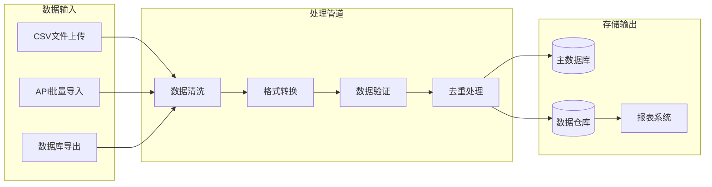

## 事件流架构

### 事件驱动架构

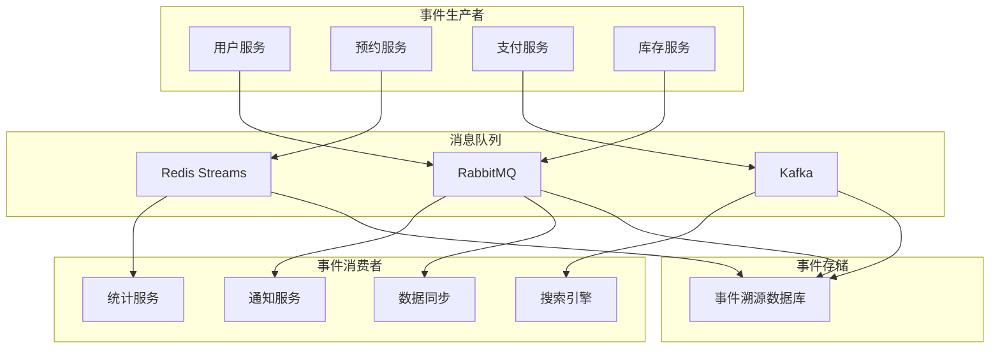

### 核心事件类型

#### 用户相关事件

```yaml
用户事件:
  user.created:
    payload:
      userId: string
      email: string
      createdAt: timestamp
    routingKey: user.lifecycle

  user.updated:
    payload:
      userId: string
      changes: object
      updatedAt: timestamp
    routingKey: user.lifecycle

  user.deleted:
    payload:
      userId: string
      deletedAt: timestamp
    routingKey: user.lifecycle
```

#### 预约相关事件

```yaml
预约事件:
  appointment.created:
    payload:
      appointmentId: string
      userId: string
      shopId: string
      scheduledTime: timestamp
    routingKey: appointment.lifecycle

  appointment.confirmed:
    payload:
      appointmentId: string
      confirmedAt: timestamp
    routingKey: appointment.lifecycle

  appointment.cancelled:
    payload:
      appointmentId: string
      cancelledAt: timestamp
      reason: string
    routingKey: appointment.lifecycle
```

### 事件处理流程

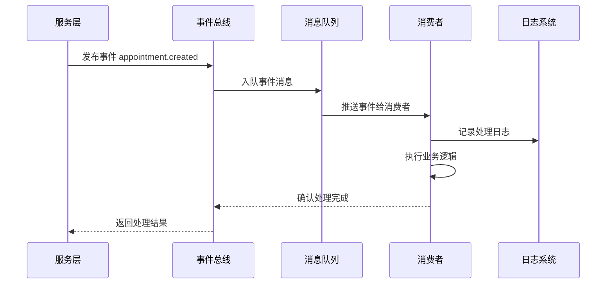

## 微服务架构

### 服务拆分架构

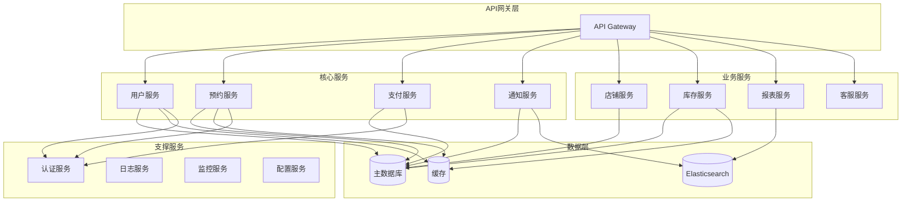

### 服务间通信

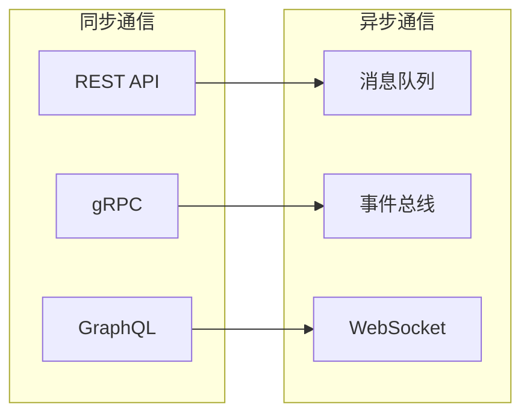

### 服务发现与负载均衡

```yaml
服务注册中心:
  type: Consul/Eureka
  features:
    - 服务注册与发现
    - 健康检查
    - 负载均衡
    - 配置管理

负载均衡策略:
  - 轮询(Round Robin)
  - 加权轮询
  - 最少连接
  - IP哈希
  - 响应时间加权
```

## 部署架构

### 容器化部署架构

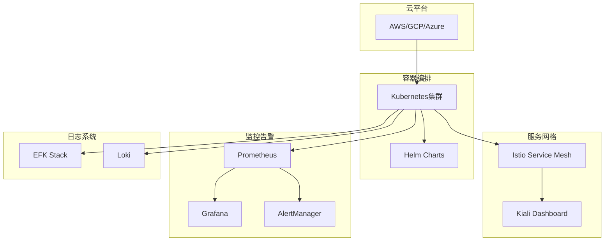

### 多环境部署拓扑

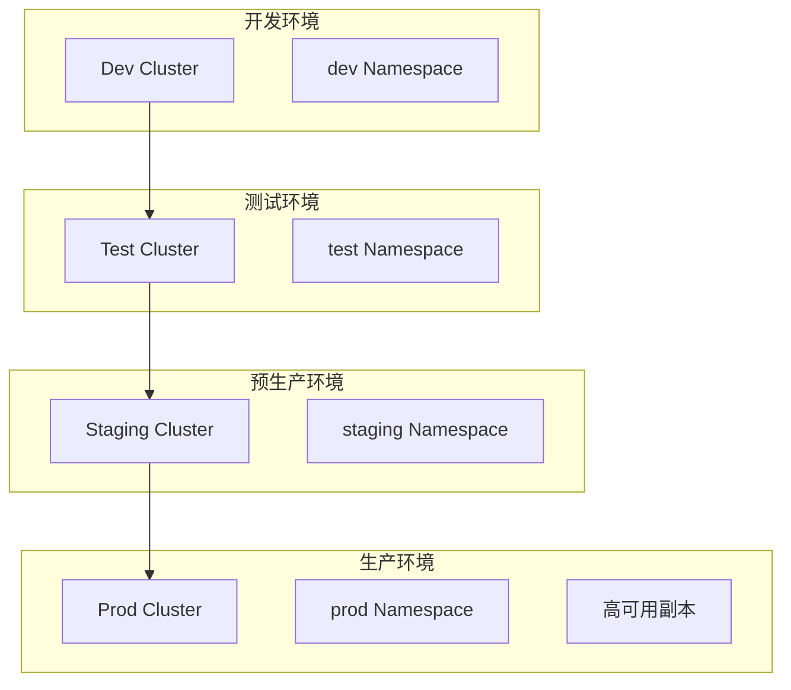

### 网络安全架构

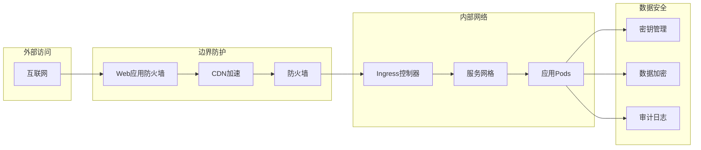

### 灾备架构

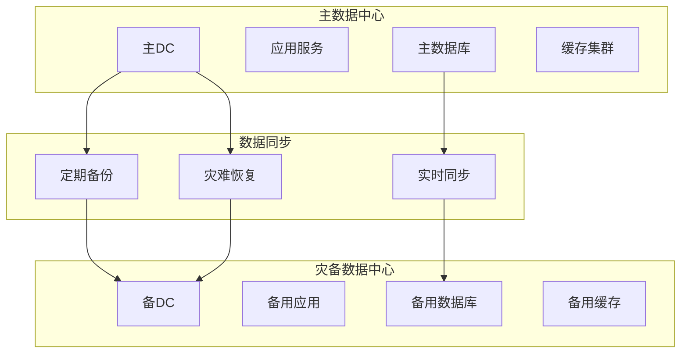

## 性能架构

### 缓存架构

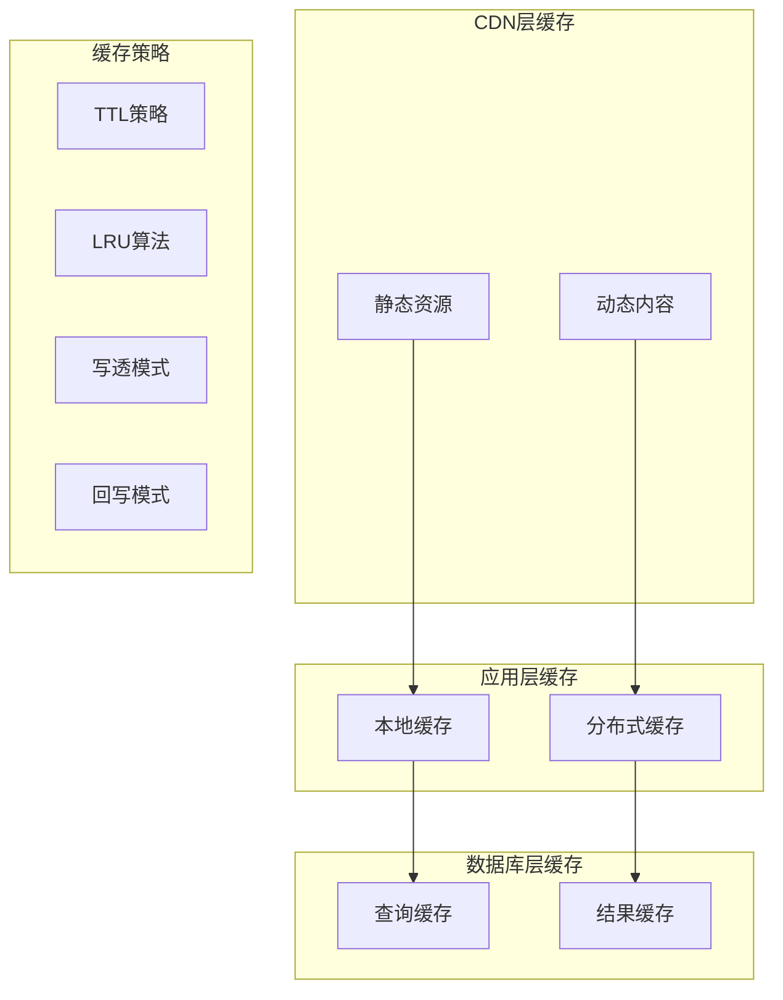

### 扩展性架构

```yaml
水平扩展:
  应用层:
    - 无状态设计
    - 容器化部署
    - 自动扩缩容

  数据层:
    - 读写分离
    - 分库分表
    - 数据分区

垂直扩展:
  计算资源:
    - CPU增强
    - 内存扩容
    - 存储升级

  网络资源:
    - 带宽扩容
    - CDN加速
    - 边缘计算
```

## 安全架构

### 零信任安全模型

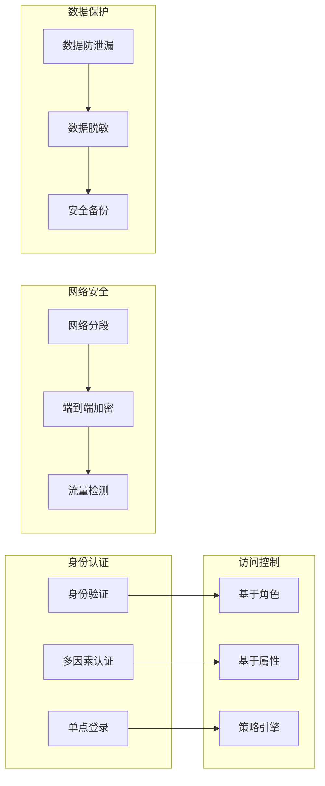

### 安全监控体系

```yaml
安全监控:
  威胁检测:
    - 入侵检测系统(IDS)
    - 异常行为分析
    - 漏洞扫描

  合规监控:
    - GDPR合规检查
    - 数据保护审计
    - 访问日志分析

  响应机制:
    - 安全事件响应
    - 自动隔离机制
    - 应急恢复预案
```

---

_架构图更新日期: 2026-02-20_
_架构版本: v2.1.0_
