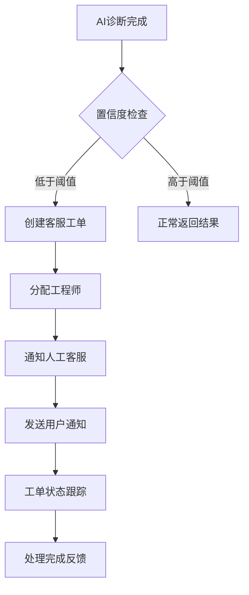

# AI诊断转人工工作流设计文档 (INT-207)

## 概述
本工作流处理当AI诊断置信度低于预设阈值时，自动创建客服工单并通知人工客服的流程，确保用户问题得到及时有效的人工协助。

## 流程架构

### 整体流程图


### 详细步骤说明

#### 步骤1：AI诊断结果监控
- **监控内容**：
  - 诊断置信度分数（0-100）
  - 问题复杂度评估
  - 诊断准确性历史记录
- **阈值设定**：
  - 默认置信度阈值：70%
  - 可配置的动态阈值
  - 不同设备类型的差异化阈值

#### 步骤2：置信度评估机制
- **评估维度**：
  - 问题识别准确率
  - 解决方案可行性
  - 用户反馈历史
  - 同类问题成功率
- **计算方法**：
  ```
  综合置信度 = (基础置信度 × 0.6) + (历史准确率 × 0.3) + (用户满意度 × 0.1)
  ```

#### 步骤3：自动创建客服工单
- **工单信息**：
  ```
  工单编号：TK-{YYYYMMDD}-{序号}
  优先级：根据问题紧急程度（高/中/低）
  类别：技术支持/设备维修/咨询答疑
  描述：AI诊断结果 + 用户原始问题
  ```
- **附加信息**：
  - 用户联系信息
  - 设备详细资料
  - AI诊断过程记录
  - 相关历史工单

#### 步骤4：工程师智能分配
- **分配策略**：
  - 技能匹配：根据问题类型匹配专长工程师
  - 负载均衡：考虑工程师当前工作负载
  - 地理位置：优先分配附近的工程师（如适用）
  - 历史表现：基于过往处理质量和时效
- **备用机制**：
  - 主要工程师忙碌时的替补方案
  - 紧急情况下的快速通道

#### 步骤5：多渠道通知推送
- **企业微信通知**：
  ```
  【紧急工单】新客户问题需要人工协助
  工单号：TK20260220001
  问题类型：设备故障诊断
  置信度：65%（低于阈值）
  客户：张三（VIP等级：金卡）
  ```
- **钉钉通知**：
  - 机器人推送至指定群组
  - @相关人员提醒处理
  - 附带工单详情链接

#### 步骤6：用户状态通知
- **通知内容**：
  ```
  您好！我们的AI助手正在为您寻求更专业的帮助，
  已为您创建专属客服工单，工程师将尽快联系您。
  工单编号：TK20260220001
  预计响应时间：30分钟内
  ```
- **通知渠道**：
  - 站内消息
  - 短信通知（重要客户）
  - 邮件确认
  - APP推送

#### 步骤7：工单状态实时跟踪
- **状态流转**：
  ```
  新建 → 已分配 → 处理中 → 待确认 → 已完成
  ```
- **关键节点**：
  - 工程师接单确认
  - 处理进度更新
  - 用户反馈收集
  - 工单关闭确认

#### 步骤8：处理完成反馈循环
- **质量评估**：
  - 用户满意度调查
  - 工程师处理质量评分
  - 问题解决效果验证
- **知识积累**：
  - 将解决方案加入知识库
  - 更新AI训练数据集
  - 优化置信度评估模型

## 技术实现要点

### 实时监控架构
```
AI诊断服务 → 置信度监控 → 条件触发 → 工单系统 → 通知服务
```

### 数据流设计
1. **诊断结果接收**：WebSocket长连接接收实时诊断结果
2. **置信度计算**：本地算法 + 远程API调用结合
3. **决策引擎**：基于规则的条件判断系统
4. **工单创建**：调用工单管理系统的API
5. **通知分发**：多渠道并行推送机制

### 容错与重试机制
- **网络异常**：自动重试3次，间隔递增
- **服务降级**：核心功能优先保障
- **数据持久化**：关键操作日志完整记录
- **人工兜底**：系统故障时转人工处理

## 接口设计规范

### 置信度检查接口
```http
POST /api/ai-confidence/check
Content-Type: application/json

{
  "diagnosisId": "DIAG20260220001",
  "confidenceScore": 65,
  "deviceInfo": {
    "type": "smartphone",
    "model": "iPhone 14 Pro",
    "issue": "battery_drain"
  },
  "userId": "USER001"
}
```

### 工单创建接口
```http
POST /api/tickets/create
Content-Type: application/json

{
  "ticketType": "ai_escalation",
  "priority": "high",
  "categoryId": "technical_support",
  "customerInfo": {
    "userId": "USER001",
    "name": "张三",
    "contact": "138****8888"
  },
  "deviceInfo": {
    "deviceId": "DEVICE001",
    "model": "iPhone 14 Pro"
  },
  "aiDiagnosis": {
    "diagnosisId": "DIAG20260220001",
    "confidence": 65,
    "issues": ["电池异常耗电"],
    "recommendations": ["更换电池"]
  }
}
```

### 通知推送接口
```http
POST /api/notifications/multi-channel
Content-Type: application/json

{
  "recipients": [
    {
      "channel": "wechat_work",
      "target": "@all",
      "userId": "ENG001"
    },
    {
      "channel": "dingtalk",
      "target": "technical_group",
      "userId": "ENG002"
    }
  ],
  "message": {
    "title": "【紧急】AI诊断转人工工单",
    "content": "工单详情...",
    "urgency": "high"
  }
}
```

## 安全与权限

### 访问控制
- 工单系统API鉴权
- 工程师权限分级管理
- 敏感信息脱敏处理
- 操作审计日志记录

### 数据保护
- 用户隐私信息加密存储
- 通信过程HTTPS加密
- 工单内容访问权限控制
- 历史数据定期清理

## 监控与告警

### 关键指标
| 指标 | 目标值 | 告警阈值 |
|------|--------|----------|
| 转人工率 | <15% | >20% |
| 平均响应时间 | <5分钟 | >10分钟 |
| 工单解决率 | >90% | <85% |
| 用户满意度 | >4.5/5 | <4.0/5 |

### 告警机制
- 钉钉机器人实时通知
- 邮件汇总报告
- 可视化监控大屏
- 异常趋势预警

## 部署配置

### 环境变量
```bash
# AI诊断服务配置
AI_DIAGNOSIS_API_URL=http://ai-service:8000
CONFIDENCE_THRESHOLD=70

# 工单系统配置
TICKET_SYSTEM_API_URL=http://ticket-service:8000
ENGINEER_ASSIGNMENT_STRATEGY=skill_based

# 通知服务配置
NOTIFICATION_API_URL=http://notification-service:8000
WECHAT_WORK_WEBHOOK=https://qyapi.weixin.qq.com/cgi-bin/webhook/send?key=xxx
DINGTALK_WEBHOOK=https://oapi.dingtalk.com/robot/send?access_token=xxx
```

### 高可用部署
- 主备双活架构
- 负载均衡分发
- 数据库读写分离
- 缓存层加速访问

## 测试验证方案

### 功能测试
- 置信度边界值测试
- 工单创建流程验证
- 通知渠道覆盖测试
- 异常场景处理测试

### 性能测试
- 并发转人工处理能力
- 系统响应时间压测
- 资源消耗监控
- 长时间稳定性验证

### 集成测试
- 与AI诊断服务联调
- 工单系统接口测试
- 通知服务可靠性验证
- 端到端流程测试

## 版本迭代规划
- v1.0.0 (2026-02-20)：基础转人工功能上线
- v1.1.0 (2026-03-01)：智能工程师分配算法
- v1.2.0 (2026-03-15)：多渠道通知优化
- v2.0.0 (2026-04-01)：引入机器学习优化置信度评估