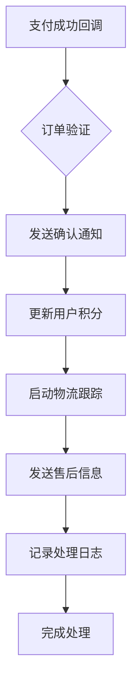

# 支付成功后续处理工作流设计文档 (INT-205)

## 概述
本工作流处理用户新机预定支付成功后的自动化后续流程，包括订单确认通知、积分更新、物流跟踪启动等关键业务动作，确保用户获得完整的服务体验。

## 流程架构

### 整体流程图


### 详细步骤说明

#### 步骤1：支付成功监听
- **触发方式**：第三方支付平台回调通知
- **验证内容**：
  - 签名有效性检查
  - 订单金额一致性核对
  - 商户订单号唯一性验证
- **安全措施**：
  - HTTPS加密传输
  - IP白名单限制
  - 重放攻击防护

#### 步骤2：订单信息验证
- **验证项目**：
  - 订单状态确认（待支付 → 已支付）
  - 商品库存扣减检查
  - 用户账户状态核实
  - 价格计算准确性
- **异常处理**：
  - 重复支付检测
  - 订单超时处理
  - 数据不一致回滚

#### 步骤3：发送确认通知
- **通知渠道**：
  - 站内消息系统
  - 短信通知（重要订单）
  - 邮件确认函
  - APP推送通知
- **通知内容**：
  ```
  【订单确认】您购买的[商品名称]已支付成功！
  订单号：[订单编号]
  支付金额：¥[金额]
  预计发货时间：[日期]
  ```

#### 步骤4：用户积分更新
- **积分计算规则**：
  - 基础积分 = 订单金额 × 积分比例
  - VIP等级加成
  - 活动期间倍数奖励
  - 新用户首单额外积分
- **积分发放时机**：
  - 支付成功立即发放基础积分
  - 确认收货后发放奖励积分
  - 好评返积分（可选）

#### 步骤5：启动物流跟踪
- **物流服务商对接**：
  - 自动生成运单号
  - 下发拣货指令到仓库
  - 更新库存管理系统
  - 同步物流状态API
- **跟踪信息初始化**：
  - 物流公司选择
  - 预计送达时间计算
  - 配送路线规划
  - 异常预警设置

#### 步骤6：发送售后服务信息
- **服务内容**：
  - 产品使用指导
  - 保修政策说明
  - 客服联系方式
  - 常见问题解答
- **个性化服务**：
  - 根据商品类型定制说明
  - 用户历史购买偏好
  - 地区特色服务介绍

#### 步骤7：记录处理日志
- **日志内容**：
  - 处理时间戳
  - 操作人员/系统
  - 关键业务数据
  - 异常情况记录
- **监控指标**：
  - 处理成功率统计
  - 平均处理时延
  - 系统错误率
  - 用户满意度反馈

## 技术实现要点

### 数据一致性保证
```
支付回调 → 订单锁定 → 积分更新 → 物流启动 → 状态同步
```
采用分布式事务或补偿机制确保各环节数据一致性。

### 异常处理机制
- **重试策略**：指数退避重试
- **死信队列**：处理失败的消息暂存
- **人工干预**：超时未处理的订单转人工
- **监控告警**：异常情况实时通知运维

### 性能优化
- **异步处理**：非关键路径异步执行
- **批量操作**：合并相似的处理请求
- **缓存利用**：热点数据内存缓存
- **数据库优化**：索引优化和读写分离

## 接口设计规范

### 支付回调接口
```http
POST /webhook/payment-success
Content-Type: application/json
Authorization: Bearer {{webhook_token}}

{
  "order_id": "ORDER20260220001",
  "payment_id": "PAY20260220001",
  "amount": 2999.00,
  "currency": "CNY",
  "payment_method": "alipay",
  "timestamp": "2026-02-20T14:30:00Z",
  "signature": "加密签名"
}
```

### 积分更新接口
```http
POST /api/user/{{user_id}}/points/update
Content-Type: application/json
Authorization: Bearer {{api_token}}

{
  "operation": "add",
  "points": 299,
  "reason": "purchase_reward",
  "reference_id": "ORDER20260220001",
  "expiry_date": "2027-02-20"
}
```

### 物流启动接口
```http
POST /api/logistics/create-shipment
Content-Type: application/json
Authorization: Bearer {{api_token}}

{
  "order_id": "ORDER20260220001",
  "recipient": {
    "name": "张三",
    "phone": "138****8888",
    "address": "北京市朝阳区xxx街道"
  },
  "items": [
    {
      "product_id": "PROD001",
      "quantity": 1,
      "weight": 0.5
    }
  ],
  "service_level": "standard"
}
```

## 安全考虑

### 数据安全
- 敏感信息加密存储
- API调用权限控制
- 操作审计日志完整
- 数据备份机制健全

### 防欺诈措施
- 支付风控系统集成
- 异常交易模式识别
- 多重身份验证机制
- 黑名单实时更新

## 监控与报警

### 关键指标监控
| 指标 | 目标值 | 报警阈值 |
|------|--------|----------|
| 处理成功率 | >99.5% | <99% |
| 平均处理时间 | <2秒 | >5秒 |
| 积分发放准确率 | 100% | <100% |
| 物流启动及时率 | >99% | <98% |

### 报警机制
- 钉钉/企业微信群通知
- 邮件告警
- 电话通知（严重故障）
- 可视化监控面板

## 部署配置

### 环境变量
```bash
# 支付服务配置
PAYMENT_WEBHOOK_SECRET=your_payment_secret_key
PAYMENT_CALLBACK_URL=https://yourdomain.com/webhook/payment-success

# 积分系统配置
POINTS_API_URL=http://points-service:8000
POINTS_CALCULATION_RATE=0.1

# 物流服务配置
LOGISTICS_API_URL=http://logistics-service:8000
DEFAULT_SHIPPING_COMPANY=sf-express

# 通知服务配置
NOTIFICATION_API_URL=http://notification-service:8000
SMS_TEMPLATE_ID=template_001
```

### 高可用部署
- 主备双活架构
- 负载均衡分发
- 数据库主从复制
- 容灾备份机制

## 测试策略

### 单元测试
- 各服务接口功能验证
- 边界条件测试
- 异常场景覆盖

### 集成测试
- 端到端流程测试
- 第三方服务Mock
- 性能压力测试

### 回归测试
- 版本升级前后对比
- 兼容性验证
- 数据迁移测试

## 版本迭代规划
- v1.0.0 (2026-02-20)：核心功能上线
- v1.1.0 (2026-03-01)：增加多支付渠道支持
- v1.2.0 (2026-03-15)：优化积分计算算法
- v2.0.0 (2026-04-01)：引入AI个性化服务