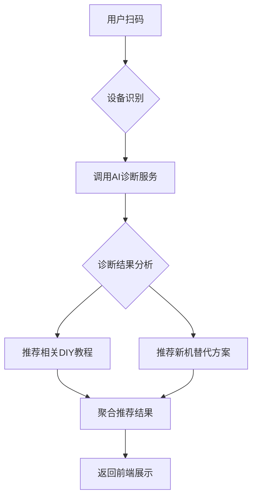

# 扫码智能服务工作流设计文档 (INT-201)

## 概述
本工作流实现用户扫码 → AI诊断 → 教程推荐 → 新机推荐的完整自动化服务流程，为用户提供一站式设备智能诊断和升级建议服务。

## 流程架构

### 整体流程图


### 详细步骤说明

#### 步骤1：设备识别与信息提取
- **输入**：用户扫描的二维码/条形码数据
- **处理**：
  - 解析扫码内容获取设备标识符
  - 提取设备型号、品牌、序列号等关键信息
  - 验证数据格式和完整性
- **输出**：标准化的设备信息对象

#### 步骤2：调用AI诊断服务
- **API调用**：`POST /api/ai/diagnose`
- **请求参数**：
  ```json
  {
    "deviceId": "设备唯一标识",
    "deviceInfo": {
      "brand": "品牌名称",
      "model": "型号",
      "serialNumber": "序列号"
    },
    "diagnosticType": "full" // 完整诊断模式
  }
  ```
- **处理**：等待AI服务返回诊断结果

#### 步骤3：诊断结果分析
- **输入**：AI诊断服务返回的结果
- **分析内容**：
  - 问题严重程度评估
  - 维修成本效益分析
  - 设备剩余使用寿命预测
  - 升级潜力评估

#### 步骤4：DIY教程推荐
- **推荐逻辑**：
  - 基于诊断结果匹配相关教程
  - 考虑用户技能水平（初级/中级/高级）
  - 结合设备维修复杂度
- **数据源**：内部教程数据库
- **排序规则**：相关性得分 + 用户评价

#### 步骤5：新机替代推荐
- **推荐策略**：
  - 性价比优先原则
  - 技术规格匹配度
  - 用户预算范围筛选
  - 品牌偏好考虑
- **数据源**：商品数据库 + 价格API

#### 步骤6：结果聚合与返回
- **聚合内容**：
  - 诊断报告摘要
  - 推荐教程列表（最多3个）
  - 新机推荐列表（最多2款）
  - 维修vs更换建议
- **响应格式**：
  ```json
  {
    "success": true,
    "deviceId": "设备ID",
    "diagnosis": {
      "summary": "诊断摘要",
      "severity": "high/medium/low",
      "recommendation": "repair/replace/monitor"
    },
    "tutorials": [
      {
        "id": "tutorial-001",
        "title": "教程标题",
        "difficulty": "easy/medium/hard",
        "estimatedTime": "30分钟",
        "url": "/tutorials/001"
      }
    ],
    "newDevices": [
      {
        "id": "device-001",
        "name": "设备名称",
        "price": 2999,
        "specScore": 85,
        "url": "/products/device-001"
      }
    ]
  }
  ```

## 技术实现要点

### 错误处理机制
- 设备识别失败：返回友好的错误提示
- AI服务超时：使用缓存结果或降级方案
- 推荐系统异常：提供通用推荐内容

### 性能优化
- 异步并行处理教程推荐和新机推荐
- 结果缓存机制减少重复计算
- 预加载热门设备的诊断模板

### 安全考虑
- 输入数据验证和清洗
- API调用频率限制
- 敏感信息脱敏处理

## 集成接口规范

### 输入接口
- **Webhook端点**：`POST /webhook/scan-service`
- **认证方式**：API Key + 时间戳签名
- **内容类型**：application/json

### 输出接口
- **响应格式**：JSON
- **编码**：UTF-8
- **最大响应时间**：5秒

## 监控指标
- 平均响应时间 < 3秒
- 成功率 > 95%
- 用户满意度评分 > 4.0/5.0
- 教程点击率 > 25%

## 版本历史
- v1.0.0 (2026-02-20)：初始版本发布