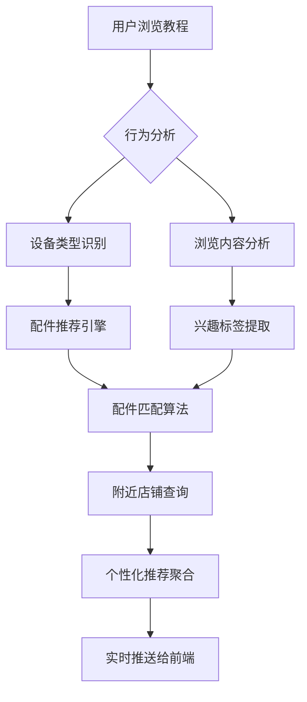

# 教程浏览引导工作流设计文档 (INT-203)

## 概述
本工作流实现在用户浏览教程过程中，根据当前设备类型和浏览行为，智能推荐相关配件购买链接和附近维修店铺的服务流程，提升用户体验和转化率。

## 流程架构

### 整体流程图


### 详细步骤说明

#### 步骤1：用户行为监控
- **监控内容**：
  - 当前浏览的教程ID和类别
  - 浏览时长和停留页面
  - 点击行为和互动记录
  - 设备上下文信息
- **数据采集**：通过前端埋点实时收集
- **传输方式**：WebSocket长连接或定期HTTP上报

#### 步骤2：设备类型识别
- **识别依据**：
  - 用户账户绑定的设备信息
  - 当前教程关联的设备类型
  - 浏览历史中的设备偏好
- **输出**：设备分类标签（手机/电脑/家电等）

#### 步骤3：浏览内容分析
- **分析维度**：
  - 教程主题关键词提取
  - 技能难度等级判断
  - 维修/升级/使用场景识别
- **技术手段**：自然语言处理 + 分类算法

#### 步骤4：兴趣标签提取
- **标签体系**：
  - 维修技能标签（硬件/软件/系统）
  - 兴趣偏好标签（DIY/专业维修/学习）
  - 预算敏感度标签（经济型/品质型）
- **更新机制**：动态权重调整

#### 步骤5：配件推荐引擎
- **推荐算法**：
  - 基于内容的协同过滤
  - 设备兼容性匹配
  - 价格区间筛选
  - 用户评分加权
- **数据源**：商品数据库 + 用户评价数据

#### 步骤6：附近店铺查询
- **地理位置服务**：
  - 获取用户当前位置（经度纬度）
  - 查询周边维修店铺数据库
  - 计算距离和交通便利性
- **筛选条件**：
  - 店铺资质认证
  - 服务评价分数
  - 营业时间匹配
  - 专业技能匹配

#### 步骤7：个性化推荐聚合
- **聚合策略**：
  - 配件推荐（最多3个）
  - 店铺推荐（最多2家）
  - 优惠信息整合
- **优先级排序**：
  1. 高相关性配件
  2. 附近优质店铺
  3. 限时优惠活动

#### 步骤8：实时推送到前端
- **推送时机**：
  - 用户长时间停留在某页面
  - 完成重要操作步骤后
  - 浏览到关键知识点时
- **推送形式**：侧边栏弹窗或底部横幅
- **交互设计**：一键跳转购买/预约

## 技术实现要点

### 实时处理架构
```
用户行为 → 消息队列 → 实时分析 → 推荐引擎 → 前端推送
```

### 数据处理流程
1. **行为数据预处理**：清洗、去重、标准化
2. **特征工程**：提取用户画像特征
3. **模型推理**：运行推荐算法
4. **结果缓存**：Redis缓存热门推荐
5. **推送分发**：WebSocket广播给相关用户

### 性能优化策略
- **异步处理**：使用消息队列解耦各服务
- **缓存机制**：热点数据预加载到内存
- **批量处理**：合并多个用户的推荐请求
- **边缘计算**：就近节点处理减少延迟

## 接口设计规范

### 行为数据上报接口
```http
POST /api/user-behavior/track
Content-Type: application/json

{
  "userId": "用户ID",
  "sessionId": "会话ID",
  "eventType": "page_view/click/scroll",
  "pageInfo": {
    "tutorialId": "教程ID",
    "pageTitle": "教程标题",
    "deviceType": "设备类型"
  },
  "timestamp": "ISO时间戳",
  "metadata": {
    "停留时长": 120,
    "滚动深度": 0.75
  }
}
```

### 推荐结果推送接口
```http
POST /api/recommendation/push
Content-Type: application/json

{
  "userId": "用户ID",
  "recommendations": {
    "accessories": [
      {
        "id": "配件ID",
        "name": "配件名称",
        "price": 299,
        "compatibility": "兼容性说明",
        "purchaseUrl": "/products/accessory-001"
      }
    ],
    "shops": [
      {
        "id": "店铺ID",
        "name": "店铺名称",
        "distance": "2.5km",
        "rating": 4.8,
        "services": ["手机维修", "数据恢复"],
        "bookingUrl": "/shops/shop-001/book"
      }
    ]
  },
  "triggerReason": "long_page_stay"
}
```

## 安全与隐私

### 数据保护措施
- 用户身份匿名化处理
- 敏感位置信息模糊化
- 行为数据加密存储
- 访问权限严格控制

### 合规要求
- 符合个人信息保护法
- 明确用户授权机制
- 提供数据删除功能
- 定期安全审计

## 监控与优化

### 关键指标
- 推荐点击率 > 15%
- 平均响应延迟 < 200ms
- 系统可用性 > 99.5%
- 用户留存提升 > 8%

### A/B测试框架
- 不同推荐算法效果对比
- 推送时机优化实验
- 界面展示形式测试
- 个性化程度调节

## 部署配置

### 环境变量
```bash
# 推荐服务配置
RECOMMENDATION_API_URL=http://recommendation-service:8000
GEO_SERVICE_API_KEY=your_geo_api_key
USER_BEHAVIOR_TOPIC=user-behavior-stream

# 缓存配置
REDIS_HOST=redis-server
REDIS_PORT=6379
CACHE_TTL_SECONDS=300
```

### 扩展性考虑
- 微服务架构支持水平扩展
- 容器化部署便于运维
- 负载均衡保障高并发
- 自动伸缩应对流量波动

## 版本迭代计划
- v1.0.0 (2026-02-20)：基础推荐功能上线
- v1.1.0 (2026-03-01)：增加地理位置服务
- v1.2.0 (2026-03-15)：优化推荐算法精度
- v2.0.0 (2026-04-01)：引入机器学习模型