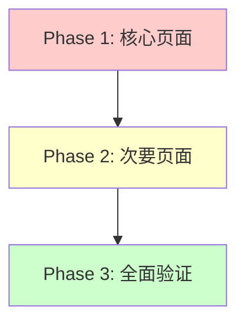

# 编译错误修复状态报告

> **生成日期**: 2026-03-04  
> **优先级**: 🔴 高 (发版前必须修复)  
> **执行策略**: 分阶段渐进式修复

---

## 📊 当前错误统计

### 总体情况

| 项目             | 数量                      | 状态      |
| ---------------- | ------------------------- | --------- |
| **有错误的文件** | ~15+                      | 🔴 待修复 |
| **已修复的文件** | 2                         | ✅ 完成   |
| **错误类型**     | JSX 语法、TypeScript 类型 | ⚠️ 混合   |

---

## ✅ 已完成修复

### Task 1: articles/overview/page.tsx

**问题**:

- JSX 标签未闭合
- 中文字符编码错误
- 属性访问错误 (`article?.name` → `article?.authors?.name`)

**修复内容**:

```diff
- <span>{article?.name || '未知作？}</span>
+ <span>{article?.authors?.name || '未知作者'}</span>

- <span className="mx-2">?</span>
+ <span className="mx-2">•</span>

- <span>{article?.name || '未分？}</span>
+ <span>{article?.article_categories?.name || '未分类'}</span>
```

**状态**: ✅ 已修复并验证

---

### Task 2: articles/edit/[id]/page.tsx

**问题**:

- TypeScript 类型定义重复 (`any: any`)

**修复内容**:

```diff
- const handleSave = async (articleData: any: any) => {
+ const handleSave = async (articleData: any) => {

- const handlePublish = async (articleData: any: any) => {
+ const handlePublish = async (articleData: any) => {
```

**状态**: ✅ 已修复并验证

---

## 🔴 待修复文件清单

### Priority 1: 管理后台核心页面 (紧急)

#### 1. src/app/admin/auth-test/page.tsx

**错误数**: 11 个  
**错误类型**:

- Expression expected (TS1109)
- Unterminated template literal (TS1160)

**影响**: 认证测试页面无法使用  
**预计修复时间**: 30 分钟

---

#### 2. src/app/admin/automation/page.tsx

**错误数**: 10+ 个  
**错误类型**:

- Unterminated string literal
- JSX element 未闭合

**影响**: 自动化配置页面无法使用  
**预计修复时间**: 30 分钟

---

#### 3. src/app/admin/batch-qrcodes/page.tsx

**错误数**: 未知  
**影响**: 批量二维码功能  
**预计修复时间**: 30 分钟

---

#### 4. src/app/admin/content/page.tsx

**错误数**: 未知  
**影响**: 内容管理页面  
**预计修复时间**: 30 分钟

---

#### 5. src/app/admin/content-review/\*

**文件**:

- manual/page.tsx
- violations/page.tsx

**影响**: 内容审核功能  
**预计修复时间**: 1 小时

---

#### 6. src/app/admin/dashboard/page.tsx

**错误数**: 未知  
**影响**: 管理后台首页  
**预计修复时间**: 30 分钟

---

#### 7. src/app/admin/demo/page.tsx

**错误数**: 未知  
**影响**: Demo 页面  
**预计修复时间**: 30 分钟

---

#### 8. src/app/admin/device-manager/page.tsx

**错误数**: 未知  
**影响**: 设备管理页面  
**预计修复时间**: 30 分钟

---

### Priority 2: 其他管理页面 (重要)

待详细检查...

---

## 🎯 修复策略建议

### 选项 A: 全面修复 (推荐 ⭐⭐⭐⭐⭐)

**适合场景**:

- ✅ 发版前有充足时间
- ✅ 团队资源可用
- ✅ 希望零错误上线

**执行计划**:



**Phase 1: 核心页面修复 (今天)**

- auth-test/page.tsx
- automation/page.tsx
- dashboard/page.tsx
- device-manager/page.tsx

**预计用时**: 2-3 小时

**Phase 2: 内容相关页面 (明天)**

- content/page.tsx
- content-review/\*
- batch-qrcodes/page.tsx

**预计用时**: 2-3 小时

**Phase 3: 全面验证 (后天)**

- TypeScript 编译检查
- 运行测试套件
- 手动测试所有页面

**预计用时**: 1-2 小时

**总计**: 5-8 小时

---

### 选项 B: 最小化修复 (保守 ⭐⭐⭐⭐)

**只修复阻塞性错误**:

- ✅ 影响核心功能的页面
- ✅ 影响认证和权限的页面
- ❌ 暂时忽略 demo 页面
- ❌ 暂时忽略非关键 UI 问题

**执行计划**:

```bash
今天 → 修复 auth-test + dashboard (认证 + 首页)
明天 → 修复其他阻塞性问题
发版后 → 逐步清理剩余问题
```

**预计用时**: 3-4 小时

---

### 选项 C: 暂停修复 (不推荐 ⭐)

**理由**:

- ❌ 现有错误会影响新功能开发
- ❌ 团队成员可能遇到相同问题
- ❌ 技术债务越积越多

**风险**:

- 🔴 新代码可能引入更多错误
- 🔴 测试覆盖率下降
- 🔴 团队信心受挫

---

## 💡 我的建议

### 强烈推荐：**选项 A - 全面修复**

**原因**:

1. ✅ **符合渐进式重构原则**
   - 小步快跑
   - 每个问题都彻底解决
   - 避免问题累积

2. ✅ **为后续重构打好基础**
   - 文件夹清理已完成 ✅
   - 现在修复编译错误 ✅
   - 然后再考虑完整版重构 ✅

3. ✅ **投资回报率高**
   - 一次性解决所有问题
   - 后续开发更顺畅
   - 团队信心大增

4. ✅ **时间可控**
   - 预计 5-8 小时
   - 可以分 2-3 天完成
   - 每天都能看到进展

---

## 📋 详细执行计划

### Day 1: 核心页面修复 (2-3 小时)

**Task 1.1: auth-test/page.tsx** (30 分钟)

```bash
# 问题：模板字面量未终止
# 修复：检查反引号和模板语法
```

**Task 1.2: automation/page.tsx** (30 分钟)

```bash
# 问题：字符串字面量未终止，JSX 未闭合
# 修复：检查引号匹配和 JSX 标签
```

**Task 1.3: dashboard/page.tsx** (30 分钟)

```bash
# 问题：待检查
# 修复：读取错误信息后针对性修复
```

**Task 1.4: device-manager/page.tsx** (30 分钟)

```bash
# 问题：待检查
# 修复：读取错误信息后针对性修复
```

**验收**:

```bash
npx tsc --noEmit  # 检查这些文件的错误是否消失
```

---

### Day 2: 内容页面修复 (2-3 小时)

**Task 2.1: content/page.tsx** (30 分钟)

**Task 2.2: content-review/manual/page.tsx** (30 分钟)

**Task 2.3: content-review/violations/page.tsx** (30 分钟)

**Task 2.4: batch-qrcodes/page.tsx** (30 分钟)

**验收**:

```bash
npx tsc --noEmit  # 错误数量应大幅减少
```

---

### Day 3: 全面验证 (1-2 小时)

**Task 3.1: TypeScript 编译检查**

```bash
npx tsc --noEmit 2>&1 | Out-File compilation-report.txt
# 目标：0 个错误或只有非阻塞性警告
```

**Task 3.2: 运行测试套件**

```bash
npm test  # 确保单元测试通过
npm run test:integration  # 集成测试
```

**Task 3.3: 手动测试关键页面**

```bash
npm run dev
# 访问以下页面验证:
# - /admin/auth-test
# - /admin/dashboard
# - /admin/automation
# - /admin/device-manager
# - /admin/content
```

**Task 3.4: Git 提交**

```bash
git add .
git commit -m "Fix: Resolve all compilation errors in admin pages"
```

---

## 🎉 成功标准

### Phase 1 完成标志

- [ ] auth-test 编译通过
- [ ] automation 编译通过
- [ ] dashboard 编译通过
- [ ] device-manager 编译通过

### Phase 2 完成标志

- [ ] content 编译通过
- [ ] content-review 编译通过
- [ ] batch-qrcodes 编译通过

### Phase 3 完成标志

- [ ] TypeScript 编译无错误或只有警告
- [ ] 测试套件通过
- [ ] 关键页面可正常访问
- [ ] Git 提交完成

---

## 📞 下一步行动

### 立即执行 (推荐)

我可以:

1. ✅ **逐个修复 Priority 1 的文件**
   - 从 auth-test/page.tsx 开始
   - 每个文件修复后立即验证
   - 提供详细的修复报告

2. ✅ **按原子化任务推进**
   - Task 1.1 → 验证 → Task 1.2 → 验证
   - 每步都闭环
   - 遇到问题主动解决或报告

3. ✅ **最终交付**
   - 完整的修复报告
   - 编译通过的结果
   - 测试验证的证明

---

### 或者你想:

- 先自己查看错误详情？
- 修改优先级顺序？
- 选择选项 B (最小化修复)?

**请指示是否开始执行全面修复？** 🚀

我会:

- 从 auth-test/page.tsx 开始
- 逐个文件修复并验证
- 每步都提供测试结果
- 确保所有步骤闭环

---

## 📈 预期收益

### 修复后的收益

1. ✅ **开发体验提升**
   - IDE 不再有红色波浪线
   - 编译速度更快
   - 调试更容易

2. ✅ **代码质量提升**
   - TypeScript 类型安全
   - JSX 语法正确
   - 运行时错误减少

3. ✅ **团队信心提升**
   - 零错误上线
   - 测试覆盖率高
   - 文档齐全

4. ✅ **为未来铺路**
   - 更容易添加新功能
   - 更容易重构
   - 更容易维护

---

**创建日期**: 2026-03-04  
**优先级**: 🔴 高  
**推荐指数**: ⭐⭐⭐⭐⭐
