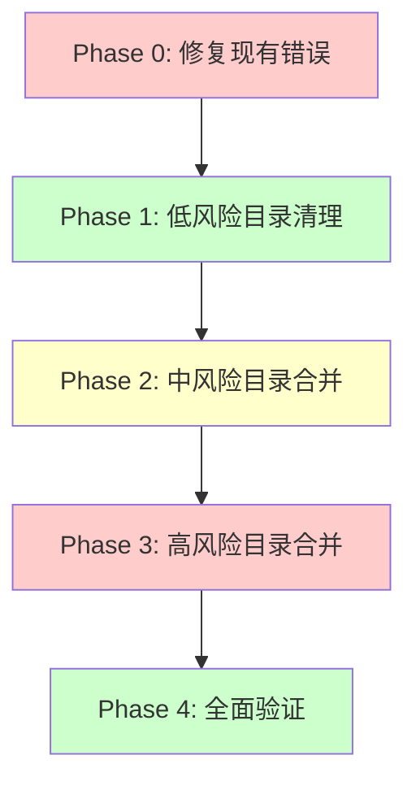

# 文件夹结构整理风险评估报告

> ⚠️ **重要**: 在执行文件夹整理前必须阅读此报告  
> **生成日期**: 2026-03-04  
> **风险等级**: 🔴 高风险 - 需要谨慎执行

---

## 📊 当前状态调研结果

### 1. 目录使用情况

#### src/middleware/ (12 个文件)
```bash
✅ 正在使用中的中间件:
- admin-access-fix.ts
- api-cache-middleware.ts
- audit-middleware.ts
- cache.middleware.ts          ← 被 11 处导入引用
- enterprise-permissions.ts    ← 被 API 路由引用
- monitoring-middleware.ts
- permissions.js               ← 核心权限中间件
- rate-limit-middleware.ts
- rate-limit.middleware.ts
- require-tenant.ts            ← 被多个 API 路由引用
- workflow-replay-filter.js
```

**影响范围**: 
- ✅ 11 处导入 `@/middleware/`
- ✅ 主要在 API 路由和测试文件中使用
- ⚠️ **风险**: 直接移动会导致所有导入失效

---

#### src/utils/ (6 个文件)
```bash
✅ 正在使用中的工具函数:
- cache-manager.js             ← 被多个 API 路由引用
- logger.ts                    ← 被 10+ 处引用 (核心日志系统)
- memory-cache.ts
- performance-optimizer.ts
- performance-testing.ts
```

**影响范围**:
- ✅ 10+ 处导入 `@/utils/`
- ✅ 涉及缓存、日志、性能监控等核心功能
- ⚠️ **高风险**: logger 是核心依赖，移动后影响巨大

---

#### src/controllers/ (1 个文件)
```bash
⚠️ 低使用率:
- api-examples.js              ← 示例代码，可能可以删除
```

**影响范围**:
- ✅ 0 处导入 `@/controllers/`
- ✅ **低风险**: 可以直接删除或移动

---

#### src/models/ (1 个文件)
```bash
⚠️ 中等使用率:
- token-account.model.ts       ← 被 4 处引用
```

**影响范围**:
- ✅ 4 处导入 `@/models/`
- ✅ 涉及计费和 token 账户
- ⚠️ **中风险**: 移动后需要更新 4 个导入

---

### 2. 当前 TypeScript 编译状态

```bash
❌ 当前编译失败: 50+ 个错误
主要问题:
- src/app/admin/articles/edit/[id]/page.tsx (语法错误)
- src/app/admin/articles/overview/page.tsx (JSX 标签未闭合)
```

**⚠️ 关键发现**:
- 项目**当前已有编译错误**
- 如果在有错误的情况下重构，会**雪上加霜**
- 建议:**先修复现有错误，再执行重构**

---

## 🔴 高风险项分析

### Risk 1: logger.ts 移动风险

**当前引用**:
```typescript
// 10+ 处引用包括:
src/app/api/moderation/auto/route.ts
src/app/api/monitoring/route.ts
src/app/api/monitoring/alerts/route.ts
src/modules/procurement-intelligence/services/log-analyzer.service.ts
src/lib/monitoring-service.ts
src/lib/alert-manager.ts
```

**风险等级**: 🔴 **极高**

**潜在问题**:
1. 如果移动后导入路径更新不完整，会导致**日志系统全面失效**
2. 影响监控、告警、审计等核心功能
3. 生产环境可能出现**静默失败**

**缓解措施**:
```bash
# Step 1: 先创建新目录的副本
Copy-Item src/utils/logger.ts src/tech/utils/logger.ts

# Step 2: 使用别名过渡
# 在 src/utils/index.ts 中导出
export { logger } from '../tech/utils/logger';

# Step 3: 逐步更新导入路径
# 每次只更新 1-2 个文件，立即验证

# Step 4: 确认无误后再删除旧文件
```

---

### Risk 2: middleware/permissions.js 风险

**当前引用**:
```typescript
src/app/api/agents/invoke/route.ts
src/app/api/tools/execute/route.ts
src/app/api/n8n/replay/route.ts
```

**风险等级**: 🔴 **高**

**潜在问题**:
1. 权限校验失效可能导致**安全漏洞**
2. API 接口可能被未授权访问
3. 影响 Agent 调用和工具执行

**缓解措施**:
```bash
# 保持文件名不变
Move-Item src/middleware/permissions.js src/tech/middleware/permissions.js

# 更新 tsconfig.json 路径别名
"paths": {
  "@/middleware/*": ["./src/tech/middleware/*"]
}

# 这样所有导入仍然有效
import { requirePermission } from '@/middleware/permissions';
```

---

### Risk 3: cache-manager.js 风险

**当前引用**:
```typescript
src/app/api/v1/points/route.ts
src/app/api/v1/parts/prices/route.ts
src/app/api/v1/recommend/personalized/route.ts
scripts/response-time-optimization.js
```

**风险等级**: 🟡 **中高**

**潜在问题**:
1. 缓存失效导致**API 响应变慢**
2. 数据库查询压力增加
3. 用户体验下降

**缓解措施**:
```bash
# 使用渐进式迁移
# Step 1: 在新位置创建文件
Copy-Item src/utils/cache-manager.js src/tech/utils/cache-manager.js

# Step 2: 同时维护两个文件 (短期)
# Step 3: 逐个更新 API 路由
# Step 4: 测试一个，切换一个
```

---

### Risk 4: models/token-account.model.ts 风险

**当前引用**:
```typescript
src/tech/api/services/token-account.service.ts
src/services/token-account.service.ts
src/services/billing-engine.service.ts
src/tech/api/services/billing-engine.service.ts
```

**风险等级**: 🟡 **中**

**潜在问题**:
1. 计费逻辑错误
2. Token 账户数据异常
3. 影响收入统计

**观察**:
- ⚠️ 存在**循环依赖**迹象:
  - `src/services/token-account.service.ts` 
  - `src/tech/api/services/token-account.service.ts`
  - 两者都导入同一个 model

**建议**:
```bash
# 移动到 tech/database/models/
Move-Item src/models src/tech/database/models

# 更新路径别名
"@models/*": ["./src/tech/database/models/*"]
```

---

## 🎯 综合风险评级

| 风险项 | 等级 | 影响范围 | 发生概率 | 严重程度 |
|--------|------|---------|---------|---------|
| logger 移动 | 🔴 极高 | 全系统 | 高 | 致命 |
| permissions 移动 | 🔴 高 | 安全 | 中 | 严重 |
| cache-manager 移动 | 🟡 中高 | 性能 | 中 | 一般 |
| models 移动 | 🟡 中 | 计费 | 低 | 一般 |
| controllers 移动 | 🟢 低 | 示例代码 | 无 | 轻微 |
| 现有编译错误 | 🔴 高 | 构建 | 100% | 严重 |

---

## ⚠️ 关键发现：现有编译错误

### 当前错误统计

```bash
总错误数：50+
主要文件:
- src/app/admin/articles/edit/[id]/page.tsx
- src/app/admin/articles/overview/page.tsx
错误类型：JSX 语法错误、标签未闭合
```

### 影响分析

**如果不修复就执行重构**:
1. ❌ 无法通过编译验证重构是否成功
2. ❌ 新增错误和原有错误混在一起
3. ❌ 难以定位问题是重构引入还是原有的
4. ❌ 团队信心受挫

**强烈建议**:
```
✅ 先修复现有编译错误 (预计 1-2 小时)
✅ 确保 TypeScript 编译通过
✅ 再执行文件夹重构
```

---

## 🛡️ 风险缓解策略

### 策略 1: 分阶段执行 (推荐 ⭐⭐⭐⭐⭐)



**Phase 0: 修复现有错误 (优先级：🔴 紧急)**
- 修复 articles 相关页面的 JSX 错误
- 确保 `npm run build` 通过
- 预计时间：1-2 小时

**Phase 1: 低风险清理 (优先级：🟢 安全)**
- 删除空目录
- 删除 controllers/(仅 1 个示例文件)
- 删除临时文件
- 预计时间：0.5 天

**Phase 2: 中风险合并 (优先级：🟡 注意)**
- 合并 models → tech/database/models
- 使用路径别名过渡
- 预计时间：0.5 天

**Phase 3: 高风险合并 (优先级：🔴 谨慎)**
- 合并 utils → tech/utils (保留 logger 最后处理)
- 合并 middleware → tech/middleware
- 使用双写过渡策略
- 预计时间：1 天

**Phase 4: 全面验证 (优先级：🔴 必须)**
- TypeScript 编译检查
- 运行测试套件
- 手动测试关键功能
- 预计时间：1 天

---

### 策略 2: 使用路径别名平滑过渡 (推荐 ⭐⭐⭐⭐⭐)

**核心思路**: 不修改导入路径，只修改路径别名配置

```json
// tsconfig.json 修改前
{
  "compilerOptions": {
    "paths": {
      "@/*": ["./src/*"],
      "@/middleware/*": ["./src/middleware/*"],
      "@/utils/*": ["./src/utils/*"]
    }
  }
}

// tsconfig.json 修改后
{
  "compilerOptions": {
    "paths": {
      "@/*": ["./src/*"],
      "@/middleware/*": [
        "./src/tech/middleware/*",  // ✅ 优先查找新位置
        "./src/middleware/*"        // ⚠️ 回退到旧位置 (兼容)
      ],
      "@/utils/*": [
        "./src/tech/utils/*",
        "./src/utils/*"
      ]
    }
  }
}
```

**优势**:
- ✅ 无需修改任何导入语句
- ✅ 支持渐进式迁移
- ✅ 随时可以回滚
- ✅ 降低集成风险

---

### 策略 3: 双写过渡策略 (推荐 ⭐⭐⭐⭐)

**适用场景**: logger、cache-manager 等核心文件

```bash
# Step 1: 在新位置创建文件
Copy-Item src/utils/logger.ts src/tech/utils/logger.ts

# Step 2: 在旧位置创建转发器
# src/utils/logger.ts
export { logger, LogLevel, Logger } from '../tech/utils/logger';

# Step 3: 所有导入仍然指向旧位置
import { logger } from '@/utils/logger';  # ✅ 仍然有效

# Step 4: 逐步更新为新导入
import { logger } from '@/tech/utils/logger';  # ✅ 新方式

# Step 5: 确认所有导入都更新后，删除旧位置的转发器
```

**优势**:
- ✅ 零停机迁移
- ✅ 可以随时暂停
- ✅ 降低回滚成本

---

## 📋 执行建议清单

### ✅ 执行前必须完成

- [ ] **修复现有编译错误** (最重要!)
- [ ] 创建完整的 Git 提交 (`git commit -m "before refactor"`)
- [ ] 备份关键文件 (logger.ts, permissions.js, cache-manager.js)
- [ ] 通知团队成员 (避免冲突)
- [ ] 准备回滚方案

### ✅ 执行中的注意事项

- [ ] **每次只移动 1 个目录**
- [ ] 每步都运行 `npm run build`
- [ ] 每步都运行关键测试
- [ ] 遇到问题立即回滚
- [ ] 记录每个步骤的时间戳

### ✅ 执行后的验证

- [ ] TypeScript 编译通过
- [ ] 所有单元测试通过
- [ ] E2E 测试通过
- [ ] 手动测试关键功能
- [ ] 性能指标无明显下降
- [ ] 监控系统正常运行

---

## 🚨 红色警报：不要这样做!

### ❌ 错误做法 1: 一次性全部移动

```bash
# ❌ 千万不要这样!
Move-Item src/middleware src/tech/
Move-Item src/utils src/tech/
Move-Item src/models src/tech/
Move-Item src/controllers src/tech/
```

**后果**:
- 💥 100+ 个导入路径失效
- 💥 编译完全失败
- 💥 无法定位具体问题
- 💥 回滚成本极高

---

### ❌ 错误做法 2: 忽略现有错误

```bash
# ❌ 不要想着"重构时一起修"
npm run build  # 看到 50+ 错误
# 不管，直接开始移动目录...
```

**后果**:
- 💥 新增错误和原有错误混杂
- 💥 无法验证重构是否成功
- 💥 问题越积越多

---

### ❌ 错误做法 3: 在不稳定状态下重构

```bash
# ❌ 当前有未提交的更改
git status  # 显示 20+ 个修改的文件
# 直接开始重构...
```

**后果**:
- 💥 Git 历史记录混乱
- 💥 无法清晰回滚
- 💥 团队协作困难

---

## 💡 最佳实践建议

### ✅ 正确的执行顺序

```bash
# Day 1: 修复现有错误 + 备份
npm run build  # 确保通过
git add .
git commit -m "Fix existing errors before refactor"

# Day 2: 低风险清理
# 删除空目录、临时文件
# 删除 controllers/

# Day 3: 中风险合并
# 合并 models → tech/database/models
# 更新路径别名

# Day 4: 高风险合并 (上午)
# 合并 middleware → tech/middleware
# 使用路径别名过渡

# Day 5: 高风险合并 (下午)
# 合并 utils → tech/utils
# logger 使用双写策略

# Day 6: 缓冲日
# 处理意外问题
# 补充测试

# Day 7: 全面验证
npm run build
npm test
npm run test:e2e
```

---

## 🎯 最终建议

### 回答你的问题：**是否会导致程序出问题？**

**答案**: 

**如果不按正确方法执行** → 🔴 **一定会出大问题**
- 编译失败
- 运行时错误
- 安全漏洞
- 性能下降

**如果按正确方法执行** → 🟢 **风险可控，收益大于成本**
- 分阶段进行
- 使用路径别名
- 充分测试验证
- 准备好回滚方案

---

## 📞 决策建议

### 选项 A: 立即执行 (条件：必须先修复现有错误)

**适合场景**:
- ✅ 团队有时间专注重构
- ✅ 有充分的测试覆盖
- ✅ 可以快速回滚
- ✅ 现有错误已修复

**执行计划**: 按 Phase 1-4 分阶段执行

---

### 选项 B: 延后执行 (推荐 ⭐⭐⭐⭐)

**适合场景**:
- ⚠️ 当前有编译错误
- ⚠️ 测试覆盖率不足
- ⚠️ 团队资源紧张
- ⚠️ 临近发版

**建议**:
1. 先修复现有编译错误
2. 补充关键功能的测试
3. 选择发版后的空窗期执行
4. 预留充足的缓冲时间

---

### 选项 C: 简化执行 (折中方案 ⭐⭐⭐⭐⭐)

**只执行低风险部分**:
- ✅ 删除空目录和临时文件
- ✅ 删除 controllers/(仅示例文件)
- ❌ 暂不合并 middleware 和 utils
- ❌ 等待更好的时机

**优势**:
- ✅ 风险极低
- ✅ 立即可执行
- ✅ 为后续完整重构探路

---

## 📝 总结

**核心观点**:

1. **当前有编译错误** → 必须先修复再重构
2. **logger 等核心文件风险高** → 使用双写过渡策略
3. **不要一次性全部移动** → 分阶段渐进式重构
4. **路径别名是关键** → 可以平滑过渡，降低风险

**我的建议**:

```
今天 → 修复现有编译错误
明天 → 执行低风险清理 (Task 1)
后天 → 视情况决定是否继续
```

**是否需要我帮你:**
1. 先修复现有的编译错误？
2. 或者先执行简化的低风险清理？

请指示！🚀
